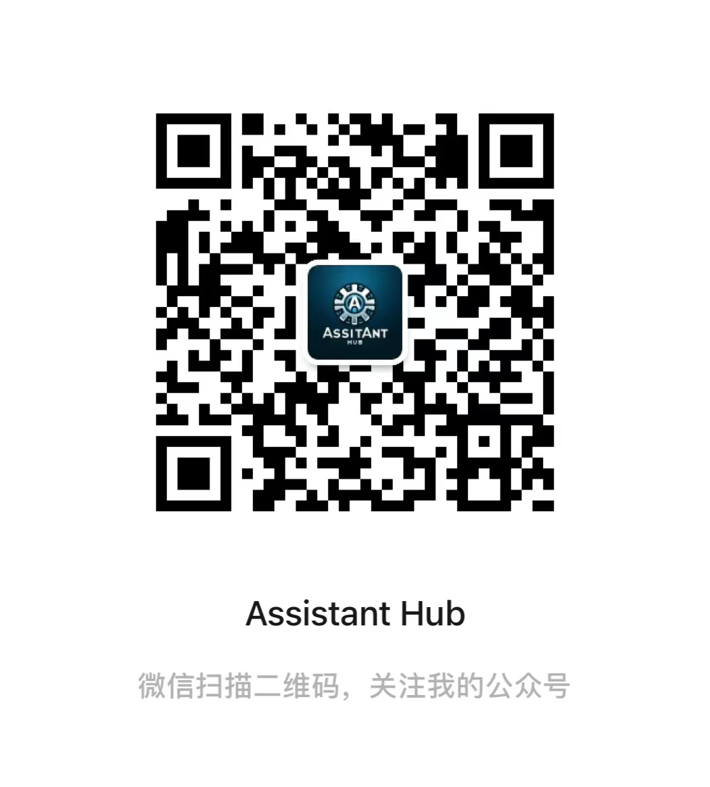

# Assistant Hub

欢迎来到 **Assistant Hub** —— 一个专注于分享各种工具、知识和编程相关内容的知识平台。无论你是编程新手，还是希望扩展你的技术栈的资深开发者，这里都有适合你的资源。

## 我的目标

我的目标是为开发者、技术爱好者和学习者提供一个集中的资源库，帮助他们通过最新的工具和知识来提升自己的技能和效率。我们相信，通过分享和交流，我们可以一起进步。

## 特色内容

- **编程语言教程**：从Python到JavaScript，无论你对哪种编程语言感兴趣，我们提供从入门到高级的教程。
- **工具与框架**：介绍最新的开发工具和框架，帮助你提升开发效率。
- **项目案例**：分享实际项目案例，让你在实践中学习和成长。
- **技术动态**：追踪最新的技术趋势和行业动态，保持你的知识更新。

## 加入我们

我们邀请所有对技术充满热情的朋友加入我们。无论你是想分享你的知识，还是在寻找解决方案，**Assistant Hub** 都欢迎你。

- **贡献内容**：如果你有优质的教程、技巧或项目经验，欢迎分享。

## 联系我们

有问题或建议？请通过以下方式联系我们：

- 微信公众号：Assistant Hub
  
