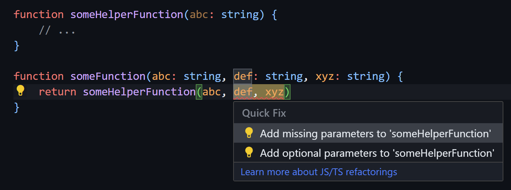
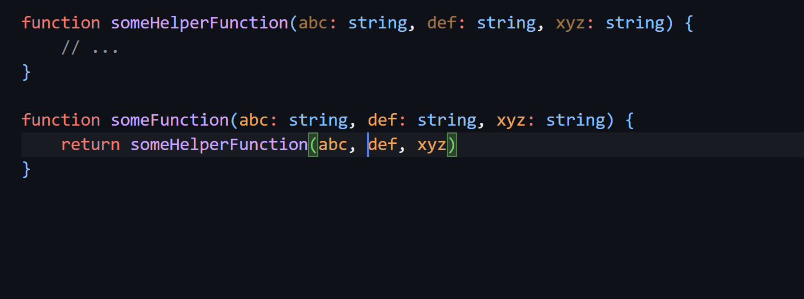

# 宣布TypeScript 5.4 - TypeScript

> ## 摘录
>
> 今天我们非常激动地宣布释放TypeScript 5.4版本！如果你还不熟悉TypeScript，它是一种在JavaScript之上构建的语言，通过使声明和描述类型成为可能。在我们的代码中编写类型，使我们能够解释意图，并让其他工具检查我们的代码来捕捉错误，比如打字错误，

---

2024年3月6日

今天我们非常激动地宣布TypeScript 5.4版本的发布！

如果你还不熟悉TypeScript，它是一种在JavaScript之上构建的语言，通过使声明和描述类型成为可能。在我们的代码中编写类型，使我们能够解释意图，并让其他工具检查我们的代码来捕捉错误，比如打字错误，`null`和`undefined`的问题等。类型也支持TypeScript的编辑器工具，比如自动完成、代码导航和重构，你可能在Visual Studio和VS Code中看到这些。实际上，如果你一直在这些编辑器中编写JavaScript，你一直在使用TypeScript！

通过以下命令通过NuGet或通过npm开始使用TypeScript：

```typescript
npm install -D typescript
```

以下是TypeScript 5.4中新增内容的快速列表！

- [闭包中保留缩小后的赋值](https://devblogs.microsoft.com/typescript/announcing-typescript-5-4/#preserved-narrowing-in-closures-following-last-assignments)
- [`NoInfer`实用类型](https://devblogs.microsoft.com/typescript/announcing-typescript-5-4/#the-noinfer-utility-type)
- [`Object.groupBy`和`Map.groupBy`](https://devblogs.microsoft.com/typescript/announcing-typescript-5-4/#objectgroupby-and-mapgroupby)
- [在`--moduleResolution bundler`和`--module preserve`中支持`require()`调用](https://devblogs.microsoft.com/typescript/announcing-typescript-5-4/#support-for-require-calls-in---moduleresolution-bundler-and---module-preserve)
- [检查导入属性和断言](https://devblogs.microsoft.com/typescript/announcing-typescript-5-4/#checked-import-attributes-and-assertions)
- [添加缺失参数的快速修复](https://devblogs.microsoft.com/typescript/announcing-typescript-5-4/#quick-fix-for-adding-missing-parameters)
- [支持子路径导入的自动导入](https://devblogs.microsoft.com/typescript/announcing-typescript-5-4/#auto-import-support-for-subpath-imports)
- [即将推出的5.5弃用](https://devblogs.microsoft.com/typescript/announcing-typescript-5-4/#upcoming-changes-from-typescript-50-deprecations)
- [显著的行为变化](https://devblogs.microsoft.com/typescript/announcing-typescript-5-4/#notable-behavioral-changes)

## 自Beta和RC以来的新变化？

自beta版本以来，我们已更新了版本说明文件，记录了新的[显著的行为变化](https://devblogs.microsoft.com/typescript/announcing-typescript-5-4/#notable-behavioral-changes)，包括枚举兼容性的限制、枚举成员命名的限制以及映射类型行为的改进。

自发布候选版本以来，我们已记录了我们新的[对子路径导入的自动支持](https://devblogs.microsoft.com/typescript/announcing-typescript-5-4/#auto-import-support-for-subpath-imports)。

## 闭包中保留缩小后的赋值

TypeScript通常能够根据你可能执行的检查为变量找出更具体的类型。这个过程称为缩小。

```typescript
function uppercaseStrings(x: string | number) {
  if (typeof x === "string") {
    // TypeScript knows 'x' is a 'string' here.
    return x.toUpperCase();
  }
}
```

一个常见的痛点是，这些缩小的类型并不总是在函数闭包中保留。

```csharp
function getUrls(url: string | URL, names: string[]) {
    if (typeof url === "string") {
        url = new URL(url);
    }

    return names.map(name => {
        url.searchParams.set("name", name)
        //  ~~~~~~~~~~~~
        // error!
        // Property 'searchParams' does not exist on type 'string | URL'.

        return url.toString();
    });
}
```

这里，TypeScript认为在我们的回调函数中假设`url`*实际上*是一个`URL`对象是“不安全的”，因为它在其他地方被修改了；然而，在这个实例中，那个箭头函数*总是*在对`url`的赋值之后创建的，并且它也是对`url`的*最后*一次赋值。

TypeScript 5.4利用这一点使缩小变得更聪明一些。当在非[hoisted](https://developer.mozilla.org/en-US/docs/Glossary/Hoisting)函数中使用参数和`let`变量时，类型检查器将寻找最后一个赋值点。如果找到了，TypeScript可以从包含函数的外部安全地进行缩小。这意味着上面的示例现在可以工作了。

注意，如果在嵌套函数中的任何地方分配了变量，缩小分析就不会启动。这是因为无法确切知道该函数是否会在以后被调用。

```javascript
function printValueLater(value: string | undefined) {
    if (value === undefined) {
        value = "missing!";
    }

    setTimeout(() => {
        // Modifying 'value', even in a way that shouldn't affect
        // its type, will invalidate type refinements in closures.
        value = value;
    }, 500);

    setTimeout(() => {
        console.log(value.toUpperCase());
        //          ~~~~~
        // error! 'value' is possibly 'undefined'.
    }, 1000);
}
```

这应该使大量典型的JavaScript代码更容易表达。你可以[在GitHub上阅读有关此更改的更多信息](https://github.com/microsoft/TypeScript/pull/56908)。

## `NoInfer` 实用类型

当调用泛型函数时，TypeScript能够从你传入的内容中推断出类型参数。

```csharp
function doSomething<T>(arg: T) {
    // ...
}


// We can explicitly say that 'T' should be 'string'.
doSomething<string>("hello!");

// We can also just let the type of 'T' get inferred.
doSomething("hello!");
```

然而，挑战之一是，不总是清楚推断出的“最佳”类型是什么。这可能导致TypeScript拒绝有效的调用，接受可疑的调用，或者在捕获到错误时只是报告更糟糕的错误消息。

例如，我们假设有一个`createStreetLight`函数，它接受一个颜色名称列表以及一个可选的默认颜色。

```typescript
function createStreetLight<C extends string>(colors: C[], defaultColor?: C) {
  // ...
}

createStreetLight(["red", "yellow", "green"], "red");
```

当我们传入一个不在原始`colors`数组中的`defaultColor`时会发生什么？在这个函数中，`colors`应该是“真理的来源”，并描述了可以传给`defaultColor`的内容。

```actionscript
// 哎呀！这是不可取的，但是被允许了！
createStreetLight(["red", "yellow", "green"], "blue");
```

在这次调用中，类型推断决定`"blue"`与`"red"`或`"yellow"`或`"green"`一样是有效的类型。因此，而不是拒绝调用，TypeScript推断`C`的类型为`"red" | "yellow" | "green" | "blue"`。你可能会说，推断在我们面前就爆炸了！

现在有一种方法是添加一个受现有类型参数约束的独立类型参数。

```typescript
function createStreetLight<C extends string, D extends C>(
  colors: C[],
  defaultColor?: D
) {}

createStreetLight(["red", "yellow", "green"], "blue");
//                                            ~~~~~~
// error!
// Argument of type '"blue"' is not assignable to parameter of type '"red" | "yellow" | "green" | undefined'.
```

这个方法有效，但有点尴尬，因为`D`可能在`createStreetLight`的签名中其他地方都不会被使用。虽然*在这种情况下*不算太糟，但在签名中只使用一次类型参数通常是代码异味的标志。

这就是为什么TypeScript 5.4引入了一个新的`NoInfer<T>`实用类型。在`NoInfer<...>`中包围一个类型，向TypeScript发出一个信号，不要深入挖掘并匹配内部类型来找到类型推断的候选者。

使用`NoInfer`，我们可以将`createStreetLight`重写为如下形式：

```typescript
function createStreetLight<C extends string>(
  colors: C[],
  defaultColor?: NoInfer<C>
) {
  // ...
}

createStreetLight(["red", "yellow", "green"], "blue");
//                                            ~~~~~~
// error!
// Argument of type '"blue"' is not assignable to parameter of type '"red" | "yellow" | "green" | undefined'.
```

排除`defaultColor`的类型不被探索推断意味着`"blue"`永远不会成为推断候选，类型检查器可以拒绝它。

您可以在[实现拉取请求](https://github.com/microsoft/TypeScript/pull/56794)中查看特定的更改，以及[感谢Mateusz Burzyński的最初实现](https://github.com/microsoft/TypeScript/pull/52968)！

## `Object.groupBy` 和 `Map.groupBy`

TypeScript 5.4为JavaScript的新`Object.groupBy`和`Map.groupBy`静态方法添加了声明。

`Object.groupBy`需要一个可迭代的对象，以及一个决定每个元素应该放在哪个“组”中的函数。该函数需要为每个不同的组制作一个“键”，`Object.groupBy`使用该键来创建一个对象，其中每个键映射到一个包含原始元素的数组中。

因此，以下JavaScript：

```javascript
const array = [0, 1, 2, 3, 4, 5];

const myObj = Object.groupBy(array, (num, index) => {
  return num % 2 === 0 ? "even" : "odd";
});
```

基本上等同于编写这个：

```yaml
const myObj = {
    even: [0, 2, 4],
    odd: [1, 3, 5],
};
```

`Map.groupBy`类似，但产生一个`Map`而不是一个普通对象。如果你需要`Map`的保证，你正在处理期望`Map`的API，或者你需要使用任何种类的键来分组——不仅仅是可以用作JavaScript属性名称的键——这可能更可取。

```typescript
const myObj = Map.groupBy(array, (num, index) => {
  return num % 2 === 0 ? "even" : "odd";
});
```

就像之前一样，你可以以等同的方式创建`myObj`:

```csharp
const myObj = new Map();

myObj.set("even", [0, 2, 4]);
myObj.set("odd", [1, 3, 5]);

```

请注意，在上述`Object.groupBy`的示例中，生成的对象使用了所有可选属性。

```typescript
interface EvenOdds {
    even?: number[];
    odd?: number[];
}

const myObj: EvenOdds = Object.groupBy(...);

myObj.even;
//    ~~~~
// Error to access this under 'strictNullChecks'.

```

之所以如此，是因为通常没有办法保证`groupBy`会生成*所有*的键。

请注意，这些方法仅在将您的`target`配置为`esnext`或调整您的`lib`设置时才可访问。我们预计它们最终将在稳定的`es2024`目标下可用。

我们要特别感谢[Kevin Gibbons](https://github.com/bakkot)为这些`groupBy`方法[添加了声明](https://github.com/microsoft/TypeScript/pull/56805)。

## 在`--moduleResolution bundler`和`--module preserve`中支持`require()`调用

TypeScript有一个名为`bundler`的`moduleResolution`选项，旨在模拟现代捆绑器确定导入路径引用的文件方式。该选项的一个限制是它必须与`--module esnext`配对使用，使得无法使用`import ... = require(...)`语法。

```javascript
// 之前会报错 import myModule = require("module/path");
```

如果你打算只编写标准的ECMAScript `import`，这可能看起来没什么大不了的，但如果你使用带有[条件导出](https://nodejs.org/api/packages.html#conditional-exports)的包，情况就有所不同了。

在TypeScript 5.4中，当将`module`设置为一个名为`preserve`的新选项时，现在可以使用`require()`。

通过`--module preserve`和`--moduleResolution bundler`，两者更准确地模拟了捆绑器和像Bun这样的运行时将允许的内容，以及它们将如何执行模块查找。实际上，当使用`--module preserve`时，`moduleResolution`选项将被隐含地设置为`bundler`（连同`--esModuleInterop`和`--resolveJsonModule`）

```json
{
  "compilerOptions": {
    "module": "preserve"
    // ^ also implies:
    // "moduleResolution": "bundler",
    // "esModuleInterop": true,
    // "resolveJsonModule": true,

    // ...
  }
}
```

在`--module preserve`下，ECMAScript `import`总是会按原样被输出，而`import ... = require(...)`会被输出为`require()`调用（尽管在实践中，由于您可能会使用捆绑器来处理您的代码，因此您甚至可能不会使用TypeScript进行输出）。无论包含文件的扩展名如何，这都是正确的。因此，这段代码的输出：

```typescript
import * as foo from "some-package/foo";
import bar = require("some-package/bar");
```

应该看起来像这样：

```javascript
import * as foo from "some-package/foo";
var bar = require("some-package/bar");
```

这也意味着，你选择的语法决定了如何匹配[条件导出](https://nodejs.org/api/packages.html#conditional-exports)。因此，在上述示例中，如果`some-package`的`package.json`看起来像这样：

```json
{
  "name": "some-package",
  "version": "0.0.1",
  "exports": {
    "./foo": {
      "import": "./esm/foo-from-import.mjs",
      "require": "./cjs/foo-from-require.cjs"
    },
    "./bar": {
      "import": "./esm/bar-from-import.mjs",
      "require": "./cjs/bar-from-require.cjs"
    }
  }
}
```

TypeScript将这些路径解析为`[...]/some-package/esm/foo-from-import.mjs` 和 `[...]/some-package/cjs/bar-from-require.cjs`。

更多信息，您可以[在这里阅读这些新设置](https://github.com/microsoft/TypeScript/pull/56785)。

## 已检查的导入属性和断言

现在，导入属性和断言将根据全局`ImportAttributes`类型进行检查。这意味着运行时现在可以更准确地描述导入属性

```typescript
// In some global file.
interface ImportAttributes {
  type: "json";
}

// In some other module
import * as ns from "foo" with { type: "not-json" };
//                                     ~~~~~~~~~~
// error!
//
// Type '{ type: "not-json"; }' is not assignable to type 'ImportAttributes'.
//  Types of property 'type' are incompatible.
//    Type '"not-json"' is not assignable to type '"json"'.
```

[这个更改](https://github.com/microsoft/TypeScript/pull/56034)是由[Oleksandr Tarasiuk](https://github.com/a-tarasyuk)贡献的。

## 为缺失参数添加快速修复

TypeScript现在有一个快速修复功能，可以为被调用时传递过多参数的函数添加新参数。

[]

[]

当通过几个现有的函数传递一个新参数时，这可能会很有用，如今这可能会很麻烦。

[这个快速修复](https://github.com/microsoft/TypeScript/pull/56411)是由[Oleksandr Tarasiuk](https://github.com/a-tarasyuk)提供的。

## 对子路径导入的自动导入支持

在Node.js中，`package.json`通过一个名为`imports`的字段支持[一个叫做“子路径导入”的功能](https://nodejs.org/api/packages.html#subpath-imports)。这是一种在包内部重新映射路径到其他模块路径的方式。从概念上讲，这与路径映射类似，某些模块打包工具和加载器支持路径映射（TypeScript通过一个叫做`paths`的功能支持它）。唯一的区别是子路径导入始终必须以`#`开头。

TypeScript的自动导入功能之前并未考虑`imports`中的路径，这可能会令人沮丧。相反，用户可能不得不在他们的`tsconfig.json`中手动定义`paths`。然而，多亏了[Emma Hamilton](https://github.com/emmatown)的贡献，[TypeScript的自动导入现在支持子路径导入](https://github.com/microsoft/TypeScript/pull/55015)了！

## 即将到来的修改，源自TypeScript 5.0的弃用

TypeScript 5.0弃用了以下选项和行为：

- `charset`
- `target: ES3`
- `importsNotUsedAsValues`
- `noImplicitUseStrict`
- `noStrictGenericChecks`
- `keyofStringsOnly`
- `suppressExcessPropertyErrors`
- `suppressImplicitAnyIndexErrors`
- `out`
- `preserveValueImports`
- 在项目引用中的`prepend`
- 隐式的OS-specific `newLine`

为了继续使用它们，使用TypeScript 5.0和其他更新版本的开发者必须指定一个名为`ignoreDeprecations`的新选项，值为`"5.0"`。

然而，TypeScript 5.4将是这些功能正常运作的最后一个版本。到TypeScript 5.5（可能是2024年6月），这些将变成硬性错误，使用它们的代码需要迁移。

更多信息，您可以[在GitHub上了解这项计划](https://github.com/microsoft/TypeScript/issues/51909)，它包含了有关如何最好地适应您的代码库的建议。

## 显著的行为变化

这一节突出了一组值得注意的变化，作为任何升级的一部分应该被承认和理解。有时它会强调弃用，移除和新的限制。它还可以包含那些在功能上是改进的错误修复，但同时也可能通过引入新的错误来影响现有构建。

### `lib.d.ts`的变化

为DOM生成的类型可能会对您代码库的类型检查产生影响。更多信息，[请参考TypeScript 5.4的DOM更新](https://github.com/microsoft/TypeScript/pull/57027)。

### 更准确的条件类型约束

以下代码不再允许在函数`foo`中对第二个变量声明。

```typescript
type IsArray<T> = T extends any[] ? true : false;

function foo<U extends object>(x: IsArray<U>) {
  let first: true = x; // Error
  let second: false = x; // Error, but previously wasn't
}
```

以前，当TypeScript检查`second`的初始化器时，它需要确定`IsArray<U>`是否可以赋给单元类型`false`。虽然`IsArray<U>`以任何明显的方式都不兼容，TypeScript会查看该类型的*约束*。在像`T extends Foo ? TrueBranch : FalseBranch`这样的条件类型中，其中`T`是泛型，类型系统会查看`T`的约束，将其替代为`T`本身，然后决定真分支还是假分支。

但是这种行为是不准确的，因为它过于急切。即使`T`的约束不可赋给`Foo`，这并不意味着它不会被实例化为某些是可赋给`Foo`的东西。因此，更正确的行为是在无法证明`T`*永远*或*总是*扩展`Foo`的情况下，为条件类型的约束生成一个联合类型。

TypeScript 5.4采用了这种更准确的行为。这在实践中意味着，您可能会开始发现一些条件类型实例不再与它们的分支兼容。

[您可以在这里阅读具体变化](https://github.com/microsoft/TypeScript/pull/56004)。

### 更激进地减少类型变量和原始类型之间的交集

TypeScript现在更激进地减少了类型变量和原始类型的交集，这取决于类型变量的约束与这些原始类型的重叠。

```typescript
declare function intersect<T, U>(x: T, y: U): T & U;

function foo<T extends "abc" | "def">(x: T, str: string, num: number) {
  // Was 'T & string', now is just 'T'
  let a = intersect(x, str);

  // Was 'T & number', now is just 'never'
  let b = intersect(x, num);

  // Was '(T & "abc") | (T & "def")', now is just 'T'
  let c = Math.random() < 0.5 ? intersect(x, "abc") : intersect(x, "def");
}
```

更多信息，[请参见这里的变化](https://github.com/microsoft/TypeScript/pull/56515)。

### 改进了对带有插值的模板字符串的检查

TypeScript现在更准确地检查字符串是否可以赋给模板字符串类型的占位符槽。

```typescript
function a<T extends { id: string }>() {
  let x: `-${keyof T & string}`;

  // Used to error, now doesn't.
  x = "-id";
}
```

这种行为更令人满意，但可能会导致使用如条件类型等结构的代码中出现中断，其中这些规则变化很容易被察觉。

[查看这项变化](https://github.com/microsoft/TypeScript/pull/56598)获取更多详情。

### 与本地值冲突的仅类型导入时的错误

以前，如果导入到`Something`仅引用类型，则TypeScript允许在`isolatedModules`下执行以下代码。

```javascript
import { Something } from "./some/path";
let Something = 123;
```

然而，对于单文件编译器来说，假设抛弃`import`是“安全”的并不安全，即使代码保证在运行时失败。在TypeScript 5.4中，这段代码将触发如下错误：

```typescript
导入'Something'与本地值冲突，因此在启用'isolatedModules'时必须声明为仅类型导入。
```

修复方法应该是进行本地重命名，或者，正如错误状态那样，添加`type`修饰符到导入中：

```typescript
import type { Something } from "./some/path"; // 或者 import { type Something } from "./some/path";
```

[查看更多关于这个变化本身的信息](https://github.com/microsoft/TypeScript/pull/56354)。

### 新的枚举赋值性限制

当两个枚举声明了相同的名称和枚举成员名称时，它们以前总是被认为是兼容的；然而，当值已知时，TypeScript会默默地允许它们有不同的值。

TypeScript 5.4通过要求在值已知时值必须相同来加强这种限制。

```typescript
namespace First {
  export enum SomeEnum {
    A = 0,
    B = 1,
  }
}

namespace Second {
  export enum SomeEnum {
    A = 0,
    B = 2,
  }
}

function foo(x: First.SomeEnum, y: Second.SomeEnum) {
  // Both used to be compatible - no longer the case,
  // TypeScript errors with something like:
  //
  //  Each declaration of 'SomeEnum.B' differs in its value, where '1' was expected but '2' was given.
  x = y;
  y = x;
}
```

此外，当枚举成员之一没有静态已知的值时，会有新的限制。在这些情况下，另一个枚举至少必须是隐式数字的（例如，它没有静态解析的初始化器），或者它明确是数字的（意味着TypeScript可以将值解析为某些数字）。实际上，这意味着字符串枚举成员只能与具有相同值的其他字符串枚举兼容。

```typescript
namespace First {
  export declare enum SomeEnum {
    A,
    B,
  }
}

namespace Second {
  export declare enum SomeEnum {
    A,
    B = "some known string",
  }
}

function foo(x: First.SomeEnum, y: Second.SomeEnum) {
  // Both used to be compatible - no longer the case,
  // TypeScript errors with something like:
  //
  //  One value of 'SomeEnum.B' is the string '"some known string"', and the other is assumed to be an unknown numeric value.
  x = y;
  y = x;
}
```

更多信息，[查看引入这个变化的拉取请求](https://github.com/microsoft/TypeScript/pull/55924)。

### 枚举成员的名称限制

TypeScript不再允许枚举成员使用`Infinity`、`-Infinity`或`NaN`的名称。

```cpp
// Errors on all of these:
//
//  An enum member cannot have a numeric name.
enum E {
    Infinity = 0,
    "-Infinity" = 1,
    NaN = 2,
}

```

[查看更多细节](https://github.com/microsoft/TypeScript/pull/56161)。

### 在具有`any`剩余元素的元组上映射类型保留得更好

以前，将映射类型与`any`应用于元组会创建一个`any`元素类型。这是不受欢迎的，并且现在已经修复。

```typescript
Promise.all(["", ...([] as any)]).then(result => {
  const head = result[0]; // 5.3: any, 5.4: string
  const tail = result.slice(1); // 5.3 any, 5.4: any[]
});
```

有关信息，请参阅[修复](https://github.com/microsoft/TypeScript/pull/57031)以及[关于行为变化的后续讨论](https://github.com/microsoft/TypeScript/issues/57389)和[进一步的调整](https://github.com/microsoft/TypeScript/issues/57389)。

### Emit Changes

虽然严格来说不是一个破坏性更改，但开发者可能已经隐式地依赖TypeScript的JavaScript或声明发射输出。以下是值得注意的变化。

- [更频繁地保存被覆盖的类型参数名称](https://github.com/microsoft/TypeScript/pull/55820)
- [将异步函数的复杂参数列表移动到向下级别的生成器体中](https://github.com/microsoft/TypeScript/pull/56296)
- [不要在函数声明中移除绑定别名](https://github.com/microsoft/TypeScript/pull/57020)
- [ImportAttributes应当在ImportTypeNode中经历相同的发射阶段](https://github.com/microsoft/TypeScript/pull/56395)

## 下一步是什么？

在接下来的几个月里，我们将致力于TypeScript 5.5，您可以[在GitHub上查看我们的迭代计划](https://github.com/microsoft/TypeScript/issues/57475)。我们的目标发布日期是公开的，以便您、您的团队和更广泛的TypeScript社区可以相应地安排。您还可以在npm上尝试夜间发布版本，或者[在Visual Studio Code中使用最新版本的TypeScript和JavaScript](https://marketplace.visualstudio.com/items?itemName=ms-vscode.vscode-typescript-next)。

但直到那时，TypeScript 5.4仍然是最新且最伟大的稳定版本，我们希望它能让编码为您带来乐趣！
