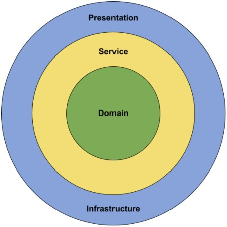
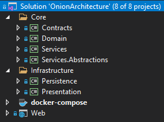
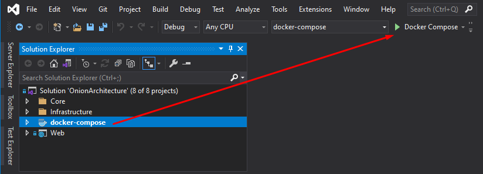
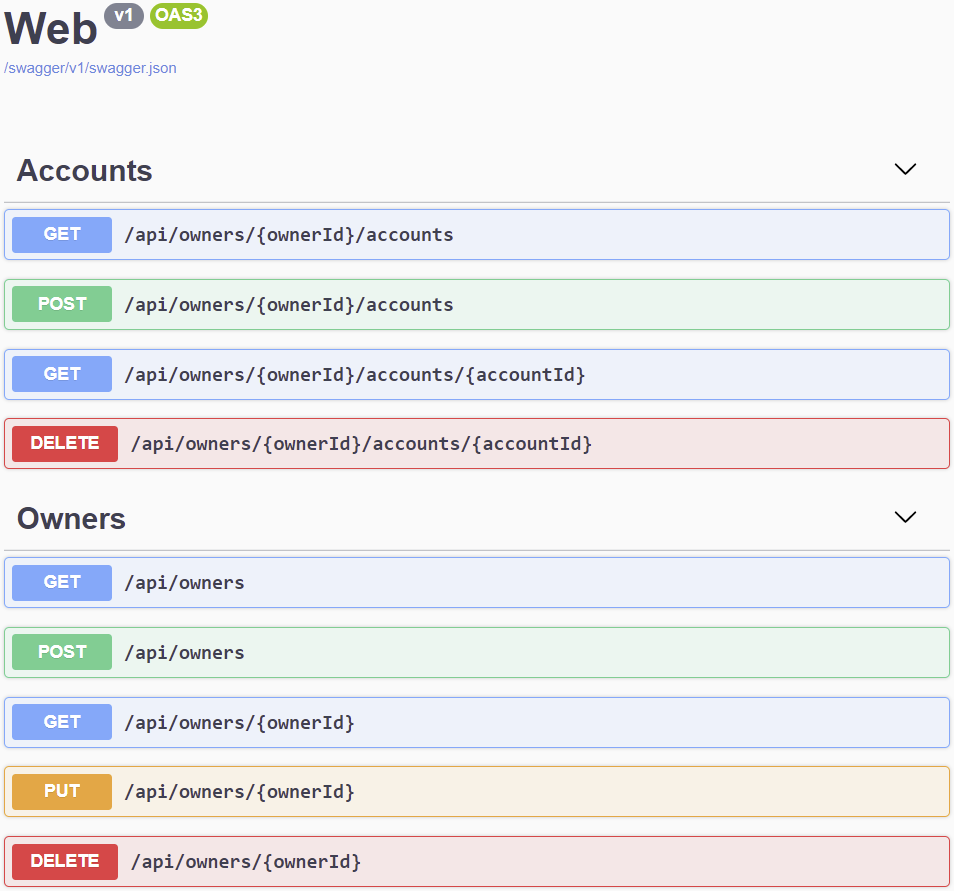

# ASP.NET Core 中的洋葱架构 - Code Maze

> ## 摘要
>
> 了解什么是洋葱架构以及为什么它非常受欢迎。您将学习如何在真实项目中实现洋葱架构。

---

在这篇文章中，我们将了解洋葱架构及其优势。我们将构建一个遵循洋葱架构的 RESTful API，使用 ASP.NET Core 和 .NET。

洋葱架构也常被称为“清洁架构”或“端口与适配器”。这些架构方法只是同一主题的变体。

我们已经准备了一个遵循洋葱架构的项目，我们将在文章的其余部分中使用它。要下载它，可以访问我们的 [ASP.NET Core 中的洋葱架构](https://github.com/CodeMazeBlog/onion-architecture-aspnetcore) 仓库。

---

## 什么是洋葱架构？

洋葱架构是一种分层架构形式，我们可以将这些层次想象为同心圆。因此得名洋葱架构。洋葱架构最初由 Jeffrey Palermo 提出，以克服传统 N 层架构方法的问题。

我们可以通过多种方式来切分洋葱，但我们将选择以下方法，我们将把架构分成 4 层：

- 领域层
- 服务层
- 基础设施层
- 表现层

从概念上讲，我们可以认为基础设施层和表现层在层次结构中处于相同的层级。

现在，让我们继续查看每一层的更多细节，了解我们为什么要引入它以及我们打算在该层内创建什么：

[](https://code-maze.com/wp-content/uploads/2021/07/onion_architecture.jpeg)

## 洋葱架构的优势

让我们来看看洋葱架构的优势，以及为什么我们想在我们的项目中实现它。

所有的层都严格通过下层定义的接口相互交互。依赖的流向是朝向洋葱的核心。我们将在下一节中解释为什么这很重要。

在整个项目中使用依赖反转，依赖抽象（接口）而不是实现，允许我们在运行时透明地替换实现。我们在编译时依赖抽象，这为我们提供了严格的合约，而实现则在运行时提供。

使用洋葱架构，可测试性非常高，因为一切都依赖于抽象。可以使用如 [Moq](https://github.com/moq/moq4) 这样的 mocking 库轻松模拟抽象。要了解更多关于在 ASP.NET Core 项目中进行单元测试的信息，请查看这篇文章 [在 ASP.NET Core 中测试 MVC 控制器](https://code-maze.com/testing-mvc-controllers-asp-net-core/)。

我们可以毫不担心任何实现细节编写业务逻辑。如果我们需要来自外部系统或服务的任何东西，我们可以为它创建一个接口并使用它。我们不必担心它将如何实现。洋葱的更高层次将透明地负责实现该接口。

## 依赖流向

洋葱架构背后的主要思想是依赖流向，或者说各层如何相互交互。在洋葱中层级越深，它具有的依赖越少。

领域层不依赖于外部层。从某种意义上说，它与外部世界是隔离的。外部层都被允许引用层次结构中直接下方的层。

我们可以得出结论，洋葱架构中的所有依赖都是向内流动的。但我们应该问自己，为什么这很重要？

依赖流向决定了洋葱架构中某一层可以做什么。因为它依赖于层次结构中的下层，它只能调用下层暴露的方法。

我们可以使用洋葱架构的较低层来定义契约或接口。架构的外层实现这些接口。这意味着在领域层，我们不需要关心诸如数据库或外部服务等基础设施细节。

使用这种方法，我们可以将所有丰富的业务逻辑封装在领域和服务层中，无需了解任何实现细节。在服务层，我们将仅依赖于下层定义的接口，即领域层。

理论够多了，让我们看一些代码。我们已经为您准备了一个正在运行的项目，并将查看解决方案中的每个项目，以及它们如何适应洋葱架构。

## 解决方案结构

让我们看一下我们将要使用的解决方案结构：

[](https://code-maze.com/wp-content/uploads/2021/07/solution_structure.png)

如我们所见，它由 `Web` 项目组成，这是我们的 ASP.NET Core 应用程序，以及六个类库。`Domain` 项目将保存领域层实现。`Services` 和 `Services.Abstractions` 将是我们的服务层实现。`Persistence` 项目将是我们的基础设施层，而 `Presentation` 项目将是表现层实现。

## 领域层

领域层位于洋葱架构的核心。在这一层中，我们通常将定义我们领域的核心方面：

- 实体
- 仓库接口
- 异常
- 领域服务

这些只是我们可以在领域层中定义的一些示例。我们可以根据需要或多或少地严格。我们必须意识到在软件工程中，一切都是一种权衡。

让我们首先看看 `Entities` 文件夹下的实体类 `Owner` 和 `Account`：

```csharp
public class Owner
{
    public Guid Id { get; set; }

    public string Name { get; set; }

    public DateTime DateOfBirth { get; set; }
    public string Address { get; set; }
    public ICollection<Account> Accounts { get; set; }
}

public class Account
{
    public Guid Id { get; set; }

    public DateTime DateCreated { get; set; }

    public string AccountType { get; set; }

    public Guid OwnerId { get; set; }
}
```

在领域层中定义的实体将捕获对描述问题领域来说重要的信息。

这时，我们应该问自己什么是行为呢？贫血领域模型不是一件坏事吗？

这取决于。如果您有非常复杂的业务逻辑，将其封装在我们的领域实体中是有意义的。但是对于大多数应用程序来说，通常从一个更简单的领域模型开始更容易，并且仅在项目需要时引入复杂性。

接下来，我们将查看 `Repositories` 文件夹中的 `IOwnerRepository` 和 `IAccountRepository` 接口：

```csharp
public interface IOwnerRepository
{
    Task<IEnumerable<Owner>> GetAllAsync(CancellationToken cancellationToken = default);
    Task<Owner> GetByIdAsync(Guid ownerId, CancellationToken cancellationToken = default);
    void Insert(Owner owner);
    void Remove(Owner owner);
}
public interface IAccountRepository
{
    Task<IEnumerable<Account>> GetAllByOwnerIdAsync(Guid ownerId, CancellationToken cancellationToken = default);
    Task<Account> GetByIdAsync(Guid accountId, CancellationToken cancellationToken = default);
    void Insert(Account account);
    void Remove(Account account);
}
```

要了解更多关于仓库模式以及如何异步地实现它的信息，请一定要查看 [在 ASP.NET Core 中实现异步泛型仓库](https://code-maze.com/async-generic-repository-pattern/)。

在同一文件夹中，我们还可以找到 `IUnitOfWork` 接口：

```csharp
public interface IUnitOfWork
{
    Task<int> SaveChangesAsync(CancellationToken cancellationToken = default);
}
```

值得注意的是，我们将 `CancellationToken` 参数设置为一个可选值，并给它赋予 `default` 值。使用这种方法，如果我们不提供实际的 `CancellationToken` 值，将为我们提供一个 `CancellationToken.None`。通过这种方式，我们可以确保使用 `CancellationToken` 的异步调用始终会工作。

### 领域异常

现在，让我们来看看在 `Exceptions` 文件夹内的一些自定义异常。

有一个抽象的 `BadRequestException` 类：

```csharp
public abstract class BadRequestException : Exception
{
    protected BadRequestException(string message)
        : base(message)
    {
    }
}
```

和抽象的 `NotFoundException` 类：

```csharp
public abstract class NotFoundException : Exception
{
    protected NotFoundException(string message)
        : base(message)
    {
    }
}
```

还有一些从抽象异常继承的异常类，用于描述应用程序中可能发生的特定场景：

```csharp
public sealed class AccountDoesNotBelongToOwnerException : BadRequestException
{
    public AccountDoesNotBelongToOwnerException(Guid ownerId, Guid accountId)
        : base($"The account with the identifier {accountId} does not belong to the owner with the identifier {ownerId}")
    {
    }
}
public sealed class OwnerNotFoundException : NotFoundException
{
    public OwnerNotFoundException(Guid ownerId)
        : base($"The owner with the identifier {ownerId} was not found.")
    {
    }
}
public sealed class AccountNotFoundException : NotFoundException
{
    public AccountNotFoundException(Guid accountId)
        : base($"The account with the identifier {accountId} was not found.")
    {
    }
}
```

这些异常将由我们架构的更高层处理。我们将在全局异常处理程序中使用它们，该程序将根据抛出的异常类型返回适当的 HTTP 状态码。

如果您对如何实现全局异常处理感兴趣，请务必查看 [ASP.NET Core Web API中的全局错误处理](https://code-maze.com/global-error-handling-aspnetcore/)。

到此为止，我们已经知道如何定义领域层。接下来，我们可以开始服务层并查看如何使用它来实现实际的业务逻辑。

## 服务层

服务层位于域层之上，这意味着它具有对域层的引用。服务层被分为两个项目，`Services.Abstractions` 和 `Services`。

在 `Services.Abstractions` 项目中，你可以找到将要封装主要业务逻辑的服务接口定义。此外，我们使用 `Contracts` 项目来定义我们将要通过服务接口消费的数据传输对象（DTO）。

首先来看一下 `IOwnerService` 和 `IAccountService` 接口：

```csharp
public interface IOwnerService
{
    Task<IEnumerable<OwnerDto>> GetAllAsync(CancellationToken cancellationToken = default);
    Task<OwnerDto> GetByIdAsync(Guid ownerId, CancellationToken cancellationToken = default);
    Task<OwnerDto> CreateAsync(OwnerForCreationDto ownerForCreationDto, CancellationToken cancellationToken = default);
    Task UpdateAsync(Guid ownerId, OwnerForUpdateDto ownerForUpdateDto, CancellationToken cancellationToken = default);
    Task DeleteAsync(Guid ownerId, CancellationToken cancellationToken = default);
}
public interface IAccountService
{
    Task<IEnumerable<AccountDto>> GetAllByOwnerIdAsync(Guid ownerId, CancellationToken cancellationToken = default);
    Task<AccountDto> GetByIdAsync(Guid ownerId, Guid accountId, CancellationToken cancellationToken);
    Task<AccountDto> CreateAsync(Guid ownerId, AccountForCreationDto accountForCreationDto, CancellationToken cancellationToken = default);
    Task DeleteAsync(Guid ownerId, Guid accountId, CancellationToken cancellationToken = default);
}
```

此外，我们可以看到有一个 `IServiceManager` 接口充当围绕我们之前创建的两个接口的包装器：

```csharp
public interface IServiceManager
{
    IOwnerService OwnerService { get; }
    IAccountService AccountService { get; }
}
```

接下来，我们将查看如何在 `Services` 项目中实现这些接口。

从 `OwnerService` 开始：

```csharp
internal sealed class OwnerService : IOwnerService
{
    private readonly IRepositoryManager _repositoryManager;
    public OwnerService(IRepositoryManager repositoryManager) => _repositoryManager = repositoryManager;
    public async Task<IEnumerable<OwnerDto>> GetAllAsync(CancellationToken cancellationToken = default)
    {
        var owners = await _repositoryManager.OwnerRepository.GetAllAsync(cancellationToken);
        var ownersDto = owners.Adapt<IEnumerable<OwnerDto>>();
        return ownersDto;
    }
    public async Task<OwnerDto> GetByIdAsync(Guid ownerId, CancellationToken cancellationToken = default)
    {
        var owner = await _repositoryManager.OwnerRepository.GetByIdAsync(ownerId, cancellationToken);
        if (owner is null)
        {
            throw new OwnerNotFoundException(ownerId);
        }
        var ownerDto = owner.Adapt<OwnerDto>();
        return ownerDto;
    }
    public async Task<OwnerDto> CreateAsync(OwnerForCreationDto ownerForCreationDto, CancellationToken cancellationToken = default)
    {
        var owner = ownerForCreationDto.Adapt<Owner>();
        _repositoryManager.OwnerRepository.Insert(owner);
        await _repositoryManager.UnitOfWork.SaveChangesAsync(cancellationToken);
        return owner.Adapt<OwnerDto>();
    }
    public async Task UpdateAsync(Guid ownerId, OwnerForUpdateDto ownerForUpdateDto, CancellationToken cancellationToken = default)
    {
        var owner = await _repositoryManager.OwnerRepository.GetByIdAsync(ownerId, cancellationToken);
        if (owner is null)
        {
            throw new OwnerNotFoundException(ownerId);
        }
        owner.Name = ownerForUpdateDto.Name;
        owner.DateOfBirth = ownerForUpdateDto.DateOfBirth;
        owner.Address = ownerForUpdateDto.Address;
        await _repositoryManager.UnitOfWork.SaveChangesAsync(cancellationToken);
    }
    public async Task DeleteAsync(Guid ownerId, CancellationToken cancellationToken = default)
    {
        var owner = await _repositoryManager.OwnerRepository.GetByIdAsync(ownerId, cancellationToken);
        if (owner is null)
        {
            throw new OwnerNotFoundException(ownerId);
        }
        _repositoryManager.OwnerRepository.Remove(owner);
        await _repositoryManager.UnitOfWork.SaveChangesAsync(cancellationToken);
    }
}
```

然后让我们检查 `AccountService` 类：

```csharp
internal sealed class AccountService : IAccountService
{
    private readonly IRepositoryManager _repositoryManager;
    public AccountService(IRepositoryManager repositoryManager) => _repositoryManager = repositoryManager;
    public async Task<IEnumerable<AccountDto>> GetAllByOwnerIdAsync(Guid ownerId, CancellationToken cancellationToken = default)
    {
        var accounts = await _repositoryManager.AccountRepository.GetAllByOwnerIdAsync(ownerId, cancellationToken);
        var accountsDto = accounts.Adapt<IEnumerable<AccountDto>>();
        return accountsDto;
    }
    public async Task<AccountDto> GetByIdAsync(Guid ownerId, Guid accountId, CancellationToken cancellationToken)
    {
        var owner = await _repositoryManager.OwnerRepository.GetByIdAsync(ownerId, cancellationToken);
        if (owner is null)
        {
            throw new OwnerNotFoundException(ownerId);
        }
        var account = await _repositoryManager.AccountRepository.GetByIdAsync(accountId, cancellationToken);
        if (account is null)
        {
            throw new AccountNotFoundException(accountId);
        }
        if (account.OwnerId != owner.Id)
        {
            throw new AccountDoesNotBelongToOwnerException(owner.Id, account.Id);
        }
        var accountDto = account.Adapt<AccountDto>();
        return accountDto;
    }
    public async Task<AccountDto> CreateAsync(Guid ownerId, AccountForCreationDto accountForCreationDto, CancellationToken cancellationToken = default)
    {
        var owner = await _repositoryManager.OwnerRepository.GetByIdAsync(ownerId, cancellationToken);
        if (owner is null)
        {
            throw new OwnerNotFoundException(ownerId);
        }
        var account = accountForCreationDto.Adapt<Account>();
        account.OwnerId = owner.Id;
        _repositoryManager.AccountRepository.Insert(account);
        await _repositoryManager.UnitOfWork.SaveChangesAsync(cancellationToken);
        return account.Adapt<AccountDto>();
    }
    public async Task DeleteAsync(Guid ownerId, Guid accountId, CancellationToken cancellationToken = default)
    {
        var owner = await _repositoryManager.OwnerRepository.GetByIdAsync(ownerId, cancellationToken);
        if (owner is null)
        {
            throw new OwnerNotFoundException(ownerId);
        }
        var account = await _repositoryManager.AccountRepository.GetByIdAsync(accountId, cancellationToken);
        if (account is null)
        {
            throw new AccountNotFoundException(accountId);
        }
        if (account.OwnerId != owner.Id)
        {
            throw new AccountDoesNotBelongToOwnerException(owner.Id, account.Id);
        }
        _repositoryManager.AccountRepository.Remove(account);
        await _repositoryManager.UnitOfWork.SaveChangesAsync(cancellationToken);
    }
}
```

最后是 `ServiceManager`：

```csharp
public sealed class ServiceManager : IServiceManager
{
    private readonly Lazy<IOwnerService> _lazyOwnerService;
    private readonly Lazy<IAccountService> _lazyAccountService;
    public ServiceManager(IRepositoryManager repositoryManager)
    {
        _lazyOwnerService = new Lazy<IOwnerService>(() => new OwnerService(repositoryManager));
        _lazyAccountService = new Lazy<IAccountService>(() => new AccountService(repositoryManager));
    }
    public IOwnerService OwnerService => _lazyOwnerService.Value;
    public IAccountService AccountService => _lazyAccountService.Value;
}
```

`ServiceManager` 实现的有趣之处在于，我们利用了 `Lazy` 类的能力来确保我们的服务延迟初始化。这意味着我们的服务实例只有在第一次访问时才会被创建，而不是之前。

### 拆分服务层的动机是什么？

为什么我们要费这么大劲将我们的服务接口和实现拆分为两个单独的项目？

正如你所见，我们使用 `internal` 关键字标记了服务实现，这意味着它们在 `Services` 项目之外不会公开可用。另一方面，服务接口是公开的。

还记得我们之前提到的依赖流吗？

通过这种方式，我们非常明确地说明了洋葱架构中更高层次可以和不能做什么。这里容易忽略的是，`Services.Abstractions` 项目没有引用 `Domain` 项目。

这意味着，当更高层次引用了 `Services.Abstractions` 项目时，它只能调用该项目公开的方法。我们将在稍后接触到展示层时看到这一点为什么非常有用。

## 基础设施层

基础设施层应涉及封装与我们的应用程序互动的外部系统或服务相关的所有事情。这些外部服务可以是：

- 数据库
- 身份提供者
- 消息队列
- 电子邮件服务

还有更多例子，但希望你已经明白了。我们在基础设施层隐藏所有实现细节，因为它位于洋葱架构顶部，而所有更低层次依赖于接口（抽象）。

首先，我们将看一下 `RepositoryDbContext` 类中的实体框架数据库上下文：

```csharp
public sealed class RepositoryDbContext : DbContext
{
    public RepositoryDbContext(DbContextOptions options)
        : base(options)
    {
    }
    public DbSet<Owner> Owners { get; set; }
    public DbSet<Account> Accounts { get; set; }
    protected override void OnModelCreating(ModelBuilder modelBuilder) =>
        modelBuilder.ApplyConfigurationsFromAssembly(typeof(RepositoryDbContext).Assembly);
}
```

正如你所看到的，实现非常简单。但是，在 `OnModelCreating` 方法中，我们根据相同程序集中的实体配置来配置我们的数据库上下文。

接下来，我们将查看实现 `IEntityTypeConfiguration<T>` 接口的实体配置。我们可以在 `Configurations` 文件夹内找到它们：

```csharp
internal sealed class OwnerConfiguration : IEntityTypeConfiguration<Owner>
{
    public void Configure(EntityTypeBuilder<Owner> builder)
    {
        builder.ToTable(nameof(Owner));
        builder.HasKey(owner => owner.Id);
        builder.Property(account => account.Id).ValueGeneratedOnAdd();
        builder.Property(owner => owner.Name).HasMaxLength(60);
        builder.Property(owner => owner.DateOfBirth).IsRequired();
        builder.Property(owner => owner.Address).HasMaxLength(100);
        builder.HasMany(owner => owner.Accounts)
            .WithOne()
            .HasForeignKey(account => account.OwnerId)
            .OnDelete(DeleteBehavior.Cascade);
    }
}
internal sealed class AccountConfiguration : IEntityTypeConfiguration<Account>
{
    public void Configure(EntityTypeBuilder<Account> builder)
{
    builder.ToTable(nameof(Account));
    builder.HasKey(account => account.Id);
    builder.Property(account => account.Id).ValueGeneratedOnAdd();
    builder.Property(account => account.AccountType).HasMaxLength(50);
    builder.Property(account => account.DateCreated).IsRequired();
}
```

太好了，现在数据库上下文配置完成后，我们可以继续查看仓储。

我们将在 `Repositories` 文件夹内查看仓储实现。仓储实现了我们在 `Domain` 项目中定义的接口：

```csharp
internal sealed class OwnerRepository : IOwnerRepository
{
    private readonly RepositoryDbContext _dbContext;
    public OwnerRepository(RepositoryDbContext dbContext) => _dbContext = dbContext;
    public async Task<IEnumerable<Owner>> GetAllAsync(CancellationToken cancellationToken = default) =>
        await _dbContext.Owners.Include(x => x.Accounts).ToListAsync(cancellationToken);
    public async Task<Owner> GetByIdAsync(Guid ownerId, CancellationToken cancellationToken = default) =>
        await _dbContext.Owners.Include(x => x.Accounts).FirstOrDefaultAsync(x => x.Id == ownerId, cancellationToken);
    public void Insert(Owner owner) => _dbContext.Owners.Add(owner);
    public void Remove(Owner owner) => _dbContext.Owners.Remove(owner);
}
internal sealed class AccountRepository : IAccountRepository
{
    private readonly RepositoryDbContext _dbContext;
    public AccountRepository(RepositoryDbContext dbContext) => _dbContext = dbContext;
    public async Task<IEnumerable<Account>> GetAllByOwnerIdAsync(Guid ownerId, CancellationToken cancellationToken = default) =>
        await _dbContext.Accounts.Where(x => x.OwnerId == ownerId).ToListAsync(cancellationToken);
    public async Task<Account> GetByIdAsync(Guid accountId, CancellationToken cancellationToken = default) =>
        await _dbContext.Accounts.FirstOrDefaultAsync(x => x.Id == accountId, cancellationToken);
    public void Insert(Account account) => _dbContext.Accounts.Add(account);
    public void Remove(Account account) => _dbContext.Accounts.Remove(account);
}
```

要了解如何使用 Entity Framework Core 实现仓储模式，你可以查看这篇文章 [ASP.NET Core Web API – 仓储模式](https://code-maze.com/net-core-web-development-part4/)。

太好了，我们已经完成了基础设施层。现在我们只剩下最后一层需要完成我们的洋葱架构实现。

## 展示层

展示层的目的是表示系统的入口点，以便消费者可以与数据交互。我们可以通过多种方式实现这一层，例如创建一个 REST API，gRPC 等。

我们使用内置 ASP.NET Core 的 Web API 创建一组 RESTful API 端点来修改域实体并允许消费者获取返回的数据。

然而，我们将会做一些不同于通常创建 Web APIs 时习惯的事情。按照惯例，控制器定义在 Web 应用程序内的 `Controllers` 文件夹中。

为什么这是一个问题？因为 ASP.NET Core 到处都使用依赖注入，我们需要在 Web 应用项目中引用解决方案中的所有项目。这使我们能够在 `Startup` 类中配置我们的服务。

虽然这正是我们想做的，但它引入了一个大的设计缺陷。有什么可以阻止我们的控制器在构造函数中注入他们想要的任何东西吗？没有！

### 干净的控制器

使用标准的 ASP.NET Core 方法，我们无法阻止任何人在控制器中注入他们需要的任何东西。那么我们如何对控制器能做什么施加更严格的规则呢？

还记得我们如何将服务层分成 `Services.Abstractions` 和 `Services` 项目吗？这是解决方案的一部分。

我们创建了一个名为 `Presentation` 的项目，并给它引用了 `Microsoft.AspNetCore.Mvc.Core` NuGet 包，以便它可以访问 `ControllerBase` 类。然后我们可以在这个项目中创建我们的控制器。

让我们看看项目的 `Controllers` 文件夹中的 `OwnersController`：

```csharp
[ApiController]
[Route("api/owners")]
public class OwnersController : ControllerBase
{
    private readonly IServiceManager _serviceManager;
    public OwnersController(IServiceManager serviceManager) => _serviceManager = serviceManager;
    [HttpGet]
    public async Task<IActionResult> GetOwners(CancellationToken cancellationToken)
    {
        var owners = await _serviceManager.OwnerService.GetAllAsync(cancellationToken);
        return Ok(owners);
    }
    [HttpGet("{ownerId:guid}")]
    public async Task<IActionResult> GetOwnerById(Guid ownerId, CancellationToken cancellationToken)
    {
        var ownerDto = await _serviceManager.OwnerService.GetByIdAsync(ownerId, cancellationToken);
        return Ok(ownerDto);
    }
    [HttpPost]
    public async Task<IActionResult> CreateOwner([FromBody] OwnerForCreationDto ownerForCreationDto)
    {
        var ownerDto = await _serviceManager.OwnerService.CreateAsync(ownerForCreationDto);
        return CreatedAtAction(nameof(GetOwnerById), new { ownerId = ownerDto.Id }, ownerDto);
    }
    [HttpPut("{ownerId:guid}")]
    public async Task<IActionResult> UpdateOwner(Guid ownerId, [FromBody] OwnerForUpdateDto ownerForUpdateDto, CancellationToken cancellationToken)
    {
        await _serviceManager.OwnerService.UpdateAsync(ownerId, ownerForUpdateDto, cancellationToken);
        return NoContent();
    }
    [HttpDelete("{ownerId:guid}")]
    public async Task<IActionResult> DeleteOwner(Guid ownerId, CancellationToken cancellationToken)
    {
        await _serviceManager.OwnerService.DeleteAsync(ownerId, cancellationToken);
        return NoContent();
    }
}
```

我们也来看一下 `AccountsController`：

```csharp
[ApiController]
[Route("api/owners/{ownerId:guid}/accounts")]
public class AccountsController : ControllerBase
{
    private readonly IServiceManager _serviceManager;
    public AccountsController(IServiceManager serviceManager) => _serviceManager = serviceManager;
    [HttpGet]
    public async Task<IActionResult> GetAccounts(Guid ownerId, CancellationToken cancellationToken)
    {
        var accountsDto = await _serviceManager.AccountService.GetAllByOwnerIdAsync(ownerId, cancellationToken);
        return Ok(accountsDto);
    }
    [HttpGet("{accountId:guid}")]
    public async Task<IActionResult> GetAccountById(Guid ownerId, Guid accountId, CancellationToken cancellationToken)
    {
        var accountDto = await _serviceManager.AccountService.GetByIdAsync(ownerId, accountId, cancellationToken);
        return Ok(accountDto);
    }
    [HttpPost]
    public async Task<IActionResult> CreateAccount(Guid ownerId, [FromBody] AccountForCreationDto accountForCreationDto, CancellationToken cancellationToken)
    {
        var response = await _serviceManager.AccountService.CreateAsync(ownerId, accountForCreationDto, cancellationToken);
        return CreatedAtAction(nameof(GetAccountById), new { ownerId = response.OwnerId, accountId = response.Id }, response);
    }
    [HttpDelete("{accountId:guid}")]
    public async Task<IActionResult> DeleteAccount(Guid ownerId, Guid accountId, CancellationToken cancellationToken)
    {
        await _serviceManager.AccountService.DeleteAsync(ownerId, accountId, cancellationToken);
        return NoContent();
    }
}
```

到这时应该很明显，`Presentation` 项目将仅引用 `Services.Abstraction` 项目。而由于 `Services.Abstractions` 项目没有引用任何其他项目，我们就强制规定了我们可以在控制器内部调用的方法集。

洋葱架构的明显优势在于我们的控制器方法变得非常简洁。大多数情况下只需要几行代码。这就是洋葱架构的真正美。我们将所有重要的业务逻辑移动到了服务层。

很好，我们已经看到了如何实现展示层。

但是，如果控制器不在Web应用程序中，我们将如何使用它呢？好吧，让我们继续下一节找出答案。

## 构建洋葱

如果你能走到这一步，恭喜你。我们向你展示了如何实现领域层、服务层和基础设施层。同时，我们通过将控制器与主要的Web应用程序解耦，向你展示了展示层的实现。

还有一个小问题没有解决。应用程序根本无法工作！我们没有看到如何连接我们的依赖项。

### 配置服务

让我们看看如何在`.NET 5`的`Web`项目的`Startup`类中注册所有必需的服务依赖。我们将看到`ConfigureServices`方法:

```csharp
public void ConfigureServices(IServiceCollection services)
{
    services.AddControllers()
        .AddApplicationPart(typeof(Presentation.AssemblyReference).Assembly);
    services.AddSwaggerGen(c =>
        c.SwaggerDoc("v1", new OpenApiInfo { Title = "Web", Version = "v1" }));
    services.AddScoped<IServiceManager, ServiceManager>();
    services.AddScoped<IRepositoryManager, RepositoryManager>();
    services.AddDbContextPool<RepositoryDbContext>(builder =>
    {
        var connectionString = Configuration.GetConnectionString("Database");
        builder.UseNpgsql(connectionString);
    });
    services.AddTransient<ExceptionHandlingMiddleware>();
}
```

**对于.NET 6，我们将在程序类中添加稍微修改的代码：**

```csharp
builder.Services.AddControllers()
    .AddApplicationPart(typeof(Presentation.AssemblyReference).Assembly);

builder.Services.AddSwaggerGen(c =>
    c.SwaggerDoc("v1", new OpenApiInfo { Title = "Web", Version = "v1" }));

builder.Services.AddScoped<IServiceManager, ServiceManager>();

builder.Services.AddScoped<IRepositoryManager, RepositoryManager>();

builder.Services.AddDbContextPool<RepositoryDbContext>(builder =>
{
    var connectionString = Configuration.GetConnectionString("Database");
    builder.UseNpgsql(connectionString);
});
builder.Services.AddTransient<ExceptionHandlingMiddleware>();
```

代码最重要的部分是：

```csharp
builder.Services.AddControllers()
    .AddApplicationPart(typeof(Presentation.AssemblyReference).Assembly);
```

如果没有这行代码，Web API就无法工作。这行代码会找到`Presentation`项目内的所有控制器并使用框架配置它们。它们将被视为如果是传统定义一样。

很好，我们看到了我们如何连接我们应用程序的所有依赖项。但是，仍有几件事需要处理。

### 创建全局异常处理器

记得我们在领域层内有两个抽象异常类`BadRequestException`和`NotFoundException`吗？让我们看看我们如何有效利用它们。

我们将看看[全局异常处理器](https://code-maze.com/global-error-handling-aspnetcore/) `ExceptionHandlingMiddleware`类，它可以在`Middlewares`文件夹中找到：

```csharp
internal sealed class ExceptionHandlingMiddleware : IMiddleware
{
    private readonly ILogger<ExceptionHandlingMiddleware> _logger;
    public ExceptionHandlingMiddleware(ILogger<ExceptionHandlingMiddleware> logger) => _logger = logger;
    public async Task InvokeAsync(HttpContext context, RequestDelegate next)
    {
        try
        {
            await next(context);
        }
        catch (Exception e)
        {
            _logger.LogError(e, e.Message);
            await HandleExceptionAsync(context, e);
        }
    }
    private static async Task HandleExceptionAsync(HttpContext httpContext, Exception exception)
    {
        httpContext.Response.ContentType = "application/json";
        httpContext.Response.StatusCode = exception switch
        {
            BadRequestException => StatusCodes.Status400BadRequest,
            NotFoundException => StatusCodes.Status404NotFound,
            _ => StatusCodes.Status500InternalServerError
        };
        var response = new
        {
            error = exception.Message
        };
        await httpContext.Response.WriteAsync(JsonSerializer.Serialize(response));
    }
}
```

注意，我们围绕异常实例创建了一个switch表达式，然后根据异常类型执行模式匹配。然后，我们根据具体的异常类型修改响应HTTP状态码。

想要了解更多关于switch表达式和其他有用的C#特性，请一定要查看[C# 提高代码质量和性能的技巧](https://code-maze.com/c-tips-to-improve-code-quality-and-performance/)。

接下来，我们必须在ASP.NET Core中间件管道中注册`ExceptionHandlingMiddleware`，以使其正确工作：

我们还必须在`Startup`类的`ConfigureService`方法内注册我们的中间件实现：

```csharp
services.AddTransient<ExceptionHandlingMiddleware>()
```

**或在 .NET 6中:**

```csharp
builder.Services.AddTransient<ExceptionHandlingMiddleware>();
```

如果没有在依赖容器中注册`ExceptionHandlingMiddleware`，我们将遇到运行时异常，我们不希望发生这种情况。

### 处理数据库迁移

我们将看到对项目的最后一个改进，这使得每个人都更容易使用，然后我们就完成了。

为了简化下载应用程序代码并能够在本地运行应用程序，我们使用Docker。通过`Docker`，我们将ASP.NET Core应用程序封装在Docker容器内。我们还使用`Docker Compose`将我们的Web应用程序容器与运行PostgreSQL数据库映像的容器分组。这样，我们就不需要在系统上安装PostgreSQL了。

然而，由于Web应用程序和数据库服务器将在容器内运行，我们将如何为应用程序使用创建实际数据库呢？

我们可以创建一个初始化脚本，连接到正在运行数据库服务器的Docker容器，并执行脚本。但这需要大量手动工作，而且容易出错。幸运的是，有更好的方法。

为了优雅地完成这一点，我们将使用Entity Framework Core迁移，并在应用程序启动时从代码中执行迁移。要了解我们是如何实现的，请查看`Web`项目中的`Program`类：

```csharp
public class Program
{
    public static async Task Main(string[] args)
    {
        var webHost = CreateHostBuilder(args).Build();
        await ApplyMigrations(webHost.Services);
        await webHost.RunAsync();
    }
    private static async Task ApplyMigrations(IServiceProvider serviceProvider)
    {
        using var scope = serviceProvider.CreateScope();
        await using RepositoryDbContext dbContext = scope.ServiceProvider.GetRequiredService<RepositoryDbContext>();
        await dbContext.Database.MigrateAsync();
    }
    public static IHostBuilder CreateHostBuilder(string[] args) =>
        Host.CreateDefaultBuilder(args)
            .ConfigureWebHostDefaults(webBuilder => webBuilder.UseStartup<Startup>());
}
```

这种方法的好处是，当我们创建新迁移时，迁移会自动应用。我们以后不必再考虑它了。要了解更多关于**迁移以及如何用EF Core在.NET中填充数据**的信息，请查看这篇文章[Migrations and Seed Data with Entity Framework Core](https://code-maze.com/migrations-and-seed-data-efcore/)。

## 运行应用程序

干得好！我们已经连接了我们的洋葱架构实现层，现在我们的应用程序已经准备好使用了。

我们可以通过从Visual Studio中点击`Docker Compose`按钮来启动应用程序。确保将`docker-compose`项目设置为你的启动项目。这将自动为我们启动Web应用程序和数据库服务器容器：

[](https://code-maze.com/wp-content/uploads/2021/07/running_the_application-1.png)

我们可以在`https://localhost:5001/swagger`地址打开浏览器，在那里我们可以找到`Swagger`用户界面：

[](https://code-maze.com/wp-content/uploads/2021/07/swagger_ui-3.png)

在这里，我们可以测试我们的API端点并检查一切是否正常工作。

## 结论

在这篇文章中，我们学习了洋葱架构。我们通过将其分为领域、服务、基础设施和展示层来解释我们对架构的看法。

我们从领域层开始，那里我们看到了我们的实体、仓库接口和异常的定义。

然后我们看到了如何创建服务层，在那里我们封装了我们的业务逻辑。

接下来，我们查看了基础设施层，在那里放置了仓库接口的实现，以及EF数据库上下文。

最后，我们看到我们的展示层是如何作为一个独立项目通过从主要Web应用程序解耦控制器来实现的。然后，我们解释了我们如何使用ASP.NET Core Web API连接所有层。
