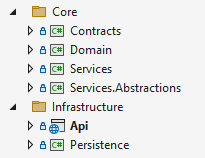

# 使用 NetArchTest.Rules 在 .NET 中进行架构测试 - Code Maze

> ## 摘录
>
> 在本文中，我们将探索如何使用 NetArchTest.Rules 库为我们的 .NET 应用编写架构测试。

---

在本文中，我们将探索如何使用 NetArchTest.Rules 库为我们的 .NET 应用编写架构测试。

要下载本文的源码，请访问我们的 [GitHub repository](https://github.com/CodeMazeBlog/CodeMazeGuides/tree/main/dotnet-testing/ArchitectureTestsWithNetArchTest)。

## 在 .NET 中创建架构测试的基础

对于本文，我们将使用基于 **洋葱架构（Onion architecture）** 的简单项目：

我们创建了几个表示这种架构模式不同层的项目。

首先，_领域层（Domain layer）_ 包括 `Domain` 项目。接着，_服务层（Service layer）_ 的实现被分割到 `Services` 和 `Services.Abstractions` 项目中。过渡到 _基础设施层（Infrastructure layer）_，我们有 `Persistence` 项目。最后，`Api` 项目代表 _展示层（Presentation layer）_。

接下来创建我们的基础实体：

这里，我们创建了 `Cat` 类，我们的应用围绕它构建。我们通过 `Api` 项目添加、更新、删除和查询猫。

现在我们准备好了待测试的项目，接下来通过创建一个新的 `xUnit` 测试项目并安装所需的 NuGet 包：

dotnet add package NetArchTest.Rules

我们可以在 `NetArchTest.Rules` 包中找到架构测试的主要规则。**[NetArchTest](https://github.com/BenMorris/NetArchTest) 本身是一个库，它允许我们创建测试，来强制执行 .NET 中的类设计、命名和依赖的约定。**

现在我们已经准备好了一切，让我们开始测试吧！

## 在 .NET 中防止继承的架构测试

我们知道，我们希望 _持久层（Persistence layer）_ 中的类被标记为 `sealed`，从而确保它们不能被继承。让我们看看我们如何强制执行这一点：

首先，我们获取我们 `Persistence` 项目的程序集。然后，我们开始使用 `Types` 类，它是 `NetArchTest.Rules` 库的入口点。我们继续将 `persistenceLayerAssembly` 变量传递给 `InAssembly()` 方法——这将获得该程序集中的所有类型。

其次，我们调用 `Should()` 方法。通过它，我们对目前匹配的类型列表应用条件。在我们的案例中，唯一的条件是所有类都必须是封闭的，所以我们使用 `BeSealed()` 方法。我们最后调用 `GetResult()` 方法。

最后，我们获得了 `result` 变量，它具有 `TestResult` 类型。它具有一个布尔值 `IsSuccessful` 属性，指示是否所有类型都符合我们的条件。因此，使用 **FluentAssertions** 库，我们确保 `IsSuccessful` 属性返回 `true`。

## 强制类可见性的架构测试在 .NET 中

**在洋葱架构中，具体的服务实现不应该在 _服务层（Service layer）_ 之外可见。**

这不适用于 `Services.Abstractions` 项目中的接口，所有这些都应该是公开的，所以让我们为此设置一个测试：

使用 `IServiceManager` 类型，我们获得所有 _服务层_ 中接口类型所在的程序集。然后，我们使用 `BePublic()` 方法，这是我们追求的条件。最后，我们断言结果是成功的。

## 确保正确的实现或继承

我们可以很容易地确保我们的类实现了正确的接口或继承自所需的类：

这里，我们创建了一个测试来确保 `CatNotFoundException` 类继承自 `NotFoundException` 类。指定程序集后，我们使用 `That()` 方法来指定哪些类型必须满足我们的条件。我们使用 `ResideInNamespace()` 方法获取 `Domain.Exceptions` 命名空间中的所有类型。

这将获取任何子命名空间中的类型，所以我们添加 `And()` 方法来进一步过滤并继续使用 `HaveNameStartingWith()` 方法。只有我们的 `CatNotFoundException` 匹配了所有的过滤器，并且我们继续使用 `Should()` 和 `Inherit()` 方法。最后，我们断言结果是 `true`，确认我们的继承规则被遵守。

## 强制项目引用的架构测试在 .NET 中

像洋葱架构或[干净架构（Clean architecture）](https://code-maze.com/dotnet-clean-architecture/)这样的软件架构在项目依赖方面有严格的规则。让我们创建一个测试来验证这些严格规则：

首先，我们编写一个测试以确保我们的 `Domain` 项目不依赖于我们解决方案中的其他项目。然后，我们获取所需的程序集并使用 `ShouldNot()` 方法连同 `HaveDependencyOnAll()` 方法。对于后者，我们使用 [集合表达式](https://code-maze.com/csharp-simple-initialization-with-collection-expressions-in-net-8/) 以字符串形式传递所有其他命名空间。

注意，`NetArchTest.Rules` 中的许多条件方法都有两个版本——以 _Have_ 或 _NotHave_ 开头。这与 `Should()` 和 `ShouldNot()` 方法一起，使我们能够用两种不同的方式编写测试，达到相同的结果。

## 为 .NET 中的架构测试编写自定义规则

`NetArchTest.Rules` 库允许我们创建自定义规则：

**要创建自定义规则，我们需要实现 `ICustomRule` 接口及其 `MeetsRule()` 方法。**我们创建一个规则，确保 `Services.Abstractions` 项目中的所有类型都是接口，具有 `public` 访问修饰符，并且名称以 _I_ 开头。

现在，让我们使用我们的规则：

在我们的测试中，我们首先创建我们 `CustomServiceLayerRule` 类的实例。然后，我们将该实例传递给 `MeetCustomRule()` 方法。这将把这个规则应用到所有匹配的类型上，在我们的例子中，这些类型都在 `Services.Abstractions` 项目中。

## 为 .NET 中的架构测试定义自定义规则策略

**`NetArchTest.Rules` 库允许我们利用自定义策略组合多个不同的规则：**

首先，我们通过在 `Policy` 类型上调用 `Define()` 方法开始创建自定义策略。该方法需要两个参数——一个名称和一个描述。我们继续通过 `For()` 方法在其中指定我们将要测试的类型。

接下来，我们开始为不同的子类型定义规则集。我们通过链接 `Add()` 方法来做到这一点，在其中我们过滤类型并使用 `Should()` 和 `ShouldNot()` 方法来断言给定条件。

策略完成后，我们调用 `Evaluate()` 方法来获取 `TestResult` 对象的列表。最后，我们断言每个结果的 `IsSuccessful` 属性是 `true`，确保所有条件都得到满足。

## 结论

在本文中，我们深入探讨了如何有效利用 NetArchTest.Rules 库来为 .NET 应用精心制定架构测试。通过强制执行关于类设计、命名和依赖的约定，我们确保了给定软件架构的完整性。值得注意的是，该库为编写有效的架构测试提供了一个强大的框架，涵盖了从防止不希望的继承到验证项目引用以及实现自定义规则的各个方面。此外，能够创建策略的重要功能增强了它的灵活性，并使我们能够根据具体项目要求定制测试。通过将 NetArchTest.Rules 集成到我们的测试工作流程中，我们可以自信地应用架构最佳实践，促进一个坚固且结构良好的代码库。
