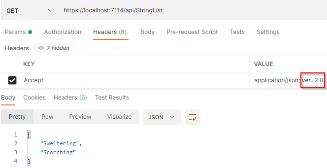
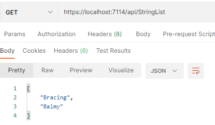
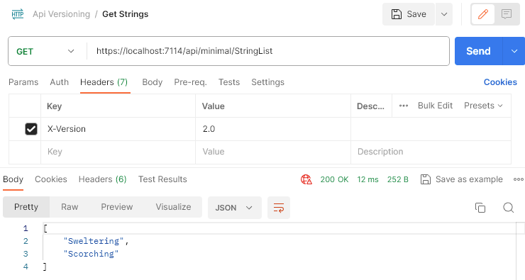

# ASP.NET Core 中的 API 版本控制

> ## 摘要
>
> 我们将讨论对 Rest API 进行版本控制，并探索 Asp.net Core 中我们拥有的不同版本控制方案。
>
> 原文 [API Versioning in ASP.NET Core](https://code-maze.com/aspnetcore-api-versioning/)

---

在这篇文章中，我们将讨论 API 版本控制，并探索我们在 ASP.NET Core 中拥有的选项。

为了下载这篇文章的源代码，你可以访问我们的 [GitHub 仓库](https://github.com/CodeMazeBlog/CodeMazeGuides/tree/main/aspnetcore-webapi/VersioningRestAPI)。

那么，让我们开始吧。

---

作为开发者，我们经常为我们的应用添加新功能并修改当前的 APIs。版本控制使我们能够安全地添加新功能而不会造成破坏性更改。但并非所有对 APIs 的更改都是破坏性更改。

**那么，在 API 端点中，我们可以将什么定义为“破坏性更改”？**

通常，添加性更改并不是破坏性更改：

- 添加新的端点
- 新的（可选的）查询字符串参数
- 向 DTOs 添加新属性

替换或移除我们 API 中的东西会导致破坏性更改：

- 更改 DTO 属性的类型
- 移除 DTO 属性或端点
- 重命名 DTO 属性或端点
- 在请求中添加必填字段

也就是说，我们不得不迟早面对版本控制要求，因为这是一种维持向后兼容性的方法。

## API 版本控制所需的包

对于版本控制要求，我们将使用 `Asp.Versioning.Mvc` 和 `Asp.Versioning.Mvc.ApiExplorer` NuGet 包。它们允许我们通过几行配置轻松地在我们的 ASP.NET Core 应用中实现版本控制。

也就是说，让我们安装它们：

PM\> Install-Package Asp.Versioning.Mvc

PM\> Install-Package Asp.Versioning.Mvc.ApiExplorer

安装完成后，让我们设置版本控制的主要配置：

```csharp
var apiVersioningBuilder = builder.Services.AddApiVersioning(o =>
{
    o.AssumeDefaultVersionWhenUnspecified = true;
    o.DefaultApiVersion = new ApiVersion(1, 0);
    o.ReportApiVersions = true;
    o.ApiVersionReader = ApiVersionReader.Combine(
        new QueryStringApiVersionReader("api-version"),
        new HeaderApiVersionReader("X-Version"),
        new MediaTypeApiVersionReader("ver"));
});
```

通过 `AssumeDefaultVersionWhenUnspecified` 和 `DefaultApiVersion` 属性，我们接受版本 1.0，如果客户端没有指定 API 的版本。此外，通过填充 `ReportApiVersions` 属性，我们展示当前支持的 API 版本。它会在我们的响应中添加 `api-supported-versions` 和 `api-deprecated-versions` 头。

最后，因为我们将支持不同的版本控制方案，所以通过 `ApiVersionReader` 属性，我们结合了从查询字符串、请求头和媒体类型读取 API 版本的不同方式。

除了这个配置，我们将对我们的 `Program` 类进行一些更多的修改：

```csharp
apiVersioningBuilder.AddApiExplorer(
    options =>
    {
        options.GroupNameFormat = "'v'VVV";
        options.SubstituteApiVersionInUrl = true;
    });
```

指定的格式代码 `GroupNameFormat` 将把版本格式化为“‘v’主要\[.次要\]\[-状态\]”。 此外，另一个属性 `SubstituteApiVersionInUrl` 只在通过 URI 段进行版本控制时才需要。

现在，我们可以添加一些测试数据来测试不同的 API 版本：

```csharp
public class Data
{
    public static readonly string[] Summaries = new[]
    {
        "Freezing", "Bracing", "Chilly", "Cool", "Mild", "Warm", "Balmy", "Hot", "Sweltering", "Scorching"
    };
}
```

我们的示例项目将在不同的版本上返回不同的字符串。API 版本 1.0 将返回以 “B” 开头的字符串；版本 2.0 将返回以 “S” 开头的字符串，而版本 3.0 将返回以 “C” 开头的字符串。

准备好一切之后，让我们检查版本控制方案。

## 查询字符串参数版本控制

**默认的版本控制方案是查询字符串参数版本控制。** 我们已经为将要用来发送版本控制信息的查询字符串参数 (**api-version**) 设置了一个名称。

现在，让我们创建一个控制器并添加一个动作，以将以 “B” 开头的字符串返回给客户端：

```csharp
[ApiController]
[Route("api/[controller]")]
[ApiVersion("1.0")]
public class StringListController : ControllerBase
{
    [HttpGet()]
    public IEnumerable<string> Get()
    {
        return Data.Summaries.Where(x => x.StartsWith("B"));
    }
}
```

我们使用 `[ApiVersion("1.0")]` 属性来设置控制器的版本。

为了测试这个，让我们在 GET 请求中以查询字符串参数的形式发送版本信息：


我们可以看到，所有以 “B” 开头的字符串作为响应被返回。

这种类型的版本控制使 URI 保持干净，因为我们只修改了 Accept 头的值。在这种情况下，该方案在版本之间保留了我们的 URI。

这样说，让我们创建另一个控制器并将其标记为版本 2.0：

```csharp
[ApiController]
[Route("api/[controller]")]
[ApiVersion("2.0")]
public class StringListController : Controller
{
    [HttpGet()]
    public IEnumerable<string> Get()
    {
        return Data.Summaries.Where(x => x.StartsWith("S"));
    }
}
```

然后，我们可以通过在请求的头部提供 `X-Version`（正如我们通过配置中的 `HeaderApiVersionReader` 类所设置的那样）来发送版本控制信息：


明显地，我们看到版本 2.0 在自定义头中被选中，以 “S” 开头的字符串被返回。

除了在头部发送版本信息外，我们还可以通过媒体类型头做同样的事情。在我们的配置中，我们使用 `MediaTypeApiVersionReader("ver")` 来声明 **ver** 应该是一个版本信息持有者。

那么，让我们修改我们的请求并提供 `Accept` 头部：



我们在这里得到了相同的结果。

最后，既然我们现在有了两个控制器，我们可以测试如果我们发送一个不带版本信息的请求会发生什么：



默认版本被选中且以 “B” 开头的字符串被返回给客户端。

## URI 版本控制

URI 版本控制是最常见的版本控制方案，因为版本信息从 URI 中很容易读取——因此这是一个优势。

为了在实践中看到这一点，我们将创建另一个控制器并将其版本设置为 3.0：

```csharp
[ApiController]
[Route("api/v{version:apiVersion}/StringList")]
[ApiVersion("3.0")]
public class StringListController : Controller
{
    [HttpGet()]
    public IEnumerable<string> Get()
    {
        return Data.Summaries.Where(x => x.StartsWith("C"));
    }
}
```

我们 V3 控制器中的动作返回以 “C” 开头的字符串。

此外，在 `Route` 属性中，我们设置了一个路由替换，声明 API 版本必须以 `v{version:apiVersion}` 格式在 URI 中。

这样说，我们可以在我们的请求中包含所需的版本：

`https://localhost:7114/api/v3/stringlist`

我们的 API 返回所有以 “C” 开头的字符串：

```json
["Cool", "Chilly"]
```

## 弃用旧版本

随着 API 中添加新功能和旧版本数量的增加，支持旧 API 合约引入了维护开销。**由于这种维护开销，我们需要一种方式来摆脱旧版本。**

API 版本控制包允许我们将 APIs 标记为已弃用。这给了客户端准备变更的时间。否则，立即删除旧 API 可能会给客户端留下不好的印象。

这样说，我们要做的所有事情就是在 `ApiVersion` 属性中使用额外的 `Deprecated` 属性来设置已弃用的版本。由于我们的例子现在包括了一个 3.0 版本的端点，让我们更新我们的代码以将版本 1 标记为弃用：

```csharp
[ApiController]
[Route("api/[controller]")]
[ApiVersion("1.0", Deprecated = true)]
public class StringListController : ControllerBase
{
    [HttpGet()]
    public IEnumerable<string> Get()
    {
        return Data.Summaries.Where(x => x.StartsWith("B"));
    }
}
```

由于我们将版本 1 标记为弃用，将版本 2 设置为默认端点的构建器配置也是一个好主意：

现在 API 版本 1.0 被标记为已弃用，并且客户端将从响应中的 `api-deprecated-versions` 头中获取这个信息：

```csharp
var apiVersioningBuilder = builder.Services.AddApiVersioning(o =>
{
    o.AssumeDefaultVersionWhenUnspecified = true;
    o.DefaultApiVersion = new ApiVersion(2, 0);
    o.ReportApiVersions = true;
    o.ApiVersionReader = ApiVersionReader.Combine(
        new QueryStringApiVersionReader("api-version"),
        new HeaderApiVersionReader("X-Version"),
        new MediaTypeApiVersionReader("ver"));
});
```


## 在 Minimal API 中的版本控制

.NET 中的 Minimal API 是一种以最小代码和设置创建 HTTP API 的简化方式。**它们提供了简化的语法和减少的样板代码，使它们非常适合微服务和小规模应用程序。**

我们可以在 minimal API 中使用版本控制。

为此，我们需要添加一个新的 NuGet 包 `Asp.Versioning.Http`。

让我们安装它：

PM\> Install-Package Asp.Versioning.Http

现在，让我们创建三个 minimal 端点，执行与基于控制器的等效端点相同的工作。为此，我们将修改我们的 `Program` 类。

我们从创建一个 API 版本集开始：

```csharp
var apiVersionSet = app.NewApiVersionSet()
    .HasDeprecatedApiVersion(new ApiVersion(1, 0))
    .HasApiVersion(new ApiVersion(2, 0))
    .HasApiVersion(new ApiVersion(3, 0))
    .ReportApiVersions()
    .Build();
```

如你所见，我们正在定义一个包含所有 API 版本信息的版本集，包括一个已弃用的版本。我们将把这个对象传递给我们的端点。

然后，我们定义我们的 minimal API 端点：

```csharp
app.MapGet("api/minimal/StringList", () =>
{
    var strings = Data.Summaries.Where(x => x.StartsWith("B"));
    return TypedResults.Ok(strings);
})
    .WithApiVersionSet(apiVersionSet)
    .MapToApiVersion(new ApiVersion(1, 0));
app.MapGet("api/minimal/StringList", () =>
{
    var strings = Data.Summaries.Where(x => x.StartsWith("S"));
    return TypedResults.Ok(strings);
})
    .WithApiVersionSet(apiVersionSet)
    .MapToApiVersion(new ApiVersion(2, 0));
app.MapGet("api/minimal/v{version:apiVersion}/StringList", () =>
{
    var strings = Data.Summaries.Where(x => x.StartsWith("C"));
    return TypedResults.Ok(strings);
})
    .WithApiVersionSet(apiVersionSet)
    .MapToApiVersion(new ApiVersion(3, 0));
```

我们通过使用 `WithApiVersionSet()` 方法将我们的版本集分配给它们。**这个方法将一个给定的端点与我们之前创建的版本集对象相关联。**

最后，我们正在使用 `MapToApiVersion()` 方法来指定端点的版本。这个方法将一个特定的端点映射到一个特定的版本。在我们的案例中，我们有三个具有相同 URL 但不同版本的端点，第一个是版本 1.0，第二个是版本 2.0，第三个是版本 3.0。

我们可以验证我们的端点是否按预期工作。

当我们调用端点的版本 1.0 时，它返回所有以 “B” 开头的摘要数据：


同一个端点的 2.0 版本，返回所有以 “S” 开头的摘要数据：



最后，带有 URI 版本控制的同一个端点的 3.0 版本，将返回所有以 “C” 开头的摘要数据：


再一次，我们将版本 1.0 标记为已弃用。因此，在响应中带有头 `api-deprecated-versions` 的版本将返回版本 1.0：


## 结论

API 必须演进，不同的版本将开始共存。这种共存导致了我们透明地管理 API 更改的实践，称为版本控制。我们需要添加新的 API 并优雅地弃用旧的 API。

在这篇文章中，我们学习了什么是版本控制，如何配置它，以及如何在我们的项目中使用不同的版本控制方案。此外，我们还学习了如何添加已弃用的版本以及在 Minimal API 中的版本控制。
