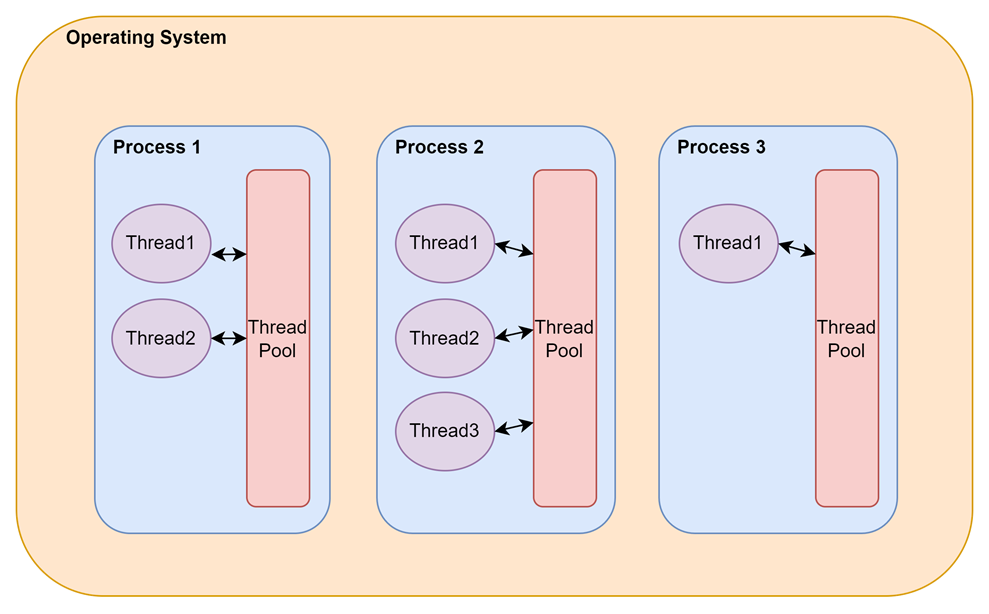
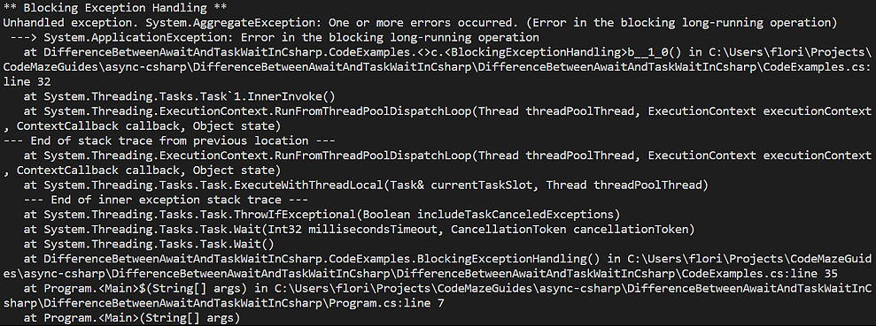

# C#中await和Task.Wait的区别 - Code Maze

> ## 摘要
>
> 深入探究C#中await和Task.Wait()的区别，覆盖.NET开发者的异步编程和异常处理。
>
> 原文 [Difference Between await and Task.Wait in C#](https://code-maze.com/csharp-difference-between-await-and-task-wait/)

---

在这篇文章中，我们讨论了C#和.NET中await和Task.Wait()的区别。我们将从阻塞代码和异步编程的概念入手。接下来，我们将看到如何在代码中使用await和Task.Wait()，以及它们对我们的应用程序的影响。最后，我们将建议我们应该使用哪一个，以及为什么。

要下载本文的源代码，你可以访问我们的 [GitHub仓库](https://github.com/CodeMazeBlog/CodeMazeGuides/tree/main/async-csharp/DifferenceBetweenAwaitAndTaskWaitInCsharp)。

那么，让我们开始吧。

## 为什么阻塞代码是不好的

我们编写代码是为了构建应用程序。我们的应用程序是一组在OS进程中托管的命令。更准确地说，每个进程都利用有限的线程数（由线程池管理），来执行我们应用程序的各种命令。

我们的软件中的每个命令都在一个线程中执行：

[](https://code-maze.com/wp-content/uploads/2024/03/CM-942-threads.png)

如上所述，一个进程可以拥有的线程数量有限。因此，我们应该确保高效地利用**线程**。也就是说，我们的代码应该尽可能少地占用一个线程，并在不再需要时尽快释放线程，意味着将它们返回给线程池。

然而，有些命令本质上需要很长时间才能完成。

这类长时间操作有两种类别：

- CPU密集型：对CPU施加压力并需要大量时间才能完成的重型操作。这类操作的例子包括复杂的数学计算和视频或图像压缩。
- I/O密集型：严重依赖于外部和远程资源且涉及显著等待时间的操作。例子包括写入/读取数据库和调用Web API。

**阻塞代码**指的是在CPU或I/O密集型操作完成整个期间保留一个线程的代码。这通常是一个漫长的时期，这种代码经常导致低效率、无响应和糟糕的用户体验。

**作为开发者，我们应该避免编写阻塞代码。而且我们有工具可以做到这一点。**

## 理解await和Task.Wait的异步编程

**异步编程**是一种编程范式，我们可以用它来避免在应用程序中阻塞线程。\*\*执行长时间运行的CPU和I/O密集型操作的执行转移到应用程序主执行流的单独流中。执行这些长时间运行的操作的线程不会阻塞，而是被释放并用于其他任务，直到长时间运行的操作完成。这时，代码执行会继续进行下一个操作。这种方式使我们的系统保持响应，整体感觉是我们的应用程序运行得更快。

在最新的.NET版本中，通过[基于任务的异步模式](https://learn.microsoft.com/en-us/dotnet/standard/asynchronous-programming-patterns/task-based-asynchronous-pattern-tap)和关键字`await`和`async`实现异步编程。

现在我们已经了解了阻塞和异步代码的基础知识，让我们继续看看`Task.Wait()`和`await`对我们的应用程序有什么影响，以及它们如何与上述概念相关。

## 异步编程和Task.Wait

**`Task`是`System.Threading.Tasks`命名空间中的一个类，代表一个异步操作。** 当我们想要异步运行某些操作时，我们可以将它包装在一个`Task`对象中并开始它。[Task](https://code-maze.com/?s=task)通过其接口暴露了大量有用的功能，允许我们与它和正在运行的操作进行交互。我们可以在`Task`对象上使用的方法之一是`Task.Wait()`。

**当我们调用`Task.Wait()`时，我们指示运行时停止并等待Task完成执行**，导致执行被阻塞。这意味着停止时，运行的线程没有被释放。相反，它保持忙碌，等待操作完成。这也意味着线程在调用`Wait()`之前和之后都将运行我们的代码。我们理解调用`Task.Wait()`具有本文前面提到的关于阻塞代码的所有负面因素。

让我们看看如何在运行中的`Task`上调用`Task.Wait()`方法：

```csharp
public static void BlockingCodeExample()
{
    Console.WriteLine("** 阻塞代码示例 **");
    Console.WriteLine($"当前 ManagedThreadId: {Environment.CurrentManagedThreadId}");
    Task taskToBlock = Task.Run(() =>
    {
        Thread.Sleep(5000);
        return "来自阻塞任务的问候";
    });
    taskToBlock.Wait();
    string blockingResult = taskToBlock.Result;
    Console.WriteLine($"当前 ManagedThreadId: {Environment.CurrentManagedThreadId}");
}
```

这里，我们创建`BlockingCodeExample()`方法，初步在控制台中打印执行线程的`CurrentManagedThreadId`。然后，我们定义一个类型为`Task`的对象，它包装了一个`Func`委托方法。委托方法调用`Thread.Sleep()`来模拟一个需要5秒才能完成的长时间运行操作并返回一个`string`。

然后，我们在`Task`上调用`Wait()`方法，使执行的线程在等待长时间运行操作的完成时阻塞。之后，我们调用`taskToBlock`的`Result`属性来检索任务的结果。

最后，我们再次打印`CurrentManagedThreadId`，注意到线程是相同的。

让我们检查控制台输出：

```shell
** 阻塞代码示例 **
当前 ManagedThreadId: 1
当前 ManagedThreadId: 1
```

现在我们继续使用`await`操作符，看看它与我们到目前为止看到的有什么不同。

## 异步编程和await

**`await`操作符用于异步等待操作完成。** 一旦运行时注意到一个`Task`被await，执行就会停止，运行的线程被释放，直到异步操作完成。在此期间，运行时可以在其他操作中使用该线程，系统保持响应。

此外，一旦异步操作完成，`await`关键字还可以“解包”返回的值，并允许我们将其分配给一个变量。

`await`操作符只能用于用`async`操作符标记的异步方法。最佳实践是方法具有`Task`或`Task<T>`的返回类型。这样调用方法的人也可以使用`await`。事件处理程序最好标记为`async`，返回类型为`void`。

现在让我们看看如何在一个异步方法中使用`await`关键字：

```csharp
public async static Task AsynchronousCodeExampleAsync()
{
    Console.WriteLine("** 异步代码示例 **");
    Console.WriteLine($"当前 ManagedThreadId: {Environment.CurrentManagedThreadId}");
    Task taskToAwait = Task.Run(() =>
    {
        Thread.Sleep(5000);
        return "来自异步任务的问候";
    });
    string awaitResult = await taskToAwait;

    Console.WriteLine($"当前 ManagedThreadId: {Environment.CurrentManagedThreadId}");
}
```

这里，我们声明了`AsynchronousCodeExample()`方法，并将其标记为`async`，以便我们可以在其中使用`await`操作符。我们打印执行线程的`CurrentManagedThreadId`，并定义我们将要等待的`Task`，通过调用`Thread.Sleep()`模拟一个长时间运行的操作。

然后我们使用`await`关键字来异步等待Task的完成并接收其结果。注意，在这种情况下，我们不需要像之前那样使用`Result`属性。最后，我们再次打印`CurrentManagedThreadId`。

让我们看一下我们方法的输出：

```shell
** 异步代码示例 **
当前 ManagedThreadId: 1
当前 ManagedThreadId: 10
```

注意在这种情况下，`CurrentManagedThreadId`在调用`await`关键字后值发生了变化。这是因为运行时决定切换执行线程。如前所述，初始线程被释放而不是阻塞等待完成。重要的是要注意，根据应用程序类型和我们的代码，运行时可能会等待初始线程再次空闲以在长时间运行操作完成后继续执行。

## 使用await和Task.Wait的异常处理

现在我们已经讨论了`await`和`Task.Wait()`在执行流中的区别，让我们也看看它们在处理异常时的不同方式。

正如我们已经看到的，`await`关键字在异步操作完成时返回结果。除此之外，它还会检查异步操作中是否引发了任何`Exception`，并将`Exception`抛回主线程。因此，我们得到的体验非常类似于同步执行。

现在，让我们看看这个动作：

```csharp
public async static Task AsynchronousExceptionHandlingAsync()
{
   Console.WriteLine("** 异步异常处理 **");
    try
    {
        Task taskToFail = Task.Run(() =>
        {
            throw new ApplicationException("异步长时间运行操作中的错误");
        });
        await taskToFail;
    }
    catch (ApplicationException ex)
    {
        Console.WriteLine(ex.Message);
    }
}
```

这里，我们定义了`AsynchronousExceptionHandling()`方法，该方法运行会引发`ApplicationException`的`Task`。我们使用[try-catch](https://code-maze.com/try-catch-block-csharp/)块来包装代码并处理任何异常。

现在，让我们运行这段代码，我们应该看到成功捕获`ApplicationException`：

```shell
** 异步异常处理 **
异步长时间运行操作中的错误
```

现在，让我们看看使用`Task.Wait()`时相同的代码行为如何：

```csharp
public static void BlockingExceptionHandling()
{
    Console.WriteLine("** 阻塞异常处理 **");
    try
    {
        Task taskToFail = Task.Run(() =>
        {
            throw new ApplicationException("阻塞长时间运行操作中的错误");
        });
        taskToFail.Wait();
    }
    catch (ApplicationException ex)
    {
        Console.WriteLine(ex.Message);
    }
}
```

这里，我们定义了`BlockingExceptionHandling()`方法，该方法运行会引发`ApplicationException`的`Task`。唯一的区别是这次我们没有`await`结果，而是调用`Wait()`方法。

我们运行这段代码，但注意到它崩溃了！

让我们看看输出：

[](https://code-maze.com/wp-content/uploads/2024/03/CM-942-exception.png)

看起来我们的代码抛出了`System.AggregateException`，而不是我们预期的`ApplicationException`。基于任务的编程使用[AggregateException](https://learn.microsoft.com/en-us/dotnet/api/system.aggregateexception?view=net-8.0)来整合并行任务可能抛出的多个异常。当我们处理并发任务并想要检查它们的状态并报告它们的失败时，这是一个强大的概念。然而，在处理单个异步任务的错误时，`AggregateException`在没有任何好处的情况下为我们的代码增加了复杂性。

## 结论

在这篇文章中，我们分析了await操作符和Task.Wait()方法的区别。我们首先讨论了什么是阻塞代码，为什么这是一种坏习惯，以及我们如何使用异步代码代替。我们看到了如何在我们的代码中使用await和Task.Wait()以及它们如何影响我们程序的执行流。我们看到了await如何使我们的异常处理变得更容易，以及为什么我们应该使用它来构建高效和响应式的系统。
