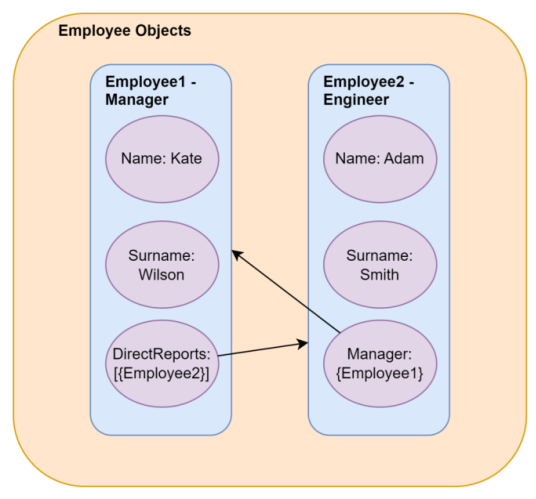

> ## 摘要
>
> 解决 .NET 中与 JSON 相关的循环引用问题，这些问题发生在对象之间直接或间接循环引用时。
>
> 原文 [Handling Circular References When Working With JSON in .NET](https://code-maze.com/aspnetcore-handling-circular-references-when-working-with-json/) 由 Georgios Panagopoulos 撰写。

---

在 .NET 应用中处理 JSON (JavaScript对象表示法)时，开发者经常遇到循环引用的挑战，即对象相互之间形成循环引用。

在本文中，我们将探索在 .NET 应用中涉及循环引用的常见场景，并讨论有效处理这些场景的技术。我们将使用 System.Text.Json 进行序列化和反序列化，这是最受欢迎的 NuGet 库之一。

要下载本文的源代码，你可以访问我们的 [GitHub 仓库](https://github.com/CodeMazeBlog/CodeMazeGuides/tree/main/json-csharp/HandlingCircularRefsWhenWorkingWithJson)。

## 理解循环引用

**循环引用** **发生在一个对象通过直接或间接的引用回到自身。** 在 JSON 序列化的背景下，当序列化复杂的对象图时，对象之间循环引用就会出现。

作为循环引用的一个例子，让我们定义一个类并引用同一类型的属性：

```csharp
public class Employee
{
    public required string Name { get; set; }
    public required string Surname { get; set; }
    public required string Title { get; set; }
    public Employee? Manager { get; set; }
    public Collection<Employee> DirectReports { get; set; } = new Collection<Employee>();
}
```

在这里，我们定义了 `Employee` 类，带有一个属性 `Employee? Manager`，该属性持有对员工直接上司的引用。另外，我们还定义了一个 `Collection<Employee> DirectReports` 属性，保存员工直接下属的集合。

这两个属性形成了一个循环引用：



接下来的部分将讨论将 `Employee` 类的 JSON 负载返回意味着什么。

## 默认的 JSON 序列化行为

首先，让我们看看对于序列化 `Employee` 类时 .NET [System.Text.Json](https://code-maze.com/introduction-system-text-json-examples/) 的默认行为。

让我们创建一个 ASP.NET Core Web API 项目并带有 `Controllers`。我们将使用 `Services` 层将数据返回给 `Controller` 来实现 [单一职责原则](https://code-maze.com/single-responsibility-principle/)。

现在让我们创建一个 `EmployeeService` 类：

```csharp
public class EmployeeService : IEmployeeService
{
    public IReadOnlyCollection<Employee> GetEmployees()
    {
        var manager = new Employee() { Name = "Kate", Surname = "Wilson", Title = "Development Manager" };
        var engineer = new Employee()
        {
           Name = "Adam", Surname = "Smith", Title = "Software Engineer", Manager = manager
        };
        manager.DirectReports.Add(engineer);
        return new[] { manager, engineer}.AsReadOnly();
    }
}
```

在这里，我们定义了 `EmployeeService` 类并实现了 `GetEmployees()` 方法。

在我们的方法中，我们创建了两个 `Employee` 对象的数组并将其作为 `ReadOnlyCollection` 返回。在集合中定义的 `manager` 和 `engineer` 员工形成了循环依赖。

现在让我们创建我们的 `EmployeeController`：

```csharp
[Route("api/[controller]")]
[ApiController]
public class EmployeeController(IEmployeeService employeeService) : ControllerBase
{
    [HttpGet]
    [ProducesResponseType(StatusCodes.Status200OK)]
    public IActionResult GetEmployees() => Ok(employeeService.GetEmployees());
}
```

在这里，我们使用 [依赖注入](https://code-maze.com/dependency-injection-aspnet/) 方式将我们的 `IEmployeeService` 接口传递给 `EmployeeController` 类。同时，我们定义了 `GetEmployees()` 方法，该方法监听 `HttpGet` 网络调用并返回包含 `IEmployeeService`  `GetEmployees()` 方法结果的 `OkObjectResult`。

在 `Program` 类中，让我们注册 `IEmployeeService` 和 `EmployeeService` 之间的依赖关系：

```csharp
builder.Services.AddScoped<IEmployeeService, EmployeeService>();
```

现在，让我们构建并运行我们的项目，并向我们的 `/api/employee` 端点执行一个 `GET` 请求：

```bash
Status: 500 Internal Server Error
System.Text.Json.JsonException: A possible object cycle was detected.
This can either be due to a cycle or if the object depth is larger than the maximum allowed depth of 32.
Consider using ReferenceHandler.Preserve on JsonSerializerOptions to support cycles.
Path: $.DirectReports.Manager.DirectReports.Manager.DirectReports.Manager.DirectReports.Manager.Name.
   at System.Text.Json.ThrowHelper.ThrowJsonException_SerializerCycleDetected(Int32 maxDepth)
...
```

我们得到了一个 `JsonException` 错误 `检测到可能的对象循环。这可能是由于循环或对象深度大于允许的最大深度32`。

另外，我们看到错误路径 `$.DirectReports.Manager.DirectReports.Manager.DirectReports.Manager.DirectReports.Manager.DirectReports.Manager.DirectReports.Manager.DirectReports.Manager.DirectReports.Manager.DirectReports.Manager.DirectReports.Manager.DirectReports.Manager.Name...`，指示导致错误的属性。

此外，框架提出了解决错误的方法 `考虑在 JsonSerializerOptions 上使用 ReferenceHandler.Preserve 以支持循环`，接下来让我们看看如何解决它。

## 处理循环引用

现在，让我们看看我们有哪些解决由循环引用引起的问题的选项。

`System.Text.Json` 库允许我们配置 C# 对象序列化为 JSON 的某些方面。我们可以用它来配置格式化、编码、末尾逗号，以及库将如何处理循环引用的方式。

通过 `ReferenceHandler` 配置选项处理**循环引用**，它可以取 `ReferenceHandler.IgnoreCycles` 或 `ReferenceHandler.Preserve` 两个值。

让我们从 **`IgnoreCycles`** 选项开始尝试。

### ReferenceHandler.IgnoreCycles

在我们的 `Program` 类中，让我们添加 `IgnoreCycles`：

```csharp
builder.Services.AddControllers().AddJsonOptions(options =>
   options.JsonSerializerOptions.ReferenceHandler = ReferenceHandler.IgnoreCycles);
```

.NET 框架将通过打破循环引用并返回 `null` 来尝试解决错误：

```json
[
  {
    "name": "Kate",
    "surname": "Wilson",
    "title": "Development Manager",
    "manager": null,
    "directReports": [
      {
        "name": "Adam",
        "surname": "Smith",
        "title": "Software Engineer",
        "manager": null,
        "directReports": []
      }
    ]
  },
  {
    "name": "Adam",
    "surname": "Smith",
    "title": "Software Engineer",
    "manager": {
      "name": "Kate",
      "surname": "Wilson",
      "title": "Development Manager",
      "manager": null,
      "directReports": [null]
    },
    "directReports": []
  }
]
```

`"manager":{...}` 和 `"directReports":[...]` 属性被替换为 `null`，这打破了循环引用，因为对象不再引用回自身。

这种方法很有效，并且我们可以看到输出以简单的格式。然而，这种解决方案的缺点是通过查看 JSON 结果很难理解关系。

现在让我们尝试 `ReferenceHandler.Preserve` 选项。

### ReferenceHandler.Preserve

在我们的 `Program` 类中，让我们更改配置代码：

```csharp
builder.Services.AddControllers().AddJsonOptions(options =>
   options.JsonSerializerOptions.ReferenceHandler = ReferenceHandler.Preserve);
```

通过这种方式，我们尝试用 `Preserve` 处理器解决我们的问题。这个处理器引入了两个新字段，`$id` 和 `$ref`，用于在打破循环引用的同时保留对象之间的关系：

```json
{
  "$id": "1",
  "$values": [
    {
      "$id": "2",
      "name": "Kate",
      "surname": "Wilson",
      "title": "Development Manager",
      "manager": null,
      "directReports": {
        "$id": "3",
        "$values": [
          {
            "$id": "4",
            "name": "Adam",
            "surname": "Smith",
            "title": "Software Engineer",
            "manager": {
              "$ref": "2"
            },
            "directReports": {
              "$id": "5",
              "$values": []
            }
          }
        ]
      }
    },
    {
      "$ref": "4"
    }
  ]
}
```

现在每个对象被声明一次并分配了一个 `$id`，这个 `$id` 被用于在 JSON 的其他地方通过 `$ref` 字段引用同一个对象。

这个机制解决了循环引用问题，并且还保留了关系。然而，它的缺点是使得 JSON 输出有些复杂，难以阅读和反序列化。

## 结论

在本文中，我们已经看到了如何使用 **System.Text.Json** 配置 JSON 序列化以在 C# 和 . NET 中处理循环引用。我们讨论了什么是循环引用并观察了在处理循环引用时 **System.Text.Json** 库的默认行为。最后，我们还讨论了解决循环引用的两种不同选项，**IgnoreCycles** 和 **Preserve**。
