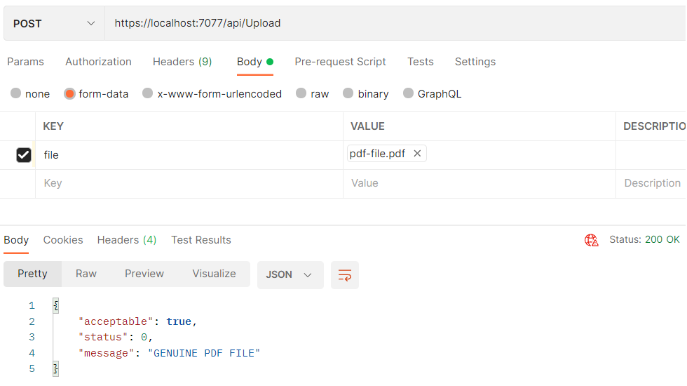

> ## 摘录
>
> 在这篇文章中，我们将了解如何验证文件上传扩展名，并确保我们的应用程序免受恶意上传的威胁。
>
> 原文 [How to Validate File Upload Extensions in ASP.NET Core](https://code-maze.com/aspnetcore-how-to-validate-file-upload-extensions/)

---

在这篇文章中，我们将看看如何**验证文件上传扩展名**并确保我们的应用程序免受恶意上传的威胁。

当接收用户上传的文件时，仅依靠文件名来确定文件类型是存在风险的。这是因为通过替换其扩展名可以轻松伪造文件类型。因此，我们需要一个更可靠的验证方法。

要下载本文的源代码，您可以访问我们的 [GitHub仓库](https://github.com/CodeMazeBlog/CodeMazeGuides/tree/main/aspnetcore-features/ValidatingFileUploadExtension)。

## 什么是文件签名？

文件签名，也称为**魔术数字**，是**文件开头的唯一字节序列**。与易于被用户操纵的文件名不同，文件签名提供了一个独特的指纹，允许我们确定文件的真实性质。

## 创建一个项目来验证文件上传扩展名

我们的目标是创建一个基本系统，用于上传图像和PDF文件，并通过两步进行验证：

1. 使用上传文件的文件扩展名确定它是否属于可接受的格式，PDF或图像
2. 验证该文件是否确实与其扩展名指示的类型相对应。如果第一步成功，我们将执行此过程

### 创建初始项目

让我们使用Visual Studio创建一个新的Web API，指定项目名称和目标框架。**确保保持‘使用控制器’选项被选中，因为我们将使用标准控制器**，而不是 [Minimal APIs.](https://code-maze.com/dotnet-minimal-api/)

### 添加我们的主要类

接下来，我们需要定义一个名为 `FileFormatDescriptor` 的抽象类，它将作为特定文件类型实现的基类：

在我们的类中，我们有`Extensions`和`MagicNumbers`属性，分别存储支持的文件扩展名及其相应的文件签名。

`Validate()`方法将负责执行验证。它以`IFormFile`类对象作为输入。在该方法中，我们打开一个流，提取初始字节，然后将它们与存储的签名进行比较以验证文件签名。

由于大多数文件格式的签名长度相对较短，通常不超过16个字节，我们将它们读入使用 [stackalloc](https://learn.microsoft.com/en-us/dotnet/csharp/language-reference/operators/stackalloc) 创建的 `Span` 中。**如果字节需求超过合理长度，例如256个字节，我们需要使用 [ArrayPool](https://code-maze.com/csharp-arraypool-memory-optimization/) 或其他适当方法来为我们的字节缓冲区**。

请注意，由于**不同文件类型可能具有不同长度的签名**，例如PNG和JPG图像文件的情况，我们需要读取到存储在`MagicNumbers`数组中的签名的最大长度的字节，以可能匹配存储的任何签名。

现在，我们需要一个简单的`record`来保存验证方法的结果，表明文件是否可接受，以及合适的消息：

public record Result(bool Acceptable, Status Status, string Message);

接下来，我们定义两个类，`Pdf` 和 `Image`，它们继承自抽象类 `FileFormatDescriptor`。每个类代表我们系统中支持的一个文件格式。我们将使用它们各自的扩展名和签名初始化这些类。

这篇文章对您是否有用？考虑订阅并免费获取 **ASP.NET Core Web API 最佳实践** 电子书。

让我们从 `Pdf` 类开始：

然后，我们将继续添加 `Image` 类：

鉴于我们的系统在图像格式上有一定的容忍度，我们将JPG和PNG格式合并为一个类。然而，我们可以将每个图像格式分解成单独的类。

### 实现我们的验证器静态类

现在，让我们通过创建一个静态类来集中我们的验证过程，该类维护允许的类型类列表并使用它们各自的`Validate()`方法：

验证从提取上传文件的[扩展名](https://learn.microsoft.com/en-us/dotnet/api/system.io.path.getextension?view=net-8.0)开始，然后通过在`AllowedFormats`列表中寻找匹配的扩展名来确定假定的文件类型。如果没有找到相应的扩展名，我们简单地返回一个响应，表示不支持该文件类型。否则，我们将`file`传递给`targetType`实例的`Validate()`方法以验证文件的内容是否符合预期的格式。

### 添加一个上传端点

为了准备验证上传的文件，我们必须有一个调用它的动作。因此，让我们定义`UploadController`，它将运用我们的`FileValidator`：

## 使用Postman测试

让我们验证我们的代码是否按预期工作。因为我们创建了一个Web API，我们将使用**Postman**来测试。

我们创建一个新的POST请求，选择`form-data`选项。最后，我们将添加一个**键值对**，其中键对应于控制器中的`IFormFile`参数的名称，值代表文件本身。

这篇文章对您是否有用？考虑订阅并免费获取 **ASP.NET Core Web API 最佳实践** 电子书。

让我们从上传一个伪造的PNG文件开始：

响应表明上传的文件不可接受，我们的消息属性为我们提供了一个更易读的解释。

现在，让我们通过上传一个PDF文件来继续我们的测试：

最后，我们将尝试上传一个不支持的文件类型，即Word文档：

很好，结果符合我们的预期。现在，在这个成功的基础上，我们可以通过实现操作过滤器来增强我们的解决方案，详见我们的文章 [在ASP.Net Core中验证上传文件的不同方式](https://code-maze.com/aspnetcore-validate-uploaded-file/)。

这篇文章对您是否有用？考虑订阅并免费获取 **ASP.NET Core Web API 最佳实践** 电子书。

## 结论

在这篇文章中，我们学习了如何在.NET应用中验证文件上传扩展名。我们在系统中使用了文件签名，作为一种简单而有效的安全增强方法。尽管它很简单，但这种方法为我们的软件增加了一层额外的保护，使其更加安全，抵御潜在威胁。
