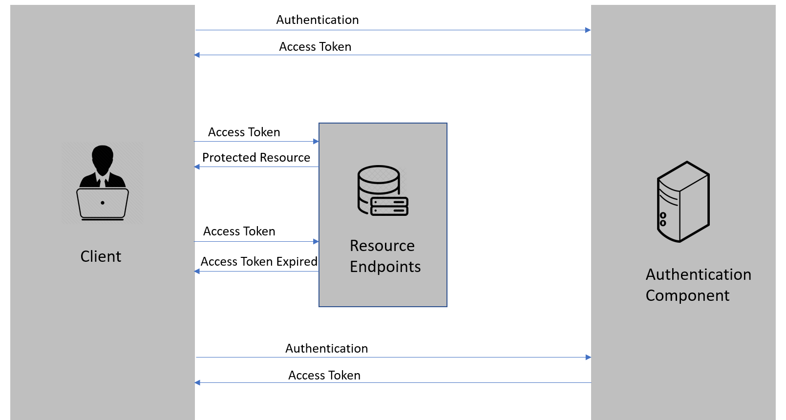
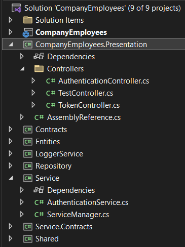
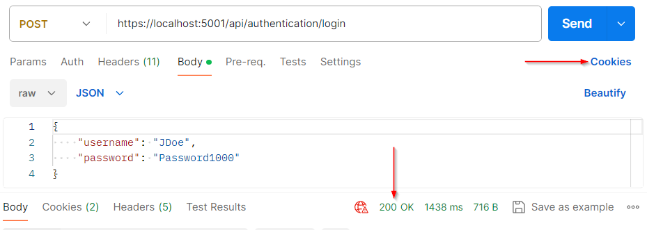
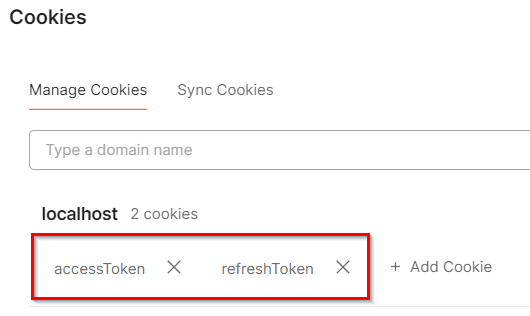

> ## 摘要
>
> 在本文中，我们将向您展示在 .NET Core 应用中如何使用 HttpOnly Cookie 来保护我们的 JWT (JSON Web Tokens)，当实现认证和刷新令牌操作时。
>
> 原文 [How to Use HttpOnly Cookie in .NET Core for Authentication and Refresh Token Actions](https://code-maze.com/how-to-use-httponly-cookie-in-net-core-for-authentication-and-refresh-token-actions/) 由 Marinko Spasojević 撰写。

---

在本文中，我们将向您展示在 .NET Core 应用中如何使用 HttpOnly Cookie 来保护我们的 JWT (JSON Web Tokens)，当实现认证和刷新令牌操作时。

## 使用 JWT 进行身份验证逻辑的标准流程

当我们遵循 JWTs 的通常流程时：

]

我们可以看到，一旦客户端发送身份验证请求，他们将得到访问令牌，我们通常将其存储在本地或会话存储中。

这两种存储方法都不太安全，当然，我们可以通过在将令牌存储在存储中之前加密它们来增加令牌的安全性。然后在发送请求之前对它们进行解密。在这种情况下，如果攻击者以某种方式获取存储访问权，那么这些令牌对他们来说将没有用处。

但是，还有另一种选择，被认为更好和更安全。当然，我们谈论的是 HttpOnly cookies。

## 什么是 HttpOnly Cookie？

HttpOnly Cookie 是我们添加到浏览器 cookie 的一个标签，以防止客户端脚本访问数据。它提供了一个门禁，我们用它来防止除服务器之外的任何东西访问特殊的 cookie。当我们生成一个 cookie 时，使用 HttpOnly 标签有助于减少客户端脚本访问受保护 cookie 的风险，从而使这些 cookie 更加安全。

因此，考虑到这一切，让我们看看如何在 .NET Core 应用程序中使用 HttpOnly cookie 进行认证和刷新令牌操作。

## 在 .NET Core 应用中实现 HttpOnly Cookie

现在，我们已经有了一个实现了认证和刷新动作的项目：

]

这里，我们正在使用常规方式，令牌通过响应体发送给客户端：

```csharp
[HttpPost("login")]
public async Task<IActionResult> Authenticate([FromBody] UserForAuthenticationDto user)
{
    if (!await _service.AuthenticationService.ValidateUser(user))
        return Unauthorized();
    var tokenDto = await _service.AuthenticationService.CreateToken(populateExp: true);
    return Ok(tokenDto);
}
```

这是我们在 [Refresh Token video](https://youtu.be/9CobMWEzr2A) 中使用的代码，因此我们不会在这里深入研究认证或刷新令牌逻辑。如果您想了解更多关于这两者的内容，您可以观看视频，或者您可以阅读有关 [刷新令牌逻辑](https://code-maze.com/using-refresh-tokens-in-asp-net-core-authentication/) 和 [JWT 认证逻辑](https://code-maze.com/authentication-aspnetcore-jwt-1/) 的内容。

好的，首先。

让我们开始修改 ServiceExtensions 类中的 JWT 配置：

```csharp
.AddJwtBearer(options =>
{
    options.TokenValidationParameters = new TokenValidationParameters
    {
        ValidateIssuer = true,
        ValidateAudience = true,
        ValidateLifetime = true,
        ValidateIssuerSigningKey = true,
        ValidIssuer = jwtSettings["validIssuer"],
        ValidAudience = jwtSettings["validAudience"],
        IssuerSigningKey = new SymmetricSecurityKey(Encoding.UTF8.GetBytes(secretKey))
    };
    options.Events = new JwtBearerEvents
    {
        OnMessageReceived = ctx =>
        {
            ctx.Request.Cookies.TryGetValue("accessToken", out var accessToken);
            if (!string.IsNullOrEmpty(accessToken))
                ctx.Token = accessToken;
            return Task.CompletedTask;
        }
    };
});
```

因此，为了避免任何混淆，我们正在使用 JWT 认证，并且在实现 HttpOnly cookie 逻辑之后我们将继续使用 JWT 认证。cookie 将被用作传输机制而已 - 所以我们在这里不使用 cookie 认证，我们不必注册 cookie 中间件。

但是我们必须做的是使用 Events 属性扩展 JwtBearer 配置，并用一个新的 JwtBearerEvents 类来实例化它……然后在内部，我们调用 OnMessageReceived 属性，它在这里充当一旦接收到认证协议消息就会触发的事件。这是一个接受上下文作为参数的 Func 委托。

借助 context 参数，我们调用 `Request.Cookies` 属性尝试提取 `accessToken` cookie 的值并将其放入 `accessToken` 本地变量中。当然，只有当我们找到 `accessToken` 时，我们才使用 `Token` 属性并将其设置为 `accessToken` 的值。

最后，我们返回 `Task.completedTask`。

## 使用 TestController 来授权附加了 HttpOnly Cookie 的请求

现在，为了解释这一点。如果你检查测试控制器：

```csharp
[Route("api/test")]
[ApiController]
public class TestController : ControllerBase
{
    [HttpGet]
    [Authorize]
    public IActionResult TestAction()
    {
        return Ok();
    }
}
```

它有一个单一的虚拟 Get 动作，并且用 `Authorize` 属性进行了装饰。一旦请求到达这个 `Authorize` 属性，`OnMessageReceived` 事件将被触发。然后，我们只是想提取 cookie 的令牌值并将其作为验证过程的 `Token` 设置。

另外，为了更清楚，我们将在 HttpOnly cookie 中存储访问令牌和刷新令牌，但对于授权部分，我们只需要访问令牌。

就配置而言，这就是全部，我们可以继续修改身份验证控制器中的逻辑。

## 修改 .NET Core 应用中的认证操作以使用 HttpOnly Cookie。

在这个控制器中，我们有不同的动作，但认证动作是我们关心的：

```csharp
[HttpPost("login")]
public async Task<IActionResult> Authenticate([FromBody] UserForAuthenticationDto user)
{
    if (!await _service.AuthenticationService.ValidateUser(user))
        return Unauthorized();
    var tokenDto = await _service.AuthenticationService.CreateToken(populateExp: true);
    return Ok(tokenDto);
}
```

您可以看到我们正在调用身份验证服务来处理身份验证逻辑和令牌创建逻辑的繁重工作，然后，我们将访问令牌和刷新令牌都返回给控制器：

```csharp
public async Task<TokenDto> CreateToken(bool populateExp)
{
    …
    var accessToken = new JwtSecurityTokenHandler().WriteToken(tokenOptions);
    return new TokenDto(accessToken, refreshToken);
}
```

然后，我们只需将包含两个令牌的 `tokenDto` 返回给客户端。

现在，我们不想这么做。我们想要做的是将两个令牌都设置在 HttpOnly cookie 中，并将其发送给客户端。

### 身份验证服务修改

因此，让我们返回到身份验证服务类并创建一个新方法，该方法将令牌存储在 cookie 中。我们在身份验证服务中创建它，以便我们可以同时为认证和刷新逻辑重用它：

```csharp
public void SetTokensInsideCookie(TokenDto tokenDto, HttpContext context)
{
    context.Response.Cookies.Append("accessToken", tokenDto.AccessToken,
        new CookieOptions
        {
            Expires = DateTimeOffset.UtcNow.AddMinutes(5),
            HttpOnly = true,
            IsEssential = true,
            Secure = true,
            SameSite = SameSiteMode.None
        });
    context.Response.Cookies.Append("refreshToken", tokenDto.RefreshToken,
        new CookieOptions
        {
            Expires = DateTimeOffset.UtcNow.AddDays(7),
            HttpOnly = true,
            IsEssential = true,
            Secure = true,
            SameSite = SameSiteMode.None
        });
}
```

在该方法中，我们使用 context 参数，调用 Cookies 属性，然后调用 Append 方法添加一个新的 cookie。我们首先需要提供键，这个键必须与我们在配置事件中使用的相同。然后我们需要值，即生成的访问令牌。

最后，我们需要使用 `CookieOptions` 类来设置一些 cookie 选项。

这个 cookie 条目将在五分钟后过期，这正是访问令牌过期期限的准确值。同样，我们希望这是一个 HttpOnly cookie，并声明它对应用工作是必需的。另外，我们希望通过 `Secure` 属性仅通过 SSL 或 HTTPS 启用 cookie 传输，并最后，让我们使用 `SameSite` 属性并将其填充为 `SameSiteMode.None`。

我们对刷新令牌做了一些小的名称更改和过期期间相同的操作。

就是这样。

当然，我们必须修改 `IAuthenticationService` 接口，并在那里添加相同的成员：

```csharp
void SetTokensInsideCookie(TokenDto tokenDto, HttpContext context);
```

### 修改 AuthenticationController 以使用 HttpOnly Cookie

现在，我们可以回到我的身份验证控制器：

```csharp
[HttpPost("login")]
public async Task<IActionResult> Authenticate([FromBody] UserForAuthenticationDto user)
{
    if (!await _service.AuthenticationService.ValidateUser(user))
        return Unauthorized();
    var tokenDto = await _service.AuthenticationService.CreateToken(populateExp: true);
    _service.AuthenticationService.SetTokensInsideCookie(tokenDto, HttpContext);
    return Ok();
}
```

在这里，我们首先从 `Ok` 方法中移除有效载荷。我们不想在响应体内返回任何令牌。

然后，我们使用 `AuthenticationService`，然后是 `SetTokens` 方法来设置 cookie 中所需的令牌。

此时，我们将返回一个 200 状态码给客户端，但带有令牌的 cookie 将单独发送。

让我们测试一下。

首先，让我们向 `TestController` 发送请求：

```bash
https://localhost:5001/api/test
```

我们得到了 401 未授权的响应，我们预料到了这一点，因为我们用 `Authorize` 属性保护了该动作。

现在，让我们向认证动作发送请求：

]
我们得到了 200 OK 的结果，但如果我们检查 Cookies 链接：

]

我们可以看到这里有两个令牌。你可以检查每个令牌以找到两个令牌的值和我们在 cookie 选项类中设置的其他属性。

太棒了。

现在，带有令牌的 cookie 存储在 Postman 中，我们可以再次发送前面的请求。再次，我们会得到 200 OK 的结果。这意味着认证工作正常。

## 在 .NET 中为刷新令牌逻辑实现 HttpOnly Cookie

太棒了，现在我们可以移动至刷新逻辑：

```csharp
[HttpPost("refresh")]
public async Task<IActionResult> Refresh([FromBody] TokenDto tokenDto)
{
    var tokenDtoToReturn = await _service.AuthenticationService.RefreshToken(tokenDto);
    return Ok(tokenDtoToReturn);
}
```

老实说，我们这里只需要做一个小改动。我们不想在服务层修改任何东西，所以只有动作内部的这部分。

正如你所看到的，现在，我们在请求体内接受 `accessToken` 和 `refreshToken`。但现在，我们想要以不同的方式进行：

```csharp
[HttpPost("refresh")]
public async Task<IActionResult> Refresh()
{
    HttpContext.Request.Cookies.TryGetValue("accessToken", out var accessToken);
    HttpContext.Request.Cookies.TryGetValue("refreshToken", out var refreshToken);
    var tokenDto = new TokenDto(accessToken, refreshToken);
    var tokenDtoToReturn = await _service.AuthenticationService.RefreshToken(tokenDto);
    _service.AuthenticationService.SetTokensInsideCookie(tokenDtoToReturn, HttpContext);
    return Ok();
}
```

因此，我们从动作中移除输入参数。我想要做的是手动从 cookie 中提取两个条目。

为此，我们使用 `HttpContext` 属性，然后调用 `Request.Cookies` 属性并调用 `TryGetValue` 方法尝试提取 `accessToken` 并将其存储在名为 `accessToken` 的局部变量中。

我们对 `refreshToken` 做了一些小的名称变化。

现在，一旦我们有了这两个值，我们创建一个新的 `tokenDto` 变量，并用访问令牌和刷新令牌填充它。

然后，我们再次使用身份验证服务并调用 `SetTokensInsideCookie` 方法并提供所需的两个参数，以将新的令牌添加到 cookie 中 - 这些令牌是在 `RefreshToken` 方法内创建的。
最后，我不想在响应体内返回任何内容。

就是这样。

我再次启动应用程序……并重复流程，但首先从 postman 中删除 cookie。

然后，一旦我们发送测试请求，我们得到 401。在那之后，我们认证用户，并得到 cookie……当然，这将允许我们访问测试动作……

最后，我们可以发送刷新令牌请求：

```bash
POST: https://localhost:5001/api/token/refresh
```

再次，我们得到 200 OK 的结果。如果我们检查令牌，我们可以找到一个不同的刷新令牌和一个不同的访问令牌。

太棒了。

## 结论

在这篇文章中，我们了解了如何在 .NET 应用程序中使用 HttpOnly Cookie 实现认证和刷新令牌操作。这个功能可以提高我们令牌的安全性，并防止客户端脚本操纵令牌。
