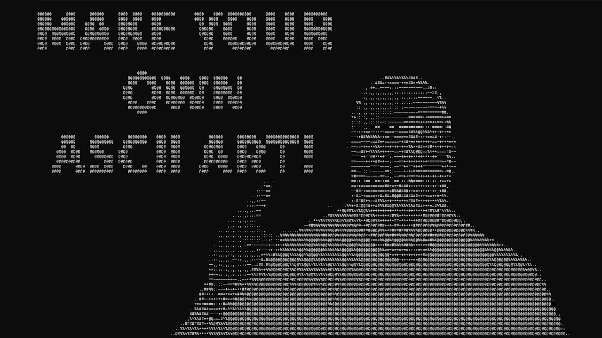

> ## 摘要
>
> 想要将图片转换为 ASCII 艺术品吗？现在，您可以使用自己的 C# 程序生成 ASCII 艺术品！包括示例代码！
>
> 原文 [Generate ASCII Art - A Simple How-To in C#](https://www.devleader.ca/2023/08/25/generate-ascii-art-a-simple-how-to-in-c/)

---

ASCII 艺术是使用 ASCII 标准中的字符来创建视觉效果的一种技术，[几十年来一直是计算世界的一部分](https://en.wikipedia.org/wiki/ASCII_art#:~:text=Among%20the%20oldest%20known%20examples,of%20their%20early%20ASCII%20art. "ASCII Art - Wikipedia")。它是一种在不需要传统图形的情况下表示图像的有趣方式。对于编程新手来说，构建一个生成 ASCII 艺术的程序可以作为一个富有洞察力的介绍。

在本指南中，我们将通过 C# 的方法转换标准图像并从中生成 ASCII 艺术。您不仅将拥有完整的源代码，使您的 C# 应用程序能够生成 ASCII 艺术，而且我还将解释为什么像这样的简单程序对于帮助您学习至关重要。

---

## 在我提供**生成 ASCII 艺术的代码**之前...

我意识到许多来到这里的人只是想直接跳到代码部分。我明白！但这就是为什么我想首先传达一个重要信息，尤其是对于更多的[初级开发者](https://www.devleader.ca/2023/03/06/how-to-choose-the-best-beginner-programming-language/ "如何选择最佳的初学者编程语言")来说。

很多时候初学者程序员在学习的早期阶段感到困难，因为他们不确定如何分配时间。他们尝试阅读书籍、文章和博客帖子（就像这篇一样！）来学习理论，或者[观看视频](https://www.devleader.ca/youtube-videos-from-devleader/ "DevLeader 的 YouTube 视频")并尝试找到最佳的 BootCamp 以便成功。我经常提醒我的观众，我认为[构建东西并实际编写代码是学习的最佳方式之一](https://www.devleader.ca/2023/08/17/building-projects-unlock-success-as-a-beginner-programmer/ "构建项目 - 解锁初学者程序员的成功")。

在我们一起浏览这段代码时，请记住这一点！在文章的结尾，我提出了一些可能需要考虑的变体和增强功能。我包括了这个列表不仅因为我认为它非常酷，而且是为了激发您的创造力！思考作为开发者您想要关注的不同事物，并看看您是否可以将它们整合到您的 ASCII 艺术生成器中！

能够利用像这样的简单程序消除“构建什么是正确的事情”的压力，并使您能够专注于学习和探索。跟着视频一起学习！



---

## **生成 ASCII 艺术的示例代码**

好吧，你坚持通过了我的导言。谢谢！让我们来看一些代码（顺便说一句，[完整的代码可在 GitHub 上获取](https://github.com/ncosentino/DevLeader/tree/master/AsciiArtGenerator "生成 ASCII 艺术 - GitHub")）：

```csharp
string imagePath = "your file path here";

using var inputStream = new FileStream(
    imagePath,
    FileMode.Open,
    FileAccess.Read,
    FileShare.Read);
var generator = new Generator();

using var sourceImage = Image.Load(inputStream);
using var imageRgba32 = sourceImage.CloneAs&lt;Rgba32&gt;();
using var image = new ImageSharpImageSource(imageRgba32);

var asciiArt = generator.GenerateAsciiArtFromImage(image);

Console.WriteLine(asciiArt.Art);
```

这是[我们的 C# 程序的入口点](https://www.devleader.ca/2023/03/01/c-basics-a-guide-for-new-programmers/ "C# 基础知识：新程序员指南")。在这里，我们设置了图像的路径并创建了一个流来读取它。我们还实例化了主要的 `Generator` 类，该类将处理 ASCII 转换，以及将持有图像数据的 `ImageSharpImageSource`。魔法发生在 `GenerateAsciiArtFromImage` 方法内部，我们将很快查看。

ImageSharp 库用于加载图像，然后克隆成一个格式（`Rgba32`），允许我们处理单个像素颜色。`ImageSharpImageSource` 类充当 ImageSharp 库与我们的 ASCII 生成逻辑之间的桥梁。当我们查看此类的代码时，我们将能够看到允许我们获取 X 和 Y 坐标的像素数据的索引器方法。

接下来让我们看看图像源的实现：

```csharp
internal interface IImageSource : IDisposable
{
    int Width { get; }

    int Height { get; }

    float AspectRatio { get; }

    Rgb GetPixel(int x, int y);
}

internal sealed class ImageSharpImageSource : IImageSource
{
    private readonly Image&lt;Rgba32&gt; _image;

    public ImageSharpImageSource(Image&lt;Rgba32&gt; image)
    {
        _image = image;
    }

    public int Width =&gt; _image.Width;

    public int Height =&gt; _image.Height;

    public float AspectRatio =&gt; _image.Width / (float)_image.Height;

    public Rgb GetPixel(int x, int y)
    {
        var pixel = _image[x, y];
        return new(
            pixel.R,
            pixel.G,
            pixel.B);
    }

    public void Dispose() =&gt; _image.Dispose();
}
```

在上面的代码中，我们可以看到我们正在实现 `IImageSource` 接口。这样做是因为您实际上可以用 System.Drawing 命名空间和 `Bitmap` 类实现相同的功能，但它只能在 Windows 上工作。代码 `_image[x, y]` 允许我们从图像中获取像素信息！

重要的最后一个类是实际的生成器。我们将在[接下来的部分](https://www.devleader.ca/2023/08/25/generate-ascii-art-a-simple-how-to-in-c/#thegeneratorclass "接下来的部分")中更详细地检查代码：

```csharp
internal sealed class Generator
{
    public AsciiArt GenerateAsciiArtFromImage(
        IImageSource image)
    {
        var asciiChars = "@%#*+=-:,. ";

        var aspect = image.Width / (double)image.Height;
        var outputWidth = image.Width / 16;
        var widthStep = image.Width / outputWidth;
        var outputHeight = (int)(outputWidth / aspect);
        var heightStep = image.Height / outputHeight;

        StringBuilder asciiBuilder = new(outputWidth * outputHeight);
        for (var h = 0; h &lt; image.Height; h += heightStep)
        {
            for (var w = 0; w &lt; image.Width; w += widthStep)
            {
                var pixelColor = image.GetPixel(w, h);
                var grayValue = (int)(pixelColor.Red * 0.3 + pixelColor.Green * 0.59 + pixelColor.Blue * 0.11);
                var asciiChar = asciiChars[grayValue * (asciiChars.Length - 1) / 255];
                asciiBuilder.Append(asciiChar);
                asciiBuilder.Append(asciiChar);
            }

            asciiBuilder.AppendLine();
        }

        AsciiArt art = new(
            asciiBuilder.ToString(),
            outputWidth,
            outputHeight);
        return art;
    }
}
```

---

## **分解图像处理**

当我们在计算机中讨论图像时，我们实际上是在讨论一个像素矩阵。每个像素都有一种颜色，这种颜色通常由三个主要组成部分表示：红色、绿色和蓝色（RGB）。你可能还会在这个混合中看到第四个组成部分，即“alpha”（或透明度），由 A（RGBA）表示。这些组件以不同的强度组合在一起，为我们在数字图像中看到的广泛颜色谱提供了基础。

ASCII 艺术不是以传统意义上处理颜色。相反，它使用具有不同视觉重量或密度的字符来表示图像。这就是灰度概念发挥作用的地方。灰度图像是每个像素的 RGB 组件都具有相同值的图像，从而产生各种灰色阴影。将图像转换为灰度以生成 ASCII 艺术的重要性在于简化表示。通过将图像简化为其亮度，我们就可以将不同的灰色阴影映射到特定的 ASCII 字符上，并从图像生成 ASCII 艺术。

在我们的代码中，`IImageSource` 接口作为我们图像源的抽象。它提供了获取图像宽度、高度和宽高比的属性，以及检索特定像素颜色的方法。`ImageSharpImageSource` 类是使用 ImageSharp 库的这个接口的实现。正如我们所见，它围绕一个 ImageSharp 图像包装并提供了我们的程序生成 ASCII 艺术所需的必要数据。

[正如我们将在稍后的部分中看到](https://www.devleader.ca/2023/08/25/generate-ascii-art-a-simple-how-to-in-c/#projectenhancements "正如我们将在稍后的部分中看到")，关于图像缩放仍然有一些考虑，包括缩小图像以适合控制台输出并考虑宽高比。此外，代码本身没有进行基准测试，以查看是否有机会减少内存使用和/或更有效地生成输出。

---

## **生成器类**：生成 ASCII 艺术的关键

`Generator` 类是魔法发生的地方。它负责将我们的图像转换为一幅 ASCII 艺术。让我们更深入地研究其主要方法：`GenerateAsciiArtFromImage`。

```csharp
var asciiChars = "@%#*+=-:,. ";
```

这行定义了我们的 ASCII 字符调色板。这些字符是基于它们的视觉密度选定的，其中 `@` 是最密集的，空格 ( ) 是最不密集的。您可以自定义此列表以具有不同的视觉外观，并添加或删除一些字符以改变所使用的阴影的粒度。

```csharp
var aspect = image.Width / (double)image.Height;
        var outputWidth = image.Width / 16;
        var widthStep = image.Width / outputWidth;
        var outputHeight = (int)(outputWidth / aspect);
        var heightStep = image.Height / outputHeight;
```

此代码实际上是不完整的，但它是[思考增强的好机会](https://www.devleader.ca/2023/08/25/generate-ascii-art-a-simple-how-to-in-c/#projectenhancements "思考增强的好机会")。这个块的目的是获得图像的正确输出分辨率，并考虑需要如何缩放。最理想的情况是可以配置这一点，这样就没有魔术数字了！

在我们通过图像的每个像素循环的一个重要细节是，我们从左上角开始，然后横穿过行再到下一行。这是因为逐行打印到控制台比逐列打印更简单。随着我们循环通过图像的像素，我们需要确定哪个 ASCII 字符最能代表一个特定像素的颜色。为此，我们首先将像素的颜色转换为灰度值：

```csharp
var pixelColor = image.GetPixel(w, h);
var grayValue = (int)(pixelColor.Red * 0.3 + pixelColor.Green * 0.59 + pixelColor.Blue * 0.11);
```

这个公式可以调整以获取灰度值，但当前的魔法数字在这里强调了绿色组件，因为人眼对它的敏感度。有了灰度值，我们将其映射到我们的 ASCII 字符之一：

```csharp
var asciiChar = asciiChars[grayValue * (asciiChars.Length - 1) / 255];
```

此映射确保了较暗的像素由密集的 ASCII 字符表示，而较亮的像素由不那么密集的字符表示。然后将结果字符添加到我们的 ASCII 艺术表示中。

---

## **跨平台使用 ImageSharp 生成 ASCII 艺术**

ImageSharp 是 .NET 生态系统中一个强大的开源库，提供了图像处理功能。它多功能、高效且支持广泛的图像格式。为了生成 ASCII 艺术，我们需要一种读取和操作图像的方式，ImageSharp 完美适合这一需要。

因为我最初使用 System.Drawing 启动了这个项目，我想说明我们可以交替使用 ImageSharp 或 System.Drawing 来生成 ASCII 艺术。通过这样做，我可以将核心逻辑拉到一个地方，并抽象对更具体图像代码的访问。为什么要这么做？嗯，如果我们决定在将来切换到另一个图像处理库怎么办？为了保持事物的模块化和可维护性，我们引入了一个抽象层：`IImageSource` 接口。

`ImageSharpImageSource` 类充当 ImageSharp 和我们的生成器之间的桥梁。它实现了 `IImageSource` 接口，围绕一个 ImageSharp 图像进行包装。

```csharp
public Rgb GetPixel(int x, int y)
{
    var pixel = _image[x, y];
    return new( pixel.R, pixel.G, pixel.B);
}
```

`GetPixel` 方法特别重要。它检索图像中特定像素的 RGB 值。此方法对我们的生成器至关重要，因为它使用这些 RGB 值来确定灰度值，进而确定该像素的适当 ASCII 字符。我们想要使用的任何图像库都需要有某种方式让我们访问特定的像素，这看起来是一个合理的特性。

---

## **生成 ASCII 艺术：项目增强**

为了生成 ASCII 艺术，我们已经有了一个坚实的基础，但总有改进和创新的空间。再次强调，[像这样的项目非常适合学习](https://www.devleader.ca/2023/08/17/building-projects-unlock-success-as-a-beginner-programmer/ "Building Projects – Unlock Success As A Beginner Programmer")，因为你可以选择如何集中精力来学习，根据你的增强功能的方向来决定。以下是一些建议，可以将这个项目提升到一个新的层次：

### **1\. 精炼 ASCII 艺术生成：**

不同的图像可能会受益于不同的 ASCII 字符集。尝试使用各种字符集来看哪些可以为不同种类的图像产生最好的结果。这是否可以允许用户配置？

图像大小和缩放又如何？我们可以将输出适配到特定的尺寸吗？是否保持纵横比？这些额外的功能可以真正增强生成器的易用性！

### **2\. 添加颜色：**

虽然传统的 ASCII 艺术是单色的，但你并不一定不能引入颜色。通过将像素颜色映射到终端或HTML色码，你可以生成生动的彩色 ASCII 艺术。即使在我们的 C# 控制台上也有一些基本的颜色可以使用，所以在完全改造现有内容之前，你可以更改代码以生成 ASCII 艺术，使其返回像素颜色，并有某种方法可以将其映射到最接近的控制台颜色！

### **3\. 性能优化：**

对于较大的图像，生成过程可能会有点慢。[深入性能分析，看看是否有你可以解决的瓶颈](https://www.youtube.com/watch?v=Wa3sdKGp3wE "How to Use BenchmarkDotNet - YouTube")，可能通过优化循环或利用并行处理。甚至你可以使用比 StringBuilder 更有效的东西... 即使我们回到某些 C# 数据类型的[基础知识](https://www.devleader.ca/2023/01/25/simple-data-types-in-c-a-beginners-guide/ "Simple Data Types in C#: A Beginner’s Guide")，我们也许可以选择一些更高性能的东西！

### **4\. 网络应用程序或 GUI 集成：**

将这个基于控制台的工具转变成一个更用户友好的应用程序。想象一个网页应用程序，用户可以上传图像并立即看到它们的 ASCII 艺术表示。或者是一个带有 GUI 的桌面应用程序，允许用户实时调整设置。仅仅通过远离传统控制台应用程序，你就有很多选项可以探索！

## **现在你可以创建 ASCII 艺术了！**

事实证明，范围从0到255的字符可以在我们将这些知识转化为生成 ASCII 艺术的程序时教会我们很多东西！虽然项目在表面上看起来很简单，但它提供了一个[深入到各种编程](https://www.devleader.ca/2023/08/21/balancing-learning-with-practical-application-in-programming-a-deep-dive/)概念的机会，从图像处理到算法优化。通过一些可选的增强，你确实可以让事情变得更加有趣，并学到一些很棒的新东西！

对于那些一路跟随的人，我希望你不仅获得了如何创建 ASCII 艺术的知识，还对即使是简单项目也能呈现的学习机会有所赞赏。真正的价值不仅在于最终产品，而且在于解决问题、实验和迭代的过程中。

我鼓励你使用这段代码，对其进行调整，使之成为你自己的。尝试不同的功能，进一步优化代码，或将其集成到更大的项目中。记住，你编写的每一行代码和你克服的每一个挑战，都会增加你作为开发者的成长。有时候，最简单的项目能提供最深刻的教训！
