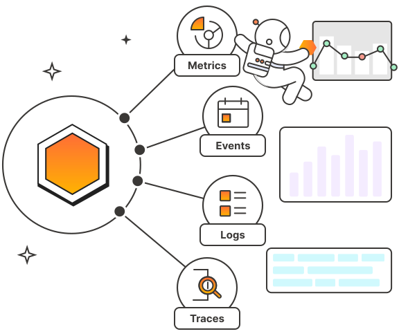
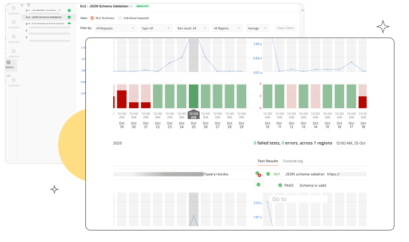

> ## 摘录
>
> 了解 API 可观察性如何帮助团队监控 API 性能、排查问题、理解使用模式以及识别优化机会。
>
> 原文 [API Observability, API Telemetry Data, Pillars & Use Cases | Postman](https://www.postman.com/api-platform/api-observability/)

---

## 什么是 API 可观察性？

API 可观察性是指通过 API 发出的信号来理解其内部状态的程度。

为了使 API 可观察，必须使用事件监听器、代理或库对其进行工具化，这使团队能够被动收集 API 的指标、事件、日志和追踪。然后可以使用这些遥测数据创建警报，以便通知团队有关问题，并且还可以进行可视化并转发到 APM 工具以进行进一步分析。因此，API 可观察性在帮助团队监控其 API 的性能、排查问题、理解使用模式以及识别优化机会方面发挥着至关重要的作用。

这里，我们将讨论 API 可观察性如何支持 [API 优先](https://www.postman.com/api-first/) 开发模型，并澄清 API 可观察性与 API 监控之间的关系。接下来，我们将回顾 API 可观察性的四大支柱，并探索这些遥测数据的一些常见用例。最后，我们将强调 [Postman API 平台](https://www.postman.com/)的一些特性，这些特性可以帮助团队提高其投资组合中每个 API 的可观察性。

## 在 API 优先的世界中，API 可观察性扮演什么角色？

如今，许多团队正在将应用程序设计和构建为通过 API 交付的内部和外部服务的集合。这种方法被称为 [API 优先](https://www.postman.com/api-first/)，导致了独立管理的微服务的广泛增长，这些微服务通过 API 相互通信。基于微服务的架构是高度可扩展的，但其分布式特性使得观察它们变得困难。例如，一个微服务中的一个看似小的变化可能对它交互的另一个微服务有重大后果，但如果没有整个系统的完全可见性，这些问题可能是难以排查的。

除了帮助团队实施基于微服务的架构外，API 优先方法还导致向第三方消费者提供的 API 数量增加，这些 API 是作为可计费产品提供的。在这种模型中，API 生产者负责维持可用性、性能和安全的服务级别协议（SLA），并且问题可能会侵蚀客户信心并导致流失。

API 可观察性为团队提供了需要的信息，以确保每个 API ——无论是私有的、合作伙伴的还是公共的——都能发挥其最大价值。它使团队不仅能够弥合微服务之间的生产级可见性差距，还能将 API 性能和使用趋势与关键商业指标（如收入和采用）相关联，以保持商业和技术策略之间的一致。

## API 可观察性与 API 监控有什么区别？

API 可观察性与 API 监控是密切相关的概念，但它们并不相同。API 监控是收集、可视化和警报预定义指标的过程，以确保 API 满足特定期望。API 可观察性支持 API 监控，但它的范围更为宽广。它不仅为团队提供了丰富的上下文数据，使它们能够调试意外问题，还促进了即兴探索和复杂分析，这些分析可以指导高层商业决策。

## API 可观察性的四大支柱是什么？

如上所述，可观察的 API 发出的遥测数据使开发人员、网站可靠性工程师和 DevOps 工程师能够更好地理解其内部状态。遥测数据有四种主要类型——指标、事件、日志和追踪，这些统称为 API 可观察性的“四大支柱”。虽然无单一遥测数据能够讲述全部故事，但这些不同类型的数据可以一起分析，以描绘出 API 的健康状况、性能和使用情况的更完整画面。

### 1\. 指标

指标是在特定间隔（如每分钟一次或每小时一次）测量的值。有许多类型的指标可以阐明 API 健康的不同维度。例如，工作指标——如吞吐量和延迟——可以揭示 API 处理请求的效率，而资源指标——如 CPU 和内存使用——可以用来衡量 API 的饱和度。这些指标不仅有助于揭示需要立即关注的问题，还可以长期分析，以识别优化机会。

### 2\. 事件

事件捕获系统内部的重大状态变化，如新主机启动、代码部署或配置更改。它们包括有关发生了什么、何时发生以及涉及哪些用户、服务或资产的上下文信息。例如，代码部署事件可能会包括时间戳、发起它的用户名称、部署环境和合并的分支名称。当团队需要排查 API 延迟或错误率的突然峰值时，事件可能包含有关问题根本原因的线索。

### 3\. 日志

与事件捕获系统内部的重大活动（尽管相对不频繁）相比，日志记录系统中发生的每一个动作的详细信息。日志比事件更细致；实际上，单一事件通常可以与众多日志相关联。例如，代码部署事件的每个步骤——如工作分支合并的时刻、构建启动和每次 CI 测试执行——很可能会在单独的日志中被捕获。

典型的 API 日志包含请求方法和 URL、其时间戳、HTTP 状态码、响应时间和调用者的 IP 地址。这些信息有助于团队排查特定端点和方法的问题，并且还可以用于调查可疑活动或安全攻击。

### 4\. 追踪

追踪是请求通过分布式系统的整个路径的记录。每个追踪至少包含一个跨度，表示请求旅程中的单个步骤。每个跨度包括在该步骤发生的数据，如所用的时间和是否发生任何错误。追踪及其组成的跨度通常在火焰图或服务地图上可视化，这使团队能够更好地理解流量模式和依赖关系。追踪还可以帮助团队隔离负责总体延迟增加的组件，并且在排查过程中可以与日志和事件相关联。

## API 可观察性支持哪些用例？

许多团队利用 API 遥测数据确保 API 的延迟和错误率满足其服务级目标（SLO）。尽管这种性能监控非常重要，但 API 可观察性还促进了更复杂形式的监控和分析。例如，API 遥测数据可以帮助团队：

### 为 API 弃用计划

弃用是 API 生命周期的正常部分，但如果没有足够的 API 使用情况可见性，团队可能很难计划弃用。API 可观察性使这些团队能够跟踪 API 的请求频率以及其独特消费者的数量，以便他们可以做出有根据的决策，确定 API 是否可以安全弃用。这些数据在发布弃用通知之后也很有用，因为它帮助团队确认使用情况如预期那样正在下降。

### 发现 API 测试覆盖的空白

API 测试帮助团队确认 API 的方法、端点和集成是否按预期工作。然而，这些团队有时可能难以预料用户将如何与 API 互动，这可能导致他们从测试套件中遗漏关键工作流。API 可观察性使团队能够通过表面洞察最常用的端点和方法——以及使用哪些参数——来最大化他们的测试覆盖率。然后，团队可以创建测试来捕获和验证这些重要但意外的用户旅程。

### 检测 API 的生产级偏差

团队通常会在将其 API 部署到生产环境之前，先将其部署到一个专用的暂存环境中。暂存环境旨在尽可能接近生产环境，这使团队能够为他们期望其 API 在真实世界中的表现建立基线。一旦 API 达到生产，团队就可以持续将其生产级数据与此基线进行比较，以便尽早捕获任何意外偏差。

## Postman 如何帮助 API 可观察性？

[Postman API 平台](https://www.postman.com/)包括几个特性，可帮助用户提升其投资组合中每个 API 的可观察性。通过 Postman，你可以：

- **创建基于集合的监控：** Postman 使你能够监控单个请求及整个工作流的健康状况和性能，通过[基于集合的监控](https://learning.postman.com/docs/monitoring-your-api/intro-monitors/#collection-based-monitors)。这些监控可以手动运行，按计划运行，并在不同的地区运行，它们还支持自定义重试逻辑。
- **将 API 性能数据转发到其他可观察性工具：** Postman 与几个第三方可观察性工具集成，如 [Datadog](https://learning.postman.com/docs/integrations/available-integrations/datadog/)、[New Relic](https://learning.postman.com/docs/integrations/available-integrations/new-relic/) 和 [Splunk](https://learning.postman.com/docs/integrations/available-integrations/splunk/)，这允许你将来自 Postman 监控的数据与你的环境中跨越指标、事件、日志和追踪的数据相关联。
- **在可过滤的仪表板上可视化性能数据** Postman 在[内置仪表板](https://learning.postman.com/docs/monitoring-your-api/viewing-monitor-results/#viewing-monitors-in-postman)上显示每次监控运行的结果，使你能够一目了然地发现性能趋势。仪表板可以限定为单个请求、运行类型、结果和地区，因此你可以更高效地排查问题。
- **在运行失败和错误时获得通知：** [Postman 监控](https://learning.postman.com/docs/monitoring-your-api/intro-monitors/)可以配置为在请求失败时自动向你发送电子邮件，因此你不必担心错过由计划运行表面化的问题。
