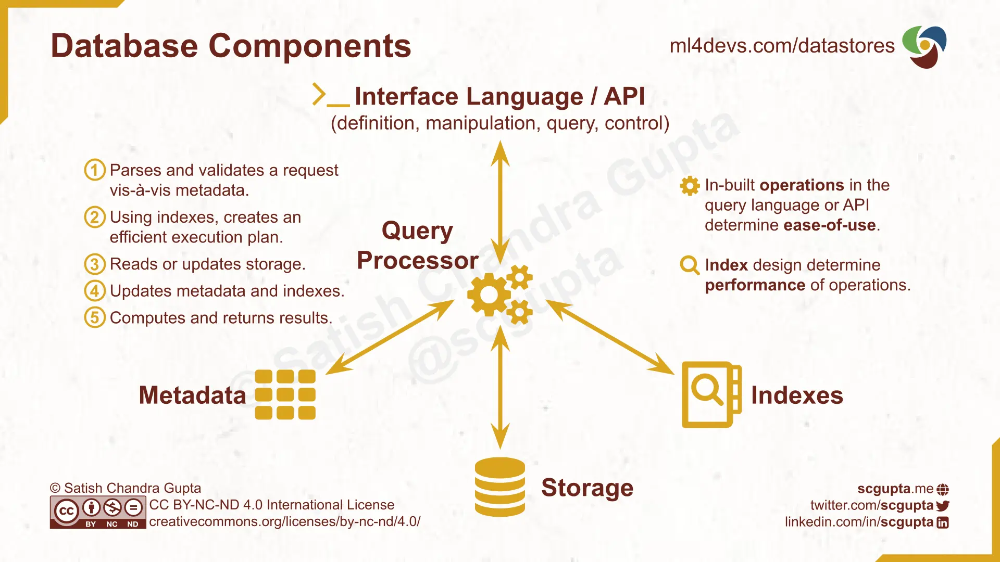
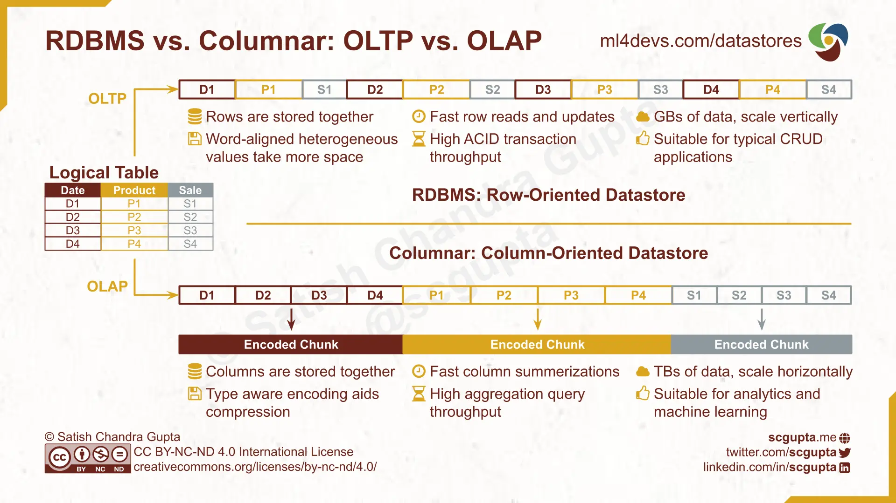
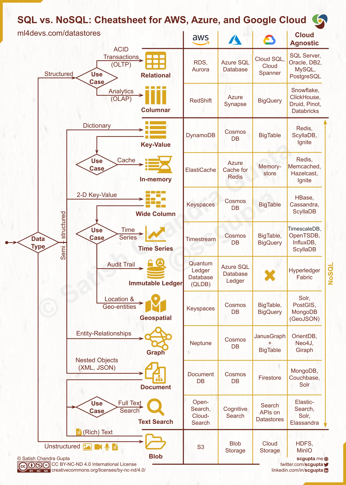

---
发布日期：2024-05-16
标签：[sql,nosql]
来源：https://www.ml4devs.com/articles/datastore-choices-sql-vs-nosql-database/
作者：Satish Chandra Gupta
标题：SQL vs. NoSQL数据库：何时使用，如何选择 - 针对开发者的机器学习
描述： SQL和NoSQL数据库的区别。何时选择NoSQL数据库取代SQL数据库。决策树选择关系型数据库，键值对数据库，宽列数据库，文档数据库和图数据库。
---

# 针对开发者的SQL vs. NoSQL数据库：何时使用，如何选择

> ## 摘要
>
> SQL和NoSQL数据库的区别。何时选择NoSQL数据库取代SQL数据库。决策树选择关系型数据库，键值对数据库，宽列数据库，文档数据库和图数据库。
>
> 原文 [SQL vs. NoSQL Database: When to Use, How to Choose - Machine Learning for Developers](https://www.ml4devs.com/articles/datastore-choices-sql-vs-nosql-database/)

---

如何选择数据库呢？也许，你会评估用例是否需要关系型数据库。根据答案，你可以选择你喜欢的SQL或NoSQL数据存储，并让它工作。采取这种策略是明智的：知道的魔鬼总比不知道的天使要好。

选择正确的数据存储可以简化你的应用程序。错误的选择可能会增加摩擦。这篇文章将帮助你深入概述各种数据存储，扩大已知魔鬼的列表。它包括以下内容：

- 定义数据存储特性的**数据库部分**。
- 根据**数据类型**分类的**数据存储**：深入研究非结构化，结构化（SQL/表格型）和半结构化（NoSQL）数据的数据库。
- **何时**使用**NoSQL** vs. **SQL**数据库。
- **SQL**和**NoSQL**数据库之间的**区别**。
- 专门针对various **NoSQL使用场景**的**数据存储**。
- **决策树备忘单**，以便导航在本地和云基础设施上的数据存储选择。

## 数据库内部

对数据库工作原理的高级理解有助于评估替代方案。数据库有5个组件：接口，查询处理器，元数据，索引和存储：

1.  **接口语言或API：**每个数据库定义一种语言或API来与它进行交互。它涵盖数据和事务的定义，操纵，查询和控制。
2.  **查询处理器：**数据库的“CPU”。它的任务是处理传入的请求，执行所需的操作，并返回结果。
3.  **存储：**存储数据的磁盘或内存。
4.  **索引：**数据结构，用于快速在存储中定位被查询的数据。
5.  **元数据：**数据，存储和索引的元信息（例如，目录，模式，大小）。

**查询处理器**对每个传入请求执行以下步骤：

1.  分析请求并根据元数据进行验证。
2.  创建一个利用索引的高效执行计划。
3.  读取或更新存储。
4.  更新元数据和索引。
5.  计算并返回结果。

为了确定数据存储是否符合你的应用需求，你需要仔细考察：

- **操作**，是由接口支持的。如果你需要的计算已经内置，你需要编写的代码就会少一些。
- 可用的**索引**。这将决定你的查询的运行速度。

在接下来的部分中，我们来 examine operations and indexes in datastores for various data types。

数据库组件：接口语言，查询处理器，存储，索引和元数据；以及查询处理器执行的步骤。

## 何时使用Blob存储

文件系统是最简单也是最早的数据存储方式。我们每天都在用它存储各种各样的数据。Blob存储是文件系统的超大规模分布式版本。它被用来存储*非结构化数据*。

Blob的[反向缩写](https://en.wikipedia.org/wiki/Backronym)是二进制大对象。你可以存储任何类型的数据。因此，blob数据存储对解释数据没有任何角色：

- Blob支持文件级别的CRUD（创建，读取，更新，删除）**操作**。
- 目录或文件的*路径*是**索引**。

因此，你可以快速定位并读取文件。但是，在文件内部定位一样东西需要顺序扫描。文档，图像，音频和视频文件都存储在blob中。

## 何时使用SQL数据库

SQL数据库适合存储*结构化数据*。数据存储在表中。每个记录（_行_）有相同数量，相同类型的属性（_列_）。

有两种类型的应用程序：

- 在线**交易**处理（**OLTP**）：实时捕获，存储和处理交易数据。
- 在线**分析**处理（**OLAP**）：从OLTP应用程序分析汇总历史数据。

OLTP应用程序需要支持*单个*记录的*低延迟*读写的数据存储。OLAP应用程序需要支持大量（_只读_）记录的*高吞吐量*读取的数据存储。

### 关系型数据库（RDBMS）

关系型数据库管理系统（RDBMS）是最早的数据存储之一。RDBMS针对需要快速读取和更新大量行的OLTP负载进行了优化。这就是为什么RDBMS是基于行的数据库。

数据被组织在表中。表被[规范化](https://en.wikipedia.org/wiki/Database_normalization)，以减少数据冗余和提高数据完整性。

表可能有主键和外键：

- [**主键**](https://en.wikipedia.org/wiki/Primary_key)是唯一确定表中一个记录（行）的属性（列）的最小集合。
- [**外键**](https://en.wikipedia.org/wiki/Foreign_key)建立了表之间的关系。它是一个表中的一组属性，引用了另一个表的主键。

查询和交易使用标准查询语言（SQL）编码。

关系型数据库针对的是事务操作。事务往往会更新多个表的多个记录。索引被优化为支持频繁的低延迟写入[ACID事务](https://en.wikipedia.org/wiki/ACID)：

- **原子性：**更新多行的任何事务都被视为一个*单位*。成功的事务执行*所有*更新。失败的事务不会执行*任何*更新，也就是说，数据库保持不变。
- **一致性：**每一个事务都会把数据库带到另一个有效的状态。他保证了满足所有数据库的不变性和约束。
- **隔离性：**并发执行多个事务会让数据库处于如果事务被顺序执行时的情况的状态。
- **持久性：**已提交的事务是永久性的，即使系统崩溃，也无法更改。

有很多可以选择的：

- 云服务商不偏不倚的选择： Oracle，Microsoft SQL Server，IBM DB2，[PostgreSQL](https://www.postgresql.org/)，和[MySQL](https://www.mysql.com/)
- AWS：[关系数据库服务 (RDS)](https://aws.amazon.com/rds/)中的PostgreSQL和MySQL
- Microsoft Azure：[Azure SQL数据库](https://azure.microsoft.com/en-in/products/azure-sql/database/)中的SQL Server
- Google Cloud：[Cloud SQL](https://cloud.google.com/sql/)中的PostgreSQL和MySQL，以及横向扩展的[Cloud Spanner](https://cloud.google.com/spanner)

### 列型数据库

虽然事务处理的数据是行（记录），但分析属性是在列（属性）上计算的。OLAP应用程序需要在表上优化列读取操作。列模型数据库是针对列聚合的高吞吐率设计的。这就是为什么Columnar DB是基于行的数据库。

一种实现的方法是在关系型数据库中添加列模型索引。例如：

- [Microsoft SQL Server中的列存储索引](https://learn.microsoft.com/sql/relational-databases/indexes/columnstore-indexes-overview)
- [PostgreSQL的列存储索引](https://swarm64.com/post/postgresql-columnstore-index-intro/)

然而，RDBMS的主要操作是低延迟、高频率的ACID交易。这并不适于分析应用程序常见的大数据规模。

对于大数据，把存储变成blob存储的[**数据湖**](https://en.wikipedia.org/wiki/Data_lake)曾经很受欢迎。部分分析聚类结果被计算和维护在[**OLAP立方体**](https://en.wikipedia.org/wiki/OLAP_cube)中。随着列模型存储的规模和性能的提升，OLAP立方体已经过时。但这些概念在设计[大数据管道](https://www.ml4devs.com/articles/scalable-efficient-big-data-analytics-machine-learning-pipeline-architecture-on-cloud/)时仍然保持相关性。

现代的[**数据仓库**](https://en.wikipedia.org/wiki/Data_warehouse)是基于[**列型**](https://en.wikipedia.org/wiki/Column-oriented_DBMS)数据库构建的。数据是按列而不是按行存储的。可用的选择有：

- AWS： [RedShift](https://aws.amazon.com/redshift/)
- Azure：[Synapse](https://azure.microsoft.com/en-in/services/synapse-analytics/)
- Google Cloud：[BigQuery](https://cloud.google.com/bigquery)
- Apache：[Druid](https://druid.apache.org/)，[Kudu](https://kudu.apache.org/)，[Pinot](https://pinot.apache.org/)
- 其他：[ClickHouse](https://clickhouse.tech/)，[Snowflake](https://www.snowflake.com/)

[Databricks Delta Lake](https://databricks.com/product/delta-lake-on-databricks) 在数据湖中存储的数据上提供了类似于列模型的性能。

RDBMS vs. Columnar: 针对OLTP和OLAP应用的基于行的数据库和基于列的数据库。

## 何时使用NoSQL数据库

NoSQL数据库处理半结构化数据类型：键值对，宽列，文档（树），和图。

### 键值数据库

键值存储是一个[字典或哈希表](https://en.wikipedia.org/wiki/Associative_array)数据库。它针对每个记录有唯一键的CRUD操作进行优化：

- Create(key, value)：把一个键值对添加到数据存储
- Read(key)：查找与键相关联的值
- Update(key, value)：改变键的现有值
- Delete(key)：从数据存储删除(key, value)

值没有固定的模式，可以是从基本值到复合结构的任何内容。键值存储是高度可分区的（因此可以并行处理）。[Redis](https://redis.io/)是一个流行的键值存储。

### 宽列数据库

宽列存储有表，行和列。但是在同一个表的每个行，列的名称和他们的类型可能都会有不同。逻辑上，它是一个带有多维映射（row-value, column-value, timestamp）的稀疏矩阵版本。它像一个二维键值存储，每一个单元格的值带有一个版本和时间戳。

宽列数据存储是高度可分区的。它有一些被存储在一起的列族的概念。一个单元格的逻辑坐标是：(Row Key, Column Name, Version)。物理查找按照以下路径：Region Dictionary ⇒ Column Family Directory ⇒ Row Key ⇒ Column Family Name ⇒ Column Qualifier ⇒ Version。因此，宽列存储实际上是基于行的数据库。

[Apache HBase](https://hbase.apache.org/)是第一个开源的宽列数据存储。查看[HBase实践](https://www.slideshare.net/larsgeorge/hbase-in-practice)，了解宽列数据存储的核心概念。

### 文档数据库

文档存储用于存储和检索由嵌套对象组成的文档，如 XML、JSON 和 YAML 的树结构。

在键值存储中，值是不透明的。但是文档存储利用值的树结构提供丰富的操作。[MongoDB](https://www.mongodb.com/document-databases) 是文档存储的一个流行示例。

### 图数据库

图数据库类似于文档存储，但是设计用于图形而非文档树。例如，图数据库适用于存储和查询社交连接网络。

[Neo4J](https://neo4j.com/) 是一个知名的图数据库。也常常在宽列存储上使用 [JanusGraph](https://janusgraph.org/) 类型的索引。

## SQL和NoSQL的区别

非关系型NoSQL数据存储之所以受欢迎有两个原因：

- 关系型数据库管理系统（RDBMS）无法为大数据水平扩展
- 并非所有数据都适合严格的RDBMS模式

NoSQL 数据存储在各种 CAP 定理权衡中提供了水平扩展。按照 [CAP Theorem](https://en.wikipedia.org/wiki/CAP_theorem)，分布式数据存储最多可以提供以下三个保证中的两个：

- **一致性（Consistency）**：每次读取都会收到最近的写入或错误。
- **可用性（Availability）**：每个请求都可以得到一个（非错误的）响应，无论节点的各自状态如何。
- **分区容忍性（Partition tolerance）**：尽管节点之间的网络丢弃（或延迟）任意数量的消息，集群也不会失败。

注意CAP定理和ACID事务中的一致性定义是不同的。ACID一致性是关于数据完整性（每个事务后，数据在关系和约束上是一致的）。CAP定论是关于所有节点在任何给定时间都保持一致的状态。

只有少数 NoSQL 数据存储是符合 ACID的。大多数 NoSQL 数据存储支持 [BASE model](https://dl.acm.org/doi/10.1145/1394127.1394128)：

- **基本可得（Basically Available）**：数据在许多存储系统上复制，并且大部分时间都可用。
- **软状态（Soft-state）**：副本并非总是一致的；因此，状态可能只部分正确，因为它可能尚未收敛。
- **最终一致性（Eventually consistent）**：数据将在未来的某个点变得一致，但没有当时的保证。

### SQL vs. NoSQL 数据库比较

RDBMS 和 NoSQL 数据库间的区别源于他们对以下内容的选择：

- **数据模型**：RDBMS 数据库用于严格遵守关系模式的规范化结构（表格）数据。NoSQL 数据存储用于非关系数据，例如键值、文档树、图形。
- **事务保证**：所有 RDBMS 数据库都支持 ACID 事务，但大多数 NoSQL 数据存储提供 BASE 事务。
- **CAP 权衡**：RDBMS 数据库优先考虑强一致性。但是 NoSQL 数据存储通常优先考虑可用性和分区容忍性（水平扩展），并只提供 [eventual consistency](https://en.wikipedia.org/wiki/Eventual_consistency)。

### SQL vs. NoSQL性能

RDBMS设计用于快速事务处理，跨表更新多行，并具有复杂的完整性约束。SQL 查询是清晰且声明性的。你可以关注一个事务**应完成的内容**。RDBMS 将解决**如何执行**的问题。它会使用关系代数优化你的查询，并找出最佳的执行计划。

NoSQL数据存储设计用于处理比RDBMS多得多的数据。数据没有关系约束，也不需要是表格的。NoSQL 通过通常放弃强一致性来在较高的规模下提供性能。数据访问主要通过 REST APIs。 NoSQL 查询语言（如 GraphQL）在设计和优化方面还不如 SQL 成熟。因此，你需要同时处理执行的内容和如何有效地执行。

**RDBMS垂直扩展。**你需要升级硬件（更强大的 CPU，更高的存储容量）来处理增加的负载。

**NoSQL数据存储水平扩展。**NoSQL 更擅长处理分区数据，所以你可以通过增加机器来扩展。

SQL vs. NoSQL：NoSQL和SQL数据库之间的区别，以及何时使用NoSQL。

## NoSQL使用场景

各种类型的 NoSQL 数据存储之间的界限模糊。有时候，SQL 和 NoSQL 之间的界线也模糊（[作为键值存储的 PostgreSQL](https://www.postgresql.org/docs/13/hstore.html) 和 [作为 JSON 文档数据库的 PostgreSQL](https://www.sisense.com/blog/postgres-vs-mongodb-for-storing-json-data/)）。

数据存储可以通过为该数据类型添加索引和操作来改变另一种类似的数据类型。最开始的列状 OLAP 数据库是带有列存储索引的 RDBMS。同样的事情也正在发生在 NoSQL 存储，以支持多种数据类型。

这就是为什么最好考虑使用场景，然后选取适合你应用的数据存储。一个可以满足多种使用场景的数据存储可能有助于减少开销。

对于分析用例，表格型列数据库通常比 NoSQL 数据库更适合。

偏好内置操作适合用例的数据存储（而不是在每个应用中实现这些操作）。

### 内存中的键值数据

与键值存储一样，但数据在内存中而不是在磁盘上。它消除了磁盘 I/O 开销，作为一个快速的缓存。

### 时间序列数据

时间序列是一系列数据点，按时间戳索引和排序。时间戳是时间序列数据存储的键。

时间序列可以建模为：

- **键值**：时间戳和值的关联对
- **宽列**：以时间戳作为表的键

宽列存储，带有来自编程语言的日期时间函数，经常被用作时间序列数据库。

在分析用例中，列式数据库也可以用于时间序列数据。

### 不变的账本数据

不变的账本用于维护由一个中心信任机构拥有的不可变且（加密地）可验证的交易日志。

从存储角度看，宽列存储就足够了。但是数据存储操作必须是**不可变**和**可验证**的。目前非常少的数据存储（如 [Amazon QLDB](https://aws.amazon.com/qldb/)，[Azure SQL Ledger](https://docs.microsoft.com/en-us/azure/azure-sql/database/ledger-overview) 和 [Hyperledger Fabric](https://github.com/hyperledger/fabric)）满足这些要求。

### 地理空间数据

地理空间数据库是存储地理数据（如国家，城市等）的数据库。它优化了地理空间查询和几何操作。

宽列、键值、文档或关系数据库通常用于此目的，其具有地理空间查询功能：

- PostgreSQL 的 [PostGIS](https://postgis.net/) 扩展
- MongoDB的 [GeoJSON](https://docs.mongodb.com/manual/reference/geojson/) 对象

在分析用例中，列式数据库可能更适合。

### 文本搜索数据

对于非结构化（自然）或半结构化文本的文本搜索是许多应用中的常见操作。文本可以是纯文本或富文本（例如，PDF），存储在文档数据库中，或存储在 blob 存储中。[Elastic Search](https://www.elastic.co/what-is/elasticsearch) 是一个流行的解决方案。

## 如何选择NoSQL vs. SQL：决策树 & 云端备忘单

鉴于如此多的数据类型，用例，选择，应用程序考虑，云/on-prem约束，分析所有选项可能会耗费大量时间。下面的备忘单将帮助您快速缩小候选名单。

等待学习到做出选择所需的一切是不切实际的。这个备忘单会让你有几个合理的选择来开始。它经过设计以简化，某些细微差别和选项都不存在。它是优化用于召回而非精确。

何时选择 NoSQL 而不是 SQL：数据库选择的决策树和 AWS、Microsoft Azure、Google Cloud Platform 上的云备忘单等

## 总结

本文向您介绍了各种数据存储选择，并解释了如何根据以下因素选择一个：

- 应用：事务或分析
- 数据类型 (SQL vs. NoSQL)：结构化、半结构化、非结构化
- 使用场景
- 部署：主要云提供商，自有设施，发生厂商封锁的考虑

## 资源

1.  [AWS上的数据库服务](https://aws.amazon.com/products/databases/)
2.  AWS 白皮书：[Amazon Web Services概述-数据库](https://docs.aws.amazon.com/whitepapers/latest/aws-overview/database.html)
3.  [如何选择正确的数据库-AWS技术内容系列](https://aws.amazon.com/startups/start-building/how-to-choose-a-database/)
4.  [理解Azure数据存储模型](https://docs.microsoft.com/en-us/azure/architecture/guide/technology-choices/data-store-overview)
5.  [Azure上的数据库类型](https://azure.microsoft.com/en-in/product-categories/databases/)
6.  [Google Cloud数据库服务](https://cloud.google.com/products/databases)
7.  [Google Cloud Platform上的数据生命周期和数据库选择](https://cloud.google.com/architecture/data-lifecycle-cloud-platform)
