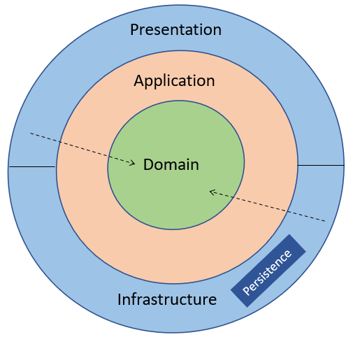
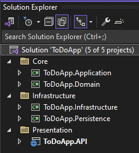
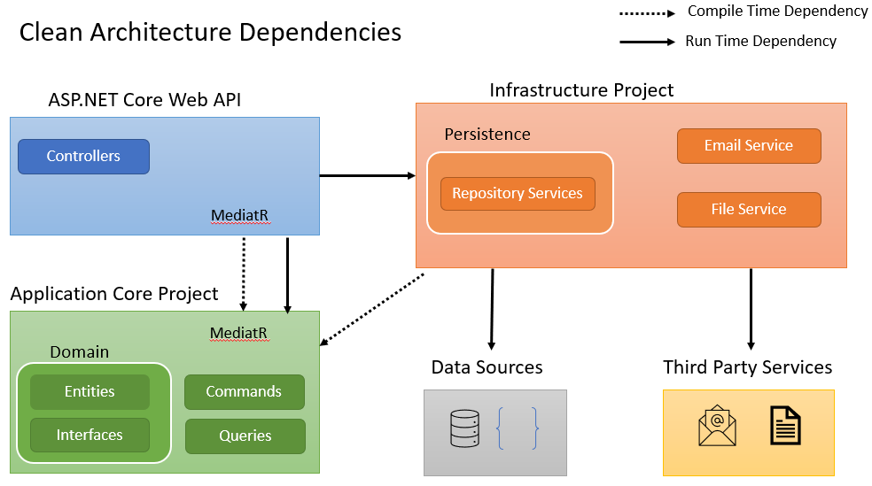

# 在 .NET中使用洁净架构 - Code Maze

> ## 摘录
>
> 洁净架构是一种旨在构建我们可以轻松维护、扩展和测试的应用程序的架构模式。
>
> 本文翻译自 [Code Maze](https://code-maze.com/dotnet-clean-architecture/)，原作者为 Muhammed Saleem。

---

在这篇文章中，我们将讨论在 .NET中使用洁净架构。

要下载这篇文章的源代码，你可以访问我们的 [GitHub 仓库](https://github.com/CodeMazeBlog/CodeMazeGuides/tree/main/csharp-architectural-patterns/CleanArchitecture)。

现在让我们开始吧。

## 什么是洁净架构？

**洁净架构** 是一种**架构模式**，旨在构建我们可以轻松维护，扩展和测试的应用程序。

它通过将应用程序拆分为具有不同责任的不同层来实现这一点：

[](https://code-maze.com/wp-content/uploads/2024/02/clean-architecture-layers.png)

- **领域层** (Domain Layer) – 领域层表示应用程序的核心业务规则和实体。这是最内层，应该没有任何外部依赖。
- **应用层** (Application Layer) – 应用层位于领域层的外面，充当领域层和其他层之间的中介。换句话说，它包含应用程序的用例，我们通过应用层公开领域层的核心业务规则。这一层仅依赖领域层。
- **基础架构层** (Infrastructure Layer) – 我们在基础设施层中实现所有外部服务，如数据库，文件存储，电子邮件等。它包含定义在领域层的接口的实现。这是与外部资源交互的层，它依赖于应用层。持久性是基础设施层处理数据持久化的部分。
- **表现层** (Presentation Layer) – 表现层处理与用户的交互并将数据传送至用户界面。这一层也仅依赖于应用层。

**洁净架构的一个基本原则是，依赖关系应该从具体外层指向抽象内层**。

这使得未来可能更改特定的实现而不影响应用程序的其他区域。此外，洁净架构遵循一个结构良好的方式来组织代码，有助于维护性和可测性。

## 洁净架构与洋葱架构的区别

**洁净架构**和 **洋葱架构** 模式遵循相同的原则，旨在实现类似的目标，如关注点分离，组件的松弛耦合等。许多开发者认为这些模式是对相同基本概念不同的理解，因为它们的目标和原则相近。然而，它们确实有一些细微的差别。

**洁净架构** **基于抽象级别划分不同层次**，依赖关系始终从具体的外层指向抽象的内层。对于需要解耦其组件并需要支持独立开发和部署周期的大型项目来说，这十分重要。

另一方面，**洋葱架构** **更注重称为核心的中心层，使用接口和依赖反转来解耦应用程序层次并实现较高程度的可测试性。** 它专注于域模型和业务规则，所有附加的同心层都指向核心。对于需要遵循领域驱动设计方法和适合中小型项目的项目特别有价值。

因此，虽然它们共享相同的基本概念，但选择洁净架构还是洋葱架构可以根据项目的特定需求和规模来选择。

## 如何在 .NET中实现洁净架构？

现在让我们看看如何使用洁净架构设计模式实现一个 ASP.NET Core Web API 项目。我们将检查不同的层次以及需要在每个层次中放什么代码。

让我们通过为应用程序创建一个新的解决方案来开始：

[](https://code-maze.com/wp-content/uploads/2024/02/clean-architecture-project-structure.png)

首先，我们创建一个名为 **ToDoApp** 的解决方案，它有三个文件夹 - **Core**, **Infrastructure,** 和 **Presentation**。然后，我们在其中添加以下项目：

- `ToDoApp.Domain` – 这是一个类库项目，代表应用程序的 **Domain** 层。
- `ToDoApp.Application` – 这也是一个类库项目，代表应用程序的 **Application** 层。这个项目只参考 `ToDoApp.Domain` 项目。
- `ToDoApp.Infrastructure` – 这是另一个用于表示应用程序的 **Infrastructure** 层的类库项目。理想情况下，它只应依赖于 `ToDoApp.Application` 项目。
- `ToDoApp.Persistence` – 这也是一个类库项目，是 **Infrastructure** 层的一部分。这是专门用于处理应用程序的数据持久性。这也只依赖于 `ToDoApp.Application` 项目。
- `ToDoApp.API` – 这是一个 ASP.NET Web API 项目，代表应用程序的 **Presentation** 层。理想情况下，它只应依赖于 `ToDoApp.Application` 项目。但是，对于依赖注入，我们需要添加对 `ToDoApp.Infrastructure` 和 `ToDoApp.Persistence` 的引用。但请记住，那些应该是运行时依赖，我们不应该与这些层创建任何编译时间的依赖。

注意我们在 **Core** 文件夹中组织 **Domain** 和 **Application** 项目。同样，**Infrastructure** 和 **Persistence** 项目进入 **Infrastructure** 文件夹。然而， **API** 项目进入 **Presentation** 文件夹。这样做，我们将有一个遵循洁净架构原则的解决方案结构。

### 领域层

现在让我们看看什么代码需要进入领域层。领域层主要用于保管应用程序的实体和接口。

保持这一点在心中，首先，让我们添加 `ToDoItem` 实体类：

```csharp
public class ToDoItem
{
    public int Id { get; set; }
    public required string Description { get; set; }
    public bool IsDone { get; set; }
}
```

在类中，我们定义了 `Id,` `Description`和 `IsDone`属性。

之后，让我们添加 `IToDoRepository`接口：

```csharp
public interface IToDoRepository
{
    Task<List<ToDoItem>> GetAllAsync();
    Task<int> CreateAsync(ToDoItem item);
}
```

在存储库接口中，让我们只添加两个方法 - `GetAllAsync()` 和 `CreateAsync()`。这是为了[实现存储库模式](https://code-maze.com/net-core-web-development-part4/)。 存储库模式在数据访问层和应用程序的业务逻辑层之间引入了一个抽象层。这提高了代码的可维护性、可读性和可测试性。

### 应用层

在 .NET中实现洁净架构时，使用 MediatR 的 CQRS 是一个热门的选择。

**CQRS** (Command Query Responsibility Segregation) 设计模式将负责读写数据的组件进行分离。

同样，MediatR 有助于实现中介模式。通过使用一个中介模式，我们可以管理应用程序的不同部分之间的通信，这些部分是松散耦合的。

要了解更多关于这个话题的知识，请参考我们的文章[CQRS with MediatR](https://code-maze.com/cqrs-mediatr-in-aspnet-core/)。

在这个例子中，我们将使用 CQRS和 Mediator 模式来实现我们 ToDoApp 的应用层。保持这点在心中，我们要创建一个为创建 `ToDoItem`的命令，以及列出所有 `ToDoItem`实例的查询。

首先，让我们添加 `MediatR` NuGet 包:

dotnet add package MediatR

然后，让我们创建一个命令类：

```csharp
public class CreateToDoItemCommand : IRequest<int>
{
    public required string Description { get; set; }
}
```

`CreateToDoItemCommand` 类实现了 `MediatR` 库中定义的 `IRequest` 接口并提供响应类型作为参数。我们在类中添加 `Description` 属性。

之后，让我们为 `CreateToDoItemCommand` 类创建一个处理器：

```csharp
public class CreateToDoItemCommandHandler(IToDoRepository toDoRepository)
    : IRequestHandler<CreateToDoItemCommand, int>
{
    public Task<int> Handle(
        CreateToDoItemCommand request, CancellationToken cancellationToken)
    {
        var item = new ToDoItem
        {
            Description = request.Description
        };
        return toDoRepository.CreateAsync(item);
    }
}
```

`CreateToDoItemCommandHandler` 类实现了 `MediatR` 库中的 `IRequestHandler` 接口，并传递请求和响应类型作为参数。在 `Handle()`方法中，我们调用存储库的 `CreateAsync()`方法并传递 `ToDoItem`。

完成以上步骤，命令就准备就绪。

现在，让我们创建一个简单的查询：

```csharp
public class ToDoItemQuery
    : IRequest<List<Domain.Entities.ToDoItem>>
{
}
```

这里的 `ToDoItemQuery` 类体为空，因为这个操作没有任何参数，响应类型是 `ToDoItem`的列表。

之后，让我们为查询类添加一个处理器：

```csharp
public class ToDoItemQueryHandler(IToDoRepository toDoRepository)
    : IRequestHandler<ToDoItemQuery, List<Domain.Entities.ToDoItem>>
{
    public Task<List<Domain.Entities.ToDoItem>> Handle(
        ToDoItemQuery request, CancellationToken cancellationToken)
    {
        return toDoRepository.GetAllAsync();
    }
}
```

在 `ToDoItemQueryHandler` 类中，我们实现 `Handle()` 方法，内部调用存储库的 `GetAllAsync()` 方法。

最后，让我们也添加 `MediatR`的依赖注入：

```csharp
public static IServiceCollection AddApplicationDependencies(this IServiceCollection services)
{
    services.AddMediatR(cfg => cfg.RegisterServicesFromAssemblies(AppDomain.CurrentDomain.GetAssemblies()));
    return services;
}
```

完成以上步骤，**应用程序层** 就准备就绪。

### 基础架构层

在 **基础架构层** 中，让我们添加一个具有数据储存逻辑的具体服务。为此，我们将添加一个内存数据存储服务到 **Persistence** 项目，因为这与数据持久性有关。

创建一个实施 `IToDoRepository` 接口的 `InMemoryToDoRepository` 服务：

```csharp
public class InMemoryToDoRepository : IToDoRepository
{
    private static readonly List<ToDoItem> _items = [];
    public Task<int> CreateAsync(ToDoItem item)
    {
        _items.Add(item);
        return Task.FromResult(item.Id);
    }
    public Task<List<ToDoItem>> GetAllAsync()
    {
        return Task.FromResult(_items);
    }
}
```

首先我们定义一个列表，保存 `ToDoItem`。然后，在 `CreateAsync()` 方法中，我们将 `ToDoItem` 添加到内存列表中。同样，在 `GetAllAsync()` 方法中，我们从列表中获取所有项目。

这就是现在 **基础架构层** 的全部内容。如果我们有其他外部组件的集成，比如电子邮件服务、文件存储服务等，我们可以为每个组件添加单独的部分或项目。

### 表现层

在 **表现层** 中，我们有一个 ASP.NET Core Web API 项目。

所以，让我们继续添加控制器：

```csharp
[Route("api/[controller]")]
[ApiController]
public class ToDoItemController(IMediator mediator) : ControllerBase
{
    [HttpGet]
    public async Task<IActionResult> Get()
    {
        return Ok(await mediator.Send(new ToDoItemQuery()));
    }
    [HttpPost]
    public async Task<IActionResult> Post([FromBody] CreateToDoItemCommand command)
    {
        await mediator.Send(command);
        return Created();
    }
}
```

在 `ToDoItemController` 类中，我们注入了 Mediator，并定义了两个操作方法- `Get()` 和  `Post()`。 `Get()` 方法通过 `MediatR` 向 `ToDoItemQueryHandler` 类发送请求。同样， `Post()` 方法向 `CreateToDoItemCommandHandler` 类发送请求。

在这里，为了简单起见，我们直接在 API 控制器中使用命令对象。然而，在现实的项目中，\*\*最好为每一层都创建一个单独的数据传输对象 (DTO)，并在发至下一层之前将它们映射到各自的类型。

最后，让我们将依赖项添加到 DI 容器：

```csharp
builder.Services.AddApplicationDependencies();
builder.Services.AddSingleton<IToDoRepository, InMemoryToDoRepository>();
```

首先，我们在 **Application** 项目中调用 `AddApplicationDependencies()` 方法。然后，我们添加 `InMemoryToDoRepository` 类型到 DI 容器。

完成以上步骤，我们已经创建了一个遵循洁净架构设计模式的 ASP.NET Core Web API 项目。我们应该能够通过运行应用程序创建新的 `ToDoItem`实例并列出所有项目。

## 洁净架构的优势

如上例所示，洁净架构有几个优点。让我们详细讨论这些优点。

### 明确的关注点分离

洁净架构将我们的应用程序分成清晰和明确的层次，如 **领域层**，**应用层**，**基础架构层**， **表现层**等。

每一层都是独立的，并且有其特定的职责。这使得代码更有组织性和可维护性。此外，它使我们的代码更容易理解。有了洁净架构，我们将清晰地知道在我们的应用程序中某些行为和逻辑应该放在哪里。

### 组件之间松散耦合

在洁净架构中，UI 和 基础设施组件只依赖于应用程序的核心。

这意味着我们可以在不影响应用程序其他部分的情况下更改这些组件：

[](https://code-maze.com/wp-content/uploads/2024/02/clean-architecture-dependencies.png)

例如，如果我们决定用 [SQL 数据库使用 EF Core](https://code-maze.com/entity-framework-core-series/)来替换内存存储库，我们只需要更改 **基础设施层** 中存储库的具体实现：

```csharp
public class SqlToDoRepository : IToDoRepository
{
    private readonly ToDoDbContext _context;
    public SqlToDoRepository(ToDoDbContext context)
    {
        _context = context;
    }
    public Task<int> CreateAsync(ToDoItem item)
    {
        _context.ToDoItems.Add(item);
        return _context.SaveChangesAsync();
    }
    public Task<List<ToDoItem>> GetAllAsync()
    {
        return _context.ToDoItems.ToListAsync();
    }
}
```

我们通过替换 `InMemoryToDoRepository` 类来实现这一点，用新的类 `SqlToDoRepository`来实现 `IToDoRepository` 接口。在新的存储库类中，我们注入 EF Core `DbContext` 并更改方法以使用 EF Core方法保存和从SQL数据库中检索。

之后，我们更新 DI 容器以使用这个新的存储库。应用程序的其他部分比如 **Core** 和 **Presentation** 根本不需要知道这个改变。

### **测试性**

洁净架构的另一个优点是能够独立测试每一层。业务逻辑位于应用程序的核心，可以与 **基础设施** 和 **表现层** 隔离进行测试。

例如，我们可以为应用层的命令和处理器独立编写单元测试。

首先，让我们为 `CreateToDoItemCommand` 编写一个单元测试：

```csharp
[Fact]
public void GivenCreateToDoItemCommandHandler_WhenHandleCalled_ThenCreateNewToDoItem()
{
    // Arrange
    var toDoRepositoryMock = new Mock<IToDoRepository>();
    toDoRepositoryMock.Setup(x => x.CreateAsync(It.IsAny<ToDoItem>()))
        .ReturnsAsync(1);
    var createToDoItemCommandHandler = new CreateToDoItemCommandHandler(toDoRepositoryMock.Object);
    var createToDoItemCommand = new CreateToDoItemCommand
    {
        Description = "Test Description"
    };
    // Act
    var result = createToDoItemCommandHandler.Handle(createToDoItemCommand, CancellationToken.None).Result;
    // Assert
    Assert.Equal(1, result);
}
```

之后，让我们为 `ToDoItemQuery` 写一个单元测试：

```csharp
[Fact]
public async Task GivenToDoItemQueryHandler_WhenHandleCalled_ThenReturnToDoItems()
{
    // Arrange
    var mockRepository = new Mock<IToDoRepository>();
    mockRepository.Setup(x => x.GetAllAsync())
        .ReturnsAsync(
        [
            new() { Description = "Item 1" },
            new() { Description = "Item 2" }
        ]);
    var handler = new ToDoItemQueryHandler(mockRepository.Object);
    var query = new ToDoItemQuery();
    // Act
    var result = await handler.Handle(query, CancellationToken.None);
    // Assert
    Assert.Equal(2, result.Count);
    Assert.Equal("Item 1", result[0].Description);
    Assert.Equal("Item 2", result[^1].Description);
}
```

同样，如果我们在 **领域层** 中有特定于实体的行为或验证，我们可以为那些写下独立的测试。不仅如此，我们也可以为 **UI** 或 **基础设施** 组件编写独立的测试。

### **可伸缩性**

使用洁净架构，我们可以独立地扩展应用程序的每一层。这给了我们适应应用程序变化的性能需求的灵活性。例如，**核心** 业务逻辑层可以从 **基础设施** 或 **表现层** 单独进行扩展。我们无论是横向增加服务实例数量，还是纵向提升特定服务的计算能力、内存等都有可能。

### **团队协作**

使用洁净架构，可以让不同的团队在不同的应用程序层独立工作。这给我们提供了在不同层级用不同技能集的不同团队可以并行工作，而对其他团队的依赖最小的灵活性。当然，这也会加快开发速度，因为等待依赖项的时间最短。

## 洁净架构的缺点

虽然洁净架构提供了大量的优点，但在某些情况下也会有一些潜在的缺点和挑战，如：

**增加的复杂性和抽象** - 洁净架构的结构化和分层方法可能导致复杂性增加。对于较小的项目，创建这些层和抽象可能是个负担，可能会有陡峭的学习曲线。

**依赖注入的开销** - 为所有的层次和组件设置依赖注入可能会变得庞大复杂，随着项目的增长。

**性能问题** - 在某些情况下，严格的关注点分离可能带来性能问题。例如，我们可能需要在不同的层之间映射数据，并在一个操作中进行多次调用，这可能对性能有影响。

记住这一点， **我们应该在采用这种模式之前，仔细评估洁净架构的好处和可能的缺点**。

## 什么情况下使用洁净架构？

虽然洁净架构是一个具有许多优点的软件设计模式，但它不是所有项目的万能解决方案。所以我们应该仔细评估我们的应用程序的需求，以确定洁净架构是否适合我们的应用程序。下面是一些可以考虑使用洁净架构的场景：

- **大型。复杂和持续进化的项目** - 分离关注点有助于管理大型和复杂的项目，确保核心领域逻辑将独立于UI层和基础设施层，并保持不变。
- **大量测试需求的项目** - 分层结构和松耦合的组件使得在不同层编写单元测试和集成测试更容易。这对于需要非常高测试覆盖率的长期项目特别有帮助。
- **多个开发团队一起工作的项目** - 明确的关注点分离使得多个团队可以在其它团队的影响最小的情况下在不同的层次上工作。
- **需要在未来支持基础设施变化的项目，并对其他区域最小化影响** - 因为基础设施不直接与核心业务逻辑紧密耦合，所以我们可以在无需对其他区域产生大量影响的情况下更改基础设施组件。

## 结论

在本文中，我们探讨了带有 ASP.NET Core Web API 开发的洁净架构。我们了解了它的原则，不同的层次和实施方法。除此之外，我们还讨论了在使用洁净架构时可能会遇到的一些优点和潜在的缺点。在此基础上，我们探讨了洁净架构对我们的项目是否是一个好选择的场景。
