# 软件架构文档记录 - 由 Dr Milan Milanović 撰写

> ## 摘要
>
> 架构师的选择

---

在本期新闻简报中，我们将尝试理解：

- **为什么需要记录软件架构文档**
- **如何组织和可视化这些文档**
- **如何在接近代码的仓库中存储它们，并且，**
- **如何将其自动化并发布，使非技术人员也能查看**

那么，让我们开始吧。

## 为什么我们需要记录软件架构文档？

软件架构是设计和组织软件系统整体结构以满足特定功能和非功能需求的过程。它**提供了一个指导开发者在实现过程中高层次的软件系统视图**。它还代表了一个沟通和协作的框架，使开发者、项目经理和业务分析师等利益相关者能够确保每个人都朝着同样的目标和目的努力。

记录软件架构可以确保**重要的架构决策、约束和原因被有效捕捉和传达**，并且还促进利益相关者之间（包括开发者、架构师、项目经理和最终用户）的共享理解。文档是记录架构决策的中心参考点，允许知识转移并在整个软件开发生命周期（SDLC）中保持一致性实施。

记录软件架构的一个最关键方面是它**揭示了系统背后的目标和意图，这些是代码本身无法传达的**。

> _虽然代码是系统的实现部分，但它往往不能讲述整个故事。_

开发过程中指导的主要目标、设计原则和战略决策通常在代码库中并不明显。**这种可见性的缺乏可能导致误解和目标不一致，尤其是在系统演进或新团队成员加入时。**文档通过提供上下文和清晰度来填补这一空白，确保系统的目标和设计哲学被理解并随着时间的推移被保持。

良好的软件文档能够让我们：

- **对系统的理解保持一致**
- **正确维护系统**
- **快速引导新人**

然而，我们在许多项目中看到架构文档的缺乏，经常被标记为“_我们没有时间去做_”。有时，人们不清楚如何处理架构文档，不知道里面应该包含什么以及如何记录。

对于架构文档，我们不想写难以维护的书，而是想务实地只记录我们项目当前和未来需要的那些关键概念。

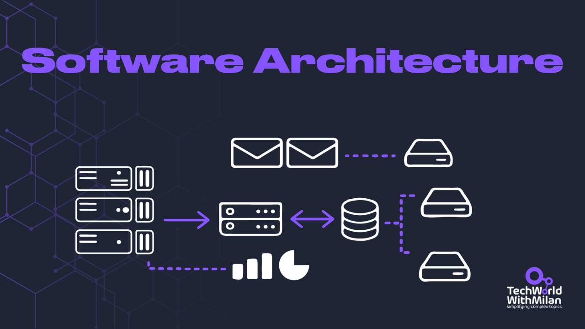

## 如何记录软件架构？

一种方法是使用 **[arc42 文档模板](https://arc42.org/)**。它提供了一种简单明了的方式来记录软件架构，使所有利益相关者都能理解。arc42 模板是由 Dr. Gernot Starke 和 Dr. Peter Hruschka 创建的，被软件行业广泛使用。

**[arc42](https://arc42.org/)** 回答以下两个问题：

- **你应该记录/传达关于你的架构的什么内容？**
- **你应该如何记录/传达？**

它使我们能够：

✅ 通过将文档组织成不同部分，arc42 帮助**分离不同的关注点**。这使得管理和导航文档变得更容易，增强了清晰度和可读性。

✅ **arc42 是业界广为人知的标准**，拥有广泛的社区支持和资源。这使得找到示例、工具和指导来有效使用模板变得更容易。

✅ arc42 的结构化方法**改进了团队成员和利益相关者之间的沟通**。通过提供一个通用的框架，它确保每个人对系统的架构有一致的理解。

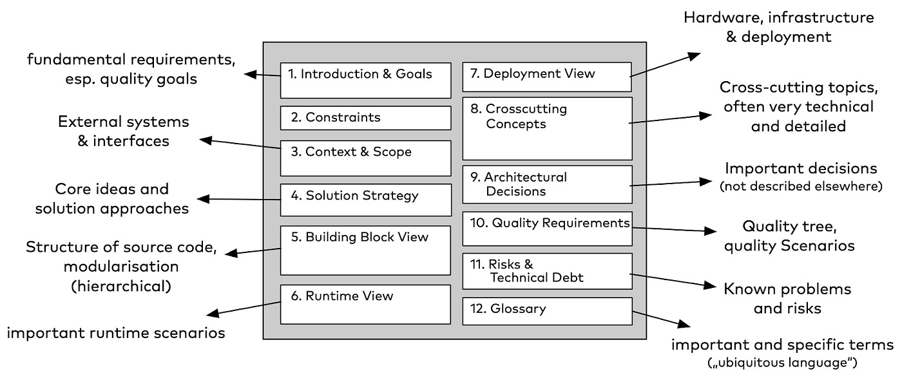

arc42 模板结构（荣誉属于 Dr. Gernot Starke）

arc42 的结构包括（没有一个是必须的）：

1. **简介：** 本节概述了软件系统、其目的和参与的利益相关者。列出了软件系统的质量需求，如性能、安全性和可扩展性（最多五个）。
2. **约束：** 本节列出了可能影响软件系统设计的任何约束，例如法律、法规或组织约束。
3. **上下文视图：** 本节描述了影响软件系统的外部因素，例如外部接口、硬件或环境。
4. **解决方案策略：** 底层选择和影响架构的解决问题策略摘要。一些示例包括技术、顶级划分和实现高质量目标的方法。
5. **构建块视图：** 本节以图表形式展示了系统的高层次代码结构。
6. **运行时视图：** 它显示了一个或多个构建块的行为，以基本用例的形式呈现。
7. **部署视图：** 本节描述了软件系统的部署方式，包括硬件、软件和网络组件。
8. **交叉概念：** 本节描述了整个软件系统中使用的交叉概念，如安全性、日志记录和异常处理。
9. **决策日志：** 本节提供了在软件系统开发过程中所做的重大设计决策的记录。
10. **质量要求：** 质量要求列表，以场景描述。
11. **风险：** 系统中已知的技术风险和问题是什么？
12. **术语表：** 讨论系统时使用的重要术语。

我们还应该提到 arc42 模板的 **一些缺点**：

❌ arc42 的全面性可能导致大量文档，这可能被视为额外负担。**这种细节层次可能对于较小的项目和团队来说显得过于繁琐**。

❌ **存在过度文档化的风险**，重点从构建系统转向记录每一个细节。

❌ 维护这些文档的实时性在快速变化的环境中会成为一个**维护问题**。如果维护不当，文档很快会过时并失去价值。

**Arc42** 提供**各种工具**来协助完成文档：

- **[arc42 文档模板](https://arc42.org/download)**。直接下载 arc42 文档模板，提供多种格式如 AsciiDoc、Markdown 和 DocBook。
- **[通过真实案例 arc42](https://arc42.org/examples)**。使用 arc42 模板记录软件架构的真实案例集合。
- **[使用 arc42 记录软件架构 (书籍)](https://leanpub.com/arc42byexample)**。arc42 创建者撰写的全面指南，讲解如何使用 arc42 模板记录软件架构。

## 如何可视化软件架构？

除了架构文档的结构，我们还需要一种描述系统不同组件的方法。首选的可视化软件架构方法之一是 **[C4 模型](https://c4model.com/)**，由软件架构师和作者 [Simon Brown](https://simonbrown.je/) 开发。C4 模型检查软件系统的静态结构、容器、组件和代码。我们构建的软件会被人们使用。

C4 模型由四个抽象层次组成，分别由四种不同类型的图表示：

### 1. 上下文（系统上下文图）

该图显示系统在上下文中的情况，提供系统及其环境的概览。这里的系统具有最高层次的抽象，显示中心被考虑的系统，周围是用户和与之交互的其他系统。这些图有助于提供大图视角。

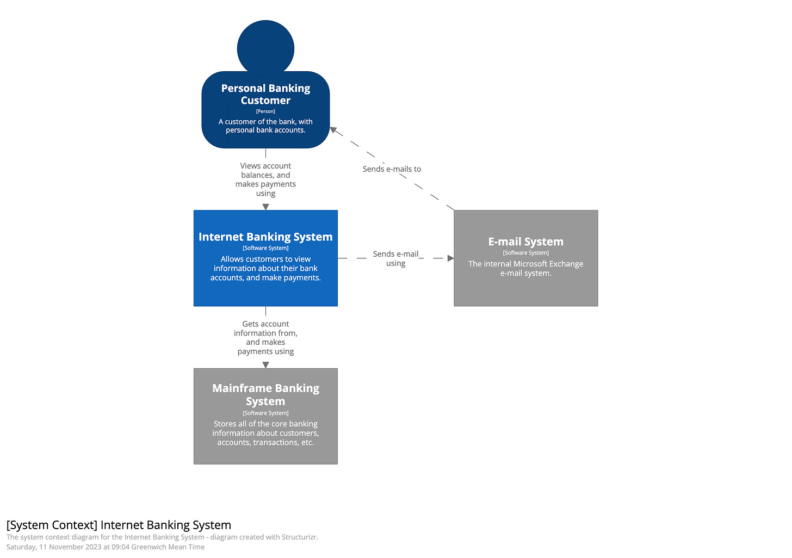

系统上下文图（[来源](https://c4model.com/#SystemContextDiagram)）。

### 2. 容器（容器图）

该图显示系统内的高层次组件或服务以及它们的连接方式。它将每个组件显示为一个方框，并省去了其内部细节，每个组件都可以单独部署或执行。容器可以代表 API、数据库、文件系统等。
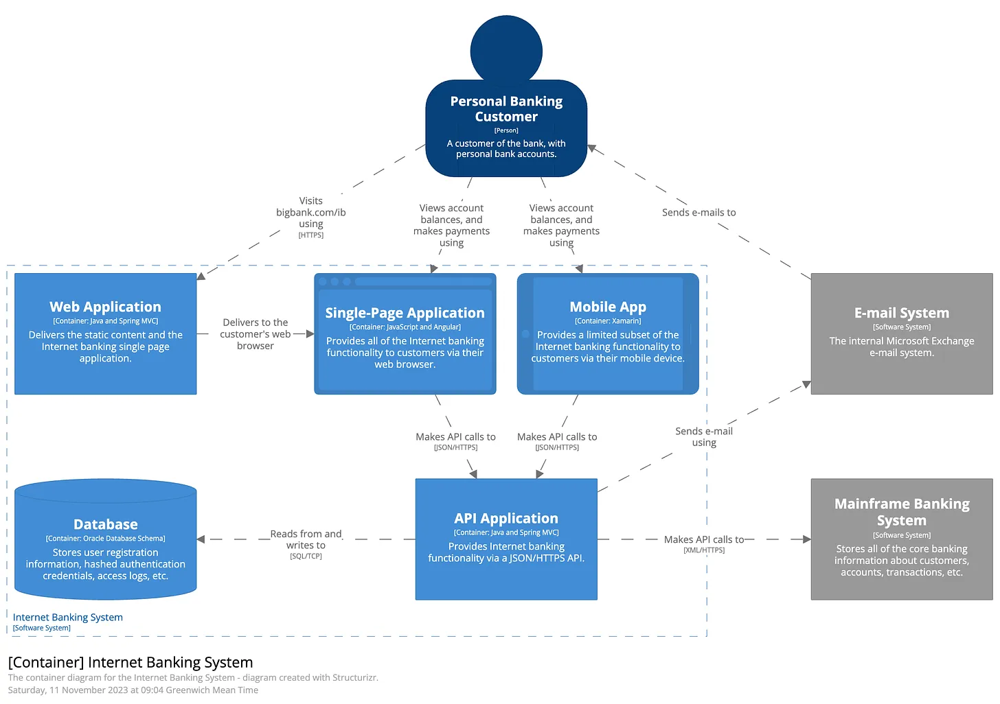

### 3. 组件（组件图）

该图显示容器的内部组件及其彼此间的交互，允许我们可视化代码库中的抽象。例如，在 C# 中，它是某个接口背后的实现类。
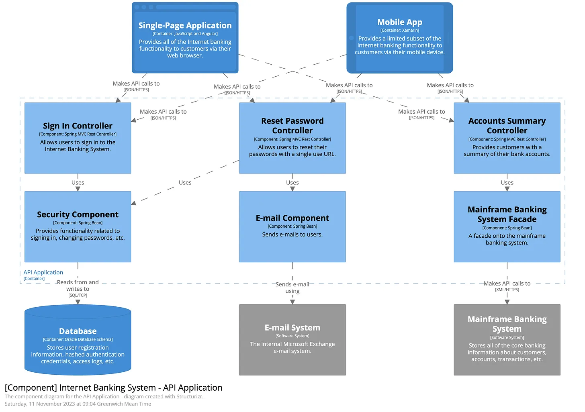

### 4. 代码（代码图）

该图显示单个组件或模块的详细结构，包括其类及其关系。可以使用 UML 或实体关系模型等符号表示该图。

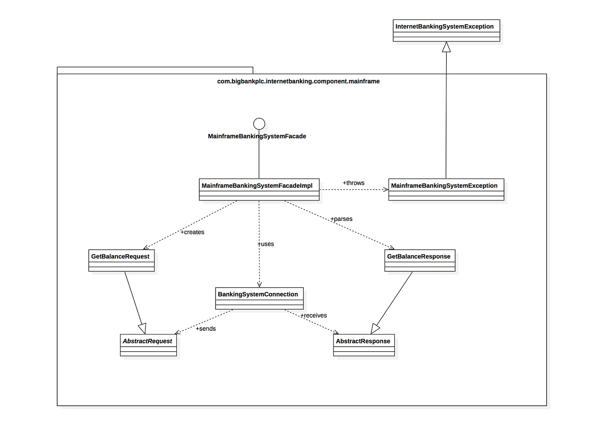

大多数团队至少应该**生成和保持系统的上下文和容器图的更新**。如果它们有用，可以制作组件图，但你需要找出如何自动化这些图的更改以满足长期文档需求。

C4 模型的一个关键方面是我们可以与**代码架构方法**一起使用。该方法的主要优势在于：

✅ **版本控制。** 图表作为代码的主要优势是能够使用如 Git 之类的版本控制系统。这使团队可以跟踪图表随时间的变化，确保修改历史清晰。

✅ **一致性**。使用代码创建图表确保所有架构的可视化表现遵循一致的风格和格式。这种标准化减少了误解并增强了可读性，使所有团队成员更容易理解图表。

✅ **自动化**。此类图表可以自动生成和更新，显著减少手动工作并最小化错误。这种自动化在集成到持续集成和持续部署（CI/CD）管道中时尤为有用，确保图表始终与代码库中的最新更改保持一致。

要使用代码架构方法结合 C4 模型，可以使用 **[Structurizr DSL](https://www.structurizr.com/)**。这是一种轻量级的文本语言，用于创建软件架构模型，允许以结构化、类似代码的格式定义架构。

Structurizr 的基本语法如下：

- **工作空间（Workspace）：** 包含你的模型和视图的顶级元素。
- **模型（Model）：** 定义架构中的人、软件系统、容器、组件和关系。语法元素包括：`person`、`softwareSystem`、`container`、`component`，以及关系箭头（`->`）。
- **视图（Views）：** 创建你的模型的不同视角，如系统上下文、容器和组件视图。语法元素包括：`systemContext`、`containerView`、`componentView`、`include`、`autolayout`。
- **风格（Styles）：** 定制元素的外观以增强可读性。语法元素：`element`、`background`、`color`、`shape`。
- **主题（Themes）：** 将预定义的视觉样式应用于你的图表（`theme`）。

[StructurizrDSL](https://docs.structurizr.com/dsl) 的语法如图所示（左图）和生成的图表（右图）。

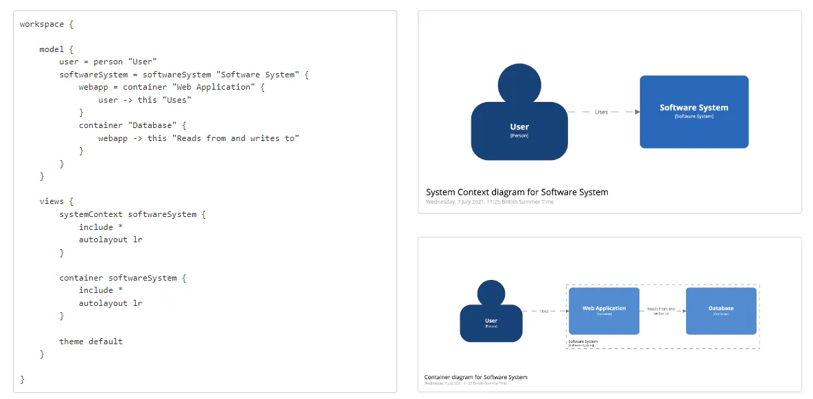

请注意，C4 模型也有**一些缺点**：

❌ 尽管 C4 模型通过四个抽象层次简化了复杂的架构，但理解和有效使用该模型仍可能需要**陡峭的学习曲线**。

❌ C4 模型可能导致**过度简化架构的某些方面**，如每个层次下与交互、依赖或跨领域关注点（如安全性、性能）相关的所有必要细节。

一些 **额外资源** 以了解更多关于 C4 模型的信息：

- [C4 模型](https://c4model.com/)。
- [Structurizr](https://docs.structurizr.com/)。
- Simon Brown 的《[可视化软件架构的 C4 模型](https://leanpub.com/visualising-software-architecture)》一书。
- Simon Brown 的《[开发人员的软件架构](https://leanpub.com/software-architecture-for-developers)》一书。

另外，你可以查看 Paul Clements 等人撰写的“**[记录软件架构：视图及其超越](https://amzn.to/3xjIUXx)**”一书，该书提供了关于软件架构文档记录方法的全面概述。还可以查阅《[开发人员文档](https://amzn.to/3VjYri8)》和《[看似代码的文档](https://amzn.to/3Vk1qHa)》等书籍。

## 如何结合使用 arc42 模板与 C4 模型

现在我们知道如何使用 arc42 模板以及 C4 模型是什么，我们可以通过将 arc42 模板的某些部分映射到一些 C4 图表上来共同使用它们。

以下是我们可以如何一起使用它们：

- **上下文图：** 包含在 arc42 第 3 部分（上下文与范围）。
- **容器图：** 包含在 arc42 第 5 部分（构建块视图，第 1 级）。
- **组件图：** 包含在 arc42 第 5 部分（构建块视图，第 2 级）。
- **类图：** 包含在 arc42 第 5 部分（构建块视图，第 3 级）。
- **部署图**：包含在 arc42 第 7 部分（部署视图）。

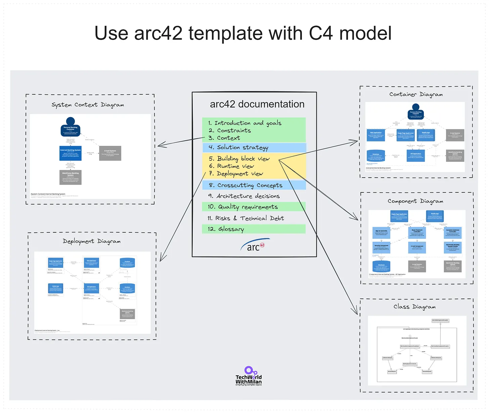

## 记录代码的架构

现在当我们有了文档框架（**arc42**）和图形模型与工具（**C4 和 Structurizr**），我们可以使用如 **[AsciiDoc](https://asciidoc.org/)** 等工具将这样的文档维护在如 **Git** 这样的版本控制系统中接近代码的地方。**arc42** 模板已经可以以 AsciiDoc 格式[获取](https://github.com/arc42/arc42-template)。**AsciiDoc** 是一种基于文本的标记语言，允许你以纯文本格式编写文档，然后可以转换为 HTML、PDF、EPUB 等格式。

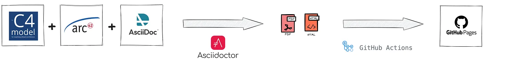

一个 **AsciiDoc** 文件的例子（左图），及其预览（右图）：

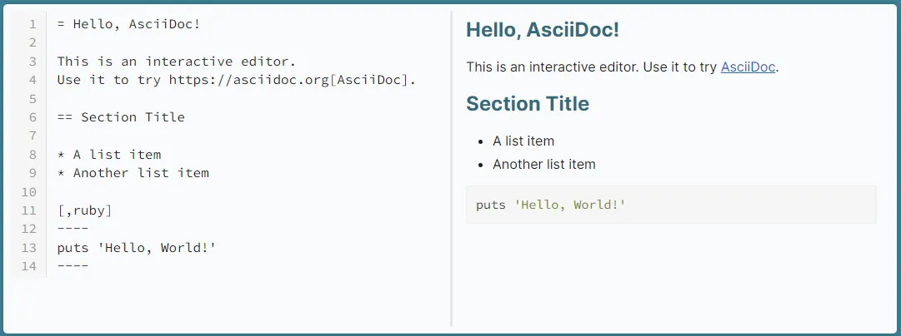

AsciiDoc 语法

使用包含 C4 图表的 arc42 模板 **[AsciiDoc 文件 (.adoc)](https://docs.asciidoctor.org/asciidoc/latest/syntax-quick-reference/)** 可能如下图所示。请注意，在 AsciiDoc 中，你可以访问主文件并从每个部分引用其他文件（例如 index.adoc → goals.adoc、strategy.adoc 等），如最后一部分所示的例子。

> _你有许多创建 AsciiDoc 文件的选项，例如 **[VSCode 的 AsciiDoc 扩展](https://marketplace.visualstudio.com/items?itemName=asciidoctor.asciidoctor-vscode)**。_

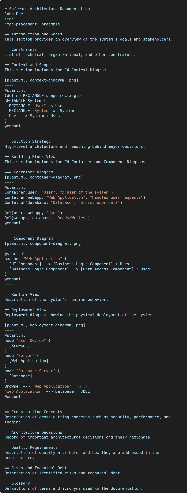

那么，我们如何开始从源文件自动生成文档：

1. **在 Structurizr 中创建 C4 模型图并将它们导出为 C4-PlantUML 图表。**
2. **基于 arc42 模型在 AsciiDoc 标记语言中创建文档模板。**
3. **将 C4-PlantUML 图表集成到文档中**（如上图所示）。
4. **在 GitHub、Azure DevOps 或类似提供商上设置 Git 仓库。将所有 AsciiDoc 和 C4 模型文件存储在仓库中。**
5. **设置 CI/CD 管道自动生成 HTML/PDF 文件的文档并进一步发布（例如到 Confluence 或 GitHub Pages）以便非技术用户可见。** CI/CD 管道将执行以下操作：

   1. 使用 [Asciidoctor](https://asciidoctor.org/) 将更改的 AsciiDoc 文档导出为 HTML5 页面。
   2. 使用 [GitHub Actions](https://github.com/features/actions) 将 HTML5 页面导出到 GitHub Pages。
   3. 使用 [docToolChain](https://doctoolchain.org/docToolchain/v2.0.x/015_tasks/03_task_publishToConfluence.html) 将 HTML5 页面导出到 Confluence。

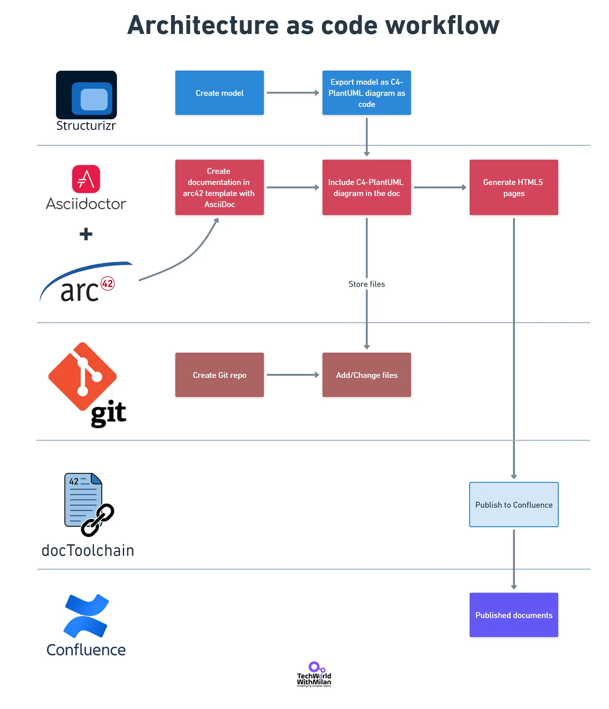

架构即代码的工作流程

> _在一个简单示例中的 GitHub Pages 上实现此工作流程的细节，可以在以下 **[GitHub 仓库](https://github.com/milanm/architecture-docs)** 中找到。_
