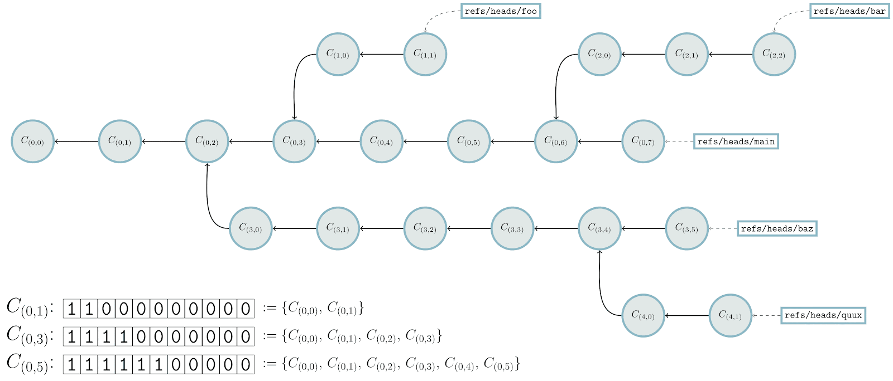
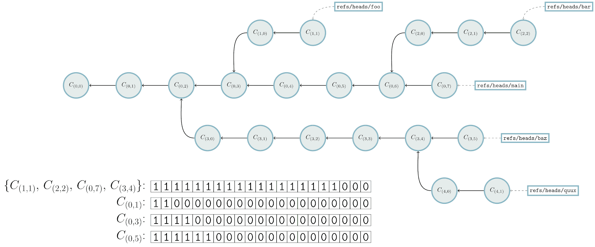

# Highlights from Git 2.46 - The GitHub Blog

> ## 摘要
>
> Git 2.46 带来了伪合并位图、更强大的凭证助手以及新的 git config 命令等新特性。查看我们对一些亮点的报道。

---

开源项目 Git 刚刚 [发布了 Git 2.46](https://github.blog/open-source/git/highlights-from-git-2-46/#)，此次版本包括来自 96 多位贡献者（其中 31 位是新贡献者）的功能和漏洞修复。上一次我们向你介绍 Git 的最新动态还是 [2.45 版本发布](https://github.blog/open-source/git/highlights-from-git-2-45/) 时。

> 在详细介绍这个最新版本之前，我们想提醒大家 [Git Merge](https://git-merge.com/) 会议将在今年 9 月 19-20 日在柏林举办。这是面向 Git 用户和开发者的会议，由 GitHub 和 [GitButler](https://gitbutler.com/) 共同主办，届时将有来自 Git 开发者以及 Git 生态系统工具开发者的演讲，提案征集（CFP）截止日期为 8 月 1 日。更多详情请访问[会议网站](https://git-merge.com/)。

说完这些，让我们看看 GitHub 对自上次发布以来引入的一些最有趣的特性和变化的看法。

## 使用伪合并位图进行更快的遍历[](https://github.blog/open-source/git/highlights-from-git-2-46/#faster-traversals-with-pseudo-merge-bitmaps)

长期关注我们文章的读者可能还记得我们对可达性位图的报道。如果你是新来的或需要一个快速复习，这里有一个简要概述。当 Git 需要满足一个 fetch 请求时，它会从一组客户端想要但没有的提交和另一组客户端已经有但不想要的提交开始。给定这些信息，Git 需要确定哪些提交（以及树、blob 等）存在于这两组之间，以满足客户端的 fetch 请求。一旦获取了这些信息，它会生成一个 [packfile](https://git-scm.com/book/en/v2/Git-Internals-Packfiles) 发送给客户端，包含客户端请求的对象。

那么，Git 如何确定要在 “存在” 和 “想要” 集合之间发送的对象集？一种方法是从 “想要” 集合中的每个提交开始，标记它们为感兴趣，然后检查它们的父提交，依次类推，直到没有更多感兴趣的提交为止。当 Git 在路上遇到一个提交时，它可以继续遍历（如果这个提交无法从任何 “存在” 集合到达）或者停止（否则）。

这种简单的对象遍历确定要发送的对象集，但根据 “存在” 或 “想要” 集合的大小、两者之间提交的数量、中间树的深度等情况，这可能会很慢。为优化这个计算，Git 使用 [可达性位图](https://github.blog/open-source/git/counting-objects/) 更快地确定要发送的对象集。位图储存从某些提交集中可达的对象集，将这一集合编码为 [位集](https://en.wikipedia.org/wiki/Bit_array)，每个位唯一标识一个对象。以下是一个示例：



在上述示例中，每个提交用一个圆圈表示，方框表示少量引用（如 `refs/heads/main`、`refs/heads/foo` 等）。在左下角有三个位图，分别对应提交 _C<sub>(0,1)</sub>_、_C<sub>(0,3)</sub>_ 和 _C<sub>(0,5)</sub>_。为确定要发送的对象集，Git 从每个给定引用向后沿每个提交的父级遍历，用绿色标记可达的提交。如果在遍历过程中提交已经被标记为绿色，我们可以提前停止。当 Git 遇到提交 _C<sub>(0,5)</sub>_ 时，它看到该提交有一个位图，标示着从该提交可达的对象集。每当发生这种情况，Git 可以快速标记所有这些对象可达，而不必沿着历史的那部分继续遍历。

因此，位图可以加速上述的许多对象遍历。但注意到仍有很多手动对象遍历来自其他分支，如 `foo`、`bar` 等。Git 可以写入更多的位图，但这样做可能代价高昂<sup id="fnref-79049-1"><a href="https://github.blog/open-source/git/highlights-from-git-2-46/#fn-79049-1" title="Read footnote.">1</a></sup>。

在 Git 2.46 中，Git 引入了一种新的实验性位图，称为 _伪合并_ 可达性位图。与储存单个提交的位图不同，伪合并位图储存从多个提交可达的对象集，而不是单个。如果客户端想要从 `foo`、`bar` 和 `baz` 可达的提交，有一个对应这些提交的伪合并位图便已足够。以下是之前相同的遍历示例，但这次启用了伪合并位图：



注意左下角有一个新的位图，对应提交 _C<sub>(1,1)</sub>_、_C<sub>(2,2)</sub>_、_C<sub>(0,7)</sub>_ 和 _C<sub>(3,4)</sub>_ 之间的伪合并。前三者都是“显式想要”集合的一部分，而 _C<sub>(3,4)</sub>_ 是隐式想要的，因为它可以从 `baz` 和 `quux` 分支到达。

Git 以相同方式开始遍历，从每个起始提交向后遍历。在每一点，它检查是否有可用的伪合并：即它们描述的提交是否都显式或隐式为客户端想要。当 Git 从 `refs/heads/baz` 开始向后遍历时，它标记 _C<sub>(3,4)</sub>_ 并确定伪合并是可用的。一旦发生这种情况，所有对应伪合并位的提交都被标记。最后，Git 执行一些剩余的手动遍历步骤，从 `refs/heads/quux` 向后直到整个遍历完成。

这篇文章只是覆盖了伪合并位图的冰山一角，其中有大量新的配置选项以确定在大型仓库中如何选择和组织伪合并。新的配置（以及该特性本身）目前仍被认为是实验性的，但你可以通过如下方式在你的仓库中启用伪合并以开始体验：

```ruby
# 配置伪合并位图
$ git config bitmapPseudoMerge.all.pattern 'refs/(heads|tags)/'
$ git config bitmapPseudoMerge.all.threshold now
$ git config bitmapPseudoMerge.all.stableThreshold never
# 然后生成一个新的 *.bitmap 文件
$ git repack -adb
```

GitHub 在未来一段时间内将逐步发布伪合并位图，因此当我们发布时，请期待我们对伪合并位图内部工作原理的更深入探讨。

\[[source](https://github.com/git/git/compare/9005149a4a77e2d3409c6127bf4fd1a0893c3495...a83e21de6b7630c1cdf3298d68b120dd9eaecd0f), [source](https://github.com/git/git/compare/ef2447d97cf1233a5f398afaa08ba51259792485...df8b05672c08ace3db9da80fb2d7cab559fa9a5e)\]

---

- 在上述关于伪合并位图的报道结尾，我们使用 `git config` 命令展示了如何调整仓库的 `.gitconfig` 文件以启用位图。资深的 Git 用户会知道这个命令不只设置配置选项。它可以列出所有配置设置，获取单个或多个匹配[正则表达式](https://en.wikipedia.org/wiki/Regular_expression)的配置，取消设置，重命名或删除部分，甚至通过您选择的 `$EDITOR` 打开 `.gitconfig`。

  过去，这些选项隐藏在不同的命令行选项后面，像 `--get`、`--get-all`、`--unset` 和 `--remove-section` 等。

  Git 2.46 为这个命令引入了一个新的用户界面，将其众多功能分组到几个顶级子命令中，使操作更加简便。例如，如果你要列出仓库中的所有配置设置，只需运行 `git config list`。如果你想获取单个设置，可以运行 `git config get <name>`。如果你想进一步缩小结果，只查看与正则表达式匹配的设置，可以使用 `get` 子命令和 `--regexp` 选项。

  这些新的命令行选项和子命令方式将 `git config` 的各种功能更整齐地组织起来，使命令更加易用，同时保留所有已有调用的向后兼容性。要了解更多关于新模式的信息，请查阅 [git-config(1) 的文档](https://git-scm.com/docs/git-config/2.46.0)。

  \[[source](https://github.com/git/git/compare/b7a1d47ba5dd0df476104a63c6ddffe2d52fccf8...7b91d310ce21aa663e025c8955c46c49ab037a41)\]

- 我们曾在此系列的[前几篇文章](https://github.blog/open-source/git/highlights-from-git-2-41/)中介绍过 Git 的 [credential helper](https://git-scm.com/docs/gitcredentials#_custom_helpers/2.46.0) 机制。如果你不熟悉，这一机制用于在访问需要凭据的仓库时提供凭据。Credential helpers 在 Git 的 [credential helper 协议](https://git-scm.com/docs/git-credential#IOFMT/2.46.0) 和其他应用程序（如 [Keychain.app](<https://en.wikipedia.org/wiki/Keychain_(software)>)，或 [libsecret](https://github.com/GNOME/libsecret)）之间进行转换。

  然而，Git 中的 HTTP 认证实际上仅限于需要用户名和密码的协议。对于想要使用 [Bearer authentication](https://datatracker.ietf.org/doc/html/rfc6750) 的服务，可以将敏感凭据存储在 [`http.extraHeader 配置`](https://git-scm.com/docs/git-config/2.46.0#Documentation/git-config.txt-httpextraHeader) 选项中，这需要将敏感信息以明文形式存储。

  Git 2.46 增强了 credential helper 协议，增加了 `authtype` 和 `credential` 字段，并扩展协议以支持为每个 credential helper 持有任意状态以及针对 NTLM 和 Kerberos 等协议的多轮验证。这些新的 credential helper 能力可以将敏感数据移出 `http.extraHeader` 配置，并为实现 NTLM 和 Digest 等协议铺平道路。

  若你有兴趣了解更多，可以查看一些新的协议更改 [这里](https://git-scm.com/docs/git-credential/2.45.0#IOFMT)。

  \[[source](https://github.com/git/git/compare/d25ad94df6bc9b3c8ce4e49d057d7665d0894a16...ffff4ac0658a2cad162c08feb1552ba02fed9099)\]

- 在[上一篇文章](https://github.blog/open-source/git/highlights-from-git-2-45/#preliminary-reftable-support)中，我们谈论了 Git 对新型引用存储后端 [reftable](https://git-scm.com/docs/reftable) 的初步支持。好奇了解这一新存储后端细节的读者可以查看那篇文章。但高层描述是，reftable 是一种新的二进制格式的引用存储。它设计为可以对单个引用进行近常时间查找，通过前缀压缩高效查找整个引用命名空间，并按更新大小进行原子更新，而不是按预先存在的引用总数进行。

  Reftable 支持在 Git 中仍在演进中。在上一次更新中，我们提及可以通过运行 `git init --ref-format=reftable /path/to/repo.git` 初始化一个新的使用 reftable 后端的仓库。在 Git 2.46 中，你现在可以通过运行新的 `git refs migrate --ref-format=reftable` 命令将现有仓库转换为使用 reftable 后端。

  注意 reftable 支持仍被视为实验性，`git refs migrate` 命令在将仓库转换为新 reftable 后端时[有一些已知的局限](https://git-scm.com/docs/git-refs/2.46.0)。但如果你喜欢走在技术前沿，或者有一个非 reftable 副本的仓库，你今天就可以开始试验 reftable。

  \[[source](https://github.com/git/git/compare/dfd668fa844f6ba18e6588a5988438baaa2d3e06...25a0023f28600102f54e7529c20da5928c3e9c75)\]

- 若你使用 Git 足够久，你可能遇到过一些在执行细微或不安全操作时出现的“提示”消息，比如切换到分离 HEAD 状态：

  ```sql
  $ git checkout HEAD^
  Note: switching to 'HEAD^'. You are in 'detached HEAD' state. You can look around, make experimental changes and commit them, and you can discard any commits you make in this state without impacting any branches by switching back to a branch. [...]
  ```

  这些提示消息在执行可能产生意外后果的操作时提供有用的提示（比如在分离 HEAD 状态提交，若不小心更容易丢失提交）。如果你对潜在的后果感到舒适，也可以禁用不同种类的提示消息。在上述示例中，你可以运行 `git config set advice.detachedHead false` 告诉 Git 取消上述提示消息。

  但每个提示消息必须单独启用或禁用。因此在脚本编写时可能很麻烦，因为需要不断维护和更新不同种类提示消息列表。

  在 Git 2.46 中，Git 有一个新的顶级选项，`--no-advice`，可以禁用所有提示消息。在编写脚本时可以使用此新选项，避免提示消息占据 `stderr` 的输出。

  \[[source](https://github.com/git/git/compare/db271e7bb60d42f3d6eadce99ee7cd8749b49754...cbdc83f1514963f86e8f027f9e75cde7f757c2a8)\]

- Git 有一个用 Shell 脚本编写的全面测试套件，包含数万个集成测试<sup id="fnref-79049-2"><a href="https://github.blog/open-source/git/highlights-from-git-2-46/#fn-79049-2" title="Read footnote.">2</a></sup>。尽管这些 Shell 脚本测试了 Git 的许多组件，但它们并非没有缺点。它们在生成新进程开销较高的平台（如 Windows）上可能较慢。

  它们有时在测试 Git 的底层组件（如[进度条](https://github.com/git/git/blob/v2.46.0/progress.c)实现）时也会显得笨拙。对于像进度条这样的组件，Git 通常会实现一个低级别的[测试助手](https://github.com/git/git/blob/master/t/helper/test-progress.c)，可以通过行定向协议操纵它测试的组件，然后可以通过 [shell 脚本驱动](https://github.com/git/git/blob/v2.46.0/t/t0500-progress-display.sh)。

  Git 开始将一些集成测试转换为单元测试，使直接测试某些底层组件变得更容易。有关这些转换进展的一些细节，查看以下一些源链接。

  \[[source](https://github.com/git/git/compare/83f1add914c6b4682de1e944ec0d1ac043d53d78...951105664dd4de73a8c949b0fb875e895d149ece), [source](https://github.com/git/git/compare/b3ba0f2133e63167e43c036b4fd50e5358745221...4d00d948ff5796ba5a8a253eb73da5ea36a72657), [source](https://github.com/git/git/compare/a39e28ace77686db3324d1093a92c2cfdf5a5e0b...efa8786800618
