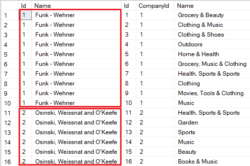
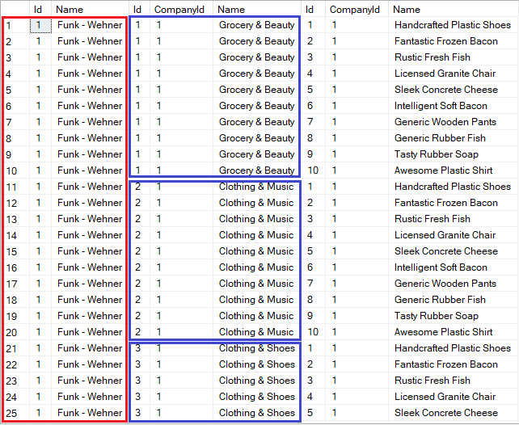
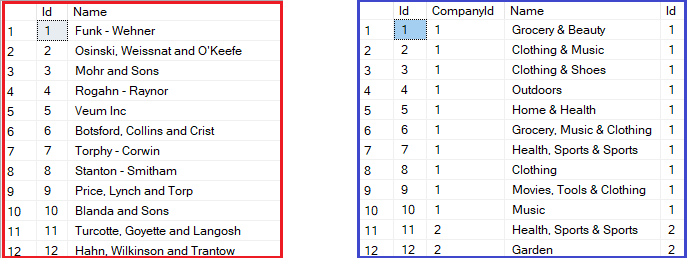

# 在Entity Framework Core 中的单一和分割查询

> ## 摘录
>
> 理解在Entity Framework Core 中的单一和分割查询。探索使用不同查询策略的优缺点。
>
> 本文翻译来源于：[Single and Split Queries in Entity Framework Core
> ](https://code-maze.com/efcore-single-and-split-queries/)

---

Entity Framework Core (EF Core）为开发者提供了两种强大的查询策略：**单一查询** 和 **分割查询**。在这篇文章中，我们将深入探讨各自的利弊，帮助我们做出高效数据检索的明智决策。

我们的样本库提供了 EF Core 执行迁移以创建其模式描绘了简单分层结构的关系数据库。我们通过外键限制在表之间建立关系，确保数据的完整性并允许有效地检索相关信息。我们也将在这个数据库中描述并演示什么是单一查询和分割查询。

如果您想要下载本文的源代码，可以访问我们的 [GitHub仓库](https://github.com/CodeMazeBlog/CodeMazeGuides/tree/main/dotnet-efcore/SingleAndSplitQueriesInEFCore)。

## **理解单一查询**

在 EF Core 中，**单一查询**的方法是一次性获取所有所需数据。就像我们在单次数据库查询中热切地获取我们需要的所有东西。

这种方法减少了我们的应用程序和数据库之间往返的次数。当处理复杂的数据模型或者获取相关数据（例如，有关系的多表数据）时，它会非常有利。

在 EF Core 中，我们可以使用 [立即加载](https://code-maze.com/lazy-loading-and-eager-loading-in-entity-framework-core/)，通过 **Include** 方法来指定在查询中包含的相关实体：

```csharp
var companies = _dbContext.Companies
    .Include(company => company.Departments)
    .ToList();
```

不难找出 EF Core 使用 SQL 查询在我们的数据库中获取数据，例如，使用 [ToQueryString()](https://learn.microsoft.com/en-us/dotnet/api/microsoft.entityframeworkcore.entityframeworkqueryableextensions.toquerystring?view=efcore-8.0) 或 数据库分析器：

```sql
SELECT [c].[Id], [c].[Name], [d].[Id], [d].[CompanyId], [d].[Name]
FROM [Companies] AS [c]
LEFT JOIN [Department] AS [d] ON [c].[Id] = [d].[CompanyId]
ORDER BY [c].[Id]
```

此查询返回一组行，每个都包含 `Companies` 和 `Departments` 表的列。这意味着我们不需要执行多次查询来检索所有必要的数据。

同时，我们可能注意到，对于公司的每个部门，公司的属性都被多次复制：

[](https://code-maze.com/wp-content/uploads/2024/02/PropertiesDuplicated.png)

通常，冗余数据并不会显著影响应用程序的性能。

但是，如果我们包括更多同级别的相关数据，在与主体 `Company` 实体一起检索时，很容易猜想会发生什么。现在想象一下，如果 `Company` 包含例如存储徽标图像的巨大二进制属性。随着我们包含的类型越来越多，数据库服务器将把更多的冗余数据通过网络传输到客户端应用程序。

让我们更新先前的查询，还包括该公司制造的产品：

```csharp
var companies = _dbContext.Companies
    .Include(company => company.Departments)
    .Include(company => company.Products)
    .ToList();
```

检查底层查询及其输出，我们注意到结果集中的行数增长得非常快：

```sql
SELECT [c].[Id], [c].[Name], [d].[Id], [d].[CompanyId], [d].[Name], [p].[Id], [p].[CompanyId], [p].[Name]
FROM [Companies] AS [c]
LEFT JOIN [Department] AS [d] ON [c].[Id] = [d].[CompanyId]
LEFT JOIN [Product] AS [p] ON [c].[Id] = [p].[CompanyId]
ORDER BY [c].[Id], [d].[Id]
```

[](https://code-maze.com/wp-content/uploads/2024/02/CartesianExplosion.png)

现在，不仅公司正在复制（标记为红色），部门开始复制（标记为蓝色）。此效果被称为 **笛卡尔爆炸。**

因此，尽管单一查询可以提高性能，我们必须小心。一次获取太多数据可能会使事情变慢。幸运的是，EF Core 可以识别这种情况，并生成相应的警告消息：

```bat
warn: Microsoft.EntityFrameworkCore.Query[20504]
      Compiling a query which loads related collections for more than one collection navigation, either via 'Include' or through projection, but no 'QuerySplittingBehavior' has been configured. By default, Entity Framework will use 'QuerySplittingBehavior.SingleQuery', which can potentially result in slow query performance. See https://go.microsoft.com/fwlink/?linkid=2134277 for more information. To identify the query that's triggering this warning call 'ConfigureWarnings(w => w.Throw(RelationalEventId.MultipleCollectionIncludeWarning))'.
```

如果我们在开发应用程序时遇到这个消息，我们应该考虑使用分割查询。

## **理解分割查询**

不同于单一查询的全包模式，**分割查询** 将数据检索分解成更小的步骤。当我们想要只检索必要的数据，避免过度检索，针对特定用户案例进行优化时，这种方法非常方便。

在 EF Core 中，合并分割查询涉及到使用 `AsSplitQuery()` 方法。这个方法语向 EF Core 发出信号思维，它应该分割查询，使数据检索进行优化：

```csharp
var companies = _dbContext.Companies
    .Include(company => company.Departments)
    .AsSplitQuery()
    .ToList();
```

作为结果，EF Core 将生成两个单独的 SQL 查询：

```sql
SELECT [c].[Id], [c].[Name]
FROM [Companies] AS [c]
ORDER BY [c].[Id]
SELECT [d].[Id], [d].[CompanyId], [d].[Name], [c].[Id]
FROM [Companies] AS [c]
INNER JOIN [Department] AS [d] ON [c].[Id] = [d].[CompanyId]
ORDER BY [c].[Id]
```

这些查询将返回两个单独的结果集：

[](https://code-maze.com/wp-content/uploads/2024/02/SplitQueries.png)

如我们可以看到，第一个查询（红色）检索所有需要的公司。第二个查询（蓝色），反过来，检索他们的部门。现在，EF Core 可以组合这些查询的结果到包含部门的 `Company` 对象的集合中。

好消息是，结果集中都没有重复的数据。这反过来就意味着在进行单一查询的情况下，数据库服务器传输到我们的应用程序中的数据量要少。

同时，我们需要执行两个 SQL 查询而不是一个。更多的查询可能会导致应用程序和数据库之间的额外往返。

此外，想象一下，在执行第二个查询之前，第一个结果集中返回的一个公司以及它的部门已经从数据库中删除。自然，第二个结果集将不包含已删除公司的部门。结果，我们的应用程序的用户可能会操作不一致的结果数据。

**所以，如果我们的数据库可以被并发更新，我们需要考虑使用** [可串行化或快照事务](https://techcommunity.microsoft.com/t5/sql-server-blog/serializable-vs-snapshot-isolation-level/ba-p/383281#:~:text=In%20serializable%20isolation%20level%2C%20SQL,transaction%20holding%20the%20lock%20completes.) **以防止这种情况**。请记住，事务带有开销，并且可能会影响性能，特别是如果他们涉及锁定资源。

## 默认使用**分割查询**

EF Core 默认使用的是单一查询策略。然而，我们可以配置 EF Core 来使用分割查询模式作为默认：

```csharp
protected override void OnConfiguring(DbContextOptionsBuilder optionsBuilder)
{
    optionsBuilder.UseSqlServer(
        "Server=(localdb)\\MSSQLLocalDB;Integrated Security=true;Initial Catalog=SingleAndSplitQueriesInEFCore",
        options => options.UseQuerySplittingBehavior(QuerySplittingBehavior.SplitQuery));
}
```

尽管这个例子配置的 EF Core [DbContext](https://learn.microsoft.com/en-us/ef/core/dbcontext-configuration/) 使用 SQL Server 作为数据库提供者，我们也可以为其他 [数据库提供者](https://learn.microsoft.com/en-us/ef/core/providers/?tabs=dotnet-core-cli) 开启查询分割行为。

现在，为了在单一查询模式中执行特定查询，我们必须使用 `AsSingleQuery()` 方法：

```csharp
var companies = _dbContext.Companies
    .Include(company => company.Departments)
    .AsSingleQuery()
    .ToList();
```

## 性能比较

我们提供的示例代码提供了一个基准，使我们能够测量和比较单一查询和分割查询的性能：

| 方法                             |      平均值 |       错误 |        中值 |       Gen0 |     Gen1 | 分配内存 |
| -------------------------------- | ----------: | ---------: | ----------: | ---------: | -------: | -------: |
| 使用单独查询获取公司和部门       |  16.64 毫秒 | 0.078 毫秒 |  16.62 毫秒 |  2000.0000 |        - |  4.04 MB |
| 使用单独查询获取公司，部门和产品 | 200.60 毫秒 | 1.786 毫秒 | 198.98 毫秒 | 23333.3333 |        - | 46.93 MB |
| 使用分割查询获取公司和部门       |  18.97 毫秒 | 0.245 毫秒 |  18.73 毫秒 |   687.5000 | 218.7500 |  4.25 MB |
| 使用分割查询获取公司，部门和产品 |  35.62 毫秒 | 0.403 毫秒 |  35.39 毫秒 |  1333.3333 | 400.0000 |  8.35 MB |

根据基准测试结果，`AsSingleQuery()` 在获取公司（不含产品）时，执行时间比 `AsSplitQuery()` 略快（16.64 毫秒 vs. 18.97 毫秒）。内存消耗也较低（4.04 MB vs. 4.25 MB）。

然而，当单一查询导致笛卡尔爆炸效果时，我们看到了非常不同的结果。现在 `AsSingleQuery()` 在与 `AsSplitQuery()` 比较时变得更慢（200.60 毫秒 vs. 35.62 毫秒），并需要更多的内存（46.93 MB vs. 8.35 MB），一次检索所有带有复制的数据。

**我们必须记住，基准测试结果将基于诸如数据库大小、查询复杂性、网络延迟和硬件配置等因素而变化。**

## 结论

综上所述，在我们一次需要很多相关数据的情况下，单一查询可能会更有效。另一方面，当我们想要优化特定用户案例或减少在给定时间获取的数据量时，分割查询可能会更有利。

两种策略都有权衡之处。单一查询可能会带来太多的数据，而分割查询意味着更多次数的数据库访问。

选择单一还是分割查询是关于找到适应我们应用程序需求的正确平衡。如果我们通常需要大量的关联数据，我们应该选择单一查询方法。如果我们需要小心翼翼和精确，分割查询就是我们的朋友。
