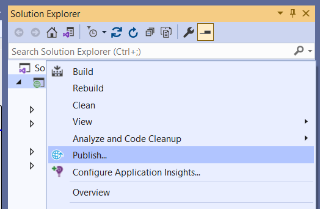

# Visual Studio 中 Build 和 Publish 之间的区别 - Code Maze

> ## 摘要
>
> 探索 Visual Studio 中用于 .NET 开发的 build 和 publish 操作之间的重要差异。

---

有没有人想知道软件开发中的 build 和 publish 功能之间有什么区别？正如我们所知，无论是 build 还是 publish 在软件开发中都是重要的步骤，特别是在使用 Visual Studio 进行 .NET 应用程序开发时。

让我们检查一下典型的开发生命周期，以确定这些操作之间的差异。

## 典型的开发生命周期

典型的开发周期指的是创建应用程序所需的一系列步骤。

让我们看看我们在开发过程中遵循的基本步骤：

最初，在 **Development** 阶段，软件的实际编码工作使用编程语言和框架来进行。在这个阶段，开发人员编写前端（UI）和后端（服务器端）功能的代码。

**Build** 阶段用于将源代码转换为机器可读代码。这一过程包括查找错误、警告和句法问题，并创建具有必要依赖项的可执行文件。

在 **Testing** 阶段，我们确认应用程序正常工作并满足实际需求。这包括进行包括单位测试和集成测试在内的测试。

最后，在 **Publish** 和 **Deployment** 阶段，我们打包应用程序并使其可供最终用户使用。这包括创建所有必要的文件、依赖项和配置设置，以及为目标环境配置应用程序。

让我们更仔细地看看 **Build** 和 **Publish** 步骤。

**`Build` 是软件开发周期中紧随代码编写完成之后的步骤，它将可读的源代码转换成可执行的软件。**

它的开始是将源代码编译为包括库和应用程序功能在内的机器可读二进制文件。Build 过程仔细检查代码，查找任何警告、句法错误或问题，以生成准备好进行测试和迭代开发的软件包。

编译器根据项目规格将代码转换为带 `.dll` 扩展名的中间语言（IL）文件。它可能会生成额外的文件，如可执行文件、调试符号文件 `.pdb`、`.deps.json` 和 `.runtimeconfig.json` 文件。

我们可以通过 CLI 命令或通过 Visual Studio 工具栏执行 build 过程。

让我们先探索如何使用 CLI 进行 build：

dotnet build

使用 `dotnet build` 命令，我们可以构建当前工作目录中找到的项目或解决方案。

现在，让我们看看 Visual Studio：

通过在 Visual Studio 的解决方案资源管理器中对我们的项目或解决方案进行右键单击打开上下文菜单，我们可以找到 **Build** 选项。

## Visual Studio 中的 “Publish” 是什么

现在我们已经构建并测试了解决方案，我们如何才能让它供用户使用？

`Publish` **是我们为应用程序的分发和交付做准备的地方。这个步骤将所有必要的文件和依赖项如二进制文件、库和配置设置打包成可部署的格式。** 通常，发布会通过资产优化、文件压缩和文件传输配置等步骤，使应用程序为目标环境做好准备。

一旦发布，应用程序会自动创建和修改依赖项，创建一个用于最终用户安装的现成目录结构，并为此配置自己。

我们可以通过 CLI 命令或通过 Visual Studio 工具栏发布一个 .NET 应用程序。

首先，让我们探索如何使用 CLI 进行发布：

dotnet publish

使用 `dotnet publish` 命令，我们可以发布在当前工作目录中找到的项目或解决方案。

有关 `dotnet publish` CLI 命令的详细信息和选项，请查看 [Microsoft 文档](https://learn.microsoft.com/en-us/dotnet/core/tools/dotnet-publish)。

现在，让我们看看 Visual Studio：

再次，通过在解决方案资源管理器中对项目或解决方案进行右键单击，我们可以通过所选项目的上下文菜单找到发布选项。

## **Build 和 Publish 之间的区别**

正如我们已经看到的那样，`build` 过程和 `publish` 过程是两个不同的实体，它们分别服务于不同的目的并产生特定的结果。`build` 过程编译源代码并在 bin 文件夹中生成输出。然后，`publish` 过程从 bin 文件夹中检索这些信息，并将其打包成可执行文件，准备发送到目标文件夹或位置。

**项目的目标框架会影响 `build` 和 `publish` 过程的结果。**

对于早于 .NET Core 3.0 的目标版本的项目，在 build 过程中，来自 NuGet 的依赖项不会被复制到输出文件夹中。它们需要发布可执行版本。但对于以 .NET Core 3.0 及以上为目标的项目，自动在 build 中包含依赖项，减少了额外的部署前步骤的需求。

## **何时使用 Build 和 Publish**

现在我们了解了 **Build** 和 **Publish** 之间的区别，让我们来看看何时以及在哪里使用这些。

在我们本地机器上开发时，我们使用 `build` 来编译代码和检查语法错误。这对于测试目的或在本地计算机内调试是必不可少的。

当我们准备将我们的应用程序部署到托管环境时，我们选择 `publish`。这将包括所有需要的依赖项，使应用程序成为一个自包含的，可以在目标系统上执行的系统。当将应用程序发布到可能没有 .NET 运行时轻松可用的环境时，这一点尤其重要。

## 结论

对于 build 和 publish 之间的区别有清晰的理解，对于程序的成功开发和实施至关重要。发布通过将应用程序及其依赖项打包成可部署的格式扩展了过程，而 build 专注于将代码组装成二进制文件。正确使用这些可以使开发人员轻松地将他们的应用程序分发到多个托管位置，并优化他们的部署管道。

**摘要：** 文章讨论了 Visual Studio 中进行 .NET 开发的 build 和 publish 操作之间的区别。Build 操作将源代码编译为可执行文件，而 publish 操作则将构建好的应用程序及其依赖项打包，准备分发给最终用户。文中提到了两者不同的使用场景：在本地环境中通常使用 build 进行编码和测试，而当准备将应用程序发布到生产环境时，则使用 publish。这篇文章对理解在不同开发阶段采取的操作及其重要性有益。
