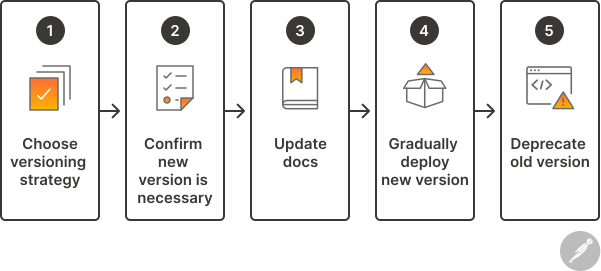

# API版本控制是什么？益处、类型和最佳实践 | Postmann

> ## 摘要
>
> 了解API版本控制如何使团队能够对其API进行更改，同时不为消费者创造问题。

---

## API版本控制是什么？

API版本控制是管理和跟踪API更改的过程。它还涉及将这些更改传达给API的消费者。

更改是API开发中的自然一部分。有时，开发人员必须更新他们的API代码以修复安全漏洞，其他更改引入新的特性或功能。一些更改根本不影响消费者，而其他被称为“重大更改”的更改则导致向后兼容性问题，比如意外错误和数据损坏。API版本控制确保这些更改顺利推出，以保持消费者信任，同时保持API安全、无bug和高性能。

在这里，我们将回顾API版本控制的益处并讨论一些必要情况。我们还将探索一些最常见的API版本控制方法，提供成功版本控制API的五个步骤，并强调一些API版本控制的最佳实践。最后，我们将讨论Postman API平台如何支持您的API版本控制工作流程。

## API版本控制的益处是什么？

API的生产者和消费者在API演变过程中保持同步至关重要——无论它是私有的还是公开的。有效的API版本控制策略不仅使API生产者能够以最小化面向消费者影响的方式进行迭代，而且还提供了一种高效沟通这些变化给消费者的框架。这种透明度建立了信任，并在公开API的情况下加强了组织的声誉，这可以提高API的采用和保留率。

## 何时应对API进行版本控制？

每当您进行更改并且需要消费者修改他们的代码库以继续使用API时，您就应该对您的API进行版本控制。这种类型的更改被称为“重大更改”，它可以对API的输入和输出数据结构、成功和错误反馈以及安全机制进行更改。一些常见的重大更改示例包括：

- **重命名属性或端点：** 有时您可能希望重命名属性或方法，以使其含义更清晰。尽管清晰的命名从[API设计](https://www.postman.com/api-platform/api-design)的角度来看很重要，但一旦API在生产中，几乎不可能更改属性或方法名称而不破坏您的消费者代码。
- **将可选参数变为必需参数：** 随着您的API演变，您可能会注意到某些输入参数应该是强制性的，即使它最初设计为可选的。虽然这种类型的变化可能有助于标准化输入和使API操作更可预测，但它会导致对未编程传递此属性值的客户端产生缺失属性错误。
- **修改数据格式或类型：** 有时您可能会意识到，例如，`firstName`和`lastName`应该存在于一个`user`对象中，而不是作为分别取字符串值的单独属性。尽管这种类型的更改会改善您的API设计，但它仍然是一个重大更改，会导致解析异常。
- **修改属性的特性：** 您可能偶尔会被诱惑去更改某些属性的规则。例如，具有`type: string`类型的`description`属性可能有一个`maxLength`规则，您发现这个规则过低或过高。根据其实现，这种类型的更改将产生不同的结果，包括数据库和UI错误。

## 有哪些类型的API版本控制？

有几种API版本控制方法，包括：

- **URL版本控制：** 使用这种方法，版本号包含在API端点的URL中。例如，对于希望查看数据库中所有产品的消费者，他们会向`https://example-api.com/v1/products`端点发送请求。这是最流行的API版本控制类型。
- **查询参数版本控制：** 该策略要求用户在API请求中包含版本号作为查询参数。例如，他们可能会向`https://example-api.com/products?version=v1`发送请求。
- **头部版本控制：** 该方法允许消费者在API请求中传递版本号作为头部，从而将API版本与URL结构解耦。
- **基于消费者的版本控制：** 这种版本控制策略允许消费者根据自己的需要选择合适的版本。使用此方法时，消费者第一次调用时存在的版本将与消费者信息一起存储。之后的每次调用都将针对这相同的版本执行——除非消费者明确修改其配置。

值得注意的是，这些版本控制策略与版本控制方案一起使用，例如语义版本控制或基于日期的版本控制。语义版本控制遵循三部分数字格式（即，3.2.1），其中第一个数字代表可能包括重大更改的主要更新，第二个数字代表包含新的、向后兼容的特性的更新，第三个数字代表修复或补丁。与此相反，基于日期的版本控制使用它们发布的具体日期来标识版本。

## 如何对API进行版本控制？

API版本控制直接影响API的整体成功，并且需要仔细规划以确保以有条不紊的方式执行。API生产者应遵循以下步骤尽可能有效地对其API进行版本控制：

### 步骤1：选择版本控制策略

在[API生命周期](https://www.postman.com/api-platform/api-lifecycle/)的API设计阶段选择一个API版本控制策略很重要。这个版本控制策略应该在您的所有API中共享。越早考虑版本控制，您就越有可能选择韧性设计模式，以减少重大更改的发生。关于API版本控制的早期决定也将帮助您的团队就您的API将如何演变以满足消费者需求制定现实的路线图。

### 步骤2：确认是否需要新版本

更改是API开发中不可避免的一部分，但并非每次更改都需要新版本。在决定推出新版本之前，团队应该评估他们想要进行的更改的范围和影响，并确定是否有办法以向后兼容的方式进行。例如，您可以选择添加一个新操作，而不是修改现有操作。如果无法避免重大更改，您可能会考虑等待直到发布一个令消费者体验得以改善的激动人心的新特性时再引入它。

### 步骤3：更新文档

如果您决定是时候对您的API进行版本控制，更新API文档以包含有关发布的信息很重要。例如，您将想要传达更改的原因、它们将如何影响消费者，以及如何访问新版本。您还可能想要包括发布时间表和迁移说明——特别是如果您计划最终弃用旧版本。

### 步骤4：分阶段部署新版本

只要可能，团队应该分阶段发布新的API版本，从一小部分用户开始。然后他们应该收集这些用户的反馈并解决任何问题，然后再更广泛地发布新版本。这种方法有助于团队验证新版本是否按预期工作——并提供有关实际消费者如何与API交互的宝贵见解。

### 步骤5：弃用旧版本

一旦新版本稳定，团队应该监控采用情况，以评估有多少用户成功迁移。如果采用率符合预期，团队可以创建并宣布弃用旧版本的时间表。在这一点上，为继续使用旧版本的用户提供支持很重要，因为他们可能需要帮助过渡到新版本。

## 有哪些API版本控制的最佳实践？

对API版本控制的草率方法可能导致API消费者和生产者产生负面后果。以下最佳实践将帮助您避免潜在的陷阱，并确保您的API版本控制策略的成功：

- **在设计时考虑到可扩展性：** 在API设计过程中战略性地思考版本控制很重要。例如，某些数据类型，如布尔值和原子数组，比其他类型更容易受到重大更改的影响，因此最好尽可能地从您的API设计中省略它们。
- **了解您的消费者：** 在决定是否进行更改时了解您的消费者如何使用您的API很重要。这涉及到了解[隐形API合约](https://www.hyrumslaw.com/)，它指的是您的API意外实现。例如，消费者可能通过索引而不是属性名称访问对象中的属性。虽然API生产者没有预料到这种实现，但在版本控制过程中仍应考虑到。
- **在您的服务条款中包括版本控制政策：** 让您的消费者知道您将如何定义重大更改，您将何时警告他们即将发生的更改，以及他们必须迁移到新版本的时间有多长很重要。这种做法对合作伙伴和公开API至关重要——尤其是那些被变现的API。
- **将实现版本控制和合约版本控制解耦：** 在版本控制方面，将API的实现与其合约分开考虑很重要。例如，如果您将Node.js实现重写为Rust，但合约没有变化，则不应发布API的新版本。
- **彻底测试：** 版本控制是API生命周期中的一个重大事件，因此尽一切可能确保它顺利进行非常重要。在开发和部署期间进行彻底的测试有助于确认新版本按预期工作——而不会为消费者引入任何新问题。
- **计划弃用：** 在开发API的新版本时，考虑如何以及何时弃用旧版本很重要。这涉及到建立弃用政策，将弃用计划传达给消费者，监控旧版本的使用情况，随着弃用日期临近，最后，删除其服务器和文档。仔细规划和沟通弃用减少了意外发生的风险，使旧实例不会运行太久，确保消费者有足够的时间过渡到新版本。

## Postman如何帮助API版本控制？

Postman API平台已连续两年被Gartner®评为全生命周期API管理类别的领导者，包含多个功能，使团队能够安全地对其API进行更改。使用Postman，您可以：

- **利用与版本控制平台的内置集成：** Postman使您能够连接到GitHub、Bitbucket、GitLab或Azure DevOps上的[远程仓库](https://learning.postman.com/docs/designing-and-developing-your-api/versioning-an-api/versioning-an-api-overview/)。一旦您的API连接到一个仓库，您可以使用基于Git的版本控制来切换分支并拉取或推送更改，而无需离开Postman。
- **在Postman构件上安全协作：** Postman包括用于处理Postman集合、环境和Postman Flows的[内置版本控制](https://learning.postman.com/docs/collaborating-in-postman/using-version-control/version-control-overview/)功能。例如，团队成员可以分叉这些实体并创建拉取请求，而不需要编辑者角色，这支持了安全迭代和有效协作。
- **轻松创建公共文档：** Postman使[发布公共文档](https://learning.postman.com/docs/publishing-your-api/publishing-your-docs/)变得简单，这自动包括每个请求和端点的详细信息，以及各种客户端语言的代码样本。此文档还将自动更新，因此您不必担心它与您的集合不同步。
- **利用手动和自动化测试功能：** Postman包括一套强大的[API测试](https://www.postman.com/api-platform/api-testing/)功能，可以帮助您验证新API版本的功能。例如，团队可以使用Postman的[集合运行器](https://learning.postman.com/docs/collections/running-collections/intro-to-collection-runs/)将请求串联在一起并记录测试结果，或者他们可以利用[Newman](https://learning.postman.com/docs/collections/using-newman-cli/command-line-integration-with-newman/)或[Postman CLI](https://learning.postman.com/docs/postman-cli/postman-cli-overview/)在其CI/CD管道中对新API版本运行测试。
