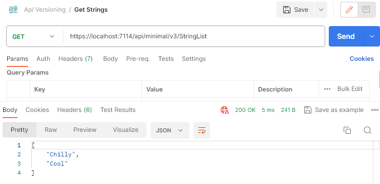

# API Versioning in ASP.NET Core - Code Maze

> ## Excerpt
>
> We’re going to talk about versioning a Rest API and explore the different versioning schemes we have in Asp.net Core.

---

In this article, we’re going to talk about API versioning and explore the options we have in ASP.NET Core.

To download the source code for this article, you can visit our [GitHub repository](https://github.com/CodeMazeBlog/CodeMazeGuides/tree/main/aspnetcore-webapi/VersioningRestAPI).

So, let’s start.

---

As developers, we often add new features to our apps and modify current APIs as well. Versioning enables us to safely add new functionality without breaking changes. But not all changes to APIs are breaking changes.

**So, what can we define as a “breaking change” in an API endpoint?**

Generally, additive changes are not breaking changes:

- Adding new Endpoints
- New (optional) query string parameters
- Adding new properties to DTOs

Replacing or removing things in our API cause breaking changes:

- Changing the type of DTO property
- Removing a DTO property or endpoint
- Renaming a DTO property or endpoint
- Adding a required field on the request

That said, we have to face versioning requirements sooner or later since it is a way to maintain backward compatibility.

## Required Packages for API Versioning

For Versioning requirements, we are going to use `Asp.Versioning.Mvc` and `Asp.Versioning.Mvc.ApiExplorer` NuGet packages. They allow us to easily implement versioning in our ASP.NET Core applications with a few configuration lines.

That said, let’s install them:

PM\> Install-Package Asp.Versioning.Mvc

PM\> Install-Package Asp.Versioning.Mvc.ApiExplorer

After the installation, let’s set up the main configuration for versioning:

```csharp
var apiVersioningBuilder = builder.Services.AddApiVersioning(o =>
{
    o.AssumeDefaultVersionWhenUnspecified = true;
    o.DefaultApiVersion = new ApiVersion(1, 0);
    o.ReportApiVersions = true;
    o.ApiVersionReader = ApiVersionReader.Combine(
        new QueryStringApiVersionReader("api-version"),
        new HeaderApiVersionReader("X-Version"),
        new MediaTypeApiVersionReader("ver"));
});
```

With the `AssumeDefaultVersionWhenUnspecified` and `DefaultApiVersion` properties, we are accepting version 1.0 if a client doesn’t specify the version of the API. Additionally, by populating the `ReportApiVersions` property, we show actively supported API versions. It will add both `api-supported-versions` and `api-deprecated-versions` headers to our response.

Finally, because we are going to support different versioning schemes, with the `ApiVersionReader` property, we combine different ways of reading the API version (from a query string, request header, and media type).

In addition to this configuration, we are going to modify our `Program` class a bit more:

```csharp
apiVersioningBuilder.AddApiExplorer(
    options =>
    {
        options.GroupNameFormat = "'v'VVV";
        options.SubstituteApiVersionInUrl = true;
    });
```

The specified format code  `GroupNameFormat` will format the version as “‘v’major\[.minor\]\[-status\]”.  Furthermore, another property `SubstituteApiVersionInUrl` is only necessary when versioning by the URI segment.

Now, we can add some test data to test different API versions:

```csharp
public class Data
{
    public static readonly string[] Summaries = new[]
    {
        "Freezing", "Bracing", "Chilly", "Cool", "Mild", "Warm", "Balmy", "Hot", "Sweltering", "Scorching"
    };
}
```

Our sample project will return different strings on different versions. API version 1.0 is going to return strings starting with “B”;  version 2.0 is going to return strings starting with “S”, and version 3.0 is going to return strings starting with “C”.

After everything is prepared, let’s check the versioning schemes.

## Query String Parameter Versioning

**The default versioning scheme is Query String Parameter Versioning.** We’ve already set a name for the query string parameter (**api-version**) that we are going to use to send versioning information.

Now, let’s create a controller with an action to return strings starting with “B” to clients:

```csharp
[ApiController]
[Route("api/[controller]")]
[ApiVersion("1.0")]
public class StringListController : ControllerBase
{
    [HttpGet()]
    public IEnumerable<string> Get()
    {
        return Data.Summaries.Where(x => x.StartsWith("B"));
    }
}
```

We use the `[ApiVersion("1.0")]` attribute to set the version of the controller.

To test this, let’s send version information as a query string parameter in a GET request:

[](https://code-maze.com/wp-content/uploads/2021/12/SentWithVersion1.png)

We can see that all the strings starting with “B” are returned as a response.

This type of versioning makes URIs stay clean because we only modify the Accept header values. In this case, the scheme preserves our URIs between versions.

That said, let’s create another controller and mark it as version 2.0:

```csharp
[ApiController]
[Route("api/[controller]")]
[ApiVersion("2.0")]
public class StringListController : Controller
{
    [HttpGet()]
    public IEnumerable<string> Get()
    {
        return Data.Summaries.Where(x => x.StartsWith("S"));
    }
}
```

Then, we can send versioning information by providing `X-Version` in the request’s header (as we’ve configured with the `HeaderApiVersionReader` class in our configuration):

[](https://code-maze.com/wp-content/uploads/2021/12/SentWithHeaderVersion2-1.png)

Clearly, we see that version 2.0 is selected in the custom header, and strings starting with “S” are returned.

In addition to sending version information in headers, we can do the same via media type header. In our configuration, we use `MediaTypeApiVersionReader("ver")`  to state that **ver** should be a version information holder.

So, let’s modify our request and provide the `Accept` header :

[](https://code-maze.com/wp-content/uploads/2021/12/SentWithHeaderMediaTypeVersion2-1.png)

We get the same result here.

Finally, since we now have two controllers, we can test what is going to happen if we send a request without version information:

[](https://code-maze.com/wp-content/uploads/2021/12/SentWithoutVersion.png)

The default version is selected and strings starting with “B” are returned to the client.

## URI Versioning

URI versioning is the most common versioning scheme because the version information is easy to read right from the URI – so it is an advantage.

To see this in action, we are going to create another controller and set its version to 3.0:

```csharp
[ApiController]
[Route("api/v{version:apiVersion}/StringList")]
[ApiVersion("3.0")]
public class StringListController : Controller
{
    [HttpGet()]
    public IEnumerable<string> Get()
    {
        return Data.Summaries.Where(x => x.StartsWith("C"));
    }
}
```

Our action from the V3 controller returns strings starting with “C”.

Additionally, in the `Route` attribute, we set a route substitution stating that the API version must be in the URI with the `v{version:apiVersion}` format.

That said, we can include the required version in our request:

`https://localhost:7114/api/v3/stringlist`

And our API returns all the strings starting with “C”:

```json
["Cool", "Chilly"]
```

## Deprecating Previous Versions

As new features are added to the API and the old versions start to increase in numbers, supporting old API contracts introduces maintenance overhead. **Due to this maintenance overhead, we need a way to get rid of old versions.**

API Versioning package allows us to flag APIs as deprecated. This gives time for the client to prepare changes. Otherwise immediately deleting older APIs could give a bad taste to clients.

That said, all we have to do to set the deprecated version is to use an additional `Deprecated` property in the `ApiVersion` attribute. Since our example now includes a version 3 endpoint, let’s update our code to mark version 1 as deprecated:

```csharp
[ApiController]
[Route("api/[controller]")]
[ApiVersion("1.0", Deprecated = true)]
public class StringListController : ControllerBase
{
    [HttpGet()]
    public IEnumerable<string> Get()
    {
        return Data.Summaries.Where(x => x.StartsWith("B"));
    }
}
```

Since we are marking version 1 as deprecated, it’s a good idea to also update our builder configuration to set version 2 as the default endpoint:

Now API version 1.0 is deprecated and the client will get this information from the `api-deprecated-versions` header in the response:

```csharp
var apiVersioningBuilder = builder.Services.AddApiVersioning(o =>
{
    o.AssumeDefaultVersionWhenUnspecified = true;
    o.DefaultApiVersion = new ApiVersion(2, 0);
    o.ReportApiVersions = true;
    o.ApiVersionReader = ApiVersionReader.Combine(
        new QueryStringApiVersionReader("api-version"),
        new HeaderApiVersionReader("X-Version"),
        new MediaTypeApiVersionReader("ver"));
});
```

[](https://code-maze.com/wp-content/uploads/2022/01/2023.12.25DeprecatedVersion.96dpi.smaller.png)

## Versioning in Minimal API

Minimal APIs in .NET are a streamlined way to create HTTP APIs with minimal code and setup. **They offer a simplified syntax and reduced boilerplate, making them ideal for microservices and small-scale applications.**

We can use versioning in a minimal API.

To do that, we have to add a new NuGet package `Asp.Versioning.Http`.

Let’s install it:

PM\> Install-Package Asp.Versioning.Http

Now, let’s create three minimal endpoints performing the same work as their controller-based equivalents. To do that, we are going to modify our `Program` class.

We start with creating an API version set:

```csharp
    var apiVersionSet = app.NewApiVersionSet()
    .HasDeprecatedApiVersion(new ApiVersion(1, 0))
    .HasApiVersion(new ApiVersion(2, 0))
    .HasApiVersion(new ApiVersion(3, 0))
    .ReportApiVersions()
    .Build();
```

As you can see, we are defining one version set containing information about all API versions, including a deprecated version. We will be passing this object to our endpoints.

Then, we define our minimal API endpoints:

```csharp
app.MapGet("api/minimal/StringList", () =>
{
    var strings = Data.Summaries.Where(x => x.StartsWith("B"));
    return TypedResults.Ok(strings);
})
    .WithApiVersionSet(apiVersionSet)
    .MapToApiVersion(new ApiVersion(1, 0));
app.MapGet("api/minimal/StringList", () =>
{
    var strings = Data.Summaries.Where(x => x.StartsWith("S"));
    return TypedResults.Ok(strings);
})
    .WithApiVersionSet(apiVersionSet)
    .MapToApiVersion(new ApiVersion(2, 0));
app.MapGet("api/minimal/v{version:apiVersion}/StringList", () =>
{
    var strings = Data.Summaries.Where(x => x.StartsWith("C"));
    return TypedResults.Ok(strings);
})
    .WithApiVersionSet(apiVersionSet)
    .MapToApiVersion(new ApiVersion(3, 0));
```

We assign our version set to each of them by using the `WithApiVersionSet()` method. **This method associates a given endpoint with the version set object that we created previously.**

Finally, we are using the `MapToApiVersion()` method to specify the version of the endpoint. This method maps a particular endpoint to a specific version. In our case, we have three endpoints with the same URL but different versions, the first is for version 1.0, the second is for version 2.0, and the third is for version 3.0.

We can verify that our endpoints are working as expected.

When we call version 1.0 of the endpoint, it returns all the summaries data which starts with “B”:

[](https://code-maze.com/wp-content/uploads/2022/01/GetStringsMinimalV1.png)

Version 2.0 of the same endpoint, returns all the summaries data which starts with “S”:

[](https://code-maze.com/wp-content/uploads/2022/01/GetStringsMinimalV2.png)

Finally, version 3.0 of the same endpoint with URI versioning, will return all the summaries data which starts with “C”:

[](https://code-maze.com/wp-content/uploads/2022/01/GetStringsMinimalV3.png)

Once again we marked version 1.0 as deprecated. Hence the header `api-deprecated-versions` in the response with return version 1.0:

[](https://code-maze.com/wp-content/uploads/2022/01/2023.12.25DeprecatedVersionMinimal.96dpi-1.png)

## Conclusion

APIs have to evolve, and different versions will start to co-exist. This co-existence leads to the practice of transparently managing changes to our API called Versioning. We need to add new APIs and gracefully deprecate old ones.

In this article, we’ve learned about what is versioning, how to configure it, and how to use different versioning schemas in our project. Also, we learned about the way to add deprecated versions and versioning in Minimal APIs.
