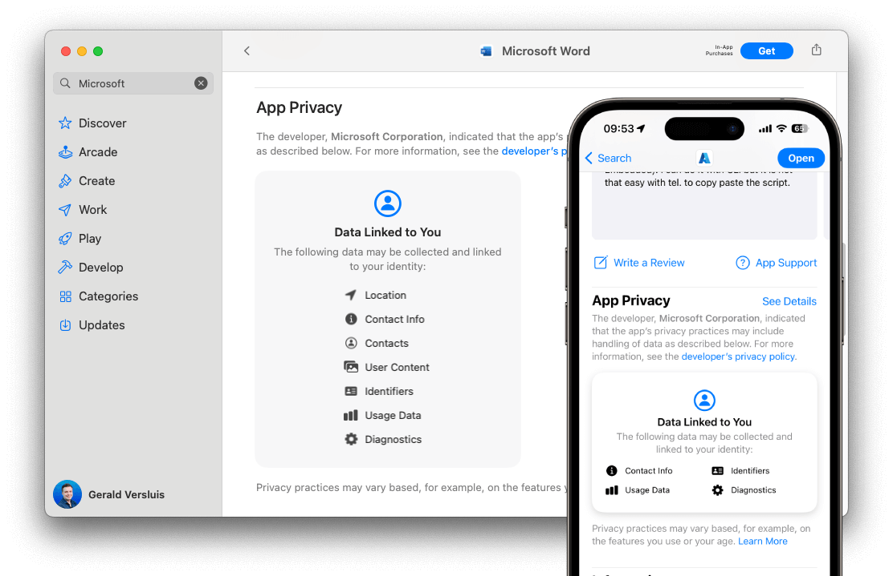

> ## 摘要
>
> 从 2024 年 5 月 1 日开始，苹果将开始在 App Store 发布的应用中强制执行其隐私声明。在这篇文章中，我们将描述如何为 .NET for iOS 和 .NET MAUI 应用导航此需求。
>
> 原文 [Adding Apple Privacy Manifest Support to .NET iOS & .NET MAUI apps - .NET Blog](https://devblogs.microsoft.com/dotnet/apple-privacy-manifest-support/)

---

2024年3月25日

苹果正在为 App Store 上针对 iOS、iPadOS 和 tvOS 平台的新应用和更新应用引入一项隐私政策，内容包括在应用中加入[隐私声明文件](https://developer.apple.com/documentation/bundleresources/privacy_manifest_files)。请注意，至少目前为止，macOS 应用被排除在外。

隐私声明文件（`PrivacyInfo.xcprivacy`）列出了您的 .NET MAUI 应用程序或任何第三方SDK和包收集的[数据类型](https://developer.apple.com/documentation/bundleresources/privacy_manifest_files/describing_data_use_in_privacy_manifests)，以及使用某些[必需理由API](https://developer.apple.com/documentation/bundleresources/privacy_manifest_files/describing_use_of_required_reason_api)分类的原因。

在撰写本文时，苹果已经开始发送关于在您的应用中包含此政策的通知。截至 2024 年 5 月 1 日，为了通过 App Store 审核，这将成为强制性需求。在这篇文章中，我们将看到为了保持您的 .NET MAUI、.NET for iOS 和 Xamarin 应用合规，并能够继续发布应用的更新，所需做的工作。

## 什么是苹果隐私声明？

几年前，苹果开始从您那里[收集信息](https://developer.apple.com/app-store/app-privacy-details/)，关于您在iOS应用中收集的数据以及您如何使用这些数据。这些信息随后会显示在您应用的 App Store 列表中，如下面的示例所示。



虽然这是向您的用户透明和保护他们隐私的重要一步，但作为应用开发者，您可能并不总是清楚您实际收集的数据是什么。您知道自己的应用收集了哪些数据以及如何处理这些数据，但很可能您正在使用第三方库，这些库可能会进行自己的处理。例如，通过使用 .NET MAUI 构建您的应用，您已经在使用可能需要在隐私报告中输入项的框架。

为了让隐私报告数据更加丰富，苹果正在通过引入苹果隐私声明进一步推进这一步。这个声明是另一个基于 XML 的元数据文件，应该包括在您的应用中，但库开发人员现在也应该在需要时包含一个在其库中。

这样，苹果可以将框架、库和您的应用中所有不同的 `PrivacyInfo.xcprivacy` 文件汇总为一个非常完整的隐私报告，然后在您应用的 App Store 列表上显示。

## 隐私声明和 .NET

这对您基于 .NET 的 iOS 应用意味着什么？您的 .NET MAUI 和 .NET for iOS 应用也需要包含一个隐私声明。幸运的是，这里不需要额外的支持，就像 .NET for iOS 和 .NET MAUI 应用一样。您可以使用今天拥有的工具和 SDK 完成所需的所有操作。

`PrivacyInfo.xcprivacy` 文件是一个 XML 格式的元数据文件，很像您可能已经知道的 `Info.plist` 文件。这个文件应该填充适用于您应用的隐私条目。目前需要在隐私声明中添加条目的 API 列表可以在 [.NET for iOS 仓库](https://github.com/xamarin/xamarin-macios/blob/main/docs/apple-privacy-manifest.md)中找到，以及何时在声明中添加哪个条目以及如何添加的详细说明。

### .NET 应用的最低隐私声明要求

根据您使用的 SDK，可能有三层可能使用[必需理由API](https://developer.apple.com/documentation/bundleresources/privacy_manifest_files/describing_use_of_required_reason_api)的地方：

- .NET 运行时和基类库 (BCL)
- .NET for iOS SDK
- .NET MAUI SDK

作为上述 SDK 的一部分，我们已经确定了这些 SDK 中使用的三个类别需要在隐私声明文件中加入：

- [文件时间戳 API](https://developer.apple.com/documentation/bundleresources/privacy_manifest_files/describing_use_of_required_reason_api#4278393)
- [系统启动时间 API](https://developer.apple.com/documentation/bundleresources/privacy_manifest_files/describing_use_of_required_reason_api#4278394)
- [磁盘空间 API](https://developer.apple.com/documentation/bundleresources/privacy_manifest_files/describing_use_of_required_reason_api#4278397)

因此，所有 .NET 应用都必须在隐私声明文件中包含上述类别。以下是构建基于 .NET 的 iOS 应用时 `PrivacyInfo.xcprivacy` 文件的内容。

请明确，运行在 iOS 上的所有基于 .NET 的应用程序，都至少需要以下声明。此外，您还应该识别您自己的代码中使用的 API 以及来自第三方库和框架的条目。

**注意：**以下内容仅适用于 .NET MAUI 版本 8.0.0 及更高版本。

```xml
<?xml version="1.0" encoding="UTF-8"?>
<!DOCTYPE plist PUBLIC "-//Apple//DTD PLIST 1.0//EN" "http://www.apple.com/DTDs/PropertyList-1.0.dtd">
<plist version="1.0">
<dict>
    <key>NSPrivacyAccessedAPIType</key>
    <string>NSPrivacyAccessedAPICategoryFileTimestamp</string>
    <key>NSPrivacyAccessedAPITypeReasons</key>
    <array>
        <string>C617.1</string>
    </array>
</dict>
<dict>
    <key>NSPrivacyAccessedAPIType</key>
    <string>NSPrivacyAccessedAPICategorySystemBootTime</string>
    <key>NSPrivacyAccessedAPITypeReasons</key>
    <array>
        <string>35F9.1</string>
    </array>
</dict>
<dict>
    <key>NSPrivacyAccessedAPIType</key>
    <string>NSPrivacyAccessedAPICategoryDiskSpace</string>
    <key>NSPrivacyAccessedAPITypeReasons</key>
    <array>
        <string>E174.1</string>
    </array>
</dict>
</plist>
```

要将此文件添加到您的 .NET for iOS 项目中，复制上述内容并将其粘贴到一个名为 `PrivacyInfo.xcprivacy` 的文件中，然后将该文件放在 `Resources` 文件夹下。这就是将该文件打包到 iOS 应用的根目录所需的全部操作。

对于 .NET MAUI 应用，复制上述内容并将其粘贴到一个名为 `PrivacyInfo.xcprivacy` 的文件中，然后将该文件放在 `Platforms/iOS` 文件夹下。然后使用您喜欢的文本编辑器编辑 .NET MAUI 项目 csproj 文件，并在 `<Project>` 节点下的某处添加以下部分。

```xml
<ItemGroup Condition="$([MSBuild]::GetTargetPlatformIdentifier('$(TargetFramework)')) == 'ios'">
    <BundleResource Include="Platforms\iOS\PrivacyInfo.xcprivacy" LogicalName="PrivacyInfo.xcprivacy" />
</ItemGroup>
```

这将确保 manifest 文件位于捆绑包的根目录。

有关隐私声明的更多信息以及您的应用可能需要哪些条目，请参阅 [Microsoft Learn 文档](https://learn.microsoft.com/dotnet/maui/ios/privacy-manifest)。

## Xamarin.iOS 和 Xamarin.Forms 的隐私声明

以上所有内容也适用于 Xamarin.iOS 和 Xamarin.Forms 应用。就像 .NET for iOS 和 .NET MAUI 应用一样，幸运的是这里不需要额外的支持，您今天就可以使用提供给您的工具和 SDK 完成所需的一切。

您可以创建一个 `PrivacyInfo.xcprivacy` 文件并将其包含在您的项目中，这应该满足 App Store 的要求。确保创建一个完整的隐私声明文件，其中包含描述您的应用所需的所有条目，并将其添加到您的项目中。

对于 Xamarin.iOS 项目和 Xamarin.Forms 项目，请确保将文件标记为捆绑资源（将构建操作设置为 BundleResource），这应该将其正确添加到结果二进制文件中。对于 Xamarin.Forms，只需要在您的 iOS 项目中添加 manifest 文件。

有关可能需要哪些条目以及如何将 `PrivacyInfo.xcprivacy` 文件添加到您的 Xamarin 项目的更多说明，可以在 [.NET for iOS 仓库](https://github.com/xamarin/xamarin-macios/blob/main/docs/apple-privacy-manifest.md)中找到。另外还有适用于 .NET MAUI 的 [Microsoft Learn 文档](https://learn.microsoft.com/dotnet/maui/ios/privacy-manifest)，同样也适用于 Xamarin，就隐私声明的外观而言。

## Mac Catalyst 和 macOS 应用

目前看来，包括 Mac Catalyst 在内的 macOS 应用似乎不需要为必需的理由 API 提供隐私声明条目。但是，如果您的应用或您在应用内使用的任何 SDK 正在收集个人数据，则仍需要一个声明文件和相关条目。请参阅 [苹果文档](https://developer.apple.com/documentation/bundleresources/privacy_manifest_files/describing_data_use_in_privacy_manifests)了解更多关于所需条目的信息。

将 `PrivacyInfo.xcprivacy` 文件添加到您的项目的过程与上述描述相同，但是您应该将文件放在 macOS 应用捆绑包的 `Contents/Resources/` 子文件夹下，而不是像 iOS 那样放在根目录下。

## 第三方库

请注意，最终作为应用开发者，您有责任提供适合您的应用的正确隐私声明，不管您使用的是任何库或框架。如果您不断收到 App Store 审核系统的警告，请确保您已经添加了涵盖您的应用代码的所有必要条目。

当您确定警告不是由您的应用代码触发时，请确保检查您可能正在使用的第三方库和框架，看它们是否需要包含必要的声明文件。

对于开源项目，您可以轻松地检查代码，看是否使用了需要在声明中加入条目的 API。请参阅 [Microsoft Learn](https://learn.microsoft.com/dotnet/maui/ios/privacy-manifest#required-reasons-api-use-in-net-maui) 获取需要在隐私声明中添加条目的 API 列表。

如果项目作者无法为其产品提供声明文件，您可以通过在自己的 `PrivacyInfo.xcprivacy` 文件中添加识别出的必需条目来解决这个问题。确保您了解 API 的用途和操作方式，以便在需要时可以自信地向用户传达这些信息。

### 您是库作者吗？

也许您自己是库的维护者，这种情况下，本博客文章和链接的文档也适用于您的项目。请确保为您的产品包含一个隐私声明。

如果您无法这样做，至少为您的用户提供所需条目，以便应用开发者可以轻松地将它们添加到他们的 `PrivacyInfo.xcprivacy` 文件中。

然而，我们强烈建议将声明包含在您的项目中，以简化您的用户生活。

## 验证添加声明

为了验证隐私声明是否正确添加，请将包含声明的应用提交给 App Store 进行审核。苹果系统将对提供的二进制文件进行一系列自动检查。如果有什么不正确，他们将发送一封电子邮件到您的苹果开发者账户注册的电子邮件地址。

如果您没有收到任何电子邮件，或者电子邮件没有特别提到隐私声明，您可以安全地假设它已被正确添加。

## 总结

请参考我们的[详细描述](https://learn.microsoft.com/dotnet/maui/ios/privacy-manifest)，确保您了解您的应用所需的内容。最终，您有责任向用户告知您如何处理他们的数据，并以正确的方式向苹果提供该信息。

为了确保您的应用发布不受影响，请从今天开始将此添加到您的应用中。通过在 2024 年 5 月 1 日截止日期之前做好这一点，您将确保在那之后可以继续发布您的应用。

请记住，作为开发者，您始终负责确保隐私声明是正确的、最新的，并且包含在您的应用中。在撰写本文时（2024年3月），我们已识别出需要在声明中添加条目的所有 API，但随着时间的推移，这些可能会发生变化。始终确保检查苹果文档以获取最新要求。

如果您有任何问题，请参考 [.NET for iOS 仓库](https://github.com/xamarin/xamarin-macios/issues/20059)上的这个[问题](https://github.com/xamarin/xamarin-macios/issues/20059)，以找到其他开发人员的经验和我们工程团队的问题回答。
