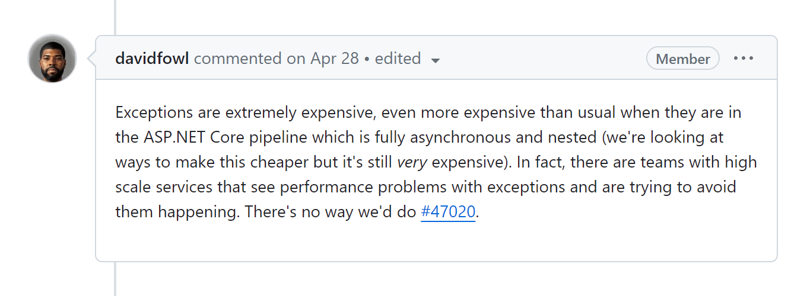

# ASP.NET Core 8中的全局错误处理

> ## 摘要
>
> 异常用于处理异常情况。但它们在您的应用程序中不可避免地会发生，您需要处理这些异常。您可以实现全局异常处理机制或只处理特定的异常。ASP.NET Core为您提供了几种实现这一点的选项。那么您应该选择哪一种呢？今天，我想向您展示在ASP.NET Core 8中处理异常的旧方法和新方法。
>
> 原文 [Global Error Handling in ASP.NET Core 8](https://www.milanjovanovic.tech/blog/global-error-handling-in-aspnetcore-8?utm_source=Twitter&utm_medium=social&utm_campaign=18.03.2024) 由 [Milan Jovanović](https://www.milanjovanovic.tech/) 发表。

---

异常用于处理异常情况。我甚至写过[**完全避免异常。**](https://www.milanjovanovic.tech/blog/functional-error-handling-in-dotnet-with-the-result-pattern)

但它们在您的应用程序中不可避免地会发生，您需要处理它们。

您可以实现全局异常处理机制或只处理特定的异常。

ASP.NET Core为您提供了几种实现这一点的选项。那么您应该选择哪一种呢？

今天，我想向您展示ASP.NET Core 8中处理异常的*旧*方法和*新*方法。

## [旧方法：异常处理中间件](https://www.milanjovanovic.tech/blog/global-error-handling-in-aspnetcore-8?utm_source=Twitter&utm_medium=social&utm_campaign=18.03.2024#old-way-exception-handling-midleware)

在ASP.NET Core中实现异常处理的标准是使用中间件。中间件允许您在执行HTTP请求之前或之后引入逻辑。您可以轻松扩展这一点来实现异常处理。在中间件中添加`try-catch`语句并返回错误HTTP响应。

在ASP.NET Core中有[**3种创建中间件的方式**](https://www.milanjovanovic.tech/blog/3-ways-to-create-middleware-in-asp-net-core)：

- 使用[**请求委托**](https://www.milanjovanovic.tech/blog/3-ways-to-create-middleware-in-asp-net-core#adding-middleware-with-request-delegates)
- 通过[**约定**](https://www.milanjovanovic.tech/blog/3-ways-to-create-middleware-in-asp-net-core#adding-middleware-by-convention)
- [`IMiddleware`](https://www.milanjovanovic.tech/blog/3-ways-to-create-middleware-in-asp-net-core#adding-factory-based-middleware)

基于约定的方法要求您定义一个`InvokeAsync`方法。

这是一个按约定定义的`ExceptionHandlingMiddleware`：

```csharp
public class ExceptionHandlingMiddleware
{
    private readonly RequestDelegate _next;
    private readonly ILogger<ExceptionHandlingMiddleware> _logger;

    public ExceptionHandlingMiddleware(
        RequestDelegate next,
        ILogger<ExceptionHandlingMiddleware> logger)
    {
        _next = next;
        _logger = logger;
    }

    public async Task InvokeAsync(HttpContext context)
    {
        try
        {
            await _next(context);
        }
        catch (Exception exception)
        {
            _logger.LogError(
                exception, "Exception occurred: {Message}", exception.Message);

            var problemDetails = new ProblemDetails
            {
                Status = StatusCodes.Status500InternalServerError,
                Title = "Server Error"
            };

            context.Response.StatusCode =
                StatusCodes.Status500InternalServerError;

            await context.Response.WriteAsJsonAsync(problemDetails);
        }
    }
}
```

`ExceptionHandlingMiddleware`会捕获任何未处理的异常并返回一个[Problem Details](https://www.rfc-editor.org/rfc/rfc7807.html)响应。您可以决定要向调用者返回多少信息。在此示例中，我隐藏了异常详情。

您还需要将此中间件添加到ASP.NET Core请求管道中：

```csharp
app.UseMiddleware<ExceptionHandlingMiddleware>();
```

## [新方法：IExceptionHandler](https://www.milanjovanovic.tech/blog/global-error-handling-in-aspnetcore-8?utm_source=Twitter&utm_medium=social&utm_campaign=18.03.2024#new-way-iexceptionhandler)

[ASP.NET Core 8](https://learn.microsoft.com/en-us/aspnet/core/introduction-to-aspnet-core?view=aspnetcore-8.0)引入了一个新的[`IExceptionHandler`](https://learn.microsoft.com/en-us/dotnet/api/microsoft.aspnetcore.diagnostics.iexceptionhandler?view=aspnetcore-8.0)抽象，用于管理异常。内置的异常处理中间件使用`IExceptionHandler`实现来处理异常。

这个接口只有一个`TryHandleAsync`方法。

`TryHandleAsync`尝试在ASP.NET Core管道中处理指定的异常。如果异常可以被处理，它应该返回`true`。如果异常无法处理，它应该返回`false`。这允许您为不同的场景实现自定义异常处理逻辑。

这是一个`GlobalExceptionHandler`实现：

```csharp
internal sealed class GlobalExceptionHandler : IExceptionHandler
{
    private readonly ILogger<GlobalExceptionHandler> _logger;

    public GlobalExceptionHandler(ILogger<GlobalExceptionHandler> logger)
    {
        _logger = logger;
    }

    public async ValueTask<bool> TryHandleAsync(
        HttpContext httpContext,
        Exception exception,
        CancellationToken cancellationToken)
    {
        _logger.LogError(
            exception, "Exception occurred: {Message}", exception.Message);

        var problemDetails = new ProblemDetails
        {
            Status = StatusCodes.Status500InternalServerError,
            Title = "Server error"
        };

        httpContext.Response.StatusCode = problemDetails.Status.Value;

        await httpContext.Response
            .WriteAsJsonAsync(problemDetails, cancellationToken);

        return true;
    }
}
```

## [配置IExceptionHandler实现](https://www.milanjovanovic.tech/blog/global-error-handling-in-aspnetcore-8?utm_source=Twitter&utm_medium=social&utm_campaign=18.03.2024#configuring-iexceptionhandler-implementations)

您需要两件事来将`IExceptionHandler`实现添加到ASP.NET Core请求管道中：

1.  使用依赖注入注册`IExceptionHandler`服务
2.  在请求管道中注册[`ExceptionHandlerMiddleware`](https://learn.microsoft.com/en-us/dotnet/api/microsoft.aspnetcore.diagnostics.exceptionhandlermiddleware?view=aspnetcore-8.0)

您调用`AddExceptionHandler`方法来注册`GlobalExceptionHandler`作为服务。它被注册为[**单例生命周期**](https://www.milanjovanovic.tech/blog/improving-aspnetcore-dependency-injection-with-scrutor)。因此，请小心注入具有不同生命周期的服务。

我也在调用`AddProblemDetails`来为常见异常生成[Problem Details](https://www.rfc-editor.org/rfc/rfc7807.html)响应。

```csharp
builder.Services.AddExceptionHandler<GlobalExceptionHandler>(); builder.Services.AddProblemDetails();
```

您还需要调用`UseExceptionHandler`将`ExceptionHandlerMiddleware`添加到请求管道中：

```csharp
app.UseExceptionHandler();
```

## [链接异常处理器](https://www.milanjovanovic.tech/blog/global-error-handling-in-aspnetcore-8?utm_source=Twitter&utm_medium=social&utm_campaign=18.03.2024#chaining-exception-handlers)

您可以添加多个`IExceptionHandler`实现，并按照注册的顺序调用它们。这可能的用例是使用异常进行流程控制。

您可以定义像`BadRequestException`和`NotFoundException`这样的自定义异常。它们对应于您将从API返回的HTTP状态码。

这是一个`BadRequestExceptionHandler`实现：

```csharp
internal sealed class BadRequestExceptionHandler : IExceptionHandler
{
    private readonly ILogger<BadRequestExceptionHandler> _logger;

    public GlobalExceptionHandler(ILogger<BadRequestExceptionHandler> logger)
    {
        _logger = logger;
    }

    public async ValueTask<bool> TryHandleAsync(
        HttpContext httpContext,
        Exception exception,
        CancellationToken cancellationToken)
    {
        if (exception is not BadRequestException badRequestException)
        {
            return false;
        }

        _logger.LogError(
            badRequestException,
            "Exception occurred: {Message}",
            badRequestException.Message);

        var problemDetails = new ProblemDetails
        {
            Status = StatusCodes.Status400BadRequest,
            Title = "Bad Request",
            Detail = badRequestException.Message
        };

        httpContext.Response.StatusCode = problemDetails.Status.Value;

        await httpContext.Response
            .WriteAsJsonAsync(problemDetails, cancellationToken);

        return true;
    }
}
```

这是一个`NotFoundExceptionHandler`实现：

```csharp
internal sealed class NotFoundExceptionHandler : IExceptionHandler
{
    private readonly ILogger<NotFoundExceptionHandler> _logger;

    public GlobalExceptionHandler(ILogger<NotFoundExceptionHandler> logger)
    {
        _logger = logger;
    }

    public async ValueTask<bool> TryHandleAsync(
        HttpContext httpContext,
        Exception exception,
        CancellationToken cancellationToken)
    {
        if (exception is not NotFoundException notFoundException)
        {
            return false;
        }

        _logger.LogError(
            notFoundException,
            "Exception occurred: {Message}",
            notFoundException.Message);

        var problemDetails = new ProblemDetails
        {
            Status = StatusCodes.Status404NotFound,
            Title = "Not Found",
            Detail = notFoundException.Message
        };

        httpContext.Response.StatusCode = problemDetails.Status.Value;

        await httpContext.Response
            .WriteAsJsonAsync(problemDetails, cancellationToken);

        return true;
    }
}
```

您还需要通过调用`AddExceptionHandler`来注册这两个异常处理器：

```csharp
builder.Services.AddExceptionHandler<BadRequestExceptionHandler>(); builder.Services.AddExceptionHandler<NotFoundExceptionHandler>();
```

`BadRequestExceptionHandler`将首先执行并尝试处理异常。如果异常未被处理，`NotFoundExceptionHandler`将接着执行并尝试处理异常。

## [要点](https://www.milanjovanovic.tech/blog/global-error-handling-in-aspnetcore-8?utm_source=Twitter&utm_medium=social&utm_campaign=18.03.2024#takeaway)

在ASP.NET Core中使用中间件进行异常处理是一个很好的解决方案。不过，使用`IExceptionHandler`接口的新选项也很棒。我会在ASP.NET Core 8项目中使用新方法。

我非常反对使用异常进行流程控制。当您无法继续正常应用程序执行时，异常是最后的手段。[**结果模式**](https://www.milanjovanovic.tech/blog/functional-error-handling-in-dotnet-with-the-result-pattern)是一个更好的替代方案。

正如David Fowler所指出，异常也是[极其昂贵的](https://github.com/dotnet/aspnetcore/issues/46280#issuecomment-1527898867)：



如果您想在您的代码中摆脱异常，[**请查看这个视频。**](https://youtu.be/WCCkEe_Hy2Y)

感谢阅读，保持卓越！

---
