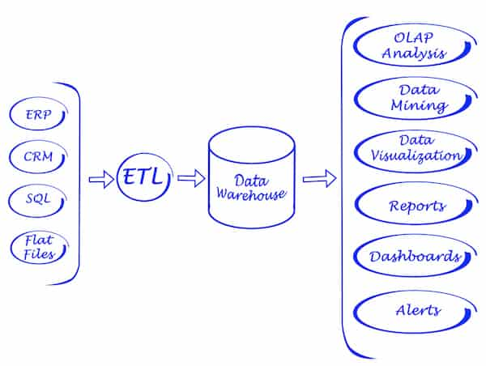
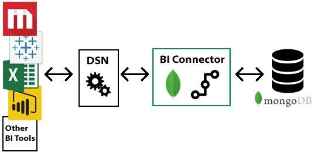
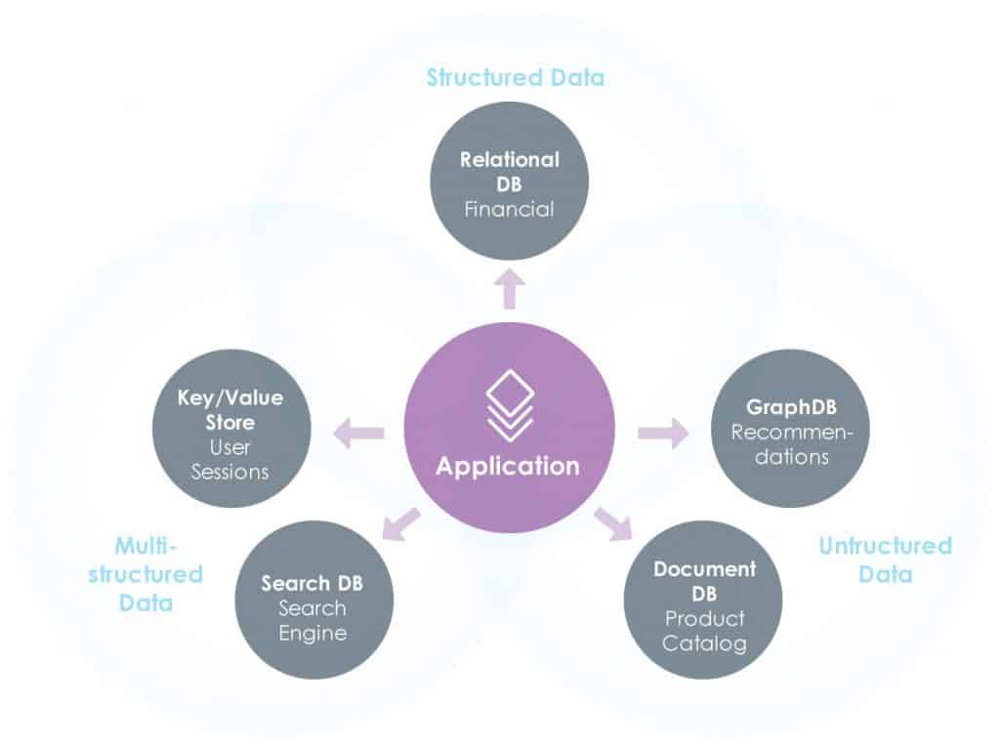

> ## 摘要
>
> MongoDB与SQL数据库是后端世界的两个对立面。每种都有其优点和缺点，适用于不同类型的用途。点击这里获取完整概览！
>
> 原文 [MongoDB Vs SQL - A Deep Dive](https://www.knowi.com/blog/mongodb-vs-sql/) 由 Jay Gopalakrishnan 撰写。

---

MongoDB和SQL数据库是后端世界中两个极端。前者处理混乱的非结构化数据，而后者处理组织有序的结构化数据。这两个世界各有其优点和缺点，适用于不同类型的用例。在本文中，我们将深入比较MongoDB与SQL数据库（准确来说是MySQL数据库）之间的差异，并将讨论如何进行类似于其SQL对等体上的 [MongoDB 分析](https://www.knowi.com/mongodb-analytics) 这一重要话题。

## MongoDB vs MySQL

正如我们所讨论的，我们将比较MongoDB与MySQL，后者是一种众所周知的SQL数据库，我们的大多数读者对它都很熟悉。但我们的比较也可以适用于其他任何SQL数据库，如Oracle、MS SQL Server、PostgreSQL等。[MySQL 分析](https://www.knowi.com/mysql) 非常常见，因此它是查看如何在Mongo上进行分析的一个很好的参考点。

### 历史

MongoDB属于NoSQL数据库家族，用于以JSON格式存储非结构化文档。它于2009年首次发布，并自那以后成为NoSQL领域中的领先数据库之一。

MongoDB总部

MySQL是一个开源的SQL关系数据库，用于以类似表的格式存储结构化数据。它于1995年首次发布，现在由Oracle管理。由于它是免费的，它已经成为需求中非常受欢迎的SQL数据库选择。

### SQL vs NoSQL的范式

SQL数据库，也称为关系数据库，旨在存储具有结构化模式的数据。模式代表数据库的设计，数据应符合该设计。在一个结构化模式中，数据以行列格式保存，在称为*表*的地方，并可以使用结构化查询语言（SQL）格式化的查询进行检索。

SQL关系数据库是直到2000年代互联网和Web 2.0热潮开始产生大量非结构化数据之前唯一可行的商业数据存储解决方案。这样的非结构化数据无法正确映射到类似表的模式中，因此出现了支持此类非结构化数据的不同类别数据库的需求。

这就是NoSQL数据库开始出现的时候。这些新数据库需要支持这种不同类型的数据，这种数据是非结构化的，不适合模式；数据如键值存储、文档、文本、图形和宽列。例如，MongoDB主要支持非结构化文档。

非结构化数据的积累是朝着大数据时代方向迈出的一大步，但另一方面，由于存储的数据是非结构化的，使用SQL查询这些数据就变得不可能。直到这一点，SQL是查询和分析的标准，并为开发人员所熟知。我们稍后会再讨论这一点。

### 数据存储方式

在MySQL中，数据存储在*表*中，其中列表示属性，行表示特定记录。这些表反过来又位于数据库中。在MongoDB中，数据存储在*集合*中，与MySQL表类似。一个集合可以包含许多文档，其中数据以键值的JSON格式存储。MongoDB数据库中可以有数百个此类集合。

SQL数据库具有关系属性，其中不同的表通过外键、主键彼此相关。例如，*EmployeeID*列，它将是*Employee*表的主键，将作为*支付*表中的*外键*出现，从而将两个表通过引用属性连接起来。这种关系确保不存在未在主*Employee*表中提供详细信息的员工的支付条目。这就是为什么像MySQL这样的SQL数据库也被称为关系数据库的原因。

另一方面，在MongoDB中，我们无法在集合的非结构化数据之间建立这样的关系。因此，它被认为是非关系数据库。

像MySQL这样的SQL数据库的架构受到ACID属性原则的支配。

ACID代表原子性、一致性、隔离性和持久性。这些属性专注于数据库中完成的事务的一致性和可靠性。

MongoDB是基于CAP定理构建的，该定理专注于一致性、可用性和分区。与SQL数据库的ACID属性不同，CAP定理专注于MongoDB中数据的可用性。

总之，SQL数据库保障了事务的可靠性，而MongoDB确保了数据的高可用性。

### 可扩展性

MySQL数据库或一般的SQL数据库，只能通过增加内存大小、磁盘空间或服务器的计算能力来进行垂直扩展。垂直扩展可能会非常昂贵，对于具有高查询量的大型数据库来说，成本迅速增长。

NoSQL数据库，如MongoDB支持水平扩展，也称为分片。在这种情况下，不是增加服务器配置，而是增加一个新服务器用于扩展目的。这种方法通常较为经济，因为一组低成本的商品硬件可以共同满足以经济高效的方式支持高查询量的要求。

### 可靠性和可用性

可靠性和可用性是衡量任何数据库系统健壮性的关键指标。大多数SQL数据库最初是为单台服务器设计的。为了降低故障风险，它们的架构转向分布式数据库，其中数据库在一组节点上运行，从而增加了弹性。即使集群中的一个节点宕机，数据库仍然可以在其他节点上运行。

NoSQL数据库，如MongoDB最初就是在考虑到弹性的情况下设计的。它在一组商品硬件上运行，并在节点之间复制数据以确保高可靠性和可用性。与SQL数据库不同，MongoDB架构的可靠性和可用性是内置特性，而不是事后考虑。因此，MongoDB中的自动故障转移更加迅速且复杂性更低，与MySQL和其他SQL数据库相比。

### 模式

MySQL数据库，像任何其他SQL数据库一样，有一个预定义的模式，数据必须符合该模式。例如，创建表时必须定义列的数量及其数据类型。保存在表中的任何数据都必须匹配表结构，否则将给出错误。

另一方面，在MongoDB中，不需要预先定义任何模式。一个集合可以存储不同类型的文档而不会有任何问题。如果出现新类型的文档，可以轻松保存。

由于大多数互联网应用和物联网设备生成的数据是非结构化的，MongoDB模式的动态性非常有用，这些数据无法保存在传统的SQL数据库中。

此外，许多公司会在他们知道如何以后使用这些数据之前存储数据。这在移动应用存储日志数据和用户活动时很常见。随着公司将应用程序推向市场，他们在没有最终目标的情况下收集数据。稍后，他们可能会发现这些数据为他们提供了有价值的信息，说明需要添加哪些功能。对于非结构化数据库来说，这种未计划的数据收集更容易，因为不需要提前定义模式。

### 查询和分析

MySQL数据库可以借助结构化查询语言或SQL进行查询。实际上，MySQL遵循ANSI SQL标准，这是几乎所有关系数据库（如Oracle、PostgreSQL、Sybase等）采用的通用SQL标准。

SQL查询对开发人员友好并且已经确立。SQL还可以用于执行高级分析功能，如过滤器、连接、合并和数据聚合等。这使得SQL成为执行高级分析的强大选择。

MongoDB不支持MySQL那样的传统SQL查询。然而，MongoDB确实支持文档查询，但该功能开发不足且受限 - 尤其是与SQL相比。例如，MongoDB查询不支持连接，这是派生多个数据来源信息的关键操作。

因此，MongoDB适用于存储非结构化数据，但它不提供成熟的查询语言来执行高级分析。这对许多商业用例来说似乎是一个交易破坏者，但幸运的是，有一些选择。

## MongoDB和MySQL之间的主要区别

|                | MongoDB                    | MySQL                            |
| -------------- | -------------------------- | -------------------------------- |
| 范式           | NoSQL，支持非结构化数据    | SQL，支持具有模式的结构化数据    |
| 数据存储       | 包含JSON文档的集合         | 带有行和列的表                   |
| 关系           | 不支持表关系               | 支持外键和主键的关系             |
| 数据模型       | 非关系型                   | 关系型                           |
| 可扩展性       | 支持水平扩展（分片）       | 支持垂直扩展                     |
| 可靠性和可用性 | 构建为弹性和可用性         | 架构转向分布式数据库以提高可靠性 |
| 模式           | 无预定义模式，动态结构     | 需要预定义的模式以确保数据结构   |
| 查询语言       | 有限的文档查询，不支持连接 | 使用SQL进行查询和高级分析功能    |

## MongoDB和MySQL之间的选择

- MongoDB 通常用于需要快速迭代、处理大规模数据集、以及数据模式可能会随时间变化的应用，如`大数据应用`、`内容管理系统`等。
- SQL Server 适用于需要复杂查询、事务完整性和数据一致性的应用，如`金融服务`、`ERP` 系统等。

## 我需要对 [MongoDB数据进行分析](https://knowi.com/mongodb-analytics): 我有哪些选择？

MongoDB中存储大量非结构化文档数据的便利性对许多用例来说是一个重要因素。这就是为什么尽管MongoDB的查询支持有限，行业仍然发展出来创造多种解决方案来支持MongoDB上的高级分析。以下是一些不错的选择。

### 选项1：将MongoDB数据导入SQL数据仓库

如果我们无法在MongoDB上执行分析，我们可以将数据加载到SQL数据仓库中，然后在那里运行熟悉的SQL查询进行分析。为此，我们可以编写自定义批处理ETL过程，或使用Panoply或Xplenty等工具。

ETL到数据仓库解决方案的示意图

这是一个已为许多公司效力良好的强大方法，但它确实有一些局限性。尽管它满足目的，但它带来了构建和维护数据仓库的额外开销，更不用说为ETL或ELT过程支付的成本了。

如果你的一些MongoDB数据不适合SQL模式怎么办？在许多情况下，那些数据将被丢弃。

数据仓库可能是大企业的一个好解决方案，但如果你是一家小公司或年轻的初创公司，你可能不愿意投资于数据仓库。即使数据仓库是公司大部分数据的合适选择，但如果你的某些数据有更严格的处理要求或受到限制性规定的约束，可能需要将其保留在数据仓库之外。如果你需要对外部数据集进行快速的实验分析，而你既不能也不想将其移到你的数据仓库中，也可能会出现问题。

**收获：**数据仓库是一个很好的选择，但可能带来一些开销和限制。它们还可以通过迫使你为数据分配一个关系模式，从而消除使用NoSQL数据库的好处。

### 选项2：MongoDB BI连接器

MongoDB意识到他们也必须为MongoDB分析提供一些选择。因此，他们推出了MongoDB BI连接器，它可以与流行的商业智能工具如Tableau、Cognos、Qlik等配合使用。该连接器充当BI工具和MongoDB之间的中间接口，将SQL查询转换为MongoDB查询，并在将结果传递给BI工具时将结果转换回SQL格式。

MongoDB BI连接器确实比我们上面讨论的列表中的其他选项更简单。使用MongoDB BI连接器可以节省构建数据仓库或用于MongoDB分析的自定义Python应用程序的开销。

这里仍然存在一个缺点，如果你想在MongoDB数据和MySQL数据或任何其他SQL数据之间进行连接怎么办。一种选择是将MongoDB数据导入MySQL数据库，然后在那里执行分析。但这本质上让我们回到了我们上面讨论过的数据仓库选项和相关的开销。

将数据导入结构化数据仓库所需的BI连接器管道图解

**收获：**如果你想将你现有的BI工具与MongoDB连接起来，MongoDB BI连接器是一个不错的选择，但它遭受了你无法从多个异质性数据来源连接数据的缺点。

### 选项3：使用Knowi进行数据虚拟化

数据虚拟化是一个过程，其中应用程序可以从多个源访问数据，并通过抽象底层技术细节来呈现给前端用户。这意味着用户将从多个数据源获得一致的数据视图和无缝体验。

[Knowi](https://www.knowi.com/) 建立在数据虚拟化之上，正是这样做的。它可以本地连接到MongoDB，并提供与在SQL数据库上运行SQL查询相同的用户体验。

此外，它还可以从多个异构源无缝地连接数据。这意味着，如果我们想将MongoDB数据与MySQL数据结合起来，只需提供这两个源和连接字段即可实现。另一个值得注意的特性是，Knowi内部也支持原生MongoDB查询。

数据虚拟化平台如何直接连接到包括MongoDB在内的各种数据源的示意图

**要点：** 与列表中的其他选项相比，如果您正在寻找在MongoDB数据上执行高级分析的轻量级和无缝体验，数据虚拟化是最佳选项。如果您有多个数据源并且需要进行跨数据库连接，或者您只是需要在扩展时保持灵活的数据基础结构，这是一个极佳的选项。

### 选项4：使用Python和PyMongo进行自定义编码

铁杆Python粉丝将会很高兴知道这可以通过Python完成

另一个选项是构建一个自定义的Python应用程序来连接到MongoDB，从中获取数据并对其进行分析。PyMango是一个用于 Python 的MongoDB驱动程序，以实现此目的。实际上，使用PyMongo，我们不仅可以获取MongoDB数据，还可以将数据写回MongoDB。

与数据仓库相比，这可以是一个好选择，并且在探索性数据分析中会表现出色，但对于商业应用来说可能并不总是合适的选择。

**要点：** 除非您特别需要一个轻量级的自定义解决方案，可以轻松用于探索性数据分析，否则您可能仍然想考虑数据仓库或BI解决方案。

### 选项5：转换

最后一个选项是将SQL查询转换为MongoDB查询。这与MongoDB连接器做的非常类似，但是作为第三方实现完成。Dremio 团队在构建试图解决这一问题的转换引擎方面做得很好。转换系统允许您编写出SQL查询，解释它们，并将它们重新格式化为NoSQL查询。这对于一些简单的用例来说是一个好选项，但对于需要跨数据库连接等更复杂的应用来说可能会遇到问题。它还引入了可能对高吞吐量分析造成问题的延迟。然而，如果您的用例相对简单，并且您预见不会在未来变得更复杂，转换可能是一个很好的选项。

**要点：** 如果您需要在单个数据库源上处理简单的分析查询，这个选项是不错的。

## 结论

在这篇文章中，我们进行了MongoDB与SQL数据库之间的全面比较，并探讨了在MongoDB数据上执行分析的各种选项。让我们下面总结我们的讨论。

- SQL数据库用于存储结构化数据，而像MongoDB这样的NoSQL数据库用于保存非结构化数据。
- MongoDB用于以JSON格式保存非结构化数据。
- MongoDB不支持SQL数据库支持的高级分析和连接。
- 有许多支持MongoDB分析的好解决方案，包括：数据虚拟化、转换、MongoDB连接器，以及使用ETL或ELT过程的数据仓库。
