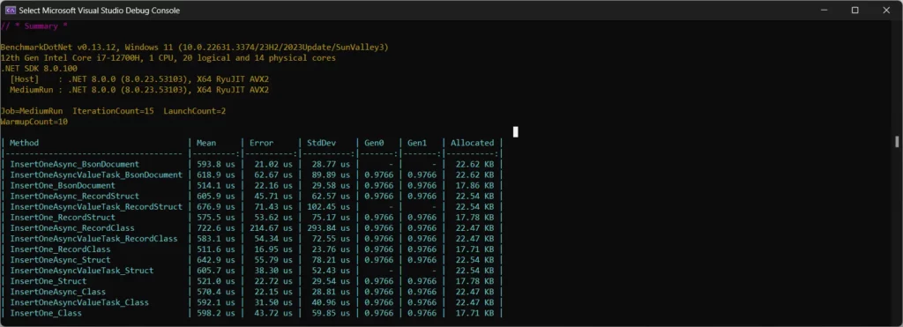

> ## 摘要
>
> 对C# MongoDB插入基准测试感到好奇吗？在这篇文章中，我将向你展示BenchmarkDotNet代码及多种插入数据变体的结果！
>
> 原文 [C# MongoDB Insert Benchmarks – What You Need To Know](https://www.devleader.ca/2024/03/28/c-mongodb-insert-benchmarks-what-you-need-to-know/)

---

在之前的文章中，我解释了如何[使用C#和MongoDB插入记录](https://www.devleader.ca/2024/03/22/mongodb-in-c-simplified-guide-for-inserting-data/ "MongoDB in C#: 简化插入数据指南")。但我们开始探索MongoDB时，覆盖了很多基础知识，我想开始研究更有趣的方面，关于我们如何将这些东西一起使用。当我将所有这些主题的视频内容整合在一起时，一个引起我的注意的点是通用方法与操作BsonDocument的方法，我很好奇性能是否有所不同。所以首先，我认为我们应该看看C# MongoDB插入基准测试，看看是否有任何有趣的模式突显出来。

---

## 这些C# MongoDB基准测试的考虑因素

我前几天在Twitter上和[David Callan](https://twitter.com/Dave_DotNet "Dave Callan - Twitter")聊天，他经常在社交媒体上发布关于基准测试的信息。原来还有另一个在Twitter-verse中流传的讨论，讨论的是同步调用与异步调用数据库的对比。提议说对于非常快速的DB查询，异步变体确实较慢。

当然，这启动了我的思考。我整个星期都在写关于MongoDB in C#的文章和制作视频，并暗示即将公布性能基准测试。这与我与Dave的对话以及我在Twitter上看到的讨论结合在一起，让我觉得我必须更加关注这个问题。我推测这可能与Task与ValueTask有关，但我并没有很多依据。

然而，我最初想研究这些基准测试是因为我好奇使用BsonDocument与专用DTO（无论是结构体、类还是记录变体）相比，会有不同的性能特征。

这意味着我会想确保我涵盖了一个矩阵跨越：

- 同步
- 异步
- 异步与ValueTask
- 结构体
- 类
- 记录结构体
- 记录类
- BsonDocument

有了这个，我就开始编写一些超级简单的基准测试！让我们来看看。

---

## C# MongoDB插入基准测试代码

正如我们在C#中所做的所有[基准测试，BenchmarkDotNet是我们的首选工具](https://www.devleader.ca/2023/09/18/dotnet-benchmarks-how-to-use-benchmarkdotnet-for-beginners/ "dotnet基准测试 - 如何为初学者使用BenchmarkDotNet")！确保你首先安装了BenchmarkDotNet NuGet包。我们将使用它来确保我们的MongoDB基准测试具有一致的设置、预热、运行和报告。

由于我们尝试尽可能减少这些基准测试中可能的外部因素，我们将使用Testcontainers在Docker容器中运行MongoDB实例。当然，通过与我们的代码直接之外的任何东西交互，存在不一致的可能性，以及我们的结果中出现更多错误的空间。然而，这应该有助于最小化这些因素。你还会想要Testcontainers.MongoDB NuGet包。

你可以[在GitHub上找到所有相关的代码](https://github.com/ncosentino/DevLeader/tree/master/MongoDBExamples/MongoDBExamples.Benchmarks "Dev Leader - GitHub")，但我们从入口点开始的代码如下：

```csharp
using BenchmarkDotNet.Running;

using System.Reflection;

BenchmarkRunner.Run(
    Assembly.GetExecutingAssembly(),
    args: args);
```

很简单就为了开始基准测试。这里最重要的部分是基准测试：

```csharp
using BenchmarkDotNet.Attributes;

using MongoDB.Bson;
using MongoDB.Driver;

using Testcontainers.MongoDb;

[MemoryDiagnoser]
//[ShortRunJob]
[MediumRunJob]
public class InsertBenchmarks
{
    private MongoDbContainer? _container;
    private MongoClient? _mongoClient;
    private IMongoCollection&lt;BsonDocument&gt;? _collection;
    private IMongoCollection&lt;RecordStructDto&gt;? _collectionRecordStruct;
    private IMongoCollection&lt;RecordClassDto&gt;? _collectionRecordClass;
    private IMongoCollection&lt;StructDto&gt;? _collectionStruct;
    private IMongoCollection&lt;ClassDto&gt;? _collectionClass;

    [GlobalSetup]
    public async Task SetupAsync()
    {
        _container = new MongoDbBuilder()
            .WithImage("mongo:latest")
            .Build();
        await _container.StartAsync();

        _mongoClient = new MongoClient(_container.GetConnectionString());
        var database = _mongoClient.GetDatabase("test");
        _collection = database.GetCollection&lt;BsonDocument&gt;("test");
        _collectionRecordStruct = database.GetCollection&lt;RecordStructDto&gt;("test");
        _collectionRecordClass = database.GetCollection&lt;RecordClassDto&gt;("test");
        _collectionStruct = database.GetCollection&lt;StructDto&gt;("test");
        _collectionClass = database.GetCollection&lt;ClassDto&gt;("test");
    }

    [GlobalCleanup]
    public async Task CleanupAsync()
    {
        await _container!.StopAsync();
    }

    [Benchmark]
    public async Task InsertOneAsync_BsonDocument()
    {
        await _collection!.InsertOneAsync(new BsonDocument()
        {
            ["Name"] = "Nick Cosentino",
        });
    }

    [Benchmark]
    public async ValueTask InsertOneAsyncValueTask_BsonDocument()
    {
        await _collection!.InsertOneAsync(new BsonDocument()
        {
            ["Name"] = "Nick Cosentino",
        });
    }

    [Benchmark]
    public void InsertOne_BsonDocument()
    {
        _collection!.InsertOne(new BsonDocument()
        {
            ["Name"] = "Nick Cosentino",
        });
    }

    [Benchmark]
    public async Task InsertOneAsync_RecordStruct()
    {
        await _collectionRecordStruct!.InsertOneAsync(new RecordStructDto("Nick Cosentino"));
    }

    [Benchmark]
    public async ValueTask InsertOneAsyncValueTask_RecordStruct()
    {
        await _collectionRecordStruct!.InsertOneAsync(new RecordStructDto("Nick Cosentino"));
    }

    [Benchmark]
    public void InsertOne_RecordStruct()
    {
        _collectionRecordStruct!.InsertOne(new RecordStructDto("Nick Cosentino"));
    }

    [Benchmark]
    public async Task InsertOneAsync_RecordClass()
    {
        await _collectionRecordClass!.InsertOneAsync(new RecordClassDto("Nick Cosentino"));
    }

    [Benchmark]
    public async ValueTask InsertOneAsyncValueTask_RecordClass()
    {
        await _collectionRecordClass!.InsertOneAsync(new RecordClassDto("Nick Cosentino"));
    }

    [Benchmark]
    public void InsertOne_RecordClass()
    {
        _collectionRecordClass!.InsertOne(new RecordClassDto("Nick Cosentino"));
    }

    [Benchmark]
    public async Task InsertOneAsync_Struct()
    {
        await _collectionStruct!.InsertOneAsync(new StructDto() { Name = "Nick Cosentino" });
    }

    [Benchmark]
    public async ValueTask InsertOneAsyncValueTask_Struct()
    {
        await _collectionStruct!.InsertOneAsync(new StructDto() { Name = "Nick Cosentino" });
    }

    [Benchmark]
    public void InsertOne_Struct()
    {
        _collectionStruct!.InsertOne(new StructDto() { Name = "Nick Cosentino" });
    }

    [Benchmark]
    public async Task InsertOneAsync_Class()
    {
        await _collectionClass!.InsertOneAsync(new ClassDto() { Name = "Nick Cosentino" });
    }

    [Benchmark]
    public async ValueTask InsertOneAsyncValueTask_Class()
    {
        await _collectionClass!.InsertOneAsync(new ClassDto() { Name = "Nick Cosentino" });
    }

    [Benchmark]
    public void InsertOne_Class()
    {
        _collectionClass!.InsertOne(new ClassDto() { Name = "Nick Cosentino" });
    }

    private record struct RecordStructDto(string Name);

    private record class RecordClassDto(string Name);

    private struct StructDto
    {
        public string Name { get; set; }
    }

    private class ClassDto
    {
        public string Name { get; set; }
    }
}
```

对于基准测试来说，我们尽可能多地将我们不感兴趣的部分拉出到GlobalSetup和GlobalCleanup标记的方法中。

---

## C# MongoDB插入基准测试结果

准备好鼓掌了吗！是时候看看我们的MongoDB基准测试结果并进行一些分析了：



以下是我从上述基准测试数据中得出的结论：

- 所有异步变体相比于我们必须使用的普通方法版本使用了大约5KB更多的内存。
- 对于异步和异步value task，看起来在分配的内存上没有任何区别，但对于\*某些\*ValueTask基准测试，Gen0和Gen1没有任何值 — 然而，并非对所有基准测试都是这样。看起来像是ValueTask结合了结构体数据类型用于插入，结果在Gen0和Gen1没有值，但普通的BsonDocument是此规律的例外。
- 最快速和内存占用最低似乎是InsertOne_RecordClass，尽管InsertOne_BsonDocument只比这个慢了几微秒。
- 横向对比，基准测试的异步版本似乎普遍比它们的普通版本慢

这与一些开头从Twitter上对异步操作的思考是非常一致的！因此，一些假设被证明/推翻：

- 对于非常快速的DB操作，异步\*的确\*整体较差
- ValueTask作为一种一致的性能优化在这些情况下并不突出
- 对于单个项目，我们看到的这些数据类型变体之间没有大的内存占用差异

这将是一个好的练习，接下来基准测试将多个项目插入MongoDB。我认为我们可能会开始看到这些变体在处理项目集合时以不同方式脱颖而出 — 但这仍然是一个需要被证明的假设！

---

## 总结C# MongoDB插入基准测试

这是对使用C#对MongoDB进行插入基准测试的简单调查。总的来说，对我来说有一些惊喜，但我仍然认为当我们一次处理多个记录时，还有更多的调查工作要做。我确实有点惊讶看到异步在各方面都更差，因为我以为也许任何类型的IO都会掩盖异步开销的性能影响。但这是一个有趣的实验，并且还有更多的实验即将到来！

---

## 常见问题：C# MongoDB插入基准测试

### 我如何从C#对MongoDB进行基准测试？

你可以使用BenchmarkDotNet从C#与MongoDB进行交互进行基准测试。为了有一个更可重复的环境，你可以使用Testcontainers借助Docker容器为MongoDB提供帮助。

### 使用MongoDB C#驱动程序，InsertOneAsync比InsertOne更快吗？

根据基准测试结果，如果你有一个非常快速的插入操作到MongoDB，使用InsertOneAsync的性能可能比InsertOne差。

### 我如何从C#连接到MongoDB？

你可以使用可用的MongoDB.Driver NuGet包。如果你不想单独托管你的数据库，你可以在你的开发或休息环境中使用Testcontainers从C#工作于MongoDB。
