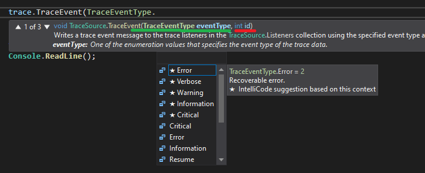
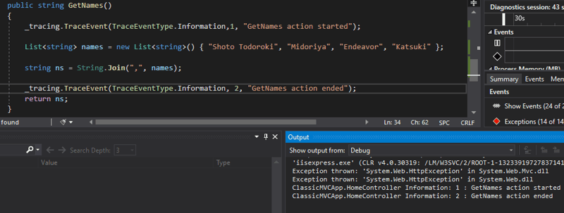

> ## 摘要
>
> Tracing（跟踪）允许我们看到关于正在运行的程序的各种信息性数据。像往常一样，我们运行...
>
> 原文 [Implementing Diagnostings In .NET Applications](https://dev.to/turalsuleymani/implementing-diagnostings-in-net-applications-23ab)

---

跟踪允许我们看到关于正在运行的程序的各种信息性数据。

像往常一样，我们在Debug模式下运行应用程序，并在必要的地方设置断点。

但这在Release模式下不适用。因为程序在Release模式下的行为相对不同。就内存优化而言，垃圾回收器工作更加频繁，编译器为代码优化生成最优代码，还可以改变代码块的位置。也就是说，结果是我们不能在Release模式下看到与Debug模式一一对应的行为。此外，应用程序部署后，您没有内置机制来追踪应用程序的流程。

## Trace（跟踪）

控制程序的流程，程序中可能发生的任何问题，或仅仅是跟踪流程的进展。

.NET中的Trace架构  
跟踪通常可以视为4个块的组合，

**Source（源）**\- 产生跟踪消息的来源  
**Listeners（监听器）** — 将跟踪数据写入的位置  
**Switch（开关）** — 设置跟踪数据的日志级别  
**Filters（过滤器）** — 定义哪些跟踪数据将被监听器处理。  
要启用跟踪过程，创建一个TraceSource类的对象。

可以使用TraceInformation(), TraceData(), 或 TraceEvent()方法之一提供数据流。

TraceSource初始将信息写入输出调试窗口。但从下面的代码示例中可以清楚地看到，尽管给出了发送数据的命令，输出窗口中仍然没有显示数据。

原因是Trace的Switch机制默认是关闭模式。


在文章的继续部分，激活Switch后，将可以看到消息。

但在进入Switch之前，让我们更仔细地看看TraceSource方法。

## TraceEvent()

TraceSource将某种类型的消息而不是单一消息发送到监听器。

也就是说，写消息时，你需要指明那个消息的类型。

消息的类型表明它属于哪个类别（错误消息，仅信息性消息，表明程序抛出异常或完全崩溃的类别等）。

这些消息可以根据程序如何处理它们进行调整。例如，如果您指定TraceEventType.Information，这只是信息性信息，但如果您指定TraceEventType.Critical，则表示程序已经崩溃。

Id只是作为约定赋予消息步骤的标识符。这可以作为团队设置或使用一些协议使用。



在下面的示例中，id=1是输入，id=2是方法的输出。



TraceInformation()用于通过TraceSource向监听器发送信息性消息。实际上，这个方法是TraceEvent()方法的一个封装，在后台替换了TraceEvent(TraceEventType.Information, 0, message)模板。我们可以写


## TraceData()

通过这个方法，你可以直接取一些对象并将其交给监听器。通常，异常的情况下会通过这个方法发送Exception实例。

在你编写的代码示例中，如果我们想要TraceSource方法最低限度地向Output写入消息，则应该启用TraceSource的Switch。Switch允许我们按类型过滤数据。从Switch类派生的SourceSwitch用于在源端对TraceSource进行过滤，顾名思义。其枚举参数控制哪组消息可以发送给监听器。

```csharp
public class HomeController: Controller {
    private readonly TraceSource _tracing;
    public HomeController() {
        _tracing = new TraceSource("ClassicMVCApp.HomeController");
        //允许Critical, Error或warning信息被发送到监听器。
        _tracing.Switch = new SourceSwitch("ClassicMVCApp.AllSwitching") {
            Level = SourceLevels.Warning
        };
    }
    public ActionResult All() {
        var students = StudentDb.Students;
        return View(students);
    }
    public string GetNames() {
        _tracing.TraceEvent(TraceEventType.Information, 1, "GetNames操作开始");
        _tracing.TraceError("测试目的的一些错误消息");
        List &lt; string &gt; names = new List &lt; string &gt; () {
            "Shoto Todoroki",
            "Midoriya",
            "Endeavor",
            "Katsuki"
        };
        string ns = String.Join(",", names);
        _tracing.TraceEvent(TraceEventType.Warning, 4, "一些警告消息");
        _tracing.TraceEvent(TraceEventType.Information, 2, "GetNames操作结束");
        return ns;
    }
}
```


要能够在应用程序外配置SourceSwitch数据，我们可以完全从代码中删除它，并通过配置将其添加到应用程序。为此，你需要在configuration标签下的App.config或Web.config文件中写入这个。


现在，只需在代码中创建一个TraceSource对象并给它在配置中给定的名称（不在代码中指定任何SourceSwitch信息），即可将数据发送给监听器。

TraceSource还可以将数据写入不同的监听器。
