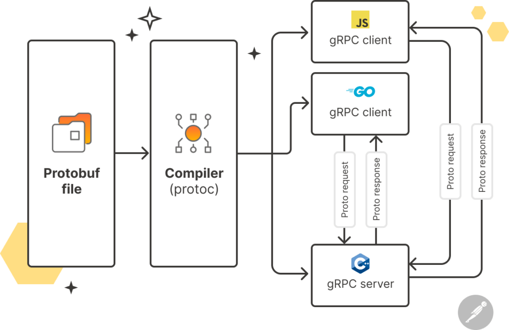

# 什么是 gRPC? | Postman 博客

> 本文翻译自 [The Postman Team](https://blog.postman.com/what-is-grpc/) 的博客文章。原文标题为 [What Is gRPC?](https://blog.postman.com/what-is-grpc/)。

---

gRPC 是一个基于模式的框架，它促进了分布式环境中服务与服务之间的通信。作为 RPC（远程过程调用）协议的一种语言不可知的实现，它通过使用 HTTP/2 和协议缓冲区（Protobuf）支持流媒体和强类型服务契约。

在这里，我们将探索 gRPC 的历史，解释它是如何工作的，并将其与 REST 进行比较。我们还将讨论 gRPC 的关键优势、挑战和用例。最后，我们将突出 Postman [API 平台](https://www.postman.com/api-platform/) 如何简化 gRPC API 的设计、开发和调试过程。

## gRPC 的历史是什么？

“RPC” 在 gRPC 中代表 “远程过程调用”。RPC 首次引入是在 1970 年代末到 1980 年代，它允许客户端和服务器彼此交互，就好像它们都在同一台机器上一样。

gRPC 是 RPC 的一个实现，由谷歌在 2015 年开源。最初，它被设想为他们现有的 RPC 基础设施 “Stubby” 的下一代，自 2001 年以来，谷歌使用 Stubby 连接运行在许多数据中心的大量微服务。它现在是云原生计算基金会（CNCF）的一部分。

gRPC 现代化并简化了远程过程调用的方式。例如，它使用协议缓冲区（Protobuf）作为其接口定义语言（IDL），提供了强类型并促进了多种语言的代码生成。此外，它使用 HTTP/2 作为传输，提高了网络效率并支持实时通信。

## gRPC 是如何工作的？

gRPC 的高层概览。

gRPC 使得分布式的、多语言的服务能够通过网络高效地通信。这一过程从开发者在 Protobuf (.proto) 文件中定义服务契约和数据结构开始。这些文件包含了关于服务方法、消息类型和 API 结构的信息（我们将在本文后面更详细地探讨 Protobuf）。

接下来，这些 .proto 文件被协议缓冲区编译器（称为 “protoc”）处理，这涉及到在各种编程语言中生成客户端和服务器代码。gRPC 的语言无关性使其非常适合分布式系统和基于微服务的架构，其中不同节点上运行的服务可能有不同的运行时。

protoc 生成的代码包括抽象掉进行 gRPC 调用的许多复杂性的类或模块。对于客户端，生成的代码通常包括与 .proto 文件中定义的 RPC 方法对应的方法存根。这些存根处理数据的序列化、通过网络进行 gRPC 调用以及反序列化响应。对于服务器，生成的代码提供了一个基类，开发者可以实现它来定义服务的行为。开发者还可以覆盖这些方法来创建自定义的服务器逻辑。

gRPC 中有四种方法类型——一元、服务器流、客户端流和双向流。这些通信模式通过 gRPC 使用 HTTP/2 作为底层传输协议来实现，这使得多个数据流能够有效地共享单个通信通道或连接。双向流支持是 gRPC 的一个关键区别点，因为它解锁了重要的用例，如实时聊天应用和物联网系统。

## 什么是 Protobuf？

gRPC 使用协议缓冲区（Protobuf）作为其接口定义语言（IDL），这是其对 RPC 的主要增强之一。Protobuf 是一种灵活高效的方法，用于将结构化数据序列化为二进制格式。以二进制形式编码的数据比如 JSON 或 XML 这样的文本格式更节省空间，序列化和反序列化的速度也更快。

Protobuf 有几个优点，不仅仅是二进制数据序列化。例如，它生成代码的能力减少了开发开销，并使得在各种编程语言中处理序列化数据变得更容易。Protobuf 还允许你在不中断现有代码的情况下向数据结构添加新字段，并促进强类型，确保数据一致性并降低出错的风险。

## gRPC 定义了哪四种服务方法？

gRPC 定义了四种主要的服务方法，用于客户端和服务器之间的远程过程调用（RPC）。这些方法代表了客户端和服务器之间的基本通信模式：

- **一元 RPC**：在一元 RPC 中，客户端向服务器发送单个请求并等待单个响应。这种一对一的通信模式是最简单的 RPC 形式，类似于传统的 HTTP 请求。
- **服务器流 RPC**：在服务器流 RPC 中，客户端向服务器发送单个请求并返回一系列响应。
- **客户端流 RPC**：在客户端流 RPC 中，客户端向服务器发送一系列请求并等待单个响应。当客户端需要向服务器发送一系列数据，并且服务器在处理完所有请求后响应时，这种方法非常有用。
- **双向流 RPC**：在双向流 RPC 中，客户端和服务器都可以同时向对方发送一系列消息。这使得客户端和服务器之间能够实时通信，并根据需要发送和接收消息。

## gRPC 与 REST 有什么区别？

**相关阅读：[gRPC 与 REST](https://blog.postman.com/grpc-vs-rest/)**

gRPC 和 REST 是构建 [API](https://www.postman.com/what-is-an-api/) 的两种不同的架构风格。它们都使用 HTTP 使客户端和服务器能够交换数据，并且都可以用广泛的编程语言实现。

然而，gRPC 和 REST 使用非常不同的通信模型。使用 REST，客户端使用一组标准化的 [HTTP 方法](https://blog.postman.com/what-are-http-methods/) 通过相应的 [API 端点](https://blog.postman.com/what-is-an-api-endpoint/) 从服务器请求资源。通过 REST API 交换的数据通常以 JSON 格式化，它具有高度的灵活性，并且人类和机器都能轻松读取。

相比之下，gRPC 客户端通过调用服务器上的函数操作，就好像它们是本地函数一样。gRPC 客户端可以向服务器发送一个或多个请求，服务器也可以回送一个或多个响应。此外，gRPC 使用 Protobuf 定义数据结构——然后将数据序列化为二进制格式。

REST 是构建 API 的最流行的架构风格。它的标准化接口使得开发者易于学习和实现，最常用于创建 Web 应用程序。相比之下，gRPC 设计用于支持可能需要实时、双向数据传输的高性能微服务架构。

## gRPC 的优势是什么？

gRPC 提供了许多优势，使其成为构建现代分布式系统中高效和高性能 API 的有力选择。这些优势包括：

- **效率**：Protobuf 将数据序列化为二进制格式，这减少了数据传输大小和处理时间——尤其是与 JSON 这样的文本格式相比。
- **语言不可知性**：gRPC 允许开发者自动在多种编程语言中生成客户端和服务器代码，这促进了跨不同技术栈的互操作性。
- **强类型**：Protobuf 强制执行强类型，为数据提供了定义良好且经过验证的结构。这减少了服务之间交换数据时出现错误和不匹配的可能性。
- **可扩展性**：使用 gRPC，您可以向您的服务和消息添加新的字段或方法，而不会破坏现有的客户端代码。这使得团队可以进化和扩展 API 而不强迫客户端立即更新，这在分布式系统中尤其重要。
- **代码生成**：Protobuf 的编译器从 .proto 文件生成客户端和服务器代码，这减少了手动编码工作并有助于确保一致性和准确性。
- **支持拦截器和中间件**：gRPC 使开发者能够使用拦截器和中间件实现认证、日志记录和监控。这有助于确保 gRPC 服务保持清洁并专注于业务逻辑——并且在整个服务基础设施中一致地引入必要的功能。

## gRPC 的主要用例是什么？

gRPC 是一个多功能的框架，非常适合需要高效、跨平台通信、实时数据交换和高性能网络的情况。其主要用例包括：

- **微服务架构**：在基于微服务的架构中，各个服务可能会使用不同的编程语言开发，以满足其特定需求。此外，可能需要同时执行许多任务，服务可能面临不同的工作负载。gRPC 的语言不可知性，加上其对并发请求的支持，使其非常适合这些场景。
- **流应用程序**：gRPC 对多种流模式的支持使服务能够在数据一旦可用时立即共享和处理数据——无需重复建立新连接的开销。这使其非常适合实时聊天和视频应用程序、在线游戏应用程序、金融交易平台和实时数据源。
- **物联网系统**：物联网（IoT）系统连接了大量持续交换数据的设备。gRPC 的低延迟以及对实时数据摄取、处理和分析的支持，使其非常适合这些环境。

## 使用 gRPC 的一些挑战是什么？

虽然 gRPC 提供了诸多优势，但它也带来了一些独特的挑战。这些挑战包括：

- **Protobuf 的复杂性**：Protobuf 非常高效和强大，但使用 .proto 文件定义消息结构和服务契约可能比使用像 JSON 这样的文本格式更具挑战性。
- **陡峭的学习曲线**：对于各个技能水平的开发者来说，理解 Protobuf、HTTP/2、强类型和代码生成的复杂性可能需要时间。
- **调试工作流程困难**：二进制序列化不是人类可读的，这可能使得调试和手动检查相比于 JSON 或 XML 更具挑战性。
- **不够成熟的生态系统**：虽然 gRPC 已经获得了显著的流行度，但它的生态系统和社区不如一些更老的技术那样广泛。因此，找到 gRPC 库或工具可能更困难。

## Postman 如何帮助你使用 gRPC？

Postman 的 gRPC 客户端解决了使用 gRPC API 的挑战，使团队能够轻松构建复杂的服务架构。使用 Postman，你可以：

- **使用所有四种 gRPC 方法类型发送请求**：Postman 用户可以从直观的用户界面调用一元、客户端流、服务器流和双向流方法。
- **获取消息提示**：Postman 使用户能够在服务定义的帮助下，通过自动完成提示快速组成和发送 gRPC 消息。用户还可以一键生成示例消息。
- **从头开始创建服务定义**：Postman 的 API 构建器允许你在 Postman API 平台内部创建 Protobuf 服务定义。然后，你可以将此服务定义作为整个 API 项目的唯一真理来源。
- **在 Postman 的云中保存你的多文件 Protobuf API**：使用 Postman，用户可以轻松导入他们的 gRPC 服务定义——并将所有相关的 .proto 文件保存为单个 API。这允许团队在 Postman 中组织他们最复杂的 gRPC API，促进可重用性和协作。
- **自动访问可用的服务和方法**：Postman 包括对 gRPC 服务器反射的支持，这使用户能够在不手动上传 .proto 文件或创建模式的情况下发送 gRPC 请求。
- **消除上下文切换**：使用 Postman，用户可以直接在请求数据和文档旁边查看 gRPC 响应。这通过消除在窗口和工具之间来回切换的需要，简化了工作流程。
- **获取每个 gRPC 连接的完全可见性**：Postman 用户可以看到在 gRPC 流连接上发生的所有事件的统一时间线。他们还可以过滤嘈杂的流以隔离特定消息类型，这简化了调试过程。
