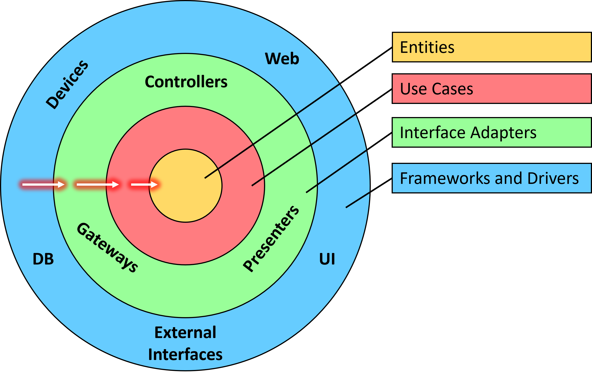

# 保持整洁的架构

> ## 摘要
>
> 本文翻译自 [Julio Casal](https://juliocasal.com/blog/Clean-Architecture) 的文章，介绍了 Clean Architecture 的概念和实际应用。

#### **什么是 Clean Architecture?**

Clean Architecture 是一种架构模式，强调：

- 关注点的分离
- 系统内不同组件的独立性

它由[Robert C. Martin (Uncle Bob)](https://en.wikipedia.org/wiki/Robert_C._Martin)创建，并基于他同样提出的[SOLID](https://en.wikipedia.org/wiki/SOLID)原则。


#### **Clean Architecture 的环形结构是什么？**

Clean Architecture 中有 4 个环形结构：



让我们简要描述每一个：

**实体（Entities）**

- 代表整个企业范围内的业务规则
- 可以跨多个应用使用
- 当外部改变时，这部分改变的可能性最小
- **示例：** 用户（User），比赛匹配（GameMatch），订单（Order）

**用例（Use Cases）**

- 代表应用程序特定的业务规则
- 它们协调数据从实体到外部的流动（反之亦然）
- 外部变化不会影响这一层
- **示例：** 创建用户（Create User），匹配玩家（Match Players），下订单（Place Order）

**接口适配器（Interface Adapters）**

- 它们将数据从用例格式转换为外部格式（反之亦然）
- 这个圈内的代码不知道外部的细节
- **示例：** 仓库（Repository），控制器（Controller），端点（Endpoint），后台服务（Background Service）

**框架和驱动（Frameworks and Drivers）**

- 外部框架和工具存在的地方
- 这里的一切都是细节，不会影响内部圈子
- **示例：** ASP.NET Core, Angular, React, SQL Server, Cosmos DB, Azure, AWS, Stripe

#### **依赖规则**

这是 Clean Architecture 中的关键规则：

> 源代码依赖只能向内指向，内部圈子中的任何内容都不知道外部圈子中的任何事物。

例如，用例只能依赖于实体，但永远不能依赖于控制器、端点或具体的仓库实现。

#### **一个实际的 ASP.NET Core 实现**

那么，这些圈子是如何转化为实际 ASP.NET Core 应用程序的结构的呢？

这里的指导意见因为 Uncle Bob 没有提及如何在任何特定技术栈上实施而各不相同。

已经有数十个参考实现存在，其中一些最受欢迎的是由[Jason Taylor](https://github.com/jasontaylordev/CleanArchitecture)和[Steve Smith](https://github.com/ardalis/CleanArchitecture)创建的模板。

但在这里，我将向你展示我一直在做的方式：


**核心（Core）**  
我倾向于将`实体（Entities）`和`用例（Use Cases）`圈子合并在一个称为 Core 的单个项目中，而不是为它们分别设立不同的项目。


是的，理论上你应该将实体分开，这样你就可以在组织中的多个系统中重用它们（也许作为一个 NuGet 包？）。

但实际上，我从未见过需要这样做的系统。尤其是当你做微服务时，每个微服务将完全拥有它们的领域，所以没有必要跨系统共享实体。

这是**GameMatch**实体（简短版）：

```csharp
public class GameMatch
{
    public GameMatch(Guid id, string player1)
    {
        // Validate parameters here

        Id = id;
        Player1 = player1;
        State = GameMatchState.WaitingForOpponent;
    }

    public Guid Id { get; }

    public string Player1 { get; }

    public string? Player2 { get; private set; }

    public GameMatchState State { get; private set; }

    // More properties here

    public void SetPlayer2(string player2)
    {
        ArgumentException.ThrowIfNullOrEmpty(player2);

        Player2 = player2;
        State = GameMatchState.MatchWaitingForGame;
    }
}
```

关于`用例（Use Cases）`，我在这里称它们为`处理器（Handlers）`，每一个处理器都是一个小类，专门用来处理一个，且仅一个用例。

这是**MatchPlayerHandler**（为简洁起见，移除了日志记录）：

```csharp
public class MatchPlayerHandler
{
    private readonly IGameMatchRepository repository;
    private readonly IBus bus;
    private readonly ILogger<MatchPlayerHandler> logger;

    public MatchPlayerHandler(IGameMatchRepository repository, IBus bus, ILogger<MatchPlayerHandler> logger)
    {
        this.repository = repository;
        this.bus = bus;
        this.logger = logger;
    }

    public async Task<GameMatchResponse> HandleAsync(JoinMatchRequest matchRequest)
    {
        string playerId = matchRequest.PlayerId;

        GameMatch? match = await repository.FindMatchForPlayerAsync(playerId);

        if (match is null)
        {
            match = await repository.FindOpenMatchAsync();

            if (match is null)
            {
                match = new GameMatch(Guid.NewGuid(), playerId);
                await repository.CreateMatchAsync(match);
            }
            else
            {
                match.SetPlayer2(playerId);
                await repository.UpdateMatchAsync(match);
                await bus.Publish(new MatchWaitingForGame(match.Id));
            }
        }

        return match.ToGameMatchResponse();
    }
}
```

这里还会有一个`Repositories`文件夹，它只包含仓库接口，而不包含具体的实现，具体实现属于**基础设施（Infrastructure）**项目。

这是**IGameMatchRepository**：

```csharp
public interface IGameMatchRepository
{
    Task CreateMatchAsync(GameMatch match);
    Task<GameMatch?> FindMatchForPlayerAsync(string playerId);
    Task<GameMatch?> FindOpenMatchAsync();
    Task UpdateMatchAsync(GameMatch match);
}
```

类似于仓库，有时我也会在这里有一个`Services`文件夹，里面有一堆接口用于与其他基础设施服务交互。

最后，有一个`Extensions`类提供了一个方法来注册所有核心依赖项：

```csharp
public static IServiceCollection AddCore(
    this IServiceCollection services)
{
    services.AddSingleton<GetMatchForPlayerHandler>()
            .AddSingleton<MatchPlayerHandler>();

    return services;
}
```

**契约（Contracts）**  
这个在 Clean Architecture 的理论中没有提及，但我觉得它是必需的。

这是所有用于与客户端或其他微服务交互的`DTOs（数据传输对象）`和`消息`所在的地方。


由于其他团队通常希望我提供一个包含所有这些契约的 NuGet 包，因此最理想的做法是将它们保留在自己的项目中，这样就可以轻松地将它们转换成 NuGet 包。

这些契约被用作用例的输入和输出，因此核心项目（Core project）必须依赖于契约项目（Contracts project）。

这样做是否非常清晰？不能确定，但这是我能想到的最佳方案。

以下是**MatchPlayerHandler**使用的 DTOs：

```csharp
public record GameMatchResponse(Guid Id, string Player1, string? Player2, string State, string? IpAddress, int? Port);
public record JoinMatchRequest(string PlayerId);
```

**基础设施（Infrastructure）**  
这是`接口适配器（Interface Adapters）`所在的地方，因此这个项目被允许依赖于几乎任何外部框架。


在我的示例中它看起来很小，但通常这部分会相当大，因为这里是你会找到 Core 项目中定义的任何接口的具体实现，这些接口是处理程序驱动用例所需的。

注意，这是唯一知道我们正在使用 Mongo DB 的项目。Core 项目对此一无所知。

而且，在你问之前：

> 是的，如果你正在使用 Entity Framework，这里就是你实现具体 EF 仓库的地方。你的 Core 项目应该不知道你正在使用 Entity Framework。

这是**MongoGameMatchRepository**（为简洁起见，移除了大部分方法实现）：

```csharp
public class MongoGameMatchRepository : IGameMatchRepository
{
    private const string collectionName = "matches";
    private readonly IMongoCollection<GameMatch> dbCollection;
    private readonly FilterDefinitionBuilder<GameMatch> filterBuilder = Builders<GameMatch>.Filter;

    public MongoGameMatchRepository(IMongoDatabase mongoDatabase)
    {
        dbCollection = mongoDatabase.GetCollection<GameMatch>(collectionName);
    }

    public async Task<GameMatch?> FindMatchForPlayerAsync(string playerId)
    {
        var filter = filterBuilder.Or(
            filterBuilder.Eq(match => match.Player1, playerId),
            filterBuilder.Eq(match => match.Player2, playerId));
        return await dbCollection.Find(filter).FirstOrDefaultAsync();
    }

    public async Task<GameMatch?> FindOpenMatchAsync()
    {
        // Find an open match
    }

    public async Task CreateMatchAsync(GameMatch match)
    {
        // Create the match
    }

    public async Task UpdateMatchAsync(GameMatch match)
    {
        // Update the match
    }
}
```

我还在那里有一个`Extensions`类，提供了一个方法来注册所有基础设施依赖项：

```csharp
public static IServiceCollection AddInfrastructure(
    this IServiceCollection services,
    IConfiguration configuration)
{
    services.AddSingleton(serviceProvider =>
    {
        MongoClient mongoClient = new(configuration["DatabaseConnectionString"]);
        return mongoClient.GetDatabase(configuration["DatabaseName"]);
    })
    .AddSingleton<IGameMatchRepository, MongoGameMatchRepository>();

    services.AddMassTransit(configurator =>
    {
        configurator.UsingRabbitMq();
    });

    return services;
}
```

请注意，**AddInfrastructure**最终会进行这样的调用：

```csharp
services.AddSingleton<IGameMatchRepository, MongoGameMatchRepository>();
```

> 这就是依赖反转魔法发生的地方。

因此，当**MatchPlayerHandler**被实例化时，它将接收到一个**MongoGameMatchRepository**的实例，但它将不知道这是一个 Mongo 仓库，因为它只知道**IGameMatchRepository**。

很酷的东西！

**API**  
这里是你将定义所有`控制器（controllers）`和`端点（endpoints）`的地方。


以下是端点：

```csharp
public static class MatchMakerEndpoints
{
    public static RouteGroupBuilder MapMatchMakerEndpoints(this IEndpointRouteBuilder routes)
    {
        var group = routes.MapGroup("/matches");

        group.MapPost("/", async (JoinMatchRequest request, MatchPlayerHandler handler) =>
        {
            return await handler.HandleAsync(request);
        });

        group.MapGet("/", async (string playerId, GetMatchForPlayerHandler handler) =>
        {
            return await handler.HandleAsync(playerId);
        });

        return group;
    }
}
```

而且，在启动时，在`Program.cs`中，你会有类似这样的内容：

```csharp
builder.Services.AddInfrastructure(builder.Configuration)
                .AddCore();
```

这负责注册 Core 和 Infrastructure 项目中的所有依赖项。

**测试（Tests）**  
最后，我们有了测试项目，这是所有自动化测试所在的地方。


这里体现了 Clean Architecture 的一个关键好处：

> 你可以专注于对业务规则（实体和用例）进行单元测试，而不必担心任何外部依赖。

这是可能的，因为 Core 项目不依赖于任何外部框架，所以你可以通过在 Core 中定义的仓库和服务接口轻松地模拟任何协作者。

这是**MatchPlayerHandler**单元测试之一：

```csharp
[Fact]
public async Task HandleAsync_ExistingOpenMatch_ReturnsMatch()
{
    // Arrange
    GameMatch match = new(Guid.NewGuid(), "P1");
    repositoryStub.Setup(repo => repo.FindMatchForPlayerAsync(It.IsAny<string>()))
        .ReturnsAsync((GameMatch?)null);
    repositoryStub.Setup(repo => repo.FindOpenMatchAsync())
        .ReturnsAsync(match);
    GameMatchResponse expected = new(match.Id, match.Player1, "P2", GameMatchState.MatchWaitingForGame.ToString(), null, null);

    var handler = new MatchPlayerHandler(repositoryStub.Object, busStub.Object, loggerStub.Object);

    // Act
    var actual = await handler.HandleAsync(new JoinMatchRequest(expected.Player2!));

    // Assert
    actual.Should().Be(expected);
}
```

当你完成对 Core 的测试添加后，你就知道你有了一个坚实的基础，可以在其上构建。

#### **使用 Clean Architecture 能得到什么？**

具体来说，这里是我在我的项目中通过使用 Clean Architecture 获得的好处：

- **我可以轻松地对我的核心业务规则（实体和用例）进行更改**，因为它们集中在一个地方，而且没有与任何基础设施问题混合。
- **我可以轻松地对这些业务规则进行单元测试**，而不必担心任何外部依赖。
- **理解我的用例很容易**，因为它们是只承担一个责任的小类。
- **我不必担心最终选择使用哪个数据库**。我可以从内存中的仓库开始，然后切换到 Mongo DB、使用 SQL Server 的 Entity Framework、Cosmos DB 等，而无需更改 Core 项目中的任何代码。
- 实际上，**我可以切换任何基础设施部分**，而无需更改 Core 项目中的任何代码，这保护我免受不必要的回归。
- **我的端点或控制器非常简洁**，因为它们所做的就是调用一个处理器并返回结果。因此我不太担心对它们进行单元测试（让集成测试来处理）。

但我认为最重要的好处是这个：

> 它鼓励我不将业务规则与基础设施问题混合，这导致了一个更容易维护和随时间发展的系统。
