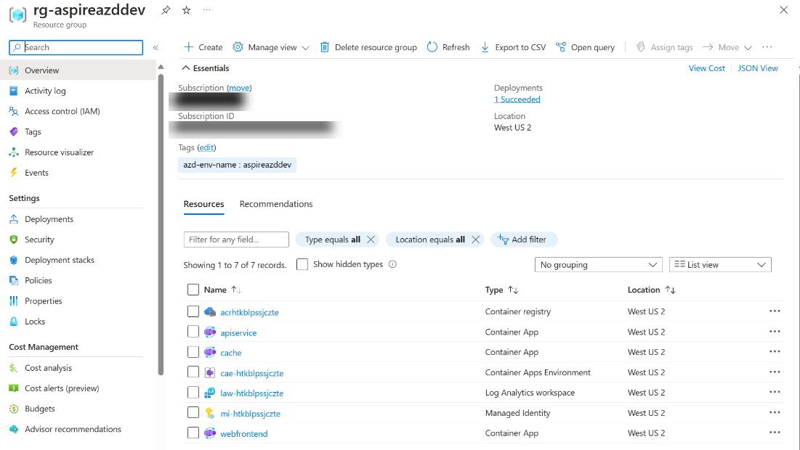

# 如何将 .NET Aspire 应用部署到 Azure 容器应用 - .NET 博客

> ## 摘录
>
> 本文翻译自 [.NET 博客](https://devblogs.microsoft.com/dotnet/how-to-deploy-dotnet-aspire-apps-to-azure-container-apps/)，原文作者为 Jiachen Jiang。本文介绍了如何通过几条命令，借助 Azure Developer CLI，轻松地将 .NET Aspire 应用部署到 Azure Container Apps。

---

最近宣布的用于构建云原生应用的 [.NET Aspire](https://devblogs.microsoft.com/dotnet/introducing-dotnet-aspire-simplifying-cloud-native-development-with-dotnet-8/) 与 [Azure Container Apps](https://learn.microsoft.com/azure/container-apps/) (ACA) 非常匹配。 .NET Aspire 被设计为轻松管理由一系列相互依赖的微服务组成的应用程序。Azure Container Apps 也针对微服务进行了优化，并建立在云原生技术之上，这意味着 .NET Aspire 可以无缝集成到它里面——开箱即用！

除此之外，.NET Aspire 技术栈为 ACA 提供了通过 [Azure Developer CLI](https://learn.microsoft.com/azure/developer/azure-developer-cli/) (AZD) 定制的部署体验，它允许您通过一个命令创建、配置和部署您的 Aspire 解决方案的 Azure 资源。

在这篇博客文章中，我们将讨论在ACA与非托管集群中托管应用程序的好处。我们还将展示通过示例代码演示开始操作的简便方法。

## 为什么选择 Azure Container Apps?

Azure Container Apps (ACA) 是一个用于运行容器优先应用程序和微服务的平台。它由 Kubernetes 提供支持，但对于普通开发者来说，使用和管理起来要简单得多。使用 ACA 的团队可以专注于构建他们的应用程序并投入生产，而不必为了开始就必须学习集群管理的复杂性。

它也是一个很好的选择，如果你想要灵活性并且最小化成本。作为一个无服务器环境，ACA提供了两种托管服务：按使用付费的消费型托管服务，可以扩展到零，以及具有固定定价和可靠性的专用的专业计算托管服务。ACA完全支持开源技术，如Dapr和KEDA，允许开发者从单一平台利用更广泛的微服务生态系统的最佳实践和工具！

这些功能使ACA成为开发者们构建云应用程序的绝佳选择，因为它们可以最小化开销和复杂性。如果你感兴趣，继续阅读——我们将通过一些示例代码，让你亲自看到将.NET Aspire解决方案部署到ACA有多快和容易。

## 开始使用 .NET 8、.NET Aspire 和 AZD

如果您还没有开始使用 .NET 8 来体验 .NET Aspire，请前往 [.NET Aspire 文档](https://learn.microsoft.com/dotnet/aspire/)，了解开始开发所需的一切。这将包括安装 Visual Studio（或 Visual Studio Code）、.NET 8、.NET Aspire 工作负载，以及 Docker Desktop。如果您喜欢，也可以整个过程中使用 .NET CLI。

## 创建你的 .NET Aspire 项目

如果你还没有创建一个 .NET Aspire 项目，不用担心，因为入门项目是一个很好的起点。在 Visual Studio 中创建一个新的 **.NET Aspire Starter Application** 并确保你选择了 **使用 Redis 进行缓存**，你就准备好了。

[](https://devblogs.microsoft.com/dotnet/wp-content/uploads/sites/10/2024/01/aspire-aca-vs-template.png)

您也可以直接通过以下 .NET CLI 命令来创建：

```bash
dotnet new aspire-starter --use-redis-cache --output AspireSample
```

## 设置 Azure Developer CLI

Azure Developer CLI（AZD）是一个新的开源工具，可以加速部署到Azure。AZD不仅允许您通过单一命令创建、配置和部署Azure资源以实现您的Aspire解决方案，它还与.NET工具广泛集成，并且可以从Visual Studio Code和Visual Studio中访问。

> Visual Studio的发布团队正在大力投资于一些AZD的特性中。我们已经支持基于AZD的发布，所以，如果你还没尝试过AZD，现在是从AZD中获得重复性、可组合性、部署能力的好时机。正如你稍后将在文章中看到的，Aspire和AZD是为彼此而生的，它们一起创建了一种自动方式，让你的.NET Cloud Native应用部署到ACA上，而无需编写任何基础架构代码。

AZD在Azure CLI和Bicep的基础上进行构建。就像ACA简化了Kubernetes一样，AZD通过为Aspire解决方案提供智能默认设置简化了部署过程。如果需要，您可以进一步自定义AZD拉取的bicep模板。

您可以使用这份[文档](https://learn.microsoft.com/azure/developer/azure-developer-cli/install-azd)来安装AZD。

### 初始化你的项目为ACA

现在，让我们为我们的 .NET Aspire 应用创建一个 AZD 环境。在同一环境中拥有多个应用允许它们相互通信。

在 /AspireSample/AspireSample.AppHost 中运行以下命令：

```bash
azd init
```

[](https://devblogs.microsoft.com/dotnet/wp-content/uploads/sites/10/2024/01/aspire-aca-azd-init.png)

在几秒钟内，AZD 将检测到这是一个 .NET Aspire 应用，并建议部署到 ACA。确认并继续。

[](https://devblogs.microsoft.com/dotnet/wp-content/uploads/sites/10/2024/01/aspire-aca-azd-scanning-complete.png)

AZD 现在显示了我们的 .NET Aspire 解决方案的每个组件。您现在可以选择哪些组件希望公开部署，这意味着它们将对所有互联网流量开放 HTTP 入口。在这个入门应用程序中，有一个前端和一个 API。我们希望 web 前端是公开的，而 API 应该只对 ACA 环境私有。

要进行该设置，请选择 **webfrontend**。

最后，我们将设置环境名称 - 例如，dev、prod和test。提供环境名称并继续。

AZD 然后完成了应用程序的初始化，并生成了一个 markdown 文件，该文件提供了有关 CLI 在幕后所做的详细信息。

## 将你的项目部署到ACA

AZD允许您一步完成解决方案的配置和部署。然而，首先，我们需要使用Azure AD进行认证，这样我们才能调用Azure资源管理API。

要做到这一点，运行以下命令以启动一个浏览器以验证命令行会话：

```bash
azd auth login
```

现在，我们将配置并部署我们的应用程序：

```bash
azd up
```

然后，系统会询问你想要订阅的服务以及你希望部署到的位置。

> 注意：如果在运行 azd up 后遇到无法调用 `deploy` 动作的错误，请确保注册表中有一个管理员用户。打开 Azure 门户并导航至你部署的订阅。进入 Container registry / Settings / Access keys，然后选中 Admin user 复选框。这将为你生成一个用户名和两个密码以访问 ACR 资源。系统会提示你输入用户名和密码。输入在 Azure 门户中显示的值。更多信息，请参见[启用管理员用户](https://learn.microsoft.com/azure/container-registry/container-registry-authentication)。

AZD将为Web前端和API服务应用程序生成链接。终端输出的最后一行包含链接到Azure Portal页面，显示所有已部署的资源。

[](https://devblogs.microsoft.com/dotnet/wp-content/uploads/sites/10/2024/01/aspire-aca-azd-up.png)

Azure Portal提供了大量资源，帮助您扩展和了解您的应用程序。这里不仅有管理成本、性能和安全的工具，您还可以根据传入需求设置应用程序的扩展。

[](https://devblogs.microsoft.com/dotnet/wp-content/uploads/sites/10/2024/01/aspire-aca-azd-portal.png)

就是这样！要了解更多关于AZD在幕后做了什么来配置和部署你的应用程序，你可以阅读这篇[文档](https://learn.microsoft.com/dotnet/aspire/deployment/azure/aca-deployment)。

## 下一步

恭喜，您现在可以将Aspire应用部署到ACA了。您现在应该对将您的Aspire应用部署到ACA的好处有了更好的理解。感谢您的阅读！

想要了解更多？你可以…

- 查看 [Azure 容器应用文档](https://learn.microsoft.com/azure/container-apps/)。
- 从 [Azure 容器应用定价页面](https://aka.ms/containerapps/pricing) 了解更多定价详情。
- 你可以通过我们的 GitHub [microsoft/azure-container-apps](https://github.com/microsoft/azure-container-apps) 仓库直接随时联系我们。
- 通过 [X](https://twitter.com/AzContainerApp) 和 [Discord](https://aka.ms/containerapps-discord) 与 Azure Container Apps 团队联系。

> **注意：**这篇博文最初发布在[Apps on Azure 博客](https://techcommunity.microsoft.com/t5/apps-on-azure-blog/deploy-apps-to-azure-container-apps-easily-with-net-aspire/ba-p/4032711)上，包含完整的操作指南。
