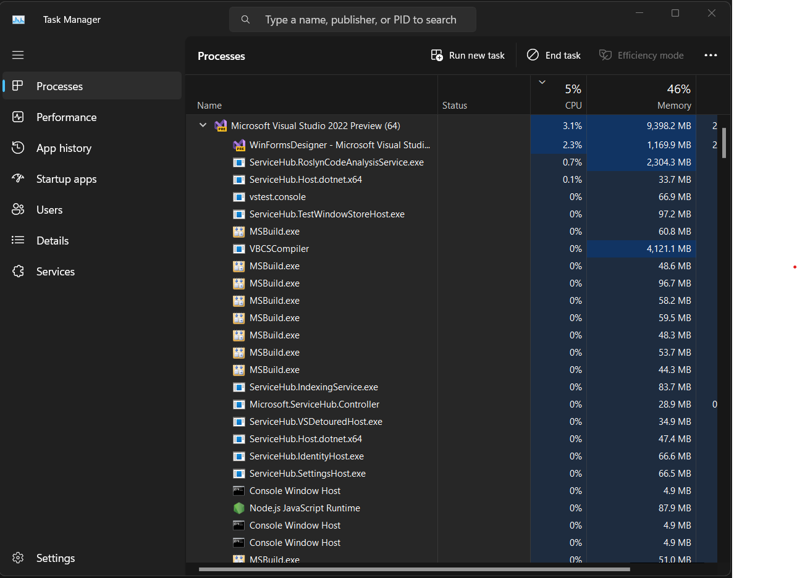
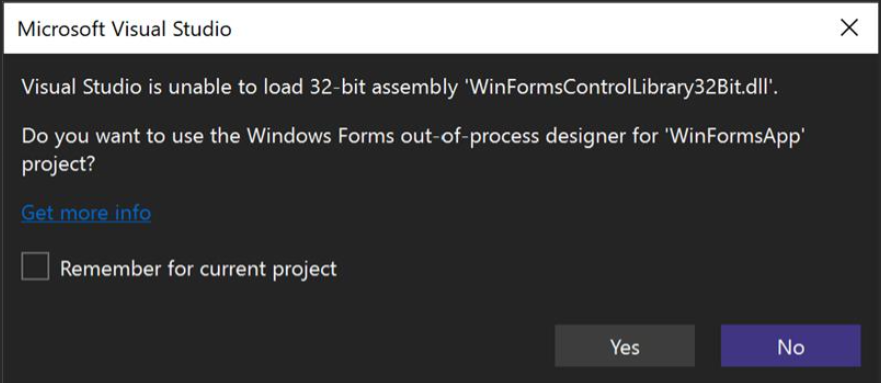

# WinForms 在64位世界的策略发展 - .NET Blog

> ## 引述
>
> 32位组件可能会给WinForms开发人员在64位Visual Studio环境中带来挑战，但有解决方案。组件现代化，迁移到.NET 6+，并且有一个新选项可以使用Framework的异步处理设计器，是一种可行的解决方式！
>
> 本文翻译自 [Klaus Loeffelmann](https://devblogs.microsoft.com/dotnet/winforms-designer-64-bit-path-forward/) 的博客文章。原文标题为 [WinForms in a 64-Bit world - our strategy going forward](https://devblogs.microsoft.com/dotnet/winforms-designer-64-bit-path-forward/)。

---

2024年2月22日

作为一个依赖创新与成长的社区的一部分，WinForms开发人员常常推动边界以创造新的可能性。我们的开发人员还负责维护使命关键线的业务软件，这些业务软件通常已经开发了十多年。我们重视你的信任以及你用我们的工具创造优秀软件解决方案的热情。你可能已经注意到，Visual Studio 2022从32位切换到64位在某些方面产生了一些复杂性，这些变化正在你的开发旅途中增加了一些难度，我们希望通过指出已经存在的解决方案和我们进一步的计划来阐明这些问题。

## 拥抱64位：向好的改变

将平台切换至64位远远超过了简单的升级。这是一个重大改进，使Visual Studio在多个方面的工作更出色。最大的好处之一就是可以使用更多的内存。在32位版本中，Visual Studio能使用的内存有限，这常常会导致处理大型项目时性能变慢，甚至出现错误。64位版本移除了这些限制，让Visual Studio能更有效地处理大型项目。

但这不仅关乎获取更多的内存。切换到64位还使Visual Studio能够更好地利用你的计算机的处理器，特别是它的多核心。由于64位应用程序可以同时处理更多的数据，它可以同时并有效地使用更多的核心，从而导致操作更快。当你构建项目时这特别明显。如果你的项目大型，文件多，代码量大，那在64位上的构建操作会显著更快。这意味着你等待构建完成的时间更短，你可以更快地完成你的工作。但这些不是唯一的优点。其他优点包括：

- **与64位库的兼容性：**有很多64位库和组件不能有效地与32位版Visual Studio一起使用。64位版本可以更好地利用和集成这些资源。
- **增强的安全性：**64位系统比32位系统具有一些内置的安全优势，包括一个叫做地址空间布局随机化（ASLR）的功能，这使得恶意代码更难以利用系统。
- **未来兼容性：**随着技术的发展，越来越多的应用程序和操作系统正在向64位体系结构过渡。现在转向64位，Visual Studio守时者的潮流，确保与未来技术的兼容性。
- **更大的数据集：**借助64位计算，你可以处理更大的数据集，这些数据集之前可能由于内存限制无法处理。这在数据密集型领域如机器学习，大数据分析以及涉及处理大型复杂数据库模式的任务例如代码生成中特别有利。

## WinForms如何适应？

这些优点也同样适用于WinForms Designer。WinForms应用程序常常反映复杂的业务案例。因此，这些应用程序通常包含数百个Forms和UserControls，它们本身可以变得十分庞大和复杂。所有这些导致了大量的代码需要在Form被编辑时生成。因此，64位转换的最大受益者无疑是WinForms Designer。Designer利用了在64位体系结构中访问更多内存的能力，大大提升了其处理复杂设计任务的性能和能力。

### 32位遗留组件挑战

虽然如此，我们完全明白这个进步带来了一些关于与32位体系结构绑定并在Windows Forms designer中被用于针对.NET Framework版本最大4.8.1的项目的组件方面的挑战。

从32位转变为64位系统不仅关乎增加效率，它涉及到的是基本的架构层面的改变。这些改变直接影响了我们管理.NET Framework版本和.NET Core应用程序的方式。例如，不可能在64位进程中主机32位独有的组件或者在.NET Framework进程中主机.NET Core类型。然而，这不应当被视作可以避免的做法，而应当被视作是在技术中自然发展和演变的必由之路。

### 我有哪些选择？

你可以考虑多条途径，每条都有它自己的优点：

- **迁移到.NET 8+：**这是最具有前瞻性的选项，会将你们的系统升级到.NET 8或更高版本。.NET 8+环境是（不仅是）WinForms应用程序开发的未来，并且提供最强大的支持，特别是在涉及第三方控制供应商时。使用.NET 8+，你不仅是跟上了时代潮流，你也走在了前面，确保你的应用程序准备好应对未来所有的挑战。
- **使用AnyCPU：**首先，在设计时间，将所有的东西都转变为使用‘AnyCPU’构建。Visual Studio中的‘AnyCPU’编译选项为你在WinForms项目中处理32位组件问题提供了一个多功能的解决方案。当你的项目设置为‘AnyCPU’时，Visual Studio将以这种方式编译你的应用程序，让它可以在32位和64位平台上运行。在设计时间的背景下，这种灵活性意味着你的过程可以在64位系统上作为64位运行，允许你充分利用64位Visual Studio的好处，例如改善的内存利用率和更快的操作。在众多情况下，这对需要32位运行时组件的项目工作得非常好。对于在设计阶段结束后的运行时，‘优先32位’的项目设定是针对老旧的32位组件或库的兼容性关键。通过启用这个设定，你指示公共语言运行环境(CLR)即使在64位系统上也将你的‘AnyCPU’编译的应用程序在32位进程中运行。这提供了一个环境使你的32位组件按预期操作，从而保持你的应用程序的顺利运行。虽然这个方法带来了一些32位限制，例如较小的内存空间，但它提供了一种在需要64位设计时间能力和32位组件在运行时间的需求之间的平衡的有效方案。
- **现代化32位组件：**如果由于32位组件的架构问题第一个选项不可行，你可能需要考虑从32位组件中迁移出去。虽然这可能需要初期的时间和资源投入，但你在长期内可以获得的好处是显著的。过渡到64位环境不仅提高了性能，还增强了安全性。而且，它为你的应用程序准备了未来的更新和进步，从而确保它们的长寿。

如果所有这些选项都不能满足你特殊的需求，那么还有异步处理的WinForms Designer作为最后的选项：

## 适应新环境：异步处理Designer

为支持.NET Core 3.1及以上版本，我们创建了一个WinForms Designer的异步版本；一个独立的进程可以处理Visual Studio作为一个.NET Framework进程无法执行的任务。这基本上需要我们创建一个全新的体系结构和可扩展性模型[来同时处理两种类型的进程](https://devblogs.microsoft.com/dotnet/state-of-the-windows-forms-designer-for-net-applications/)。升级到.NET确实有它的挑战，包括运行时的改变以及新的异步Designer的改变。虽然我们确实保持了最重要的设计时间功能的并行性，但有些情况下旧方法不再适应新的技术环境。

异步Designer使我们可以避过在进程设计中的问题，即主机组件与托管Designer,例如，Visual Studio的目标框架不兼容的问题。这是通过启动一个新的Designer进程完成的，它将在WinForms项目设定的精确目标框架版本中运行，从而在管理不同架构的组件方面提供更大的灵活性。

此外，异步制程师也允许我们提供对更高版本的.NET的支持，如.NET 8, 9和更高版本。它通过允许组件利用这些新版.NET的特性来达到这一点，这些特性可能和.NET Framework不兼容。

然而，这也意味着所有的单独组件和他们的控制Designer必须调整以适应不同的进程边界。当你正在使用你自己的WinForms控制库时，存在高度定制的设计时支持通过专门的控制Designer，这些Designer提供定制的CodeDOM序列化，专门的类型编辑器，定制的标记渲染或个性化的Designer动作项目，[你需要迁移你的Designer代码以使用WinForms Designer SDK](https://devblogs.microsoft.com/dotnet/custom-controls-for-winforms-out-of-process-designer/)。我们已经向这个方向发展了，以我们的.NET (Core, 5+)的常规控制为例。同样重要的是：我们更大的第三方控制库合作伙伴也提供他们的产品用于.NET版本5, 6和7 – 为.NET 8现代化的版本正在制作中。

重要的是当我们在处理这些问题时，优先考虑的是基于使用情况排序的组件。.NET Core中较少使用的一些组件已经过时，以支援更常用的组件。

## 用于支持32位组件的.NET Framework应用程序的异步Designer

我们看到有更多的人需要为32位.NET Framework设计WinForms应用程序的支持，这是因为这些应用程序使用了只能在32位进程中工作的部分。这就是我们采取WinForms异步Designer的方法，开始为.NET Framework引入基于此的32位异步Designer。

异步Designer设计为可以生成一个单独的32位进程，这个进程可以主机这些应用程序所需的组件。这样做，它绕过了Visual Studio 64位环境和32位组件间的不兼容性。这个设计允许更顺畅的集成和兼容性，即使系统体系结构有差异。

如果你尝试打开一个WinForms .NET Framework项目，这个项目引用了一个32位组件，Visual Studio会自动弹出一个对话框，询问你是否希望使用32位 .NET Framework异步Designer打开你的项目。

就像它的.NET对等者一样，32位.NET _Framework_ WinForms应用程序的异步Designer旨在提供相同的设计时间体验，保持使用现有甚至是遗留的32位组件的能力。尽管架构上的难度挺大，我们承诺确保切换顺畅且保持你所依赖的功能，同时也提供了未来升级和增强的途径。

我们明白重要的遗留项目可能依赖于32位ActiveX控制和其他遗留组件，这些目前与Visual Studio 2022不兼容，特别是针对那些不针对.NET (Core, 5+)而是针对.NET Framework直到版本4.8.1的项目。在这些情况下，异步Designer对许多用例可能是解决方案。但是要注意，.NET (6+) WinForms异步Designer应被视为首选和最佳实践的前进方式——你将会得到两个世界的优点：在设计时间和运行时间的32位兼容性*和*最新的，最先进的和性能最好的.NET版本。

**It _is_ important to note：**升级过的异步32位.NET FrameworkDesigner将*不*与旧的.NET FrameworkDesigner保持完全的一致性，这是由于跟异步.NET CoreDesigner提到的相同的架构差异。这也意味着高度定制的控制Designer将不会与.NET FrameworkDesigner兼容。如果你使用第三方的定制控制库，你需要查看他们是否提供支持异步\_.NET Framework_Designer的版本。

## 支持遗留组件：我们的承诺和计划

异步Designer是我们将来投入大部分精力的地方。下面是我们今年的路线图规划：

- **改进32位框架异步Designer：**这个Designer将用于维护不能迁移到.NET (Core, 5+)的项目，但依赖遗留的32位组件。这个Designer将不具备与内置Designer的全部功能，但我们会根据客户的需求添加更多功能。要知道32位框架Designer已经在预览中，并且可以通过*Tools/Option*页面激活。

对于Visual Studio 2022版本17.9我们已经发布了一个功能，它可以帮助你轻松地选择.NET Framework项目应该打开为经典的Visual Studio内部Designer还是异步Designer。与经典WinForms内部Designer相比，差异将会是：

- 你将能够打开和设计针对.NET Framework（最高版本4.8.1）的Forms和UserControls，并依赖于32位基的ActiveX组件或其他大部分原因，这些原因将会在Designer中强制生成的程序集为32位。
- 如果你依赖于特殊第三方控件库的项目，其中依赖老旧的32位组件，你不能使用这些第三方供应商为经典内部Designer提供的同类库的版本。你需要与你的控件库供应商联系，查看他们是否提供更新了的.NET Framework异步Designer版本。
- 输入类型的DataSetDesigner和SQL Server查询编辑器在设计的DataSets背景下仅保留为经典内部Designer。然而，我们将在今年内推出更易于使用和可能的获取基于已有入口类型DataSets的数据源的更新功能，这样可以继续支持基于已有数据源的数据绑定方案。然而，我们现在没有计划支持在.NET Framework异步Designer中支持经典的Data Source工具窗口\*\*。
- 基于经典SOAP Web服务的数据源不会被异步Designer所支持，不论.NET或.NET Framework应用程序。
- 对根Designer的基础设施提供支持：第三方供应商和控制库作者依赖于根Designer——例如当他们想要将他们的报告Designer从.NET Framework迁移到.NET Core时。通过在异步Designer中添加根Designer的支持，我们将使得控制的作者能够现代化他们强大的报告Designer和其他文档Designer类型，并且将他们引导到.NET 6, 7和8+。然而我们现在没有计划支持.NET Framework异步Designer的定制根Designer。

## 前行：合作的努力

从32到64位系统的过渡是一个重要的里程碑，需要一种新的途径，创新的解决方案和耐心。如之前提到的，这不是一个快速bug修复；反而，这是我们需要作为一个社区共同管理的过渡。

我们承诺尽可能使这个过渡对你顺畅。你的反馈极具价值，并帮助我们找出我们需要集中精力的领域。我们有一个路线图，正朝着前进，但完成的时间表依赖于你带给我们注意的独特的挑战。

总的来说，我们了解你面对的复杂性，并且我们想要向你保证我们正在尽力解决这些挑战。请记住，改变常常伴随着一点不适，但它为成长和更好的结果铺买道路。我们要强调你在这个持续过渡中积极参与的重要性。我们正在持续努力改进和微调64位Designer和异步Designer的支持，你的反馈和错误报告就非常重要。如果你在使用WinForms时遇到特定的问题，我们强烈建议你直接在WinForms的GitHub库或通过Visual Studio的反馈功能上报告他们。详尽、具体的问题报告，尤其是包括环境信息、再现步骤、特定的错误信息的报告，非常有助于我们识别并更有效地，更快速地解决问题。你在这个过程中的参与对于成功开发一个更强大、更高效的Visual Studio至关重要，因为32位遗留组件所基于的技术在很多情况下已经有20年甚至更久的历史了。

## 最后的想法

从32位到64位的过渡过程是复杂的，并充满了挑战。我们承诺为尽可能所有的用户成为这个过渡更顺畅，但我们理解过程中会有困难。

感谢你的支持和承诺，因为我们一同迎接一个更有能力、更多样性的WinForms生态系统，并且像往常一样…

…happy coding！
