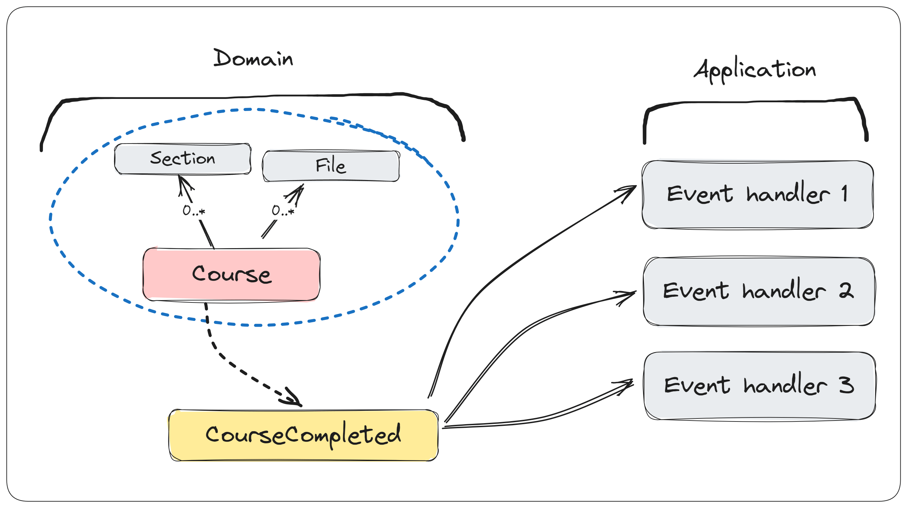

# 如何使用领域事件构建松耦合系统

> ## 摘录
>
> 在软件工程中，"耦合"意味着一个软件系统的不同部分对彼此的依赖程度。如果他们紧密耦合，改变某一部分可能会影响到其他许多部分。但如果他们松散耦合，对一个部分的改变就不会在系统的其他部分造成大的问题。
> 领域事件是一个领域驱动设计（DDD）的策略模式，我们可以用它来构建松耦合系统。
> 你可以从域中引发一个领域事件，它代表了发生的事实。系统中的其他组件可以订阅这个事件，并相应地处理它。
>
> 原文地址：[How To Use Domain Events To Build Loosely Coupled Systems](https://www.milanjovanovic.tech/blog/how-to-use-domain-events-to-build-loosely-coupled-systems)

---

在软件工程中，"耦合"表示一个软件系统的不同部分对彼此的依赖程度。如果他们是**紧耦合**，对某一部分的改变可能会影响到许多其他部分。但如果他们是**松耦合**，对一个部分的改变就不会在系统的其他部分产生大的问题。

**领域事件** 是一种 **Domain-Driven Design (DDD)** 的战术模式，我们可以用它来构建**松耦合**系统。

你可以从域里引发一个**领域事件**，这代表一个已经发生的事实。系统的其他组件可以订阅这个事件并相应地处理它。

在本周的新闻简报中，你将学习：

- 什么是 [领域事件](https://www.milanjovanovic.tech/blog/how-to-use-domain-events-to-build-loosely-coupled-systems?utm_source=Twitter&utm_medium=social&utm_campaign=19.02.2024#what-are-domain-events)
- 它们与集成事件有何[不同](https://www.milanjovanovic.tech/blog/how-to-use-domain-events-to-build-loosely-coupled-systems?utm_source=Twitter&utm_medium=social&utm_campaign=19.02.2024#domain-events-versus-integration-events)
- 如何[实现](https://www.milanjovanovic.tech/blog/how-to-use-domain-events-to-build-loosely-coupled-systems?utm_source=Twitter&utm_medium=social&utm_campaign=19.02.2024#implementing-domain-events) 和[引发领域事件](https://www.milanjovanovic.tech/blog/how-to-use-domain-events-to-build-loosely-coupled-systems?)
- 如何使用 EF Core [发布领域事件](https://www.milanjovanovic.tech/blog/how-to-use-domain-events-to-build-loosely-coupled-systems?utm_source=Twitter&utm_medium=social&utm_campaign=19.02.2024#how-to-publish-domain-events-with-ef-core)
- 如何使用 MediatR [处理领域事件](https://www.milanjovanovic.tech/blog/how-to-use-domain-events-to-build-loosely-coupled-systems?utm_source=Twitter&utm_medium=social&utm_campaign=19.02.2024#how-to-handle-domain-events)

我们有很多内容要覆盖，让我们开始吧！

## [什么是领域事件?](https://www.milanjovanovic.tech/blog/how-to-use-domain-events-to-build-loosely-coupled-systems?utm_source=Twitter&utm_medium=social&utm_campaign=19.02.2024#what-are-domain-events)

一个**事件**是指过去发生的某件事。

这是一个事实。

不可更改。

一个**领域事件**是在领域中发生的事情，领域的其他部分应该知道它。

**领域事件**允许你明确地表达副作用，并在领域中提供更好的关注点分离。它们是在领域内触发多个聚合的副作用的理想方式。

发布**领域事件**是你的责任。你会看到这比说起来更容易做到。



## [领域事件与集成事件的对比](https://www.milanjovanovic.tech/blog/how-to-use-domain-events-to-build-loosely-coupled-systems?utm_source=Twitter&utm_medium=social&utm_campaign=19.02.2024#domain-events-versus-integration-events)

你可能听说过**集成事件**，现在你可能在想它们与**领域事件**有什么区别。

从语义上来说，它们是一样的：都代表过去发生的事情。

然而，它们的**意图不同**，这点理解起来很重要。

领域事件：

- 在一个单独的领域内发布和消费
- 使用内存消息总线发送
- 可以同步或异步处理

集成事件：

- 由其他子系统（微服务，有界上下文）消费
- 通过队列的消息代理发送
- 完全异步处理

所以，如果你在纠结应该发布哪种类型的事件，考虑一下其意图和谁应该处理该事件。

**领域事件**也可以用于**生成集成事件**，这种事件会超越领域的边界。

## [实现领域事件](https://www.milanjovanovic.tech/blog/how-to-use-domain-events-to-build-loosely-coupled-systems?utm_source=Twitter&utm_medium=social&utm_campaign=19.02.2024#implementing-domain-events)

我实现**领域事件**的首选方法是创建一个`IDomainEvent`抽象，并实现MediatR的`INotification`。

其优点在于你可以使用**MediatR的发布-订阅**支持来向一个或多个处理器发布通知。

```csharp
using MediatR;

public interface IDomainEvent : INotification
{
}
```

现在你可以实现一个具体的领域事件。

以下几点是**设计领域事件**时需要考虑的**约束**：

- 不变性 - 领域事件是事实，应该是不可变的
- 宽领域事件 vs 细领域事件 - 你需要多少信息？
- 使用过去时来命名事件

```csharp
public class CourseCompletedDomainEvent : IDomainEvent
{
    public Guid CourseId { get; init; }
}
```

## [引发领域事件](https://www.milanjovanovic.tech/blog/how-to-use-domain-events-to-build-loosely-coupled-systems?utm_source=Twitter&utm_medium=social&utm_campaign=19.02.2024#raising-domain-events)

创建了领域事件后，你可能会希望从域中引发它们。

我采取的方法是创建一个`Entity`基类，因为只有实体才能引发领域事件。你可以通过使`RaiseDomainEvent`方法变为`protected`来进一步封装引发领域事件。

我们在一个内部集合中存储领域事件，以防止其他人访问它。`GetDomainEvents`方法用来获取集合的快照，`ClearDomainEvents`方法用来清空内部集合。

```csharp
public abstract class Entity : IEntity
{
    private readonly List<IDomainEvent> _domainEvents = new();

    public IReadOnlyList<IDomainEvent> GetDomainEvents()
    {
        return _domainEvents.ToList();
    }

    public void ClearDomainEvents()
    {
        _domainEvents.Clear();
    }

    protected void RaiseDomainEvent(IDomainEvent domainEvent)
    {
        _domainEvents.Add(domainEvent);
    }
}
```

现在你的实体可以继承自`Entity`基类并引发领域事件：

```csharp
public class Course : Entity
{
    public Guid Id { get; private set; }

    public CourseStatus Status { get; private set; }

    public DateTime? CompletedOnUtc { get; private set; }

    public void Complete()
    {
        Status = CourseStatus.Completed;
        CompletedOnUtc = DateTime.UtcNow;

        RaiseDomainEvent(new CourseCompletedDomainEvent { CourseId = this.Id });
    }
}
```

现在剩下的就是**发布**这些**领域事件**。

## [如何使用EF Core发布领域事件](https://www.milanjovanovic.tech/blog/how-to-use-domain-events-to-build-loosely-coupled-systems?utm_source=Twitter&utm_medium=social&utm_campaign=19.02.2024#how-to-publish-domain-events-with-ef-core)

一个优雅的发布领域事件的解决方案是使用**EF Core**。

由于EF Core充当了**工作单元**，你可以用它来聚集当前事务中的所有**领域事件**并发布它们。

我不喜欢把事情搞复杂，所以我只是重写了`SaveChangesAsync`方法来在数据库持久化变更之后发布领域事件。但你也可以使用一个拦截器。

```csharp
public class ApplicationDbContext : DbContext
{
    public override async Task<int> SaveChangesAsync(
        CancellationToken cancellationToken = default)
    {
        // 你应该何时发布领域事件？
        //
        // 1. 在调用SaveChangesAsync之前
        //     - 领域事件是同一事务的一部分
        //     - 立即一致性
        // 2. 在调用SaveChangesAsync之后
        //     - 领域事件是一个单独的事务
        //     - 最终一致性
        //     - 处理器可能会失败

        var result = await base.SaveChangesAsync(cancellationToken);

        await PublishDomainEventsAsync();

        return result;
    }
}
```

你在这里必须做的最**重要的决定**是**何时发布领域事件**。

我认为在调用`SaveChangesAsync`之后发布是最有意义的。换句话说，在将更改保存到数据库之后。

这也带来了一些权衡：

- 最终一致性 - 因为消息是在原始事务之后处理的
- 数据库一致性的风险 - 因为领域事件的处理可能会失败

我可以接受最终一致性，所以我选择了这种权衡。

然而，引入数据一致性的风险是一个大问题。

你可以采用[**发件箱模式**](https://www.milanjovanovic.tech/blog/outbox-pattern-for-reliable-microservices-messaging)来解决这个问题，将你的更改和领域事件（作为发件箱消息）在一个单独的事务中持久化到数据库。现在你拥有了一个保证的原子事务，领域事件则通过后台作业异步处理。

如果你好奇`PublishDomainEventsAsync`方法里面有什么内容：

```csharp
private async Task PublishDomainEventsAsync()
{
    var domainEvents = ChangeTracker
        .Entries<Entity>()
        .Select(entry => entry.Entity)
        .SelectMany(entity =>
        {
            var domainEvents = entity.GetDomainEvents();

            entity.ClearDomainEvents();

            return domainEvents;
        })
        .ToList();

    foreach (var domainEvent in domainEvents)
    {
        await _publisher.Publish(domainEvent);
    }
}
```

## [如何处理领域事件](https://www.milanjovanovic.tech/blog/how-to-use-domain-events-to-build-loosely-coupled-systems?utm_source=Twitter&utm_medium=social&utm_campaign=19.02.2024#how-to-handle-domain-events)

至此所创建的所有基础设施，我们已经准备好了为领域事件实现一个处理器。幸运的是，这是整个过程中最简单的步骤。

你所要做的就是定义一个实现`INotificationHandler<T>`的类，并指定领域事件类型作为泛型参数。

下面是一个`CourseCompletedDomainEvent`的处理器，它接受领域事件，并发布一个`CourseCompletedIntegrationEvent`来通知其他的系统。

```csharp
public class CourseCompletedDomainEventHandler
    : INotificationHandler<CourseCompletedDomainEvent>
{
    private readonly IBus _bus;

    public CourseCompletedDomainEventHandler(IBus bus)
    {
        _bus = bus;
    }

    public async Task Handle(
        CourseCompletedDomainEvent domainEvent,
        CancellationToken cancellationToken)
    {
        await _bus.Publish(
            new CourseCompletedIntegrationEvent(domainEvent.CourseId),
            cancellationToken);
    }
}
```

## [总结](https://www.milanjovanovic.tech/blog/how-to-use-domain-events-to-build-loosely-coupled-systems?utm_source=Twitter&utm_medium=social&utm_campaign=19.02.2024#in-summary)

**领域事件**可以帮助你构建一个松耦合系统。你可以用它们来从副作用中分离出核心域逻辑，这些副作用可以被异步处理。

实现领域事件无需重新发明轮子，你可以使用**EF Core**和**MediatR**库来建立。

你将需要做出何时发布领域事件的决定。在对数据库进行保存更改之前或之后发布都有自己的一套**权衡**。

我更倾向于在对数据库**保存更改之后发布**领域事件，并且我使用[**发件箱模式**](https://www.milanjovanovic.tech/blog/outbox-pattern-for-reliable-microservices-messaging)为其添加交易保证。这种方法引入了最终一致性，但同时也更为可靠。

希望这篇文章对你有所帮助。
