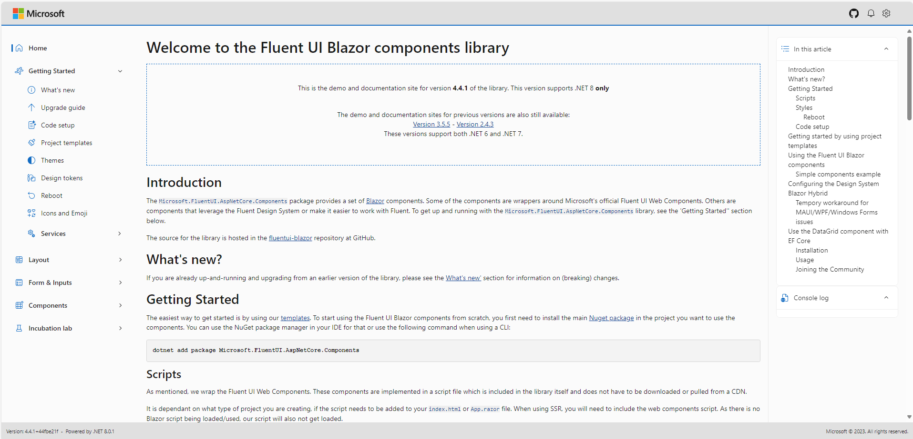
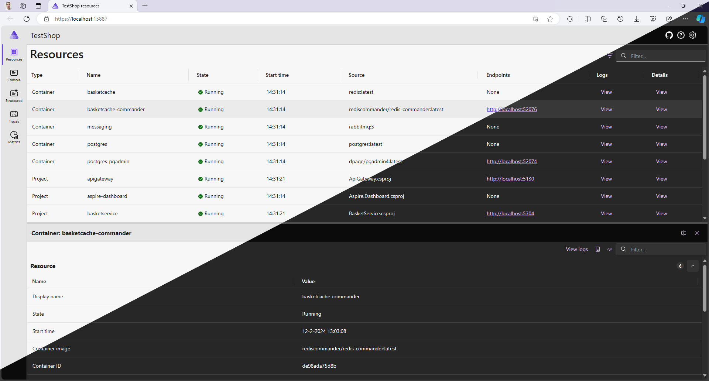

# FAST与Fluent：一个Blazor故事 - .NET博客

> ## 摘录
>
> 了解Fluent UI Blazor库的构建块的起源。我们将讨论FAST、Web Components、Fluent Design等内容。
>
> 原文地址：[The FAST and the Fluent: A Blazor story](https://devblogs.microsoft.com/dotnet/the-fast-and-the-fluent-a-blazor-story/)

---

2024年2月26日

这听起来几乎像是一部流行电影系列的标题，但我们还（尚未）涉足电影制作行业。在这篇文章中，我将会谈论Fluent UI Blazor库。它从何而来，它有哪些构建块，以及这些构建块是如何协同工作的？让我们按影片里的顺序，为这些库的主要角色做一个适当的介绍…

## FAST

简而言之，FAST是基于Web Components和现代Web标准构建的一系列技术。在微软内部，FAST是由一支UX工程师和设计师团队构建的，他们希望通过使用标准的网络技术来解决用户体验挑战。

FAST不是众多典型的前端框架之一，比如React、Angular或Vue。FAST并不是专注于“一站式SPA框架”，而是旨在让创建web组件变得可能和更加容易。因此，用FAST构建的web组件可以与几乎任何前端框架一起使用。

### Web Components

Web Components是指一组旨在创建自定义HTML元素的网络标准的总称。这个总称下的一些标准包括：

- 能够定义新的HTML标签，
- 接入标准组件生命周期，
- 封装HTML渲染，
- CSS封装和参数化

以上每个功能都由W3C定义和标准化，并且得到了每个现代浏览器的支持。FAST没有构建自己的组件模型，而是使用了上述的W3C Web Component标准。这使得用FAST构建的组件能像内置的、普通的HTML元素一样工作。

使用FAST组件并不需要使用框架，但你可以（也应该）使用。将它们与所需的框架或库结合使用总是更容易的。自2020年初以来，web组件得到了广泛采用。不仅是微软在大力投资这项技术，谷歌、Adobe、Salesforce、SAP、MIT、SpaceX等许多其他公司也在做同样的事情。更多信息，请参见[https://www.fast.design/](https://www.fast.design/)。

## Fluent

Fluent是微软在其所有现代应用程序中使用设计系统，无论是网络还是Windows（操作系统和应用程序）。Fluent的起源可以追溯到“Metro”，这是Zune音乐播放器和Windows Phone设备使用的设计系统（是的，我也还在想念它们！）。该系统包含用于软件中设计和交互的指导原则。它的基础是由五个关键组成部分构成的：光、深度、运动、材质和规模。最近，最新版本Fluent 2已经发布。欲了解更多信息，请参见[https://fluent2.microsoft.design/](https://fluent2.microsoft.design/)。

## Fluent UI Web Components

FAST团队使用他们开发的构建块，构建了Fluent设计系统的实现。这就是Fluent UI Web Components。如上所述，这些组件是不依赖框架的，并且可以在任何现代浏览器中使用。为了让每个人的生活更轻松一些，几乎总会使用一个前端框架。其中一个可以使用这些组件的框架就是Blazor。

## Blazor

Blazor是微软用于构建交互式网络应用程序的.NET框架。开发者使用C#而不是JavaScript构建交云UI。代码可以在客户端和服务器端执行，通过MAUI，甚至可以在iOS、Android和Tizen设备上（本地）运行。

客户端执行使用WebAssembly实现的.NET运行时在浏览器中运行代码。WebAssembly，或简称WASM，是一个广泛认可的标准，得到了所有现代浏览器的支持。为了优化，运行时可以即时编译（JIT）你的应用代码到WebAssembly。为了更好的性能，可以改用提前编译（AOT）你的代码到WebAssembly。

当Blazor在服务器端执行时，会建立一个Signal-R连接，通过该连接发送所需的接口更新。因为只发送了旧情况与新情况之间的差异，所以消息相当小。一个现代服务器可以轻松支持5000-10000个同时连接。

Blazor是一个基于组件的框架。每个组件都可以独立工作，但通过将它们放在一个层次结构中，也可以使组件相互通信。最终在屏幕上渲染的又是标准的HTML和CSS（有时还有一点JavaScript）。因此，将Blazor和web组件结合使用当然是一个可能性。

## 剧本：我们如何使他们一起表演？

既然舞台已经搭建好，主要角色，即基于FAST构建的Fluent UI Web Components以及Blazor已经介绍过了，那么这个库在使它们一起表演中扮演什么角色呢？对于库的初始版本，目标是为每个Fluent UI Web Component提供一个Blazor“包装器”。这里的包装器的意思是“仅仅”创建一个渲染web组件的Blazor组件，使用与web组件相同的名称、参数和枚举，但是以Razor语法和C#语言。

这个目标在2021年底实现了。FAST团队在与.NET 6.0同时发布的库的版本1中包含了大约40个不同的组件，并伴有一个演示和文档站点。当前该站点的版本，提供了更多的示例和文档，以及比最初的40个更多的组件，可以在[https://www.fluentui-blazor.net](https://www.fluentui-blazor.net/)找到。

与此同时，库可以被描述为非常成功。在写这篇文章时，NuGet包下载计数器的总和已经接近110万。

在v1版本发布后，我们收到的一个经常问到的问题是库是否可以提供更多组件。尤其是使构建遵循Fluent设计系统的应用程序更容易的组件。最初库只提供Web Components的包装器，这使得扩展变得困难。因此决定了（经与Microsoft FAST和ASP.NET Core Blazor团队协商）将库的开发和拥有权从FAST团队移交。当然，我们继续与FAST团队紧密合作，并已开始测试和包装下一版本的Fluent UI Web Components（这是基于Fluent 2的）。

> 关于所有权和支持的说明：目前，Fluent UI Blazor库是一个纯粹的开源项目。它**不是**ASP.NET Core的官方部分，这意味着它**没有**得到官方支持，也没有承诺在任何官方.NET更新中提供更新。它是由微软员工（及其他贡献者）构建和维护的，像大多数其他开源项目一样，通过GitHub仓库（不是通过support.microsoft.com）以最大努力提供支持。

成为一个纯粹的开源项目后，我们在版本3发行中推出了一大批新组件。随着每个（小）版本的发布，组件数量持续增长，现在我们在库包中提供了将近70个组件。这些不仅仅是Fluent UI Web Components的包装器。其中一些是纯粹的Blazor组件，利用Fluent设计系统进行用户界面设计，其他的则使得在应用程序中使用Fluent设计变得更容易。我们甚至创建了几个自己的web组件！与去年11月.NET 8一起发布的，是库的版本4。为了明确我们现在独立于FAST团队（和更接近Blazor团队），包的（基础）名称已经从`Microsoft.Fast.Components.FluentUI`更改为`Microsoft.FluentUI.AspNetCore.Components`。

库中最新的新增项之一：可排序列表，图片

如果库和项目作为纯粹的开源项目让你担心成熟度、持久性或支持，请放心，微软相信它的未来，并且已经在几个项目中使用了库。如果你开始探索新的.NET Aspire工作负载，并访问了它的[仪表板](https://github.com/dotnet/aspire/tree/main/src/Aspire.Dashboard)，你可以看到组件的实际应用。该仪表板是用Blazor构建的，并使用了库构建其用户界面。除了Aspire，库也被[Visual Studio Teams Toolkit](https://learn.microsoft.com/microsoftteams/platform/toolkit/toolkit-v4/teams-toolkit-fundamentals-vs)使用，后者使在Visual Studio中开始Microsoft Teams的应用程序开发变得简单。

## 一个新系列的开始？

就像电影行业一样，我们喜欢续集。我们已经想好了未来版本的一些改变。当然，我们也希望听取用户的意见，了解他们希望添加和/或改变什么。加入我们在[GitHub仓库](https://github.com/microsoft/fluentui-blazor)中的讨论。

再次，正如他们在电影中所说的：未完待续……
