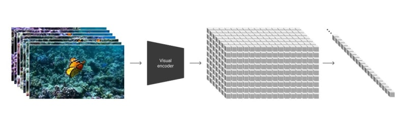
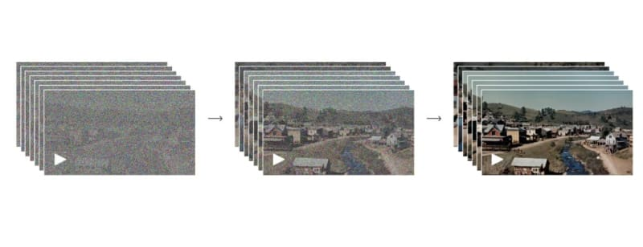

# Sora（实际上）是如何工作的 - DEV Community

> ## 摘录
>
> 让我们总结一下OpenAI所分享的内容，看看这个模型实际上是如何工作的。
>
> 原文 [How Sora (actually) works - DEV Community](https://dev.to/mikeyoung44/how-sora-actually-works-ch5)

---

让我们总结一下OpenAI所分享的内容，看看这个模型实际上是如何工作的。

这周，OpenAI团队介绍了Sora，一个大规模的视频生成模型，展示了在模拟我们物理世界的基本方面的新能力。我长期关注文本到视频的生成技术，我认为这个模型在质量上代表了一个[质的飞跃](https://twitter.com/mikeyoung44/status/1758202408088285342)。

我也在Reddit和Twitter上看到了很多关于这个模型如何工作的猜测，包括一些离谱的建议（Sora是在一个叫做Unreal的游戏引擎内运行吗？）。当这样一个突破性的东西发布时，许多人想要表现得仿佛他们知道发生了什么，或者基于一小部分发布的视频中的微妙线索和假象，他们甚至可能欺骗自己认为他们确实知道。我找到的最糟糕的一个例子是[Dr. Jim Fan宣称](https://twitter.com/DrJimFan/status/1758210245799920123) "Sora是一个数据驱动的物理引擎"，这在Twitter上被浏览了大约400万次（它根本不是一个数据驱动的物理引擎）。

幸运的是，OpenAI[发布了一篇研究帖子](https://openai.com/research/video-generation-models-as-world-simulators)说明了他们模型的架构，所以实际上没有必要去猜测，如果我们读了他们所写的内容。在这篇文章中，我为你做了这个工作，并且我将带你了解OpenAI团队提供的内容，这样我们可以看到Sora*实际上*是如何工作的。让我们开始吧。

## 为什么Sora很重要

自从该领域创立以来，创建能够模拟、理解和模仿真实世界内在复杂性的人工智能一直是一个极其困难的挑战。不同于静态图像，视频本质上涉及到随时间变化的表示、3D空间、物理互动、物体的连续性和更多方面。过去的视频生成模型在处理多样的视频时长、分辨率和摄像机角度时遇到了困难。更重要的是，这些系统缺乏产生高保真度现实模拟所需的物理、因果和对象永久性的内在“理解”。

OpenAI发布的视频从质量上显示了一个性能超越我们以往所见的模型。视频看起来非常真实。例如，一个人的头部会遮挡一个标志，然后移过它，标志上的文字仍然如前。动物在“静止”时翅膀会真实地变化。风中的花瓣会随风摆动。大多数视频模型在这类挑战上会失败，结果往往是一些[闪烁、颤抖的混乱](https://www.youtube.com/watch?v=FvG41iEXFrU)，观众的思维不得不努力使之连贯，但Sora做到了。如何做到的呢？

## 技术细节：模型架构与训练

我在研究模型和可用帖子时的主要收获是，这项工作建立在OpenAI之前的语言模型工作上，比如他们的GPT系列。

### 视频表示

研究人员引入的一个关键创新是Sora在训练期间如何表示视频。每一帧被分割成许多小块，类似于大型语言模型如GPT-4中如何将单词分解成token。这种基于块的方法让Sora能够训练不同长度、分辨率、方向和纵横比的视频。从帧中提取的块不论原视频的形状如何，都以相同的方式处理。

“从高层次上，我们通过首先将视频压缩成一个低维度的潜在空间，然后将表示分解为时空块，把视频变成块。” - 来自OpenAI研究帖子

### 模型架构

Sora使用了一个与GPT模型类似的transformer架构来处理这些视频块token的长序列。Transformers包含了空间-时间自我注意层，这对于模拟文本、音频和视频等序列的长距离依赖关系显示了巨大的好处。

在训练过程中，Sora的transformer模型以一系列来自扩散过程初期的视频块token作为输入，并预测原始的“去噪”token。通过对数百万多样化视频的训练，Sora慢慢学习了自然视频帧的模式和语义。

OpenAI研究帖子中的去噪过程图解

### 文本条件化

Sora也是有条件的，意味着它可以基于文本提示有控制地生成视频。文本提示被嵌入并作为额外的上下文提供给模型，与当前视频帧对应的块一起。

为了更好地将文本描述与实际视频内容相连接，研究人员使用了由单独的标题模型生成的每个训练视频的高度描述性标题。这种技术帮助Sora更紧密地遵循文本提示。

### 推理过程

在推理过程中，Sora从纯噪声块开始，经过50多个扩散步骤不断地去婪它们，直到出现一个连贯的视频。通过提供不同的文本提示，Sora可以生成与标题相匹配的不同视频。

基于块的表示方法允许Sora在测试时简单地通过在开始扩散过程之前按所需形状排列块来处理任何分辨率、时长和方向。

## 能力与局限性

通过将训练数据扩展到数百万视频片段，并使用大量计算资源，OpenAI团队发现了一些相当有趣的出现行为：

- Sora不仅仅是文本到视频，还可以根据输入的图片或其他视频产生视频。
- Sora似乎发展出了对场景的强大3D“理解”，角色和物体以连续的方式真实地移动。**这完全是基于数据规模的出现，没有任何显式的3D建模或图形代码。**
- 模型显示出对象永久性，常常能够跟踪实体和对象，即使它们临时离开画面或被遮挡。
- Sora展示了模拟一些基本世界互动的能力 - 例如，一个数字画家在画布上留下精确持久的笔触。
- 它还能够令人信服地生成复杂的虚拟世界和游戏，如Minecraft。Sora可以同时控制一个代理在这个生成的环境中移动，同时渲染场景。
- 随着额外的计算和数据，视频质量、连贯性和对提示的遵循显著提高，表明了通过扩展获得进一步增益的可能性。

然而，Sora仍然表现出显著的缺陷和局限性：

- 它经常难以准确地模拟更复杂的现实世界物理互动、动力学和因果关系。简单的物理和物体属性仍然具有挑战性。例如，一个被推倒并溢出的玻璃展示了玻璃融入桌子和液体跳过玻璃侧面而不破碎的效果。
- 模型倾向于在拥挤或杂乱的场景中自发生成意外的物体或实体。
- Sora在区分左右或在许多动作发生时准确地序列化时间上容易混淆。
- 在多个角色自然地与彼此和环境互动方面，真实模拟仍然困难。例如，它会生成一个人在跑步机上错误方向行走。

## 未来方向

尽管存在这些持续的缺陷，Sora暗示了研究人员继续扩大视频生成模型规模的未来潜力。随着足够的数据和计算力，视频transformers可能开始学习更多关于真实世界物理、因果关系和对象永久性的内在理解。结合语言理解，这可能启用通过视频模拟世界的新方法来训练AI系统。

Sora朝着这个目标迈出了一些初步的步骤。虽然还需要大量工作来解决它的许多弱点，但它显示出的突现能力凸显了这个研究方向的希望。经过训练的巨大transformers，使用大量多样化的视频数据集，最终可能产生能够智能地与我们物理环境的内在复杂性、丰富性和深度互动并理解的AI系统。

## 结论

因此，与那些没有根据的声称相反，Sora不是通过游戏引擎或作为一个“数据驱动的物理引擎”运作，而是通过一个transformer架构，该架构以类似GPT-4对文本token的操作方式处理视频“块”。它在创建展示深度、对象永久性和自然动力学理解的视频方面表现出色，主要是作为一系列放大属性的突现结果。

模型的关键创新在于将视频帧视为块序列，类似于语言模型中的单词token，使其能够有效处理视频的多样性方面。这种方法，结合文本条件生成，允许Sora从文本提示中产生上下文相关和视觉连贯的视频。

尽管Sora拥有开创性的能力，但它仍然存在限制，例如在建模复杂互动和保持动态场景一致性方面。这些局限性强调了需要进一步研究的必要性，但不减少其在推进视频生成技术方面取得的重大成就。

我希望不久后Sora能够发布供人们尝试，因为我已经能想到一百万种这种技术的酷炫应用。在那之前，让我们保持关注。
