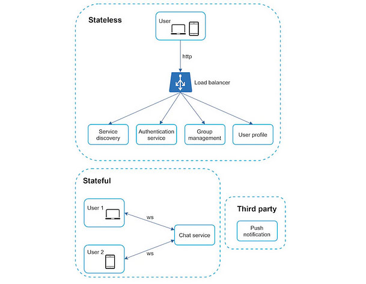
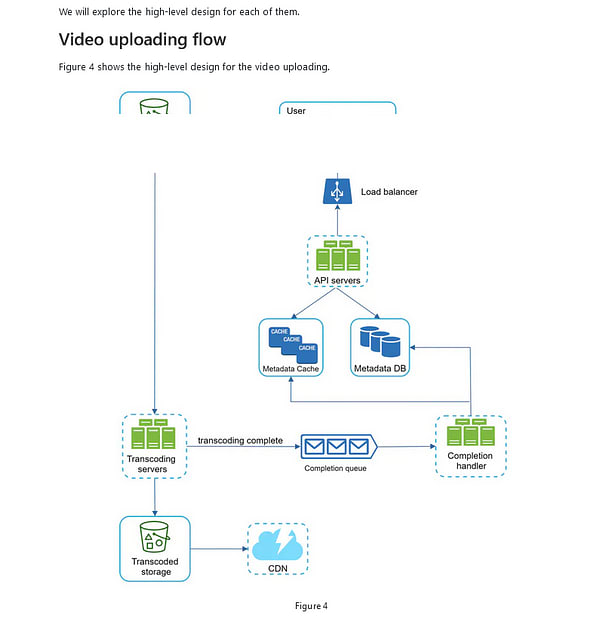
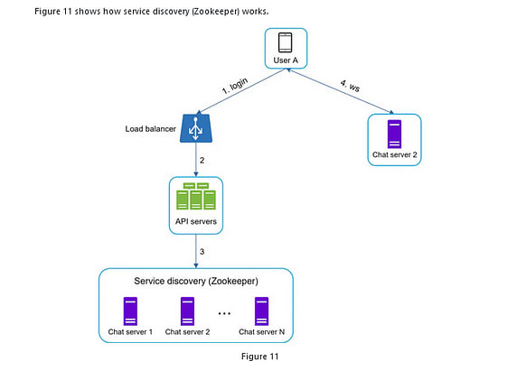
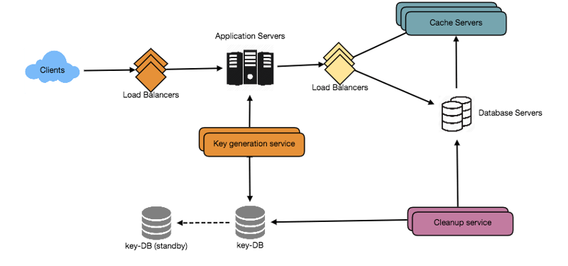
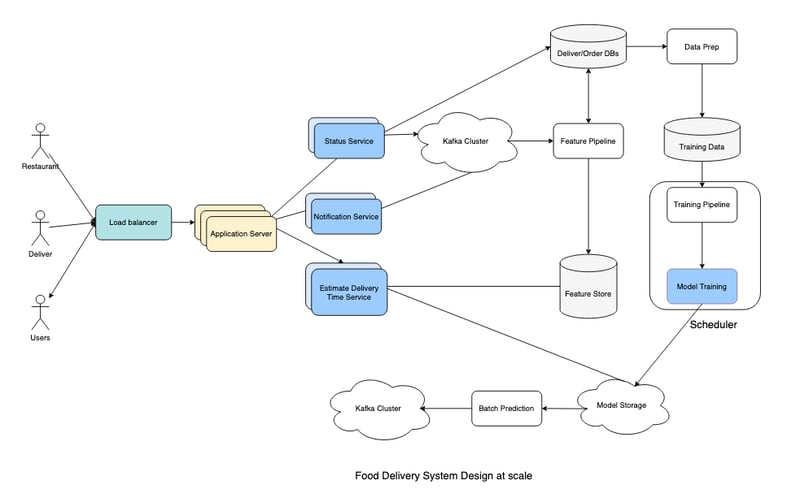
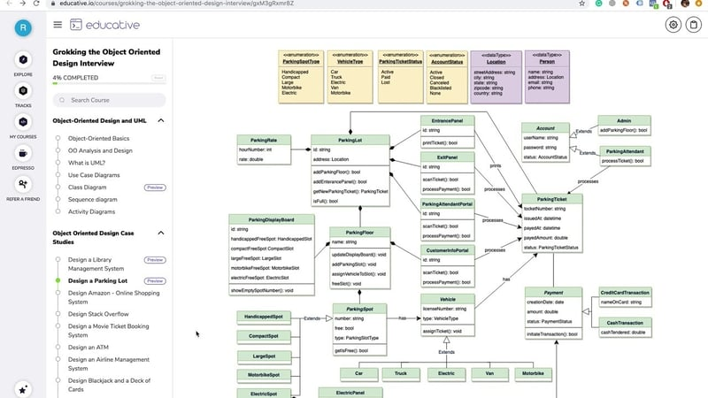
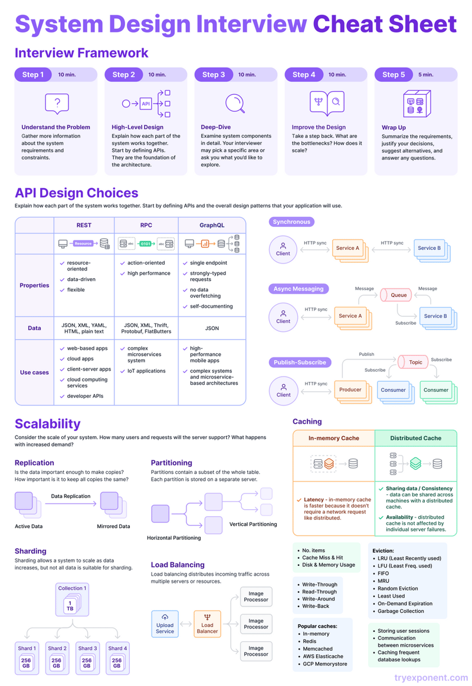

# 6个系统设计面试问题练习 - DEV 社区

> ## 摘要
>
> 面试中经常问到的系统设计问题

---

大家好，系统设计是在亚马逊、谷歌或Netflix以及大多数初创公司找到工作的最大障碍之一。我看到许多拥有多年经验的开发者因为缺乏准备和知识，在这一轮面试中失败。

这就是为什么为面试准备得好非常重要，最好准备一些经常问到的系统设计问题，比如如何设计YouTube，以及如何设计WhatsApp。

顺便说一下，如果你正在准备系统设计面试并想深入学习系统设计，你也可以查看像[**ByteByteGo**](https://bit.ly/3P3eqMN)、[**DesignGuru**](https://bit.ly/3pMiO8g)、[**Exponent**](https://bit.ly/3cNF0vw)、[**Educative**](https://bit.ly/3Mnh6UR) 和 [**Udemy**](https://bit.ly/3vFNPid) 这样的网站，它们有许多很棒的系统设计课程，如果你需要免费的系统设计课程，你也可以看下面的文章。

以下是一些我最喜欢的系统设计问题，你也可以用它们来开始，我也链接了详细的文章，你可以在那里找到解决方案，但我建议你在查看它们之前先自己尝试：

## 练习的前6个系统设计面试问题

以下是一些我最喜欢的系统设计问题，用于学习基本的系统设计概念和原则

### 1. 设计 YouTube 或其他视频流服务，如 Netflix、HBO 或 Amazon Prime Video ([**解决方案**](https://bit.ly/3bbNnAN))

我们都使用过YouTube，关于这个问题最好的地方是我们都熟悉大多数功能，但当涉及到设计它们时会有点棘手，因为我们只考虑技术方面而不是功能方面。

设计类似YouTube、Netflix或Amazon Prime Video的视频流服务涉及多个方面，以确保无缝的内容交付、用户参与度和可扩展性。

从用户验证和授权开始，系统将采用像OAuth这样的安全方法来保护用户账户。服务的核心将是一个高度可扩展和分布式的视频内容传递网络，优化的低延迟和高质量流。

该平台将支持各种视频格式和分辨率，根据观众的互联网连接动态调整。

对于内容组织和发现，将实施强大的推荐引擎，利用机器学习算法分析用户偏好并提供个性化内容建议。全面的搜索功能和分类系统将增强内容的可发现性。

用户交互功能将包括评论、点赞和分享选项，促进社区参与。此外，通知系统将通知用户有关新上传、评论和建议的信息。可以集成如订阅计划、基于广告的收入或二者结合的货币化策略，确保可持续的商业模式。

安全措施将至关重要，包括加密以确保视频传输安全、防止内容盗版和防止未经授权的访问措施。将实施数字版权管理（DRM）以控制内容分发权。

跨平台兼容性至关重要，需要为各种设备和响应式Web界面开发原生应用程序。实时分析工具将提供用户行为洞察，允许持续改进和战略决策。

为了应对潜在的需求高峰，服务器基础设施应设计为可扩展性，具有强大的内容交付网络和负载平衡机制。定期备份和恢复系统将确保数据的完整性和可用性，即使在不可预见的情况下也是如此。

总之，成功的视频流服务将集成安全的用户验证、强大的内容交付网络、个性化推荐系统、用户参与特性、货币化策略和健全的安全措施，提供引人入胜和可靠的流体验。

这是一个很好的开始问题。思考不同的功能、可扩展性、性能和弹性。

如果不能解决，请查看这个[解决方案](https://bit.ly/3bbNnAN)以获得详细讨论。

### 2\. 设计 WhatsApp 或任何其他聊天系统 ([解决方案](https://bit.ly/3SbA9Eu))

设计有效的聊天系统，我们将从一个强大的用户验证和授权机制开始，利用像OAuth这样的安全方法来确保用户登录的完整性。

对于消息存储，将实现一个可扩展和分布式数据库，利用索引实现高效的聊天历史检索。隐私将是首要任务，因此端到端加密，包括强算法和密钥管理系统，将保护用户消息。

将通过WebSocket或类似协议实现实时通信，推送通知将确保及时的消息提醒。将集成多媒体支持的文件共享，包括图像和文件的安全存储解决方案。

群聊功能将被设计为可伸缩，具有成员管理、管理员控制和实时同步功能。

语音和视频通话功能将通过技术实现，如WebRTC，辅以信号服务器以实现无缝的呼叫建立和拆除。

用户友好的界面，提供打字指示器、已读收据和表情符号，将增强整体用户体验。

跨平台兼容性至关重要，需要为iOS和Android开发原生应用程序，以及一个基于网络的版本。强大的通知系统、可定制的首选项和状态更新将有助于用户参与。

性能跟踪和用户行为洞察将采用监控工具和分析，而备份和恢复机制将确保在潜在故障面前数据的完整性和可用性。

本质上，这种全面的方法将导致一个安全、可扩展和功能丰富的聊天系统。它与前一个问题非常相似，考虑消息分发、恢复和可扩展性。如果你遇到困难，请查看[这里的解决方案](https://bit.ly/3SbA9Eu)

---

### 3\. 设计类似 TinyURL 的URL缩短服务 ([解决方案](https://bit.ly/3S98WSc))

创建URL缩短服务涉及多个组成部分，以确保功能性、可靠性和用户体验。起初，将实施一个健全的用户验证和授权系统，采用像OAuth这样的安全方法进行用户登录。

核心功能将围绕一个可扩展的数据库旋转，以高效地存储原始和缩短的URL，考虑索引和检索速度。

为了生成短网址，将采用唯一的算法或编码方法，确保无冲突和简洁的表示。

此外，实现用户友好的功能，如自定义短网址和URL过期选项，可以增强服务的吸引力。

系统将优先考虑实时重定向，利用高速服务器和缓存机制以最小的延迟。可以集成URL分析，为用户提供链接性能洞察，跟踪指标，如点击次数、地理数据和推荐来源。

为了处理潜在的滥用或误用，将有一个全面的安全层，包括针对恶意链接和垃圾邮件的措施。

跨平台兼容性至关重要，需要一个用户友好的Web界面和用于各种应用程序集成的API。可以实施通知系统，以提醒用户关于链接活动或分析更新的信息。

考虑到可能的繁重流量，服务器基础设施应该设计为能够动态扩展。定期备份和恢复系统将确保数据完整性，允许在系统故障的情况下恢复数据。

总之，一个设计良好的URL缩短服务将结合安全的用户验证、高效的链接缩短算法、实时重定向、深入洞察的分析和健全的安全措施，提供无缝和可靠的用户体验。

如果你遇到困难，请参阅[解决方案](https://bit.ly/3S98WSc)中给出的链接

---

### 4\. 设计 Instagram ([解决方案](https://bit.ly/3BqamCL))

设计Instagram涉及创建一个可扩展和功能丰富的平台，用于分享照片和视频。系统将从一个安全的用户验证机制开始，使用技术如OAuth登录。

系统的核心将是一个分布式数据库，用于存储用户配置文件、多媒体内容和参与度指标。

对于媒体存储，可以采用一个可扩展和高效的解决方案，如云存储，确保快速检索和低延迟。

内容交付网络（CDNs）将优化全球用户的媒体分发。该平台将支持图像和视频格式，针对不同设备和网络条件进行自适应流。

为了增强用户参与度，可以实施基于机器学习算法的推荐系统，提供个性化内容建议。点赞、评论和直接消息等社交功能将是不可或缺的，促进社区互动。话题标签和健全的搜索系统将改善内容的可发现性。

安全措施将包括对私人消息进行端到端加密、安全的API和内容审查工具，以防止不当内容的传播。访问控制和用户隐私设置将是至关重要的。

跨平台兼容性至关重要，需要为iOS和Android开发原生应用程序，以及一个响应式Web界面。实时通知，如点赞、评论和新粉丝，将有助于吸引用户体验。

通过负载平衡、缓存机制和分布式服务器基础设施确保可扩展性。定期备份和恢复系统将防止数据丢失或系统故障。

总之，成功的Instagram系统设计将整合安全认证、可扩展的媒体存储、个性化推荐系统、吸引人的社交功能、健全的安全措施和可靠的基础设施，以实现无缝的照片和视频分享。

如果你遇到困难，请参阅[链接](https://bit.ly/3BqamCL)中给出的解决方案

---

### 5\. 设计一个图书馆管理系统 ([解决方案](https://bit.ly/3SfwJQe))

设计图书馆管理系统（LMS）涉及为图书馆工作人员实施用户验证系统，使用安全方法如OAuth。系统的核心将是一个中心化数据库，以有效管理书籍、借阅者和交易。

用户界面将允许工作人员添加、更新和删除书籍记录，借出/归还书籍，并跟踪借阅者信息。搜索功能和分类系统将增强书籍的可发现性。

安全措施将包括用户访问控制和敏感数据加密。可以集成自动通知过期书籍和预订系统，以提高用户体验。

跨平台兼容性可以通过基于Web的界面实现。定期备份和恢复系统将确保数据完整性

如果你遇到困难，请参阅[这里的解决方案](https://bit.ly/3BqamCL)

---

### 6. 设计一个停车场 (解决方案)

设计一个停车场涉及创建一个系统，该系统具有对管理员的用户认证、一个集中的数据库用于车辆记录以及一个直观的用户界面以管理停车位。

该系统将包括特性，如进出记录、实时空位更新以及在线支付选项。安全措施，如监控摄像头和访问控制，也将被实施。

一个移动应用或网站可以便利用户预约并在停车场内提供导航。定期监控和维护将确保最佳功能，并且在系统故障的情况下会有一个数据恢复的备份系统。

如果你遇到困难，可以在[这里](https://bit.ly/3eMUosX)查看解决方案

这些是我在面试前总是练习的一些问题。不要认为它们只有6个，如果你深入研究，解决这些问题可能需要几天时间，并且每一个都会教你许多必要的系统设计概念和你面临的挑战。

祝你面试顺利，并别忘了分享你最喜欢的系统设计问题是什么。

顺便说一句，如果你正在为系统设计面试做准备，并希望深入学习系统设计，那么你也可以查看像[**ByteByteGo**](https://bit.ly/3P3eqMN)、[**DesignGuru**](https://bit.ly/3pMiO8g)和[**Exponent**](https://bit.ly/3cNF0vw)这样的网站，它们提供许多针对面试的优秀系统设计课程。

这里还有一张来自[Exponent](https://bit.ly/3cNF0vw)的精美系统设计备忘录，可以快速回顾必要的系统设计概念。

