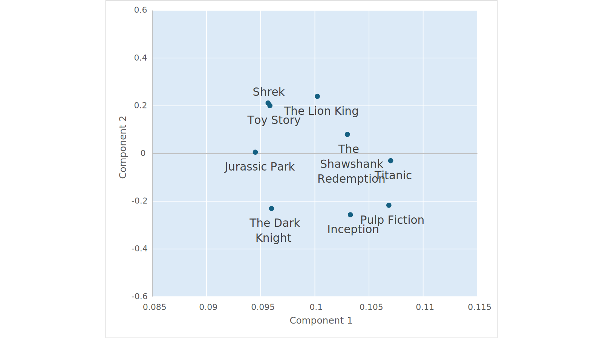

# 在 .NET 中开始使用 Milvus 向量数据库 - .NET 博客

> ## 摘要
>
> 学习如何开始使用 Milvus 向量数据库在 .NET 中管理嵌入向量，用于搜索和检索增强生成（RAG）场景。
>
> 原文 [Get started with Milvus vector database in .NET](https://devblogs.microsoft.com/dotnet/get-started-milvus-vector-db-dotnet/)

---

2024年3月6日

向量数据库已经成为支持搜索和检索增强生成（RAG）场景的生成性 AI 工作负载的重要组成部分。

.NET 团队已与 Milvus 密切合作，使 .NET 开发者能够在其应用程序中使用向量数据库。

在这篇文章中，我们将展示如何快速地使用目前处于预览版的 Milvus .NET SDK 开始使用。

## 什么是 Milvus？

Milvus 是一个向量数据库，可以存储、索引和管理由深度神经网络和其他机器学习模型生成的嵌入向量。

更多详情，请查看 [Milvus 网站](https://milvus.io/)。

## 什么是嵌入向量？

嵌入向量是数据（如文本、图像和音频）的数值表示。这些数值表示可以被看作是一系列浮点值的集合。

在这个例子中，你正在查看基于它们嵌入向量表示的电影的可视化。

[](https://devblogs.microsoft.com/dotnet/wp-content/uploads/sites/10/2024/03/movie-embedding-plot.svg)

这些向量由机器学习模型创建，例如 [OpenAI 的文本嵌入模型](https://learn.microsoft.com/azure/ai-services/openai/concepts/models#embeddings)。

[](https://devblogs.microsoft.com/dotnet/wp-content/uploads/sites/10/2024/03/vector-generation.svg)

相似的电影会有相似的嵌入向量表示。例如，像《狮子王》和《玩具总动员》这样的电影可能会有相似的向量，因为它们都是动画片且适合全家观看，而《盗梦空间》和《低俗小说》会有不同的向量，因为它们属于不同的类型和风格。

这些嵌入向量帮助计算机理解和比较电影，这对于搜索和推荐系统很有用。

对于生成性 AI 应用，能够提供相关的上下文信息来帮助大型语言模型（LLMs）像 GPT 生成相关的响应是很重要的。嵌入向量在这里起到了作用。

关于嵌入的更多学习，你可以查看以下文章：

- [OpenAI – 引入文本和代码嵌入](https://openai.com/blog/introducing-text-and-code-embeddings)
- [使用 Azure OpenAI 生成嵌入](https://learn.microsoft.com/azure/ai-services/openai/how-to/embeddings?tabs=csharp)
- [解密检索增强生成](https://devblogs.microsoft.com/dotnet/demystifying-retrieval-augmented-generation-with-dotnet/#mind-the-gap)
- [使用智能 .NET 应用改造您的业务，这些应用由 Azure 和 ChatGPT 提供支持](https://devblogs.microsoft.com/dotnet/transform-business-smart-dotnet-apps-azure-chatgpt/#chat-with-your-data)
- [有效估算向量空间中的词表示](https://arxiv.org/abs/1301.3781)
- [通过全局上下文和多个词原型改进词表示](https://www.andrewng.org/publications/improving-word-representations-via-global-context-and-multiple-word-prototypes/)
- [NLP 的深度学习：词嵌入](https://towardsdatascience.com/deep-learning-for-nlp-word-embeddings-4f5c90bcdab5)

## 为什么使用向量数据库？

就像关系数据库和文档数据库针对结构化和半结构化数据进行了优化一样，向量数据库被构建来有效地存储、索引和管理表示为嵌入向量的数据。因此，向量数据库使用的索引算法被优化以有效检索可用于您的应用程序中的下游数据，这些应用程序可能具有搜索和 AI 组件。

## 在 .NET 中开始使用 Milvus

本博文中的代码示例仅用于说明目的。有关更详细的示例，请参阅入门示例。

### 将 Milvus 部署到 Azure

您开始的最简单方式是将 Milvus 数据库的实例部署到 Azure。

Milvus 通过 [Zilliz Cloud for Azure](https://zilliz.com/blog/zilliz-cloud-now-available-on-microsoft-azure) 提供，这是 Milvus 的托管版本。

它也可以作为 [Azure 容器应用程序 Add-On](https://learn.microsoft.com/azure/container-apps/services) 使用。在未来的博客文章中，我们将探讨如何开始使用这些附加组件。敬请期待！

### 连接到数据库

假设您已部署了 Milvus 实例：

1. 创建一个 C# 控制台应用程序或 Polyglot 笔记本。
2. 安装 Milvus.Client NuGet 包。
3. 使用 Milvus SDK 创建客户端并连接到您的数据库。确保将 “localhost” 替换为您的 Milvus 服务主机。

   ```csharp
   var milvusClient = new MilvusClient("localhost", username: "username", password: "password");
   ```

### 创建一个集合

数据在集合中组织。假设我们正在创建一个用于存储电影数据的集合。

首先定义您的模式。模式将包含三个字段：

- _movie_id_：电影的唯一标识符
- _movie_name_：电影的标题
- _movie_description_：电影描述的嵌入向量。

```csharp
var schema = new CollectionSchema
{
    Fields =
    {
        FieldSchema.Create<long>("movie_id", isPrimaryKey: true),
        FieldSchema.CreateVarchar("movie_name", maxLength: 200),
        FieldSchema.CreateFloatVector("movie_description", dimension: 2)
    }
};
```

然后，创建您的集合。

```csharp
var collection = await milvusClient.CreateCollectionAsync(collectionName: "movies",schema: schema, shardsNum: 2);
```

### 向您的集合添加数据

一旦创建了集合，向其添加数据。

在这个案例中，这里是我们正在使用的数据。在这个示例中，电影描述的嵌入向量已经为方便起见而预先计算。然而，在更真实的场景中，您将使用嵌入模型来生成它们。在表中，我还仅出于演示目的包括了文本描述。然而，集合中不会存储文本描述，只存储嵌入向量。

| movie_id | movie_name | movie_description (embedding) | movie_description (text)                                                                                                                                                                     |
| -------- | ---------- | ----------------------------- | -------------------------------------------------------------------------------------------------------------------------------------------------------------------------------------------- |
| 1        | 狮子王     | \[0.10022575, -0.23998135\]   | 狮子王是一部经典的迪士尼动画片，讲述了一只名叫辛巴的年轻狮子在其父亲悲惨去世后踏上复位王位的征程的故事。                                                                                     |
| 2        | 盗梦空间   | \[0.10327095, 0.2563685\]     | 盗梦空间是一部令人费解的科幻电影，由克里斯托弗·诺兰执导。它讲述了唐姆·科布的故事，他是一位擅长进入人们梦境窃取秘密的熟练窃贼。然而，他被提供了一项最终工作，涉及在某人的脑海中植入一个想法。 |
| 3        | 玩具总动员 | \[0.095857024, -0.201278\]    | 玩具总动员是皮克斯的一部突破性动画片。它跟随玩具主人安迪不在时的玩具的秘密生活。伍迪和巴斯光年是这个温馨故事的主角。                                                                         |
| 4        | 低俗小说   | \[0.106827796, 0.21676421\]   | 低俗小说是昆汀·塔伦蒂诺执导的犯罪片。它将有关黑帮、杀手和其他彩色人物的交错故事编织在一起，故事采用非线性叙述，充满黑色幽默和暴力。                                                          |
| 5        | 怪物史莱克 | \[0.09568083, -0.21177962\]   | 怪物史莱克是一部动画喜剧电影，讲述了一位名叫史莱克的食人魔踏上征程，去从一个由龙守护的塔中营救菲奥娜公主，以便取回他的沼泽的故事。                                                           |

```csharp
var movieIds = new [] { 1L, 2L, 3L, 4L, 5L };
var movieNames = new [] { "The Lion King", "Inception", "Toy Story", "Pulp  Fiction", "Shrek" };
var movieDescriptions = new ReadOnlyMemory<float>[] {
    new [] { 0.10022575f, 0.23998135f },
    new [] { 0.10327095f, -0.2563685f },
    new [] { 0.095857024f, 0.201278f },
    new [] { 0.106827796f, -0.21676421f },
    new [] { 0.09568083f, 0.21177962f }
};

await collection.InsertAsync(new FieldData[]
{
 FieldData.Create("movie_id", movieIds),
 FieldData.Create("movie_name", movieNames),
 FieldData.CreateFloatVector("movie_description", movieDescriptions)
});
```

### 搜索电影

假设我们想找到匹配搜索查询“适合全家的有趣电影”的电影。

| 查询               | 嵌入                         |
| ------------------ | ---------------------------- |
| 适合全家的有趣电影 | \[0.12217915, -0.034832448\] |

首先，为您的电影集合创建索引。在这个案例中，索引的名称是 `movie_idx`，索引的字段是包含电影描述的嵌入向量的 `movie_description`。其余的是索引用来组织信息和进行搜索的配置。有关更多详情，请查看 [Milvus 向量索引](https://milvus.io/docs/v2.2.x/index.md) 和 [相似度度量](https://milvus.io/docs/v2.2.x/metric.md) 文档。

```csharp
await collection.CreateIndexAsync(
 fieldName: "movie_description",
 indexType: IndexType.Flat,
 metricType: SimilarityMetricType.L2,
 indexName: "movie_idx");
```

一旦创建了索引，加载您的集合。

```csharp
await collection.LoadAsync();
await collection.WaitForCollectionLoadAsync();
```

定义搜索参数。在这种情况下，您希望您的查询结果显示与您的查询最相关的电影名称，因此您将 `movie_name` 设置为 `OutputFields`。

```csharp
var parameters = new SearchParameters
{
    OutputFields = { "movie_name" },
    ConsistencyLevel = ConsistencyLevel.Strong,
    ExtraParameters = { ["nprobe"] = "1024" }
};
```

然后，进行搜索。注意，对于 `vectors`，我传入了我的搜索查询的嵌入向量表示。与电影描述一样，它们已经方便地预先计算过了。

```csharp
var results = await collection.SearchAsync(
    vectorFieldName: "movie_description",
    vectors: new ReadOnlyMemory<float>[] { new[] {0.12217915f, -0.034832448f } },
    SimilarityMetricType.L2,
    limit: 3,
    parameters);
```

结果是以下内容：

```text
[ Toy Story, Shrek, The Lion King ]
```

## 使用语义内核

如果您与语义内核一起使用 Milvus，可以使用 [Milvus 连接器](https://www.nuget.org/packages/Microsoft.SemanticKernel.Connectors.Milvus)。

## 鸣谢

感谢 Milvus 组织和开源社区以及 .NET 数据访问、Azure 应用服务和语义内核团队在这一努力中的合作。

## 下一步

今天就试试 [示例](https://github.com/Azure-Samples/openai/tree/main/Basic_Samples#datastores) 并开始吧！
