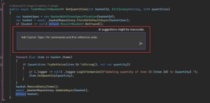
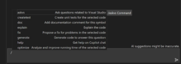
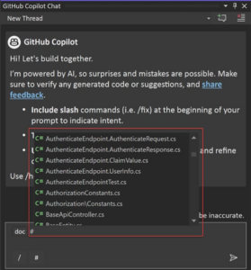
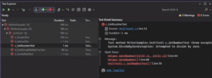
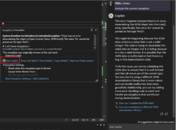
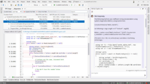
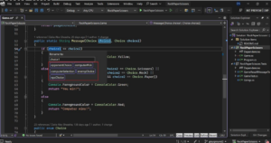
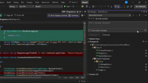
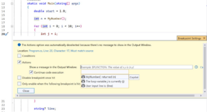
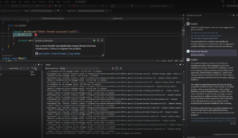

# Visual Studio中的GitHub Copilot：2023年回顾 - Visual Studio博客

> ## 摘录
>
> 在迅速发展的软件开发世界中，保持领先是至关重要的。AI在Visual Studio中的引入，特别是GitHub Copilot，已经彻底改变了开发者编码的方式。通过将Copilot集成到Visual Studio中，你可以利用AI来简化你的工作流程。
>
> 原文 [GitHub Copilot in Visual Studio: A Recap of 2023](https://devblogs.microsoft.com/visualstudio/github-copilot-in-visual-studio-a-recap-of-2023/)

---

2024年3月14日

在迅速发展的软件开发世界中，保持领先是至关重要的。AI在Visual Studio中的引入，特别是GitHub Copilot，已经彻底改变了开发者编码的方式。通过将Copilot集成到Visual Studio中，你可以利用AI来简化你的工作流程、管理大型代码库、分析异常，甚至生成提交信息。这就像你身边有一个知识渊博的配对编程者，帮助你提高生产效率，加快迭代速度，使你的应用更加可靠。以下是我们想要从去年突出展示的一些Visual Studio中的GitHub Copilot创新。

## **内联聊天视图** 

是否希望你可以直接将生成AI聊天机器人给你的代码放入编辑器中? 使用内联聊天，你可以在编辑器中直接与GitHub Copilot互动! 该功能允许你在编辑器中细化你的代码，非常适合提出有关你当前文件的特定问题，并在GitHub Copilot给出代码建议时查看差异视图。

要访问内联聊天，你需要一个有效的GitHub Copilot订阅并且在Visual Studio 17.8或更高版本中安装此扩展。要访问内联聊天，右键单击编辑器中的>问Copilot，或通过快捷键(Alt+/)。

在这里了解更多关于内联代码细化的信息：[通过GitHub Copilot聊天简化代码细化和调试 – Visual Studio博客 (microsoft.com)](https://devblogs.microsoft.com/visualstudio/simplified-code-refinement-and-debugging-with-github-copilot-chat/)

[提交内联聊天反馈](https://developercommunity.microsoft.com/t/GitHub-Copilot---Inline-Chat-Visual-Stu/10612006)

## **斜杠命令来声明意图** 

被误解是最糟糕的! 斜杠命令允许你清楚地声明你的提示背后的意图，以避免与GitHub Copilot的误解。在学习使用生成式AI聊天机器人时，当它不理解你的要求时总是令人沮丧。通过使用斜杠命令，它们允许你清楚地声明你的提示背后的意图，以避免与Copilot的误解。

斜杠命令存在于聊天窗口中。键入‘/’弹出你可以用来声明意图的命令列表，例如“/explain”来解释代码，“/doc”来记录一个方法或文件，以及更多！

在这里了解更多关于可用斜杠命令以及创建更好提示的方式：[在Visual Studio中使用GitHub Copilot聊天的提示与技巧 – Visual Studio (Windows) | Microsoft Learn](https://learn.microsoft.com/en-us/visualstudio/ide/copilot-chat-context?view=vs-2022)

[提交斜杠命令反馈](https://developercommunity.microsoft.com/t/GitHub-Copilot---Slash-Commands-Visual/10612007)

## **上下文变量细化你的范围** 

有没有想过GitHub Copilot在回答你的问题时引用了什么? 上下文变量功能允许你通过使用#符号，在你的问题中指定你的解决方案中的文件。当你引用一个文件时，Copilot可以访问其内容并提供与之相关的特定答案。

> **\[提示\]** 使用我们最新最棒的\_#\_Solution来包含你打开解决方案中所有文件的上下文，允许你将你的答案植根于其中。备注：#Solution只支持C#。
>
> 示例：“这个\_#Solution\_中哪些部分被指定为命令行界面？”

例如，你可以提出像“\_#\_Main.cs文件是如何工作的?”或者“\_#\_Calculator.cs文件的目的是什么？”这样的问题。然后Copilot聊天将根据这些文件的内容提供相关答案。这个功能通过消除手动复制和粘贴的需要来简化流程。随意在一个问题中包含多个文件以获得更高效率！

在这里了解更多关于上下文变量的信息：[通过GitHub Copilot的新功能更快更好地编码：斜杠命令和上下文变量 – Visual Studio博客 (microsoft.com)](https://devblogs.microsoft.com/visualstudio/copilot-chat-slash-commands-and-context-variables/)

[提交上下文变量反馈](https://developercommunity.microsoft.com/t/GitHub-Copilot---Context-Variables-Visu/10612008)

## **分析并修复测试窗口失败** 

使用GitHub Copilot，从来没有如此简单地分析和修复测试失败。这个AI辅助特性帮助用户分析和修复因测试假设失败或在测试执行过程中发生的异常而导致的测试失败。这个特性可以在测试资源管理器中找到，并创建一个讨论线程，允许你与GitHub Copilot互动，为你提供解释和代码修复的访问权限。当存在失败的测试时，“问Copilot”链接将出现在测试失败总结说明中，允许你与Copilot进行后续讨论。

[提交测试资源管理器反馈](https://developercommunity.microsoft.com/t/Test-Explorer---Visual-Studio/10612009)

## **AI辅助异常分析** 

是否对为什么发生异常感到困惑？现在，GitHub Copilot可以用来辅助异常分析，帮助开发者理解异常发生的原因并提出解决办法。它收集关于异常的相关信息，包括其类型、消息、来自堆栈跟踪的代码片段和局部变量值。然后这些数据发送给Copilot进行初步分析。随后，用户可以与Copilot进行进一步的对话，讨论错误，并探索可能的解决方案。

在这里了解更多关于如何使用此功能的信息：[使用GitHub Copilot调试 – Visual Studio (Windows) | Microsoft Learn](https://learn.microsoft.com/en-us/visualstudio/debugger/debug-with-copilot?view=vs-2022#ai-assisted-exceptions)

[提交AI辅助异常分析反馈](https://developercommunity.microsoft.com/t/AI-Assisted-Exception-Analysis---Visual/10612011)

通过CPU使用和仪表分析工具提出的自动见解，允许你获得关于你的代码的见解，通常涉及已知的问题模式。当展示一个自动见解时，用户现在可以使用“问Copilot”链接获得有关见解的更多详细信息。GitHub Copilot从见解中获取上下文，并使用它再次提示Copilot，以便你可以获得已给出见解的更多信息，并询问后续问题！

了解更多关于GitHub Copilot如何帮助你调试的信息：[使用GitHub Copilot调试 – Visual Studio (Windows) | Microsoft Learn](https://learn.microsoft.com/en-us/visualstudio/debugger/debug-with-copilot?view=vs-2022#ai-assisted-auto-insights)

[提交性能工具中自动见解的反馈](https://developercommunity.microsoft.com/t/Auto-Insights-in-Profiling-Tools---Visua/10612012)

## **AI提供的重命名建议** 

是否曾经为变量、方法或类的命名而纠结？你并不孤独。这个功能不仅仅提供名称建议；它学习你的标识符是如何使用的，并适应你的代码风格，提出无缝融入你的代码库的标识符。

要在Visual Studio中访问此功能，只需选择任何标识符，右键单击，并选择“重命名”(Ctrl+R, Ctrl+R)。点击重命名建议按钮或使用Ctrl+Space快捷方式。你将看到一个根据你代码上下文定制的命名建议列表。选择最符合你的名称，并按Enter键！

了解更多关于AI提供的重命名建议的信息：[命名变得简单：AI提供的重命名建议 – Visual Studio博客 (microsoft.com)](https://devblogs.microsoft.com/visualstudio/ai-powered-rename-suggestions/)

[提交AI提供的重命名建议反馈](https://developercommunity.microsoft.com/t/AI-Powered-Rename-Suggestions---Visual-S/10612013)

## **AI生成的提交信息** 

在花费数小时修复一个bug或更新一个功能后，我最不想做的事情之一就是费劲脑筋来精确解释我的Git提交内容。幸运的是，Copilot提供了解决方案。使用新生成的Git提交信息功能来简洁地描述你的变更集，并改善你的提交信息的质量和一致性，使你的代码更易于理解和维护。然后你可以通过添加变更背后的关键“为什么”来细化信息，然后提交。

使用Git更改窗口中的新“添加AI生成的提交信息”闪光笔图标来生成建议。

在这里找到更多信息：[使用GitHub Copilot撰写你的Git提交 – Visual Studio博客 (microsoft.com)](https://devblogs.microsoft.com/visualstudio/write-your-git-commits-with-github-copilot/)

[提交AI生成的提交信息反馈](https://developercommunity.microsoft.com/t/AI-Powered-Rename-Suggestions---Visual-S/10612013)

## **IntelliSense断点表达式** 

断点表达式可以帮助开发者更有效、更高效地调试代码。然而，找到最佳的断点表达式可能是具有挑战性和耗时的。这就是我们在Visual Studio中使用GitHub Copilot聊天的原因，一个AI伙伴，可以帮助我们获得IntelliSense断点表达式。GitHub Copilot可以分析我们的代码并建议最适合我们调试情景的断点表达式。省时省力的好方法！

这个功能面向创建高级断点的用户，如条件断点和跟踪点。使用断点周围代码的上下文，GitHub Copilot建议潜在的表达式用于断点条件和日志语句。备注：IntelliSense断点建议仅支持C#。

[提交IntelliSense断点表达式反馈](https://developercommunity.microsoft.com/t/Submit-Feedback-for-IntelliSense-for-Bre/10612015)

## **使用 AI 进行死锁分析**

死锁可能会在你的程序中引起严重的问题，并且检测和解决起来可能非常繁琐。有了 GitHub Copilot，死锁的神秘面纱被揭开了，通过在异常帮助器中显示它们，使用户更容易明显地看到。异常帮助器现在将包括一个“询问 Copilot”链接，在那里 Copilot 利用你的代码的上下文，以及异常帮助器累积的信息，允许用户继续向 Copilot 提问，了解他们如何可以解决死锁。

[提交死锁分析的反馈](https://developercommunity.microsoft.com/t/Submit-Feedback-for-Deadlock-Analysis-in/10612016)

## 我该如何开始？

所有这些功能以及更多现已在最近发布的 [Visual Studio 17.9](https://visualstudio.microsoft.com/downloads/) 上可用。那么，为什么还要等待呢？今天就在 Visual Studio 中安装 [Copilot](https://learn.microsoft.com/en-us/visualstudio/ide/visual-studio-github-copilot-extension?view=vs-2022) 和 [Copilot 聊天](https://learn.microsoft.com/en-us/visualstudio/ide/visual-studio-github-copilot-chat?view=vs-2022)，体验编码的未来！

## 提供反馈并保持联系

我们感谢您花时间报告问题/建议，并希望您在使用 Visual Studio 时继续向我们提供反馈，告诉我们您喜欢什么以及我们可以改进什么。

您的反馈对帮助我们使 Visual Studio 成为最佳工具至关重要！通过 [开发者社区](https://developercommunity.visualstudio.com/home%22%20/t%20%22_blank)与我们分享反馈：通过 [报告问题](https://learn.microsoft.com/visualstudio/ide/how-to-report-a-problem-with-visual-studio?view=vs-2022) 报告任何错误或问题，以及[分享您的建议](https://developercommunity.visualstudio.com/VisualStudio/suggest) 为新功能或对现有功能的改进。

通过在 [YouTube](https://www.youtube.com/@visualstudio)、[Twitter](https://twitter.com/VisualStudio)、[LinkedIn](https://www.linkedin.com/showcase/microsoft-visual-studio/)、[Twitch](https://www.twitch.tv/visualstudio) 上关注 Visual Studio 团队，以及在 [Microsoft Learn](https://learn.microsoft.com/en-us/visualstudio/?view=vs-2022) 上保持联系。
