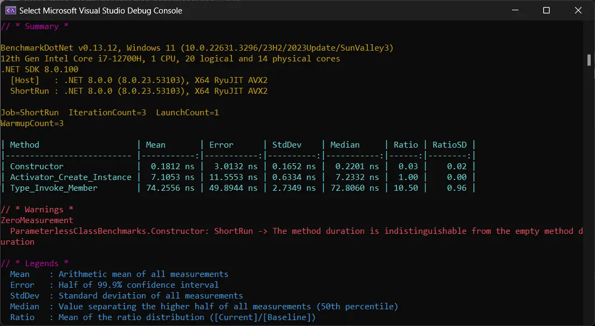
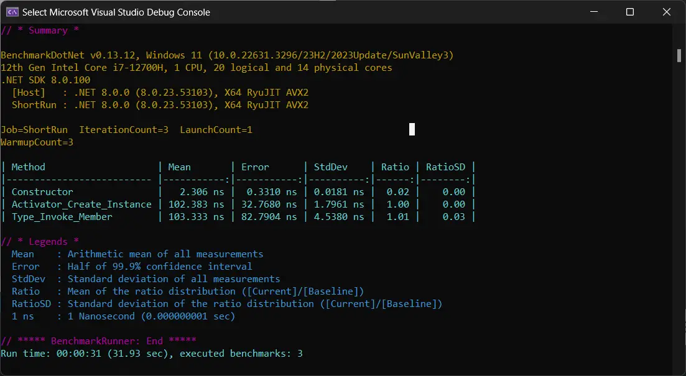
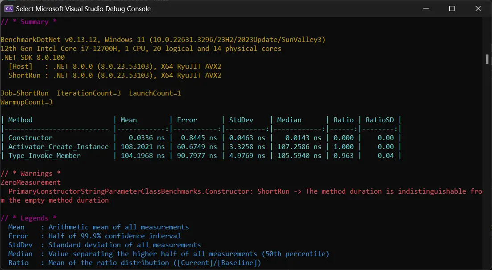

> ## 摘要
>
> 比较 Activator.CreateInstance 与 Type.InvokeMember 吧！来看一下这场面对面的战斗，了解使用 dotnet 中的反射来创建实例的方法吧！
>
> 原文 [Activator.CreateInstance vs Type.InvokeMember – A Clear Winner?](https://www.devleader.ca/2024/03/14/activator-createinstance-vs-type-invokemember-a-clear-winner/) 由 Nick Cosentino 撰写。

---

dotnet 中的反射非常强大 — 但是强大的力量伴随着巨大的责任。除了反射可能引起的各种误用之外，dotnet 反射受到批评的一个原因是因为性能。因此，我写这篇文章是为了讨论创建对象实例的两种流行方法之间的比较。这将是 Activator.CreateInstance 与 Type.InvokeMember 的战斗。

在这篇文章中，我将解释如何使用每种方法创建新类型的实例，并且还将提供一些基准测试细节来解释谁是赢家。当然，会有一点小惊喜。因此，让我们深入到 dotnet 的反射中，比较 Activator.CreateInstance 与 Type.InvokeMember 方法吧！

---

## 理解 DotNet 中的反射

DotNet 反射是一种强大的功能，它允许您在运行时检查和操作您的类型。它提供了动态加载程序集、检查和修改它们的元数据，并创建编译时未知的类型实例的能力。我一直在我的 [C# 应用程序中使用它，因为我一直在利用插件架构](https://www.devleader.ca/2024/03/12/plugin-architecture-in-c-for-improved-software-design/ "Plugin Architecture in C# for Improved Software Design")。

反射在许多高级编程场景中扮演重要角色。它使我们能够通过提供在设计时未知的类型、方法、属性和字段上进行操作的能力，构建灵活且可扩展的软件解决方案。正是这些强大的能力，使人们可以在他们的常规开发中出于可疑的原因使用它们-他们在设计中遇到了障碍，但反射允许他们直接绕过去。

然而，我觉得作为一个 C# 开发者，了解 DotNet 中的反射很重要，因为它打开了一个全新的可能性世界。有了反射，您可以构建泛型框架、实现依赖注入、创建动态代理等等。但这些通常不是您正在构建的核心 - 它们是支持部分。这就是为什么与使用反射处理您的大部分业务逻辑相比，它们可能更适合它的原因。

反射的一个关键好处是它能够使用 `Activator.CreateInstance` 或 `Type.InvokeMember` 动态创建类型的实例。这些方法允许我们在编译时不了解具体类型的情况下创建对象。在接下来的部分中，我们将探索使用反射创建实例的这两种方法，比较 `Activator.CreateInstance` 与 `Type.InvokeMember`。

---

## 使用 Activator.CreateInstance 创建实例

在 C# 中，`Activator.CreateInstance` 方法是开发者通过反射创建实例最流行的方式之一。它允许在运行时创建类的新实例，即使事先不了解它们的具体类型。这个方法属于 `System.Activator` 类，并且常用于需要动态实例化的场景。

`Activator.CreateInstance` 的主要目的是动态创建类的实例 — 因此，如果在编译时可以访问类型，那么您可能没有充分的理由使用这个方法！`Activator.CreateInstance` 特别有用的情况是，在运行时才知道要创建的对象类型，例如在加载插件或处理动态加载的程序集时。它消除了编码显式构造函数的需要，并在对象创建中提供了灵活性。

### 使用 Activator.CreateInstance 的优势和劣势

使用 `Activator.CreateInstance` 与普通对象实例化相比提供了几个优势：

- 允许延后绑定对象创建，这在运行时对象类型可能变化的场景中很有利。
- 通过消除处理不同对象类型的 switch 语句或 if-else 条件，可以简化代码库。
- 提供了一种动态和可扩展的对象创建方法。

然而，在使用 `Activator.CreateInstance` 时也需要考虑一些劣势：

- 由于在运行时解析类型所涉及的额外步骤，使用反射的性能开销可能比直接实例化更高。
- `Activator.CreateInstance` _**通常**_ 依赖于存在一个公共无参数构造函数。否则，您需要持续知道哪些参数需要传递 — 如果您正在为许多不同类型动态地执行此操作，这将是一个挑战。
- 当目标类型被修改时，容易出现错误，因为在签名兼容性方面没有编译时检查。

### 使用 Activator.CreateInstance 的代码示例

以下代码示例演示了如何使用 `Activator.CreateInstance` 动态创建实例：

```csharp
// 示例 1：创建已知类型的实例
Type objectType = typeof(MyClass);
object instance = Activator.CreateInstance(objectType);
```

在示例 1 中，我们使用 `typeof` 获取表示已知类 `MyClass` 的 `Type` 对象。然后，我们使用 `Activator.CreateInstance` 创建 `MyClass` 的一个新实例。

```csharp
// 示例 2：在运行时创建未知类型的实例
string typeName = "MyNamespace.MyClass";
Type unknownType = Type.GetType(typeName);
object dynamicInstance = Activator.CreateInstance(unknownType);
```

在示例 2 中，我们有一个由字符串 `typeName` 表示的未知类型。我们使用 `Type.GetType` 根据提供的类型名称获取 `Type` 对象。最后，使用 `Activator.CreateInstance` 创建动态确定类型的新实例。

我们将看看另一个示例，我们可以在其中传递构造函数参数 - 再次，假设我们将知道签名，因为我们不能通过这种方法在编译时证明它：

```csharp
// 示例 3：使用构造函数参数创建实例：
string typeName = "MyNamespace.MyClass";
Type unknownType = Type.GetType(typeName);
Object dynamicInstance = Activator.CreateInstance(
    unknownType,
    new[]
    {
        "Hello World!", //  这是单个字符串参数！
    });
```

---

## 使用 Type.InvokeMember 创建实例

`Type.InvokeMember` 是我们从 DotNet 中的反射中可用的一种方法，它允许我们动态创建一个类型的实例。它提供了一种在运行时利用手头类型信息实例化对象的灵活方式。因此，就您可能会利用它来创建对象实例的方式来说，它与 `Activator.CreateInstance` 非常相似。

### 使用 Type.InvokeMember 的优势和劣势

这里是使用 `Type.InvokeMember` 而不是普通对象实例化的一些通用优势：

- 允许延后绑定对象创建，这在运行时对象类型可能变化的场景中很有利。
- 通过消除处理不同对象类型的 switch 语句或 if-else 条件，可以简化代码库。
- 提供了一种动态和可扩展的对象创建方法。

等等一分钟… 这不是我们以上看到的 `Activator.CreateInstance` 的相同列表吗？没错。所以让我们缩短这一部分。直到我们开始看性能 — 或许在一些非常具体的边缘情况中，我们都不会看到任何大的区别。但总的来说，两者都提供了非常全面的方法来动态实例化对象，而且 InvokeMember 更加冗长，因为它处理的不仅仅是构造函数。

让我们在看基准测试之前检查一些代码。

### 使用 Type.InvokeMember 的代码示例

这里是一个使用 `Type.InvokeMember` 动态创建类型实例的代码示例：

```csharp
// 示例 1：创建已知类型的实例
Type objectType = typeof(MyClass);
var instance = objectType
.InvokeMember(
    null,
    BindingFlags.CreateInstance,
    null,
    null,
    null);
```

在上述示例中，我们首先获取代表类 "MyClass" 的 Type 对象。然后我们使用 Type.InvokeMember 创建该类的一个实例并将其分配给 "instance" 变量。这允许我们在不显式指定类名的情况下动态创建 "MyClass" 的对象。

而且，要在编译时不知道类的情况下做到这一点，就非常像之前那样。这部分与 InvokeMember 无关：

```csharp
// 示例 2：在运行时创建未知类型的实例
string typeName = "MyNamespace.MyClass";
Type unknownType = Type.GetType(typeName);
var instance = objectType.InvokeMember(
    null,
    BindingFlags.CreateInstance,
    null,
    null,
    null);
```

最后，如果我们需要传入一些构造函数参数，我们也可以这样做：

```csharp
// 示例 3：使用构造函数参数创建实例：
string typeName = "MyNamespace.MyClass";
Type unknownType = Type.GetType(typeName);
var instance = objectType.InvokeMember(
    null,
    BindingFlags.CreateInstance,
    null,
    null,
    new[]
    {
        "Hello World!",
    });
```

---

好了 - 进入精彩的部分。我们将查看[对这些不同方法进行基准测试](https://www.devleader.ca/2024/03/05/how-to-use-benchmarkdotnet-simple-performance-boosting-tips-to-get-started/ "如何使用 BenchmarkDotNet：开始时的 6 个简单性能提升技巧")，看看除了 API 使用之外，这两者之间有什么不同。如果您没有太多使用 BenchmarkDotNet 的经验，并想看到更多，请[查看这个关于如何使用 BenchmarkDotNet 的视频](https://youtu.be/Hqeq9ycqteQ)：

### 反射性能的 BenchmarkDotNet 设置

我想到了我们可以使用 BenchmarkDotNet 进行基准测试的三种情况：

- 无参数构造函数类
- 具有单个字符串参数的构造函数
- 具有单个字符串参数的主构造函数

我想加入主构造函数，因为我知道这是一个让很多人激动的功能 - 不妨拿到一些数据！以下是我们将实例化的类，以供参考：

```csharp
public class ParameterlessClass
{
}

public class ClassicStringParameterClass
{
    private readonly string _value;

    public ClassicStringParameterClass(string value)
    {
        _value = value;
    }
}

public class PrimaryConstructorStringParameterClass(
    string _value)
{
}
```

至于基准测试，我们将查看以下我们将运行的类。请记住，我将 `Activator.CreateInstance` 用作基准，因为我想比较 `Activator.CreateInstance` 与 `Type.InvokeMember` - 我只是将正常构造函数路径作为参考包括在内。

```csharp
[ShortRunJob]
public class ParameterlessClassBenchmarks
{
    private Type? _type;

    [GlobalSetup]
    public void GlobalSetup()
    {
        _type = typeof(ParameterlessClass);
    }

    [Benchmark]
    public void Constructor()
    {
        var instance = new ParameterlessClass();
    }

    [Benchmark(Baseline = true)]
    public void Activator_Create_Instance()
    {
        var instance = Activator.CreateInstance(_type!);
    }

    [Benchmark]
    public void Type_Invoke_Member()
    {
        var instance = _type!.InvokeMember(
            null,
            BindingFlags.CreateInstance,
            null,
            null,
            null);
    }
}

[ShortRunJob]
public class ClassicStringParameterClassBenchmarks
{
    private Type? _type;

    [GlobalSetup]
    public void GlobalSetup()
    {
        _type = typeof(ClassicStringParameterClass);
    }

    [Benchmark]
    public void Constructor()
    {
        var instance = new ClassicStringParameterClass("Hello World!");
    }

    [Benchmark(Baseline = true)]
    public void Activator_Create_Instance()
    {
        var instance = Activator.CreateInstance(
            _type!,
            new[]
            {
                "Hello World!",
            });
    }

    [Benchmark]
    public void Type_Invoke_Member()
    {
        var instance = _type!
            .InvokeMember(
                null,
                BindingFlags.CreateInstance,
                null,
                null,
                new[]
                {
                    "Hello World!",
                });
    }
}

[ShortRunJob]
public class PrimaryConstructorStringParameterClassBenchmarks
{
    private Type? _type;

    [GlobalSetup]
    public void GlobalSetup()
    {
        _type = typeof(PrimaryConstructorStringParameterClass);
    }

    [Benchmark]
    public void Constructor()
    {
        var instance = new PrimaryConstructorStringParameterClass("Hello World!");
    }

    [Benchmark(Baseline = true)]
    public void Activator_Create_Instance()
    {
        var instance = Activator.CreateInstance(
            _type!,
            new[]
            {
                "Hello World!",
            });
    }

    [Benchmark]
    public void Type_Invoke_Member()
    {
        var instance = _type!
            .InvokeMember(
                null,
                BindingFlags.CreateInstance,
                null,
                null,
                new[]
                {
                    "Hello World!",
                });
    }
}
```

### Activator.CreateInstance vs Type.InvokeMember: 谁是冠军？

当我们把这两个Reflection方法放在一起比较时，赢家是…情况性的。在最常见的情况之一中，我会说有一个非常明确的赢家，但对于其他情况，它们非常接近。但请确保你读到结论，因为这并不是故事的结尾。

我们要看的第一个基准测试是无参数构造函数：



这里的明确赢家是：`Activator.CreateInstance`，几乎是数量级的胜利。如果你的构造函数没有任何参数，你最好的选择就是这个。

接下来，让我们看看`Activator.CreateInstance`与`Type.InvokeMember`对于采用单个字符串参数的构造函数的比较：



赢家？没那么明显。这里基本上是并驾齐驱，即使`Activator.CreateInstance`略领先，但几乎可以忽略不计。

我们要看的最后一个场景将是主构造函数，这个案例中，是一个采用单个字符串参数的主构造函数：



赢家：`Type.InvokeMember`，但只是稍微领先一点。在前一个基准测试中看到的情况正好相反，非常有趣！

---

## 常见问题解答：Type.InvokeMember

### DotNet中的Reflection是什么？

DotNet Reflection是一种机制，它允许你在运行时检查和操作类型。

### 为什么DotNet中的Reflection重要？

DotNet Reflection很重要，因为它支持动态行为，例如创建实例、绑定方法和访问类型信息。

### 使用DotNet Reflection创建实例的两种方法是什么？

使用DotNet Reflection创建实例的两种流行方法是Activator.CreateInstance和Type.InvokeMember。

### 什么是Activator.CreateInstance？

Activator.CreateInstance是一个在运行时动态创建类型实例的方法。

### 什么是Type.InvokeMember？

Type.InvokeMember是一个在运行时动态调用类型的成员（如构造函数、方法或属性）的方法。
