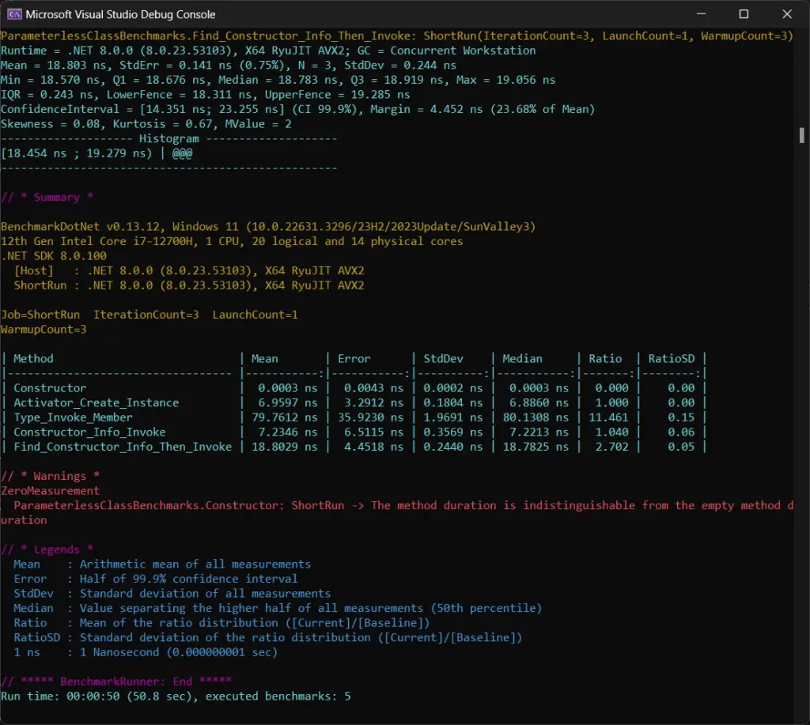
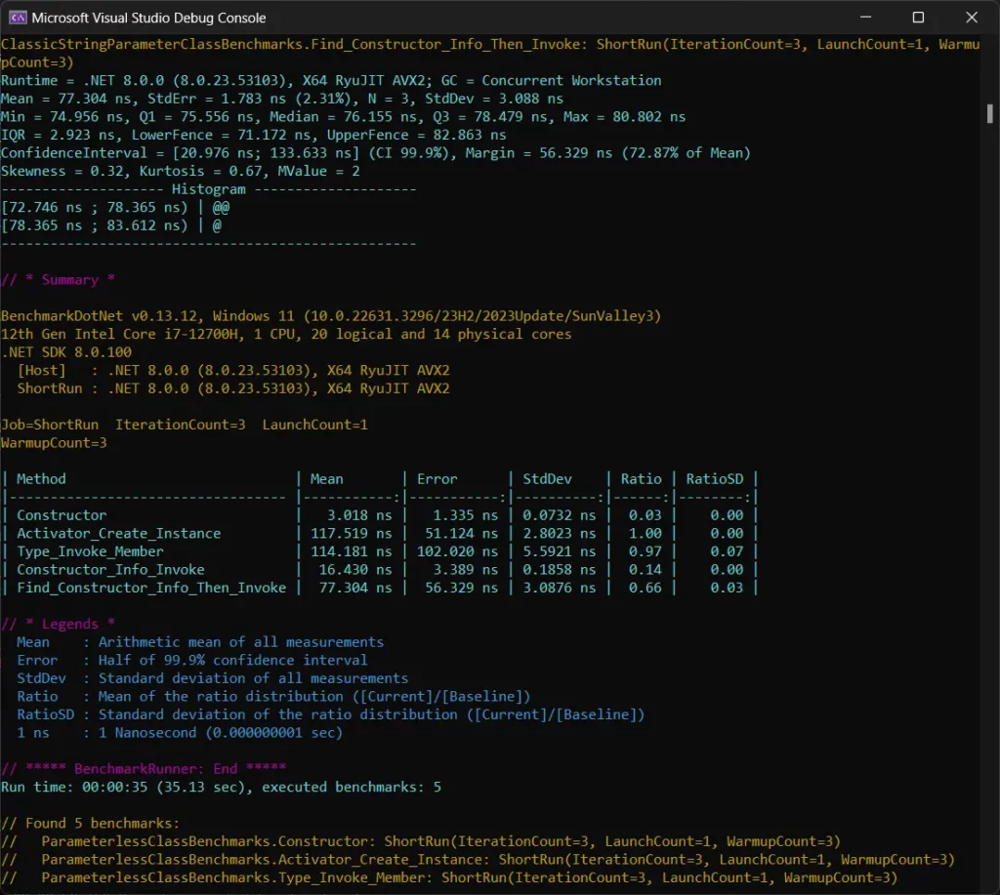
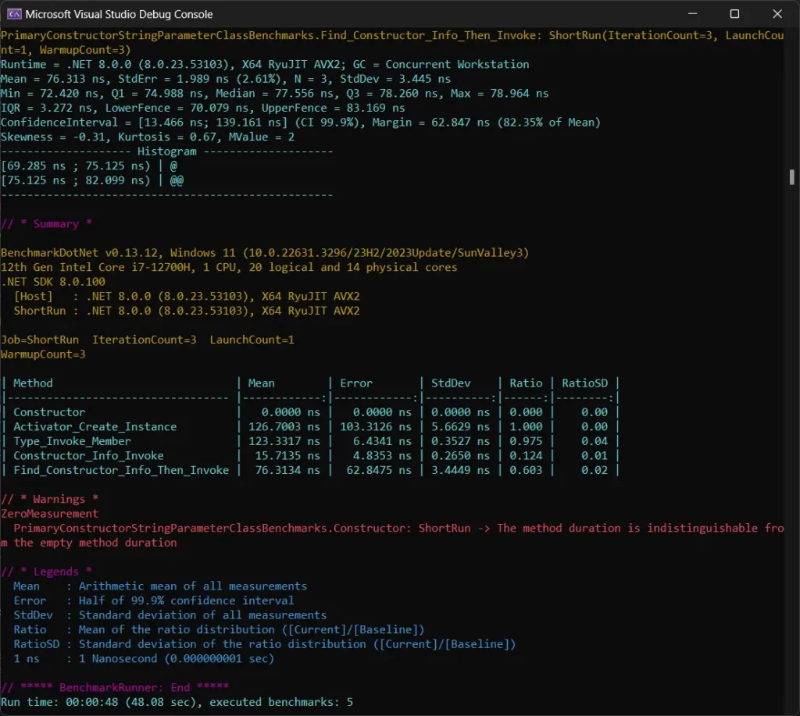

# ConstructorInfo：使用DotNet反射进行更快的实例化

> ## 摘要
>
> 使用DotNet中的反射创建对象实例？比较ConstructorInfo与DotNet反射中提供的其他方法的性能！
>
> 本文翻译自Nick Cosentino的文章[ConstructorInfo: How to Make Reflection in DotNet Faster for Instantiation](https://www.devleader.ca/2024/03/17/constructorinfo-how-to-make-reflection-in-dotnet-faster-for-instantiation/ "ConstructorInfo: How to Make Reflection in DotNet Faster for Instantiation")。

---

最近我写了一篇文章，比较了使用DotNet反射创建对象实例的一种流行方式与另一种方式。在那篇文章中，我将[Activator.CreateInstance与Type.InvokeMember进行了对比](https://www.devleader.ca/2024/03/14/activator-createinstance-vs-type-invokemember-a-clear-winner/ "Activator.CreateInstance vs Type.InvokeMember – 明确的胜者？")，看看哪种方法的性能更佳。结果是Activator.CreateInstance在一个特定情况下胜出 — 但另一个冠军将出现：ConstructorInfo。

在这篇文章中，我将解释如何使用DotNet中的反射获取ConstructorInfo引用。我还将扩展上一篇文章中的基准测试，向你展示代码以及结果如何。

---

## 本文内容：ConstructorInfo和DotNet中的反射

### 从DotNet反射了解ConstructorInfo

在DotNet反射中，我们获得了一套强大的工具，用于在运行时检查程序集、类型和成员。这些反射能力的关键组件之一是`ConstructorInfo`类，它属于System.Reflection命名空间。这里面都是好东西 — [甚至是这个视频中展示的可以在错误的手中被滥用的那些](https://youtu.be/3Qstc-ND8Oo "没有C#开发者应该拥有的力量——反射的黑暗面")：

`ConstructorInfo`允许开发者获取有关类的构造函数的信息，包括它们的可访问性（公共、私有等）、参数和元数据。但最好的部分，我们将更详细地查看的是，它使得可以在运行时动态地实例化对象，而无需在编译时知道它们的类型。

而且最棒的是？我们将看到，当我们将其与[这些其他DotNet反射机制进行新实例创建的比较](https://www.devleader.ca/2024/03/14/activator-createinstance-vs-type-invokemember-a-clear-winner/ "Activator.CreateInstance vs Type.InvokeMember – 明确的胜者？")时，它的速度要快得多。

---

## 在DotNet中使用反射查找构造函数 - 获取ConstructorInfo

在本节中，我们将看看如何首先获得`ConstructorInfo`实例，以便稍后可以利用它们进行对象实例化：

1.  从类型中获取`ConstructorInfo`实例
2.  查找正确的构造函数
3.  …
4.  利润！

差不多是这样吧？让我们来看看这些代码示例！

### 获取所有公共构造函数的ConstructorInfo

要检索类的所有公共构造函数，可以使用不带任何参数的`GetConstructors`方法，通过特定类型的`Type`实例。这个方法返回一个`ConstructorInfo`对象数组，表示为该类定义的每个公共构造函数。

让我们在这个代码示例中看到这个动作：

```csharp
using System;
using System.Reflection;

public class SampleClass
{
    public SampleClass() { }
    public SampleClass(int i) { }
    protected SampleClass(string s) { }
    private SampleClass(int i, string s) { }
}

Type typeInfo = typeof(SampleClass);
ConstructorInfo[] publicConstructors = typeInfo.GetConstructors();

foreach (var constructor in publicConstructors)
{
    Console.WriteLine(constructor.ToString());
}
```

当我们考虑动态调用这些东西时，很可能我们没有类型的引用。但是，如果我们知道我们感兴趣的类型的名称，我们可以使用以下方式：

```csharp
Type typeOfInterest = Type.GetType("The.Namespace.Of.Your.Type.TheTypeName");
```

### 获取包括私有和保护构造函数的ConstructorInfo

要获取所有构造函数的信息，无论它们的可访问性级别如何，可以使用带有`BindingFlags`参数的`GetConstructors`方法。这种方法允许你在结果中包含非公共构造函数：

```csharp
ConstructorInfo[] allConstructors = typeInfo.GetConstructors(BindingFlags.Public | BindingFlags.NonPublic | BindingFlags.Instance);

foreach (var constructor in allConstructors)
{
    Console.WriteLine(constructor.ToString());
}
```

请记住，如果你观看了我上面链接的视频，这开始进入“我应该这么做吗？”的领域。请强烈考虑一下你是否需要访问非公共的东西 — 某人很可能出于某种原因选择了那个访问修饰符。

### 获取匹配特定签名的ConstructorInfo

如果你正在寻找与特定参数签名匹配的构造函数，你可以使用`GetConstructorInfo`（注意它是单数）。这需要绑定标志，就像我们之前看到的一样，以及你想要匹配的类型数组。

以下是如何找到接受单个`int`参数的构造函数的方式：

```csharp
// 指定你正在寻找的
// 构造函数的参数类型
Type[] paramTypes = new Type[] { typeof(int) };

// 使用适当的
// BindingFlags和参数类型使用GetConstructor
var constructor = typeInfo.GetConstructor(
    BindingFlags.Public | BindingFlags.Instance,
    paramTypes);

if (constructor != null)
{
    Console.WriteLine(constructor);
}
else
{
    Console.WriteLine("没有找到匹配的构造函数！");
}
```

请注意，当没有匹配时，这个方法将返回null，所以确保你找到了你在寻找的东西！

---

## 使用ConstructorInfo创建对象实例

一旦我们有了一个`ConstructorInfo`实例，我们就可以开始创建对象实例。这就是我们在接下来的部分要进行基准测试的内容！

在这些示例中，假设我们已经有了一个名为constructorInfo的`ConstructorInfo`实例。我们将以本文前面记录的任何方式获取这个实例：

```csharp
object instance = constructorInfo.Invoke(null);
```

上面的代码展示了使用无参数构造函数实例化对象。我们传入null作为需要提供的参数列表 — 因为没有参数。注意，我们回来的类型是一个`object`。如果我们在编译时可以访问该类型，我们可以将这个实例转换为那个类型...但是，如果我们在编译时可以访问实例，那么我们可能很少有充分的理由这样做。如果你不相信我，等到你看到基准测试的结果。

如果我们想要使用带参数的构造函数进行实例化，它看起来会像下面这样：

```csharp
object instance = constructorInfo.Invoke(new object[] { 42 });
```

这个代码示例显示了一个定义了单个整数参数的构造函数被调用，42作为单个整数参数被传递。

---

## ConstructorInfo性能基准测试

你们所有人都在等待的时刻！你可能会喜欢在这里观看展示这些DotNet反射基准测试的视频：

### BenchmarkDotNet设置反射性能

就像之前的文章一样，我只是为`ConstructorInfo`场景添加了几个额外的情况。我想提到的是，我为每个类添加了两种情形，那是因为我想展示如果你必须连续去实例化并找回`ConstructorInfo`的性能。我认为，与已经拥有`ConstructorInfo`的情况相比，这种变化将是有趣的。

这是完整的代码，你[也可以在GitHub上找到](https://github.com/ncosentino/DevLeader/tree/master/ReflectionExamples/ReflectionExamples.ActivatorVsInvokeMemberBenchmarks "ReflectionExamples/ReflectionExamples.ActivatorVsInvokeMemberBenchmarks - GitHub")：

```csharp
//
// 此代码是为以下Dev Leader内容编写的：
// https://www.devleader.ca/2024/03/14/activator-createinstance-vs-type-invokemember-a-clear-winner/
// https://www.devleader.ca/2024/03/17/constructorinfo-how-to-make-reflection-in-dotnet-faster-for-instantiation/
// https://youtu.be/Djq7eMI_L-4
//
using BenchmarkDotNet.Attributes;
using BenchmarkDotNet.Running;

using System.Reflection;

BenchmarkRunner.Run(Assembly.GetExecutingAssembly());
//BenchmarkSwitcher.FromAssembly(Assembly.GetExecutingAssembly()).RunAllJoined();

public class ParameterlessClass
{
}

public class ClassicStringParameterClass
{
    private readonly string _value;

    public ClassicStringParameterClass(string value)
    {
        _value = value;
    }
}

public class PrimaryConstructorStringParameterClass(
    string _value)
{
}

[ShortRunJob]
public class ParameterlessClassBenchmarks
{
    private Type? _type;
    private ConstructorInfo? _constructorInfo;

    [GlobalSetup]
    public void GlobalSetup()
    {
        _type = typeof(ParameterlessClass);
        _constructorInfo = _type.GetConstructor(Type.EmptyTypes);
    }

    [Benchmark]
    public void Constructor()
    {
        var instance = new ParameterlessClass();
    }

    [Benchmark(Baseline = true)]
    public void Activator_Create_Instance()
    {
        var instance = Activator.CreateInstance(_type!);
    }

    [Benchmark]
    public void Type_Invoke_Member()
    {
        var instance = _type!.InvokeMember(
            null,
            BindingFlags.CreateInstance,
            null,
            null,
            null);
    }

    [Benchmark]
    public void Constructor_Info_Invoke()
    {
        var instance = _constructorInfo!.Invoke(null);
    }

    [Benchmark]
    public void Find_Constructor_Info_Then_Invoke()
    {
        var constructorInfo = _type.GetConstructor(Type.EmptyTypes);
        var instance = constructorInfo!.Invoke(null);
    }
}

[ShortRunJob]
public class ClassicStringParameterClassBenchmarks
{
    private Type? _type;
    private ConstructorInfo? _constructorInfo;

    [GlobalSetup]
    public void GlobalSetup()
    {
        _type = typeof(ClassicStringParameterClass);
        _constructorInfo = _type.GetConstructor([typeof(string)]);
    }

    [Benchmark]
    public void Constructor()
    {
        var instance = new ClassicStringParameterClass("Hello World!");
    }

    [Benchmark(Baseline = true)]
    public void Activator_Create_Instance()
    {
        var instance = Activator.CreateInstance(
            _type!,
            new[]
            {
                "Hello World!",
            });
    }

    [Benchmark]
    public void Type_Invoke_Member()
    {
        var instance = _type!
            .InvokeMember(
                null,
                BindingFlags.CreateInstance,
                null,
                null,
                new[]
                {
                    "Hello World!",
                });
    }

    [Benchmark]
    public void Constructor_Info_Invoke()
    {
        var instance = _constructorInfo!.Invoke(new[]
        {
            "Hello World!",
        });
    }

    [Benchmark]
    public void Find_Constructor_Info_Then_Invoke()
    {
        var constructorInfo = _type.GetConstructor([typeof(string)]);
        var instance = constructorInfo!.Invoke(new[]
        {
            "Hello World!",
        });
    }
}

[ShortRunJob]
public class PrimaryConstructorStringParameterClassBenchmarks
{
    private Type? _type;
    private ConstructorInfo? _constructorInfo;

    [GlobalSetup]
    public void GlobalSetup()
    {
        _type = typeof(PrimaryConstructorStringParameterClass);
        _constructorInfo = _type.GetConstructor([typeof(string)]);
    }

    [Benchmark]
    public void Constructor()
    {
        var instance = new PrimaryConstructorStringParameterClass("Hello World!");
    }

    [Benchmark(Baseline = true)]
    public void Activator_Create_Instance()
    {
        var instance = Activator.CreateInstance(
            _type!,
            new[]
            {
                "Hello World!",
            });
    }

    [Benchmark]
    public void Type_Invoke_Member()
    {
        var instance = _type!
            .InvokeMember(
                null,
                BindingFlags.CreateInstance,
                null,
                null,
                new[]
                {
                    "Hello World!",
                });
    }

    [Benchmark]
    public void Constructor_Info_Invoke()
    {
        var instance = _constructorInfo!.Invoke(new[]
        {
            "Hello World!",
        });
    }

    [Benchmark]
    public void Find_Constructor_Info_Then_Invoke()
    {
        var constructorInfo = _type.GetConstructor([typeof(string)]);
        var instance = constructorInfo!.Invoke(new[]
        {
            "Hello World!",
        });
    }
}
```

## ConstructorInfo基准测试结果，来自BenchmarkDotNet

无参数构造函数的第一组结果将是：



在上面的结果中，我们显然已经知道，不使用反射，我们获得最佳速度。这里没什么大惊小怪。BenchmarkDotNet称它太快了，甚至无法正确测量。但是我们会注意到，`Activator.CreateInstance`在这里技术上略快一点比使用`ConstructorInfo`，即使我们提前拥有了实例。结果非常接近，我见过这种情况反过来。所以总的来说，这两种情况在这种情况下非常相似。

如果我们需要使用参数怎么办呢？



上面的BenchmarkDotNet结果显示，对于接受单个字符串参数的经典样式构造函数，`ConstructorInfo`比其他DotNet反射选项快一个数量级。即使我们需要首先查找实例，它仍然几乎是其他选项的两倍快！

当然，我想看看主构造函数的行为是否有所不同：



基于上面的结果，它们表现得非常平均！

---

## 常见问题：ConstructorInfo 和在 DotNet 中的反射

### 什么是 .NET 中的 ConstructorInfo？

**ConstructorInfo** 是 .NET 框架中的一个类，代表了一个类或结构体的构造函数。它是 System.Reflection 命名空间的一部分，并提供了关于构造函数的元数据，如它们的参数、可访问性（公共、私有等），并允许动态地实例化对象。

### 如何使用 ConstructorInfo 动态创建类的实例？

你可以使用 `ConstructorInfo.Invoke` 方法在 .NET 中动态创建一个类的实例。这个方法需要一个对象数组作为参数，这些参数对应于你希望调用的构造函数的参数。对于没有参数的构造函数，传递 `null` 或一个空数组。

### 在 .NET 应用程序中使用 ConstructorInfo 能提高性能吗？

虽然使用 **ConstructorInfo** 和反射来动态实例化对象提供了灵活性，但它可能比直接使用 `new` 关键字实例化更慢。然而，像缓存 `ConstructorInfo` 对象或使用表达式这样的技术可以减少性能开销，并使反射更有效率。

### 如何使用反射在 DotNet 中获取类的所有构造函数？

要获取类的所有公共构造函数，可以在 `Type` 对象上不带参数地使用 `GetConstructors` 方法。要包括非公共构造函数（例如，私有、受保护的），指定 `BindingFlags`，如 `BindingFlags.Public | BindingFlags.NonPublic | BindingFlags.Instance` 作为 `GetConstructors` 的参数。

### 如何在 .NET 中找到具有特定参数的构造函数？

要按其参数类型查找特定构造函数，请在 `Type` 对象上使用 `GetConstructor` 方法，传递一个 `Type` 对象数组，这些对象代表构造函数的参数。这个方法返回与签名匹配的单个 `ConstructorInfo` 实例，如果没有找到匹配项，则返回 `null`。

### 使用反射在 .NET 中有什么性能影响？

由于类型检查和动态方法调用的开销，反射在 .NET 中会引入性能影响。然而，这些可以通过优化策略（如缓存、使用轻量级反射替代品或在性能关键路径中避免反射）来最小化。

### 是否可以使用 ConstructorInfo 与私有构造函数一起使用？

是的，**ConstructorInfo** 可以用来调用类的私有构造函数。这需要用适当的 `BindingFlags` 获取 `ConstructorInfo` 对象以包含非公开成员，然后调用 `Invoke` 方法。这种技术应谨慎使用，尊重类设计意图的封装。
