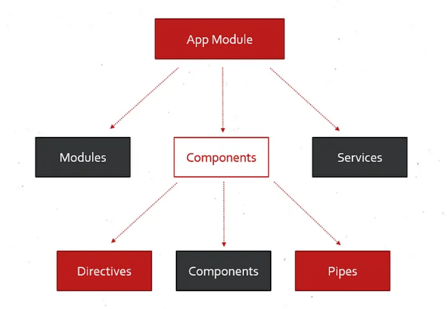
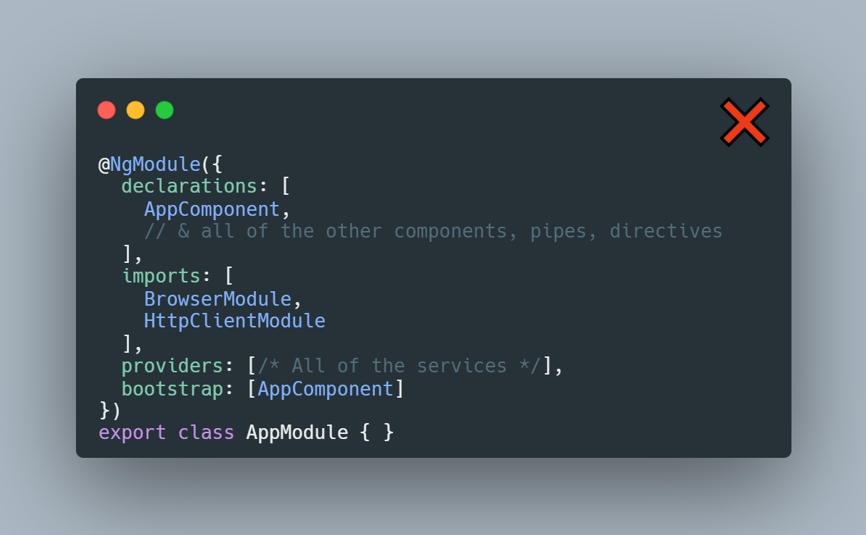
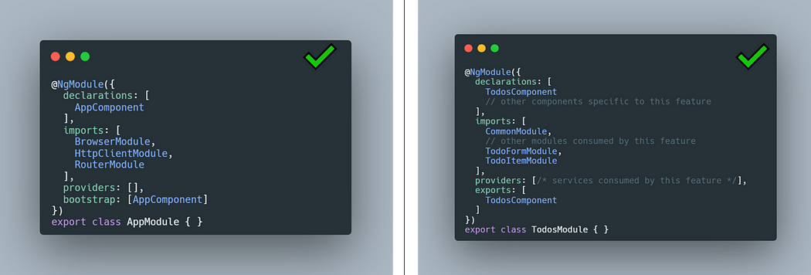
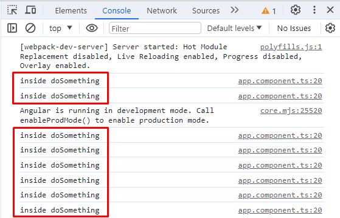
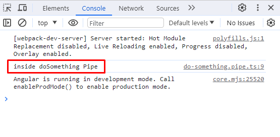
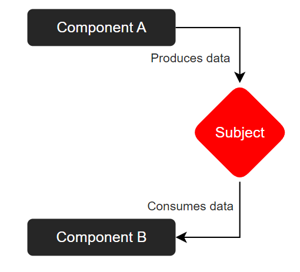
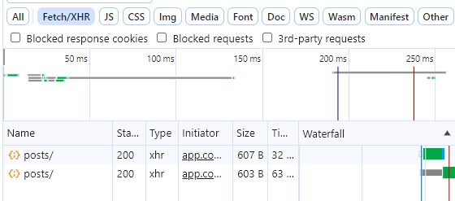
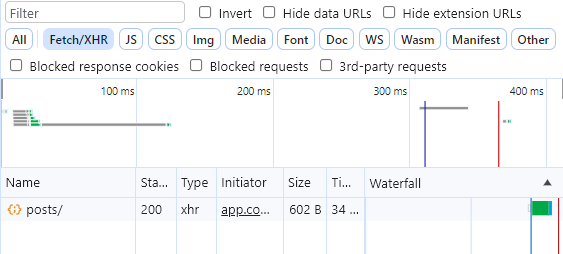

> ## Excerpt
>
> 提升你的 Angular 应用的开发、模块化和性能。
>
> 原文 [10 Angular Dos & Don’ts](https://mirzaleka.medium.com/10-angular-dos-donts-395696d97391)

## #1 关注点分离

Angular 架构的美在于分割代码库。

- **Components** — 可重用的构建块，包含业务部分并创造 UI。
- **Directives** — 在模板中为 UI 元素添加新行为或修改现有行为的类。
- **Pipes** — 在模板中使用的函数，将数据作为输入并将其转换为输出。
- **Services** — 处理业务逻辑并与 API 通信的类。
- **Modules** — 将 Components, Directives, Pipes, 和 Services 组合成功能的类。



这种分离遵守了单一职责原则，结果是更干净的代码库。

避免在主模块中导入所有的组件、指令和服务。



相反，按模块（功能模块）分割功能。当你只在其中导入与你的功能相关的部分时，模块将保持较小并且代码更清晰。



这可以与 Router 结合使用，以启用 **Lazy Loading**。

```ts
const routes: Routes = [
  {
    path: "home",
    component: HomeComponent,
  },
  {
    path: "todos",
    // 懒加载路由
    loadChildren: () => import("./Todos.module").then(m => m.TodosModule),
  },
];
```

在此示例中，**Todos** 模块及其依赖项将仅在 landing 到指定路由之后加载。主模块中使用的依赖项越少，你的应用程序将加载得越快。

## #2 使用 Angular CLI

Angular CLI 是一个内置工具，通过自动生成应用程序部分和连接依赖项来加速应用程序开发。

开始时，你可以使用以下命令生成一个新的 Angular 应用程序：

```shell
ng new my-app
```

不要手动在你的代码库中创建文件，使用 CLI：

▶ 生成新的组件：

```shell
ng g c component-name
```

▶ 生成服务：

```shell
ng g s service-name
```

▶ 生成管道：

```shell
ng g p pipe-name
```

▶ 预览将要生成的内容

```shell
ng g c modules/components/blog --dry-run

CREATE src/app/modules/components/blog/blog.component.html (19 bytes)
CREATE src/app/modules/components/blog/blog.component.spec.ts (545 bytes)
CREATE src/app/modules/components/blog/blog.component.ts (195 bytes)
CREATE src/app/modules/components/blog/blog.component.scss (0 bytes)
UPDATE src/app/app.module.ts (595 bytes)

注意：“--dry-run”选项意味着没有进行任何更改。
```

类似的操作。
CLI 还允许你安装属于 Angular 标准库的包。例如：

```shell
ng add @angular/material
```

## #3 使用框架工具

不要用原生 JavaScript API（如 Document、Fetch）从零开始复制已有的轮子或执行手动表单验证。使用框架内置的工具。

Angular 提供了大量开发功能：

- 路由间的导航（Router）
- API 通信（HTTP Client）
- 状态管理（Rx.js, Signals）
- DOM 操作（ElementRef）
- 创建表单（响应式和模板驱动）
- 截取和缓存 API 调用（HTTP Client Interceptor）
- 限制路由访问（Route Guard）
- 测试框架（Jasmine）
- 条件显示 UI 元素（ngIf、ngSwitch、ngFor）等。

## #4 Pipes

假设你需要在模板中转换一个值。自然地，你会在组件的 TypeScript 文件中创建一个函数并执行类似下面的操作：

```html
<h2>{{ doSomething(someFormValue) }}</h2>
```

这将起作用，但它对性能非常不利，因为每次重新渲染时都会重复调用该函数。



在这些场景中，你应该使用 Pipes。生成管道后，

```shell
ng g pipe doSomething
```

```ts
@Pipe({
  name: "doSomething",
})
export class DoSomethingPipe implements PipeTransform {
  transform(value: unknown, ...args: unknown[]): unknown {
    // 执行一些转换
    console.log("inside doSomething Pipe");
    return "transformed-data";
  }
}
```

使用管道（**|**）符号在模板中应用它。

```html
<h2>{{ someFormValue | doSomething }}</h2>
```

现在你有了通过 Pipe 构建的完全相同的功能。两种方法之间的区别立即显而易见。



## #5 利用依赖注入

Angular 最强大的特性之一是依赖注入。与其组件自己创建其依赖项，例如：

```ts
// 手动创建实例
private service = new PostsService();
```

它们可以从外部提供，并通过构造函数（或 `inject()` 函数）注入：

```ts
 constructor(private readonly service: PostsService) { }
```

底层依赖项在模块中注册为提供者：

```ts
@NgModule({
  declarations: [AppComponent],
  imports: [BrowserModule, HttpClientModule],
  providers: [PostsService], // <-- 注册 PostsService 依赖项
  bootstrap: [AppComponent],
})
export class AppModule {}
```

服务还可以设置一个 `providedIn` 标志，显示它在哪里提供。在这种情况下，默认情况下服务是在根模块提供的，这消除了需要在提供者数组中出现服务的必要。

```ts
@Injectable({
  providedIn: 'root'
})
export class PostsService
```

有了依赖注入，Angular 代码变得：

- 可复用
- 模块化
- 更容易测试（因为你可以轻松地用模拟的依赖项替换真实的依赖项）

这只是 Angular 中依赖注入的开始。如果你想了解更多，我建议你查阅以下主题：

- 注入器
- 注入令牌
- 覆盖依赖项（`useClass`、`useValue`、`useFactory`）
- 组件关系（`@self`、`@skipSelf`、`@host`、`@optional`）

## #6 在非相关组件之间共享数据

常见做法是在组件之间使用 **Input** 和 **Output** 指令来共享数据。这在你有父到子或子到父组件关系时非常棒。

然而，如果你需要向孙子或曾孙子组件或一个兄弟组件发送数据，那么这将是一项艰巨的工作。更不用说如果你必须更新数据，你将不得不在所有地方进行更改。

为了避免这种情况，你可以使用 Rx.js **Behavior Subject** 来建立一个存储数据的中央位置，以供消费者检索。



一切都是基于 **发布者-订阅者** 模式进行的。一个组件将数据推送到 Subject，而另一个组件通过订阅 Observable 来消费数据。

## 创建状态服务

为了看到这个动作中的创建方式，创建一个新的服务和一个带有默认计数（**1**）的 **Behavior Subject**。将此主题设为私有是一个好做法，以防止其从外部被修改。

```ts
@Injectable({
  providedIn: "root",
})
export class SharedDataService {
  private readonly currentCount$ = new BehaviorSubject<number>(1);

  public setCount(count: number): void {
    const currentValue = this.currentCount$.value;
    this.currentCount$.next(currentValue + count);
  }

  public getCount() {
    return this.currentCount$.asObservable();
  }
}
```

使用 `setCount()` 方法，外部组件可以更改当前计数。
使用 `getCount()` 方法，外部组件可以检索当前计数作为 Observable 来订阅。

## 生产者组件

注入服务并创建两个按钮，它们在点击时会增加或减少计数 —— 实际上调用相同的方法，只是值不同。

```ts
constructor(private readonly service: SharedDataService) { }

increaseCount() {
    this.service.setCount(1);
}

decreaseCount() {
    this.service.setCount(-1);
}
```

```html
<button (click)="increaseCount()">计数 +1</button>

<button (click)="decreaseCount()">计数 -1</button>
```

## 消费者组件

注入相同的服务，只是这次调用 `getCount()` 方法。

```ts
constructor(private readonly service: SharedDataService) { }

ngOnInit() {
    this.service.getCount().subscribe(console.log)
}
```

现在两个组件可以在彼此不相关的情况下共享数据。

## #7 使用 Rx.js 运算符

不要逃避 Rx.js。好好利用它。
它是一个强大的工具，与 Angular 配合得很好。

## 映射数据

你可以直接在 Observable 管道中根据你的需求映射响应：

```ts
titles!: string[];

constructor(private readonly service: PostsService) { }

ngOnInit() {
    this.service.getAllPosts()
    .pipe(
        map((data: Posts[]) => data.map(post => post.title))
    )
    .subscribe(data => this.titles = data)
}
```

```html
<div *ngFor="let title of titles">{{ title }}</div>
```

## 过滤数据

另外，你可以根据标准过滤内容。

```ts
ngOnInit() {
  this.service.getAllPosts()
  .pipe(
    map((data: Posts[]) => data.map(post => post.title)),
    filter((data: string[]) => data.length > 0)
  )
  .subscribe(data => this.titles = data)
}
```

## 在订阅者之间共享数据

有时你可能想在多个地方消费同一个 Observable。Observables 本质上被设计为 **冷** 的，意味着对于每个新订阅者，Observable 都会重新创建。

在此示例中，Observable 正在与 API 工作，每个新订阅者都将为其目的调用同一个 API。

```ts
const postsData$ = this.service.getAllPosts();

const firstSubscriber$ = postsData$;
const secondSubscriber$ = postsData$;

firstSubscriber$.subscribe(console.log);
secondSubscriber$.subscribe(console.log);
```



两个网络调用，每个订阅者一个。

通过使用 `share()` 运算符，将这个 **冷** Observable 转换为 **热** Observable 可以解决这个问题。

```ts
const postsData$ = this.service.getAllPosts().pipe(share());
const firstSubscriber$ = postsData$;
const secondSubscriber$ = postsData$;
firstSubscriber$.subscribe(console.log);
secondSubscriber$.subscribe(console.log);
```

现在，多个订阅者将共享相同的 Observable。



多个订阅者的一个网络调用

## 合并 Observables

为了消费 Observable 数据，你需要订阅它。然而，如果你有一个 API 依赖于另一个 API，那么这是否意味着你需要订阅两次？让我们来找出答案。

```ts
getCurrentUser(): Observable<User> {
  const user = {
    id: 1,
    name: 'Mirza',
    profession: 'DEV'
  };
  return of(user);
}
```

这个函数将返回一个示例用户。要将其与 Posts 服务组合，一个简单的方法可能是这样做：

```ts
myPost?: Posts;
private getUserPost() {
  this.getCurrentUser()
  .subscribe((user: User) => {
    this.service.getAllPosts()
    .subscribe((posts: Posts[]) => {
      this.myPost = posts.find(post => post.userId === user.id);
    })
  })
}
```

这样做是可以的，但这是一个非常糟糕的做法。
在这种情况下，你想使用像 `mergeMap`、`switchMap` 这样的运算符将两个流合并成一个。

```ts
private getUserPost() {
  this.getCurrentUser()
  .pipe(
    mergeMap((user) => this.service.getAllPosts()
    .pipe(
      map((posts: Posts[]) => posts.find(post => post.userId === user.id))
    ))
  )
  .subscribe((post?: Posts) => {
    this.myPost = post;
  })
}
```

还有许多其他同样有趣用途的 Rx.js 运算符。我鼓励你浏览 [Rx.js 文档](https://rxjs.dev/guide/operators) 以了解更多。

## #8 取消订阅 Observables

许多新的 Angular 开发人员经常忽略的一个重要细节是取消订阅 Observables。

```ts
export class AppComponent implements OnInit {
  postsData!: Posts[];

  constructor(private readonly service: PostsService) {}

  ngOnInit() {
    this.service.getAllPosts().subscribe(data => (this.postsData = data));
  }
}
```

即使 Angular API 与 Rx.js 紧密配合，Rx.js Observables 不知道 Angular 组件何时不再使用。当订阅仍然活跃时，它会导致内存泄漏，以及在尝试更新组件时可能会出现意外行为或错误。

为了解决这个问题，在停止使用组件之后，你需要手动取消订阅所有 Observables。这可以通过各种 `take` 运算符完成。

```ts
export class AppComponent implements OnInit, OnDestroy {
  postsData!: Posts[];
  // 创建一个将用于取消订阅的 subject
  private unsubscribe$ = new Subject<void>();

  constructor(private readonly service: PostsService) {}

  ngOnInit() {
    this.service
      .getAllPosts()
      .pipe(
        // Observable 将保持活跃状态，直到这个 subject 完成
        takeUntil(this.unsubscribe$)
      )
      .subscribe(data => (this.postsData = data));
  }

  ngOnDestroy() {
    this.unsubscribe$.next();
    // 当组件被销毁时，主题将完成
    this.unsubscribe$.complete();
  }
}
```

## #9 Async 管道

Async 管道是内置于 Angular 中的，允许我们直接在模板中订阅 Observables 或解析 Promise。

## 没有 Async 管道

你需要在组件内订阅，将订阅数据分配给属性，并手动取消订阅。

```ts
export class AppComponent implements OnInit, OnDestroy {
  postsData!: Posts[];
  private unsubscribe$ = new Subject<void>();

  constructor(private readonly service: PostsService) {}

  ngOnInit() {
    this.service
      .getAllPosts()
      .pipe(takeUntil(this.unsubscribe$))
      .subscribe(data => (this.postsData = data));
  }

  ngOnDestroy() {
    this.unsubscribe$.next();
    this.unsubscribe$.complete();
  }
}
```

```html
<div *ngFor="let post of postsData">{{ post.title }}</div>
```

## 使用Async管道

你可以直接将Observable赋值给属性，并在模板中订阅。当组件不再被使用时，Async管道还会自动**释放**（取消订阅）Observable。

```ts
export class AppComponent implements OnInit {
  postsData$!: Observable<Posts[]>;

  constructor(private readonly service: PostsService) {}

  ngOnInit() {
    this.postsData$ = this.service.getAllPosts();
  }
}
```

```html
<div *ngFor="let post of postsData$ | async">{{ post.title }}</div>
```

## #10 OnPush变更检测

当一个组件中发生了变化时，Angular会遍历整个组件树来检查是否有任何组件发生了变化。这是默认的变更检测行为，在有很多组件的项目中极其低效。

为了解决这个问题，Angular团队引入了**OnPush**变更检测，它只在以下情况下重新渲染组件：

- 组件接收到新的输入（props）
- 组件（或子组件）中触发了新的事件
- 你的组件订阅的Observable接收到了新的值

```ts
@Component({
  selector: "app-root",
  templateUrl: "./app.component.html",
  styleUrls: ["./app.component.scss"],
  changeDetection: ChangeDetectionStrategy.OnPush, // <-- 应用它
})
export class AppComponent implements OnInit {
  @Input() title: string = "默认";

  updateTitle() {
    this.title = "已更新";
  }
}
```

当你点击按钮调用`updateTitle()`方法时，Angular会将这个组件及其所有父组件标记为“脏”。  
这不影响子组件。子组件只有在通过输入属性接收新值时才会被标记为脏。

**OnPush**变更检测更高效，因为它减少了检查的数量，从而带来更好的性能和响应性。

这只是Angular所有提供内容的一小部分。要了解更多，请查看我的其他文章。
