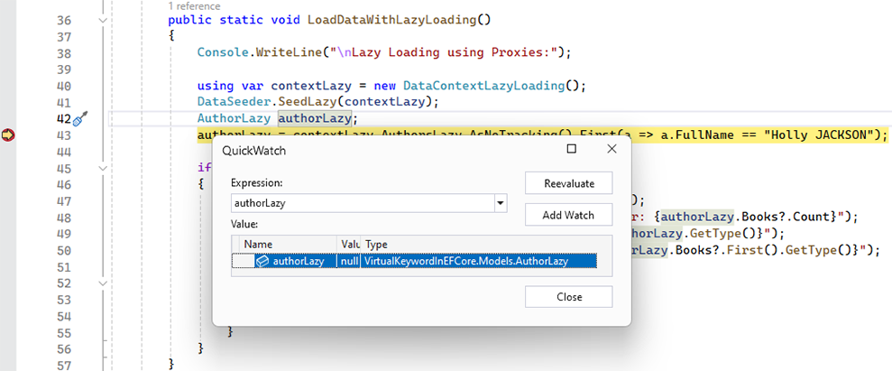
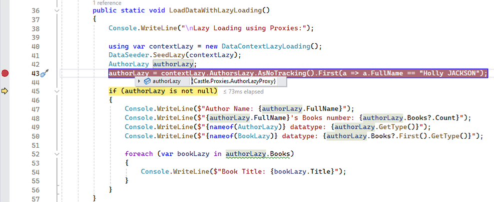
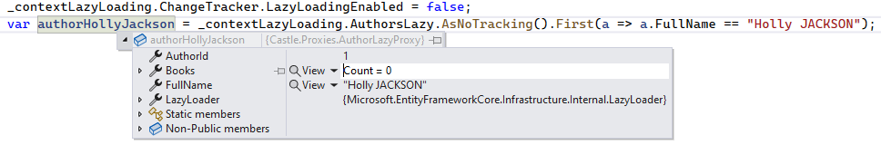

> ## 摘录
>
> 在使用EF Core时，virtual关键字对于类属性是必须的，以便启用使用代理的延迟加载。
>
> 原文 [Why Do We Use the Virtual Keyword for Properties in EF Core?](https://code-maze.com/efcore-why-do-we-use-the-virtual-keyword-for-class-properties/)

---

许多.NET应用程序使用Entity Framework Core（EF Core），这是一个流行的ORM框架。它提供了三种不同的加载相关数据的方法 —— 预先加载、延迟加载和显式加载。在本文中，我们将关注延迟加载的机制以及为什么我们在EF Core中为导航类属性使用**virtual**关键字。

要下载本文的源代码，你可以访问我们的[GitHub仓库](https://github.com/CodeMazeBlog/CodeMazeGuides/tree/main/dotnet-efcore/VirtualKeywordInEFCore)。

有关EF Core中预加载和延迟加载的更多细节，请查看我们的文章[Entity Framework Core中的延迟加载和预加载](https://code-maze.com/lazy-loading-and-eager-loading-in-entity-framework-core/)和[ASP.NET Core Web API与EF Core DB-First方法](https://code-maze.com/asp-net-core-web-api-with-ef-core-db-first-approach/)。

## EF Core应用程序设置

为了说明这个话题，我们将使用一个控制台应用程序和一个使用SQLite和Entity Framework Core的小型本地数据库。该应用程序将引用**Microsoft.EntityFrameworkCore**和**Microsoft.EntityFrameworkCore.Sqlite** NuGet包。

我们将使用两个`DbContext`实例，一个使用默认参数，一个配置为延迟加载，以观察差异。因此，我们将生成两个数据库实例。我们还将定义一个`DataSeeder`类来填充数据库。

### EF Core的默认行为不需要Virtual导航属性

**在没有特定设置的情况下，EF Core的默认行为不使用延迟加载。**因此，如果我们请求父实体的相关实体，我们将不会检索到它们。

在我们的应用程序中，让我们定义两个模型实体，`Author`和`Book`：

```csharp
public class Author
{
    [Key]
    public int AuthorId { get; set; }
    public string? FullName { get; set; }
    public ICollection<Book> Books { get; set; } = new List<Book>();
}
public class Book
{
    [Key]
    public int BookId { get; set; }
    public string? Title { get; set; }
    public int AuthorId { get; set; }
    public Author Author { get; set; }
}
```

现在，让我们看看当我们请求带有相关属性的数据时EF Core的默认运行方式：

```csharp
Console.WriteLine("没有延迟加载：");
using var contextWithoutLazyLoading = new DataContextWithoutLazyLoading();
DataSeeder.SeedWithoutLazy(contextWithoutLazyLoading);
Author author;
author = contextWithoutLazyLoading.Authors.AsNoTracking().First(a => a.FullName == "Lucy FOLEY");
if (author is not null)
{
    Console.WriteLine($"作者名字：{author.FullName}");
    Console.WriteLine($"{author.FullName}的书籍数量：{author.Books.Count}");
    foreach (var book in author.Books)
    {
        Console.WriteLine($"书名：{book.Title}");
    }
}
```

在这里，我们已经定义并分别在两个不同的行对`author`变量赋值，这将帮助我们在后面看到类类型的变化。不过，目前我们可以看到，尽管数据库中有四本作者的书，但由`author.Books.Count`返回的值是0，EF Core没有检索相关数据。

## EF Core中带Virtual导航和代理的延迟加载

**延迟加载是一种机制，允许我们延迟从数据库加载相关数据，直到我们特别请求它**，只在需要时请求关联实体，而不是一次请求全部。这在处理一对多关系时特别有用，相关实体不会立即被使用。

值得注意的是，延迟加载可能会导致执行多个额外的数据库查询，对性能产生负面影响。

### 在EF Core中启用延迟加载

EF Core 2.1引入了延迟加载，但由于上述缺点，EF Core默认不包括它。

为了使延迟加载可用，需要添加**Microsoft.EntityFrameworkCore.Proxies** NuGet包，并在配置`DbContext`时通过`UseLazyLoadingProxies()`方法启用它：

```csharp
public class DataContextLazyLoading : DbContext
{
    protected override void OnConfiguring(DbContextOptionsBuilder options)
    {
        options.UseSqlite("DataSource=LibraryLazy.db")
               .UseLazyLoadingProxies();
        base.OnConfiguring(options);
    }
    public DbSet<AuthorLazy> AuthorsLazy { get; set; }
    public DbSet<BookLazy> BooksLazy { get; set; }
}
```

在这里，我们覆盖了`OnConfiguring()`方法，并在其中调用`UseLazyLoadingProxies()`以确保为EF Core `DbContext`启用延迟加载。

它还要求我们所有的导航属性都是`virtual`的：

```csharp
public class AuthorLazy
{
    [Key]
    public int AuthorId { get; set; }
    public string? FullName { get; set; }
    public virtual ICollection<BookLazy> Books { get; set; } = new List<BookLazy>();
}
 public class BookLazy
{
    [Key]
    public int BookId { get; set; }
    public string? Title { get; set; }
    public int AuthorId { get; set; }
    public virtual AuthorLazy Author { get; set; }
}
```

如果我们忘记了在实体的导航属性上添加`virtual`修饰符，程序将抛出`InvalidOperationException`异常。

### 代理类和导航属性中的Virtual关键字

是时候使用延迟加载运行我们的应用程序了。让我们使用调试模式并一步步进行：



在这里，我们已经定义并分别在两个不同的行对`authorLazy`变量赋值，这允许我们做一些有趣的观察。不出所料，当定义`authorLazy`变量时，它的类型是`Models.AuthorLazy`。

但是当我们跳到下一行并使用延迟加载请求数据时，我们观察到`authorLazy`现在的类型是`Castle.Proxies.AuthorLazyProxy`。当我们继续执行下一个语句时，我们同样注意到`bookLazy`变量的类型是`Castle.Proxies.BookLazyProxy`：



`Castle.Proxies.AuthorLazyProxy`和`Castle.Proxies.BookLazyProxy`从哪里来的？

### 如何POCO代理和Virtual导航属性工作

**代理是从域对象类型自动生成的类型**（即从我们的实体POCO类）。通过EF Core的查询执行创建动态代理实体。这些POCO实体的生成发生在运行时。这启用了像延迟加载这样的附加功能。这是通过`Microsoft.EntityFrameworkCore.Proxies`包实现的，它依赖于`Castle.Core`包。EF Core利用后者包以动态加载POCO代理。

导航属性中的virtual有什么用途？

**动态代理类覆盖原始实体的virtual属性以在访问这些属性时自动执行加载**。因此，在访问映射到数据库的属性时，代理子类执行从数据库的加载。这种加载对开发者代码是透明的。

换句话说，**为了启用延迟加载，我们必须在关系中添加virtual修饰符。**在后台，当两个实体之间存在延迟加载的关系属性时，EF Core通过从实体类派生并覆盖其virtual属性来创建代理类。代理实体提供了一种方便的方法，通过ORM框架在运行时用额外功能如延迟加载增强POCO实体。

注意，可以随时使用DbContext的`ChangeTracker.LazyLoadingEnabled`属性设置为false来禁用延迟加载：

[

尽管`BooksLazy`表中包含多条作者的记录，但在这种情况下我们不会获得任何相关数据。

## 结论

在EF Core世界中，当使用代理进行延迟加载时，**virtual**关键字是实体类属性所必需的。代理可以覆盖这些属性以在首次访问时触发数据库加载。这是**virtual**修饰符在Entity Framework中的唯一作用。如果我们不使用代理进行延迟加载，其在相关实体上的使用是不必要的。
