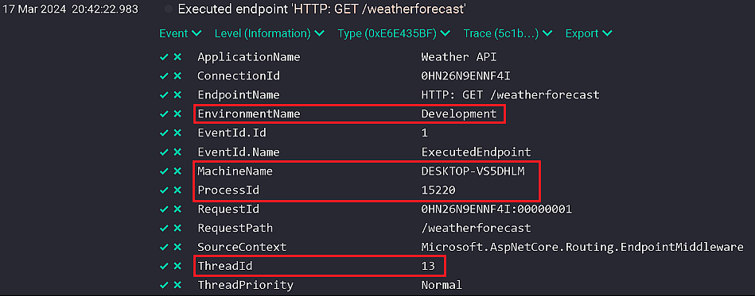
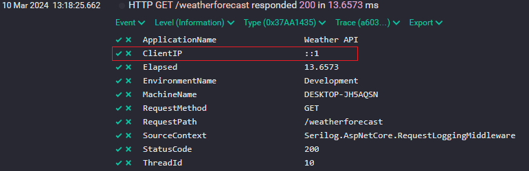

> ## 摘录
>
> 在本文中，我们将仔细看看在 .NET 中使用 Serilog 进行日志记录时的一些最佳实践。
>
> 原文 [Best Practices for Logging With Serilog](https://code-maze.com/dotnet-best-practices-for-logging-with-serilog/)

---

在本文中，我们将探讨一些关于在 .NET 中使用 Serilog 进行日志记录的最佳实践。

日志记录对于我们构建的任何应用程序都是至关重要的，而 Serilog 是主要的日志提供者之一。因此，我们准备了一些 Serilog 最佳实践，以帮助你改善你的日志。贯穿全文，我们将使用样板化的天气 API 来展示这里提到的任何实践。

要下载本文的源代码，你可以访问我们的 [GitHub 仓库](https://github.com/CodeMazeBlog/CodeMazeGuides/tree/main/dotnet-logging/SerilogBestPractices)。

让我们开始吧！

## 避免使用静态 Logger 类

Serilog 提供了静态的 `Log` 类，我们可以在应用程序中使用它来记录事件和信息。我们可以使用它来访问其 `Logger` 属性，并写下我们希望的任何类型的日志。但通过这样做，我们违反了[依赖反转原则](https://code-maze.com/dependency-inversion-principle/)。

我们可以轻松地将 Serilog 与 [Microsoft 的内置日志接口](https://code-maze.com/aspnetcore-using-serilog-with-microsofts-ilogger-api/)集成在一起，这是值得遵循的最有用的实践之一。通过采用这种方法，我们不仅坚持了依赖反转原则，而且还使测试我们的应用程序变得更加容易。

然而，静态 `Log` 类的一个用例是在 `Program` 类中：

```csharp
Log.Logger = new LoggerConfiguration()
    .WriteTo.File(
        "logs/log.txt",
        retainedFileCountLimit: 7,
        rollingInterval: RollingInterval.Day)
    .MinimumLevel.Information()
    .CreateLogger();
try
{
    var builder = WebApplication.CreateBuilder(args);
    // 代码略过简洁
    app.Run();
}
catch (Exception ex)
{
    Log.Error(
        "在应用程序启动期间抛出以下 {Exception}",
        ex);
}
finally
{
    Log.CloseAndFlush();
}
```

我们使用静态 `Log` 类的 `Logger` 属性来配置它将日志写入文件。然后，我们将应用程序的配置放在一个 `try`-`catch` 块中 - 这样我们就会记录在我们的应用程序启动过程中发生的任何错误。`finally` 块只负责关闭和刷新剩余的日志。

我们还可以在依赖注入不可能的任何其他地方使用静态 `Log` 类。

## 从 appsettings.json 配置 Serilog

首先也是最重要的，我们需要根据我们的需求来配置 Serilog。我们有两种选择：Fluent API 或配置系统。**尽管 Fluent API 非常直观易读，但有一个很大的缺点 - 每当我们在配置中更改某些内容时，我们需要发布应用程序的新构建。**

**这就是为什么最好使用配置系统**来在我们的应用程序中设置 Serilog：

```shell
Install-Package Serilog.Settings.Configuration
```

我们首先安装 `Serilog.Settings.Configuration` NuGet 包。

现在我们有了这个包，让我们添加我们的基本配置：

```json
"Serilog": {
  "Using": [
    "Serilog.Sinks.Console"
  ],
  "MinimumLevel": {
    "Default": "Information"
  },
  "WriteTo": [
    {
      "Name": "Console",
      "Args": {
        "OutputTemplate": "[{Timestamp:HH:mm:ss} {Level:u11}] {Message:lj}{NewLine}"
      }
    }
  ],
  "Properties": {
    "ApplicationName": "Weather API"
  }
}
```

首先，在 `appsettings.json` 文件中，我们添加一个名为 `Serilog` 的新节。在其中，我们首先创建 `Using` 子节，其中我们声明了我们想要使用的接收器。

接下来，我们[配置默认日志级别](https://code-maze.com/csharp-different-log-levels-in-serilog/)。然后我们继续前往 `WriteTo` 子节，其中我们配置不同的接收器，甚至可以包括诸如消息模板之类的东西。

然后，我们需要应用配置：

```csharp
builder.Host.UseSerilog((context, config) =>
    config.ReadFrom.Configuration(context.Configuration));
```

在我们的 `Program` 类中，我们使用 `UseSerilog()` 扩展方法来指定我们的应用程序应该使用 `appsettings.json` 文件来配置 Serilog。有了这个，当我们的日志配置发生变化时，我们就不需要重新发布我们的应用程序了。

## 在生产环境中忘掉 Serilog 的 Console 和 File Sinks

在开发应用程序时，看到实时事件日志是非常棒的。将日志记录到控制台是实现这一目的的好方法。然而，将所有内容记录到控制台会让追踪事件变得非常困难，因为它会很快被信息堵塞。此外，在我们的生产环境中，我们想要远离这个，因为它可能会造成性能问题。

Serlilog 的文件接收器在开发时甚至好于控制台接收器。我们可以轻松地过滤和排序日志，使寻找特定事件变得非常容易。然而，像控制台日志记录一样，这在生产中变得非常难以处理。

对于生产目的，我们可以使用 _Seq_、_Elasticsearch_ 或[任何其他适合生产环境的 Serilog 接收器](https://github.com/serilog/serilog/wiki/Provided-Sinks)。这样我们就可以获得比文件或控制台日志更好的可扩展性和可靠性。

**值得一提的是，根据我们的情况，可能会有场景，在生产中文件和控制台日志记录可以发挥作用**。例如，我们的日志提供者可能在接收日志时出现问题，所以拥有文件或控制台日志可能会证明很有用。

## 始终使用结构化日志记录

尽可能时，我们应该始终避免在日志记录中使用简单的字符串：

```csharp
logger.LogInformation($"今天的天气将会是 {forecast[0].Summary} 和 {forecast[0].TemperatureC} 度。");
```

这将产生一个可能不是很有用的简单日志消息。此外，尽管 `ILogger<T>` 的 `LogInformation()` 方法的第一个参数名为 `message`，这不正确，这是消息模板。

我们正确地使用它：

```csharp
logger.LogInformation(
    "今天的天气将会是 {Summary} 和 {Temperature} 度。",
    forecast[0].Summary,
    forecast[0].TemperatureC);
```

这里，我们首先传递消息模板，然后跟上模板所需的两个参数。这将产生一个结构化的日志，其中 `Summary` 和 `Temperature` 将作为与日志消息关联的参数存储。这使得查询我们的日志变得更加容易，节省了我们的时间和努力。

## 使用内置的事件日志增强器

向我们的日志中添加额外的信息可能会证明是有益的。

为此，Serilog 提供了各种内置的日志事件增强器：

```shell
Install-Package Serilog.Enrichers.Thread
Install-Package Serilog.Enrichers.Process
Install-Package Serilog.Enrichers.Environment
```

我们首先安装 Serilog 的 `Thread`、`Process` 和 `Environment` 增强器包。

接下来，我们更新我们的配置：

```json
"Enrich": [
  "WithThreadId",
  "WithProcessId",
  "WithMachineName",
  "WithEnvironmentName"
]
```

在 `appsettings.json` 文件中，我们添加一个新的名为 `Enrich` 的子节。在其中，我们添加指定 Serilog 应该用 `ThreadId`、`ProcessId`、`MachineName` 以及 `EnvironmentName` 增强我们的日志的属性。

我们可以向我们的 API 发送请求，并在 _Seq_ 中探索输出：

[](https://code-maze.com/wp-content/uploads/2024/03/CM-1044-opt.png)

我们可以看到，日志包括我们在 `appsettings.json` 文件的 `Enrich` 子节中指定的所有附加属性。

## 为 Serilog 创建自定义日志事件增强器

我们能够创建自定义日志事件增强器并不奇怪：

```csharp
public class ThreadPriorityEnricher : ILogEventEnricher
{
    public void Enrich(LogEvent logEvent, ILogEventPropertyFactory propertyFactory)
    {
        logEvent.AddPropertyIfAbsent(
            propertyFactory.CreateProperty(
                "ThreadPriority",
                Thread.CurrentThread.Priority.ToString()));
    }
}
```

我们首先创建 `ThreadPriorityEnricher` 类并实现 `ILogEventEnricher` 接口。该接口要求我们实现 `Enrich()` 方法。使用 `LogEvent` 类的 `AddPropertyIfAbsent()` 方法，我们尝试在日志中添加一个新属性（如果它尚未存在）。我们额外添加的属性将把线程优先级添加到日志事件中。要获取优先级本身，我们使用 `Thread` 类及其属性。通过 `ILogEventPropertyFactory` 接口的 `CreateProperty()` 方法将属性附加到日志中。

接下来，我们注册增强器：

```csharp
builder.Host.UseSerilog((context, config) =>
    config.ReadFrom.Configuration(context.Configuration)
        .Enrich.With(new ThreadPriorityEnricher()));
```

在 `Program` 类中，我们在 `LoggerConfiguration` 类的 `Enrich` 属性上使用 `With()` 方法。我们传入一个我们的 `ThreadPriorityEnricher` 类的新实例。

有了这个，我们的应用程序的所有日志都将具有 `ThreadPriority` 属性。

## 使用 Serilog 进行请求日志记录

请求是一个应用程序的重要部分，因此详细的日志记录是必须的：

```csharp
app.UseSerilogRequestLogging();
```

在我们的 `Program` 类中，我们在我们的 `WebApplication` 实例上调用 `UseSerilogRequestLogging()` 扩展方法。有了这个，我们的请求日志现在将包括关于 HTTP 方法、路径、状态码以及我们的应用程序响应所花时间的信息。

我们可以更进一步创建一个自定义的请求日志增强器：

```csharp
public static class RequestEnricher
{
    public static void LogAdditionalInfo(
        IDiagnosticContext diagnosticContext,
        HttpContext httpContext)
    {
        diagnosticContext.Set(
            "ClientIP",
            httpContext.Connection.RemoteIpAddress?.ToString());
    }
}
```

我们首先创建一个新的 `RequestEnricher` 类。

接下来，我们创建 `LogAdditionalInfo()` 方法。它接受两个参数：Serilog 的 `IDiagnosticContext` 和 `HttpContext` 实例。然后，我们使用诊断上下文的 `Set()` 方法创建 `ClientIP` 属性，并将其分配给传递给方法的 `HttpContext` 的 `RemoteIpAddress` 属性。

**注意，这与实现 `ILogEventEnricher` 接口不同，注册方式也不同。**

接下来，我们添加我们的自定义增强器：

```csharp
app.UseSerilogRequestLogging(options
  => options.EnrichDiagnosticContext = RequestEnricher.LogAdditionalInfo);
```

为此，我们将 `UseSerilogRequestLogging()` 方法内的 `EnrichDiagnosticContext` 属性设置为等于我们刚刚编写的 `LogAdditionalInfo()` 方法。

最后，我们可以发送请求并检查日志：

[](https://code-maze.com/wp-content/uploads/2024/03/CM-1044-enriched-request-logs.png)

我们可以看到，我们的日志现在包含有关 HTTP 方法、路径和状态码的信息。我们还得到了一个名为 `ClientIP` 的属性，其值为 `::1`，这意味着我们从运行我们的应用程序的同一台机器上发送请求。

## 结论

总之，在 .NET 中精通 Serilog 的日志记录实践对于优化我们的应用程序性能和故障排除至关重要。通过通过应用程序设置配置 Serilog，我们获得了在不需要不断重新发布的情况下更改日志记录设置的灵活性。

我们通过在生产中避开控制台和文件接收器，转而选择专门的替代方案来确保可扩展性和可靠性。

当我们用额外的信息丰富日志并采用详细的请求日志记录实践时，我们进一步增强了我们的应用程序的诊断能力。通过坚持这里提到的实践，我们可以利用 Serilog 的力量为我们的应用程序创建健壮、洞察力强的日志解决方案。我们希望你喜欢探索一些 Serilog 最佳实践，请在评论中让我们知道任何你认为值得的其他实践。
