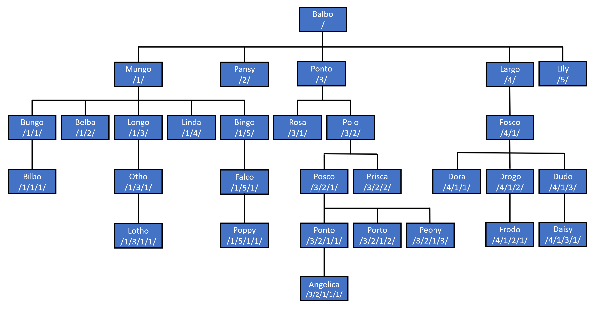

> [!NOTE]
>
> 该功能在 EF Core 8.0 中被添加。

Azure SQL 和 SQL Server 拥有一种特殊数据类型称为 [`hierarchyid`](/sql/t-sql/data-types/hierarchyid-data-type-method-reference)，用于存储[层次化数据](/sql/relational-databases/hierarchical-data-sql-server)。在这种情况下，“层次化数据”基本上指的是形成树状结构的数据，其中每个项目都可以有父级和/或子级。这类数据的例子包括：

- 一个组织结构
- 文件系统
- 项目中的一组任务
- 语言术语的分类
- 网页之间链接的图形

然后，数据库能够使用这些数据的层次化结构来运行查询。例如，查询可以查找给定项目的祖先和依赖项，或找到层次结构中某个深度的所有项目。

## 在 .NET 和 EF Core 中使用 HierarchyId

在最低层面，[Microsoft.SqlServer.Types](https://www.nuget.org/packages/Microsoft.SqlServer.Types) NuGet 包包括一个称为 `SqlHierarchyId` 的类型。虽然这个类型支持处理 hierarchyid 值，但在 LINQ 中使用它有些复杂。

在下一个层次上，一个新的 [Microsoft.EntityFrameworkCore.SqlServer.Abstractions](https://www.nuget.org/packages/Microsoft.EntityFrameworkCore.SqlServer.Abstractions) 包被引入，其中包含了一个用于实体类型的更高级别的 `HierarchyId` 类型。

> [!TIP]
>
> `HierarchyId` 类型更接近 .NET 的惯例，而不是像 `SqlHierarchyId` 那样基于 .NET Framework 类型在 SQL Server 数据库引擎中的托管方式。`HierarchyId` 旨在与 EF Core 一起工作，但它也可以在 EF Core 之外的其他应用程序中使用。`Microsoft.EntityFrameworkCore.SqlServer.Abstractions` 包不引用任何其他包，并因此对部署应用程序大小和依赖项的影响最小。

使用 `HierarchyId` 对于 EF Core 功能如查询和更新需要 [Microsoft.EntityFrameworkCore.SqlServer.HierarchyId](https://www.nuget.org/packages/Microsoft.EntityFrameworkCore.SqlServer.HierarchyId) 包。这个包引入了 `Microsoft.EntityFrameworkCore.SqlServer.Abstractions` 和 `Microsoft.SqlServer.Types` 作为传递依赖项，因此通常是唯一需要的包。

### [.NET Core CLI](#tab/netcore-cli)

```cmd
dotnet add package Microsoft.EntityFrameworkCore.SqlServer.HierarchyId
```

### [Visual Studio](#tab/visual-studio)

- **工具 > NuGet 包管理器 > 包管理器控制台**
- 运行以下命令：

  ```powershell
  Install-Package Microsoft.EntityFrameworkCore.SqlServer.HierarchyId
  ```

提示：您也可以通过右击项目并选择 **管理 NuGet 包** 来安装包

---

安装包后，通过在应用程序调用 `UseSqlServer` 时调用 `UseHierarchyId` 来启用 `HierarchyId` 的使用。例如：

```csharp
options.UseSqlServer(
    connectionString,
    x => x.UseHierarchyId());
```

#### 建模层次结构

`HierarchyId` 类型可以用于实体类型的属性。例如，假设我们想模拟一些虚构[哈比人](https://en.wikipedia.org/wiki/Halfling)的父系家谱树。在 `Halfling` 实体类型中，可以使用 `HierarchyId` 属性来定位家谱树中的每个哈比人。

```csharp
public class Halfling
{
    public Halfling(HierarchyId pathFromPatriarch, string name, int? yearOfBirth = null)
    {
        PathFromPatriarch = pathFromPatriarch;
        Name = name;
        YearOfBirth = yearOfBirth;
    }

    public int Id { get; private set; }
    public HierarchyId PathFromPatriarch { get; set; }
    public string Name { get; set; }
    public int? YearOfBirth { get; set; }
}
```

> [!TIP]
>
> 这里和下面的例子中显示的代码来自 [HierarchyIdSample.cs](https://github.com/dotnet/EntityFramework.Docs/tree/main/samples/core/Miscellaneous/NewInEFCore8/HierarchyIdSample.cs)。

> [!TIP]
>
> 如果需要，`HierarchyId` 适用于作为键属性类型。

在这个例子中，家谱树以家族的族长为根。每个哈比人都可以使用其 `PathFromPatriarch` 属性从族长沿树向下追溯。SQL Server 使用这些路径的紧凑二进制格式，但在处理代码时，通常会解析为人类可读的字符串表示形式。在这种表示中，每一级的位置由 `/` 字符分隔。例如，考虑下面图表中的家谱树：



在这棵树中：

- Balbo 在树根处，表示为 `/`。
- Balbo 有五个子女，分别表示为 `/1/`、`/2/`、`/3/`、`/4/` 和 `/5/`。
- Balbo 的第一个孩子，Mungo，也有五个子女，分别表示为 `/1/1/`、`/1/2/`、`/1/3/`、`/1/4/` 和 `/1/5/`。注意 Balbo（`/1/`）的 `HierarchyId` 是他所有孩子的前缀。
- 类似地，Balbo 的第三个孩子，Ponto，有两个孩子，分别表示为 `/3/1/` 和 `/3/2/`。再次说明，这些孩子中的每一个都由 Ponto 的 `HierarchyId` 作为前缀，表示为 `/3/`。
- 依此类推，沿着树向下...

以下代码将这个家谱树插入到数据库中使用 EF Core：

```csharp
await AddRangeAsync(
    new Halfling(HierarchyId.Parse("/"), "Balbo", 1167),
    new Halfling(HierarchyId.Parse("/1/"), "Mungo", 1207),
    new Halfling(HierarchyId.Parse("/2/"), "Pansy", 1212),
    new Halfling(HierarchyId.Parse("/3/"), "Ponto", 1216),
    new Halfling(HierarchyId.Parse("/4/"), "Largo", 1220),
    new Halfling(HierarchyId.Parse("/5/"), "Lily", 1222),
    new Halfling(HierarchyId.Parse("/1/1/"), "Bungo", 1246),
    new Halfling(HierarchyId.Parse("/1/2/"), "Belba", 1256),
    new Halfling(HierarchyId.Parse("/1/3/"), "Longo", 1260),
    new Halfling(HierarchyId.Parse("/1/4/"), "Linda", 1262),
    new Halfling(HierarchyId.Parse("/1/5/"), "Bingo", 1264),
    new Halfling(HierarchyId.Parse("/3/1/"), "Rosa", 1256),
    new Halfling(HierarchyId.Parse("/3/2/"), "Polo"),
    new Halfling(HierarchyId.Parse("/4/1/"), "Fosco", 1264),
    new Halfling(HierarchyId.Parse("/1/1/1/"), "Bilbo", 1290),
    new Halfling(HierarchyId.Parse("/1/3/1/"), "Otho", 1310),
    new Halfling(HierarchyId.Parse("/1/5/1/"), "Falco", 1303),
    new Halfling(HierarchyId.Parse("/3/2/1/"), "Posco", 1302),
    new Halfling(HierarchyId.Parse("/3/2/2/"), "Prisca", 1306),
    new Halfling(HierarchyId.Parse("/4/1/1/"), "Dora", 1302),
    new Halfling(HierarchyId.Parse("/4/1/2/"), "Drogo", 1308),
    new Halfling(HierarchyId.Parse("/4/1/3/"), "Dudo", 1311),
    new Halfling(HierarchyId.Parse("/1/3/1/1/"), "Lotho", 1310),
    new Halfling(HierarchyId.Parse("/1/5/1/1/"), "Poppy", 1344),
    new Halfling(HierarchyId.Parse("/3/2/1/1/"), "Ponto", 1346),
    new Halfling(HierarchyId.Parse("/3/2/1/2/"), "Porto", 1348),
    new Halfling(HierarchyId.Parse("/3/2/1/3/"), "Peony", 1350),
    new Halfling(HierarchyId.Parse("/4/1/2/1/"), "Frodo", 1368),
    new Halfling(HierarchyId.Parse("/4/1/3/1/"), "Daisy", 1350),
    new Halfling(HierarchyId.Parse("/3/2/1/1/1/"), "Angelica", 1381));

await SaveChangesAsync();
```

> [!TIP]
>
> 如果需要，可以使用小数值在两个现有节点之间创建新节点。例如，`/3/2.5/2/` 位于 `/3/2/2/` 和 `/3/3/2/` 之间。

#### 查询层次结构

`HierarchyId` 公开了几个可以在 LINQ 查询中使用的方法。

| 方法                                                             | 描述                                                                                                                       |
| ---------------------------------------------------------------- | -------------------------------------------------------------------------------------------------------------------------- |
| `GetAncestor(int n)`                                             | 获取一棵树中 `n` 级别向上的节点。                                                                                          |
| `GetDescendant(HierarchyId? child1, HierarchyId? child2)`        | 获得一个大于 `child1` 小于 `child2` 的后代节点的值。                                                                       |
| `GetLevel()`                                                     | 获取此节点在层次化树中的级别。                                                                                             |
| `GetReparentedValue(HierarchyId? oldRoot, HierarchyId? newRoot)` | 获取表示新节点的值，该节点从 `newRoot` 到这个节点的路径与从 `oldRoot` 到这个节点的路径相等，有效地将这个节点移动到新位置。 |
| `IsDescendantOf(HierarchyId? parent)`                            | 获取一个值，指示此节点是否是 `parent` 的后代。                                                                             |

此外，运算符 `==`、`!=`、`<`、`<=`、`>` 和 `>=` 可用。

以下是在 LINQ 查询中使用这些方法的示例。

**在树中获取给定级别的实体**

以下查询使用 `GetLevel` 返回家庭树中给定级别的所有哈比人：

```csharp
var generation = await context.Halflings.Where(halfling => halfling.PathFromPatriarch.GetLevel() == level).ToListAsync();
```

这转换为以下 SQL:

```sql
SELECT [h].[Id], [h].[Name], [h].[PathFromPatriarch], [h].[YearOfBirth]
FROM [Halflings] AS [h]
WHERE [h].[PathFromPatriarch].GetLevel() = @__level_0
```

在循环中运行这段代码，我们可以获得每一代的哈比人：

```plaintext
Generation 0: Balbo
Generation 1: Mungo, Pansy, Ponto, Largo, Lily
Generation 2: Bungo, Belba, Longo, Linda, Bingo, Rosa, Polo, Fosco
Generation 3: Bilbo, Otho, Falco, Posco, Prisca, Dora, Drogo, Dudo
Generation 4: Lotho, Poppy, Ponto, Porto, Peony, Frodo, Daisy
Generation 5: Angelica
```

**获取实体的直接祖先**

以下查询使用 `GetAncestor` 根据哈比人的名称找到直接祖先：

```csharp
async Task<Halfling?> FindDirectAncestor(string name)
    => await context.Halflings
        .SingleOrDefaultAsync(
            ancestor => ancestor.PathFromPatriarch == context.Halflings
                .Single(descendent => descendent.Name == name).PathFromPatriarch
                .GetAncestor(1));
```

这转换为以下 SQL:

```sql
SELECT TOP(2) [h].[Id], [h].[Name], [h].[PathFromPatriarch], [h].[YearOfBirth]
FROM [Halflings] AS [h]
WHERE [h].[PathFromPatriarch] = (
    SELECT TOP(1) [h0].[PathFromPatriarch]
    FROM [Halflings] AS [h0]
    WHERE [h0].[Name] = @__name_0).GetAncestor(1)
```

对 "Bilbo" 运行此查询返回 "Bungo"。

**获取实体的直接后代**

以下查询也使用 `GetAncestor`，但这次是找到给定哈比人名称的直接后代：

```csharp
IQueryable<Halfling> FindDirectDescendents(string name)
    => context.Halflings.Where(
        descendent => descendent.PathFromPatriarch.GetAncestor(1) == context.Halflings
            .Single(ancestor => ancestor.Name == name).PathFromPatriarch);
```

这转换为以下 SQL:

```sql
SELECT [h].[Id], [h].[Name], [h].[PathFromPatriarch], [h].[YearOfBirth]
FROM [Halflings] AS [h]
WHERE [h].[PathFromPatriarch].GetAncestor(1) = (
    SELECT TOP(1) [h0].[PathFromPatriarch]
    FROM [Halflings] AS [h0]
    WHERE [h0].[Name] = @__name_0)
```

对 "Mungo" 运行此查询返回 "Bungo", "Belba", "Longo", 和 "Linda"。

**获取实体的所有祖先**

`GetAncestor` 用于向上或向下搜索一个级别，或确切地说，指定数量的级别。另一方面，`IsDescendantOf` 用于找到所有祖先或依赖项。例如，以下查询使用 `IsDescendantOf` 根据哈比人的名称找到所有祖先：

```csharp
IQueryable<Halfling> FindAllAncestors(string name)
    => context.Halflings.Where(
            ancestor => context.Halflings
                .Single(
                    descendent =>
                        descendent.Name == name
                        && ancestor.Id != descendent.Id)
                .PathFromPatriarch.IsDescendantOf(ancestor.PathFromPatriarch))
        .OrderByDescending(ancestor => ancestor.PathFromPatriarch.GetLevel());
```

> [!IMPORTANT]
>
> `IsDescendantOf` 对其自身返回 true，这就是为什么在上面的查询中将其过滤掉的原因。

这转换为以下 SQL:

```sql
SELECT [h].[Id], [h].[Name], [h].[PathFromPatriarch], [h].[YearOfBirth]
FROM [Halflings] AS [h]
WHERE (
    SELECT TOP(1) [h0].[PathFromPatriarch]
    FROM [Halflings] AS [h0]
    WHERE [h0].[Name] = @__name_0 AND [h].[Id] <> [h0].[Id]).IsDescendantOf([h].[PathFromPatriarch]) = CAST(1 AS bit)
ORDER BY [h].[PathFromPatriarch].GetLevel() DESC
```

对 "Bilbo" 运行此查询返回 "Bungo", "Mungo", 和 "Balbo"。

**获取实体的所有后代**

以下查询也使用 `IsDescendantOf`，但这次是返回给定哈比人名称的所有后代：

```csharp
IQueryable<Halfling> FindAllDescendents(string name)
    => context.Halflings.Where(
            descendent => descendent.PathFromPatriarch.IsDescendantOf(
                context.Halflings
                    .Single(
                        ancestor =>
                            ancestor.Name == name
                            && descendent.Id != ancestor.Id)
                    .PathFromPatriarch))
        .OrderBy(descendent => descendent.PathFromPatriarch.GetLevel());
```

这转换为以下 SQL:

```sql
SELECT [h].[Id], [h].[Name], [h].[PathFromPatriarch], [h].[YearOfBirth]
FROM [Halflings] AS [h]
WHERE [h].[PathFromPatriarch].IsDescendantOf((
    SELECT TOP(1) [h0].[PathFromPatriarch]
    FROM [Halflings] AS [h0]
    WHERE [h0].[Name] = @__name_0 AND [h].[Id] <> [h0].[Id])) = CAST(1 AS bit)
ORDER BY [h].[PathFromPatriarch].GetLevel()
```

对 "Mungo" 运行此查询返回 "Bungo", "Belba", "Longo", "Linda", "Bingo", "Bilbo", "Otho", "Falco", "Lotho", 和 "Poppy"。

**寻找共同祖先**

关于这个特定家谱树最常被问到的问题之一是，“Frodo 和 Bilbo 的共同祖先是谁？”我们可以使用 `IsDescendantOf` 写出这样的查询：

```csharp
async Task<Halfling?> FindCommonAncestor(Halfling first, Halfling second)
    => await context.Halflings
        .Where(
            ancestor => first.PathFromPatriarch.IsDescendantOf(ancestor.PathFromPatriarch)
                        && second.PathFromPatriarch.IsDescendantOf(ancestor.PathFromPatriarch))
        .OrderByDescending(ancestor => ancestor.PathFromPatriarch.GetLevel())
        .FirstOrDefaultAsync();
```

这转换为以下 SQL:

```sql
SELECT TOP(1) [h].[Id], [h].[Name], [h].[PathFromPatriarch], [h].[YearOfBirth]
FROM [Halflings] AS [h]
WHERE @__first_PathFromPatriarch_0.IsDescendantOf([h].[PathFromPatriarch]) = CAST(1 AS bit)
  AND @__second_PathFromPatriarch_1.IsDescendantOf([h].[PathFromPatriarch]) = CAST(1 AS bit)
ORDER BY [h].[PathFromPatriarch].GetLevel() DESC
```

使用 "Bilbo" 和 "Frodo" 运行此查询告诉我们他们的共同祖先是 "Balbo"。

#### 更新层次结构

可以使用正常的 [变更跟踪](xref:core/change-tracking/index) 和 [SaveChanges](xref:core/saving/basic) 机制来更新 `hierarchyid` 列。

**重新父级化子层次结构**

例如，我相信我们都记得 SR 1752 年的丑闻（又名“LongoGate”），当时 DNA 测试显示 Longo 实际上不是 Mungo 的儿子，而是 Ponto 的儿子！这个丑闻的一个后果是家谱树需要被重写。特别是，Longo 和他所有的后代需要从 Mungo 重新父级化到 Ponto。`GetReparentedValue` 可以用来做这个。例如，首先查询“Longo”和所有他的后代：

```csharp
var longoAndDescendents = await context.Halflings.Where(
        descendent => descendent.PathFromPatriarch.IsDescendantOf(
            context.Halflings.Single(ancestor => ancestor.Name == "Longo").PathFromPatriarch))
    .ToListAsync();
```

然后使用 `GetReparentedValue` 更新 Longo 和每个后代的 `HierarchyId`，接着调用 `SaveChangesAsync`：

```csharp
foreach (var descendent in longoAndDescendents)
{
    descendent.PathFromPatriarch
        = descendent.PathFromPatriarch.GetReparentedValue(
            mungo.PathFromPatriarch, ponto.PathFromPatriarch)!;
}

await context.SaveChangesAsync();
```

这导致以下数据库更新：

```sql
SET NOCOUNT ON;
UPDATE [Halflings] SET [PathFromPatriarch] = @p0
OUTPUT 1
WHERE [Id] = @p1;
UPDATE [Halflings] SET [PathFromPatriarch] = @p2
OUTPUT 1
WHERE [Id] = @p3;
UPDATE [Halflings] SET [PathFromPatriarch] = @p4
OUTPUT 1
WHERE [Id] = @p5;
```

使用以下参数：

```text
 @p1='9',
 @p0='0x7BC0' (Nullable = false) (Size = 2) (DbType = Object),
 @p3='16',
 @p2='0x7BD6' (Nullable = false) (Size = 2) (DbType = Object),
 @p5='23',
 @p4='0x7BD6B0' (Nullable = false) (Size = 3) (DbType = Object)
```

> [!NOTE]
>
> `HierarchyId` 属性的参数值会以它们的紧凑二进制格式发送到数据库。

更新之后，查询 "Mungo" 的后代会返回 "Bungo"、"Belba"、"Linda"、"Bingo"、"Bilbo"、"Falco" 和 "Poppy"，而查询 "Ponto" 的后代会返回 "Longo"、"Rosa"、"Polo"、"Otho"、"Posco"、"Prisca"、"Lotho"、"Ponto"、"Porto"、"Peony" 和 "Angelica"。

## 函数映射

| .NET                                             | SQL                                                 |
| ------------------------------------------------ | --------------------------------------------------- |
| hierarchyId.GetAncestor(n)                       | @hierarchyId.GetAncestor(@n)                        |
| hierarchyId.GetDescendant(child)                 | @hierarchyId.GetDescendant(@child, NULL)            |
| hierarchyId.GetDescendant(child1, child2)        | @hierarchyId.GetDescendant(@child1, @child2)        |
| hierarchyId.GetLevel()                           | @hierarchyId.GetLevel()                             |
| hierarchyId.GetReparentedValue(oldRoot, newRoot) | @hierarchyId.GetReparentedValue(@oldRoot, @newRoot) |
| HierarchyId.GetRoot()                            | hierarchyid::GetRoot()                              |
| hierarchyId.IsDescendantOf(parent)               | @hierarchyId.IsDescendantOf(@parent)                |
| HierarchyId.Parse(input)                         | hierarchyid::Parse(@input)                          |
| hierarchyId.ToString()                           | @hierarchyId.ToString()                             |

## 额外资源

- [SQL Server 中的层级数据](/sql/relational-databases/hierarchical-data-sql-server)
