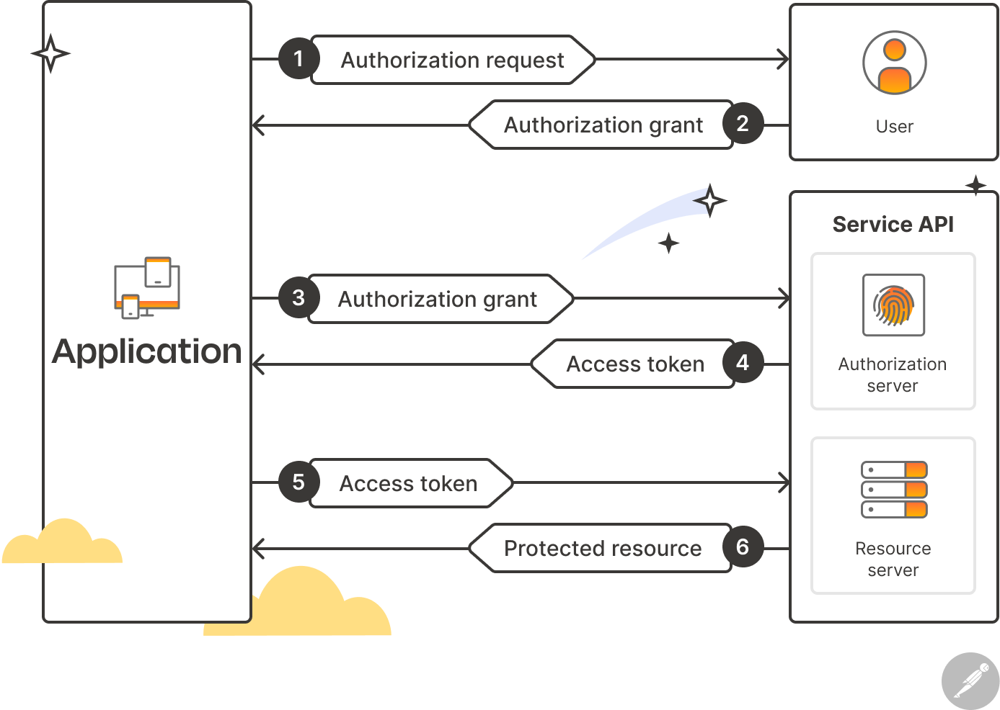

> ## 摘要
>
> 了解OAuth 2.0是什么，它是如何工作的，以及为什么它成为了授权和认证的行业标准。
>
> 原文 [What Is OAuth 2.0?](https://blog.postman.com/what-is-oauth-2-0/)

---

2023年9月7日· 11分钟

OAuth 2.0是一个授权框架，允许用户在不同应用程序之间安全地分享其数据。它是解决在分享用户凭证时相关的[API安全](https://www.postman.com/api-platform/api-security/)问题的行业标准，为网页、移动、桌面和IoT应用提供了简单、定义明确的授权流程。

这里，我们将回顾OAuth 2.0的历史，然后讨论它是如何工作的。随后，我们将探索使用OAuth 2.0的一些好处、挑战以及最佳实践，并强调Postman [API平台](https://www.postman.com/api-platform/)中有助于简化OAuth工作流程的一些特性。

## OAuth 2.0的历史是什么？

每天，数百万人与多个应用程序交互，并在它们之间分享数据。例如，一个使用健身应用跟踪其每日锻炼的人可能想要开始使用一个新的饮食计划应用来监测他们的营养摄入和卡路里消耗。饮食计划应用可能会要求用户分享其来自健身应用的数据，以创建更加定制化的体验。虽然这种类型的集成有许多好处，但它也伴随着几个安全隐患：

- **用户凭证暴露：**在OAuth之前，用户需要将其健身应用的用户名和密码分享给饮食计划应用，这将引入重大的安全风险。例如，饮食计划应用可能会以不安全的方式存储用户的凭证，使其在发生安全漏洞时变得脆弱。
- **访问范围：**在OAuth之前，饮食计划应用可能会访问用户实际不希望分享的数据。例如，在这个例子中，健身爱好者可能想要将他们的锻炼历史分享给饮食计划应用，但不是他们的年龄、电子邮件地址、职业或位置。
- **无法撤销访问：**在OAuth之前，用户无法轻松限制或撤销饮食计划应用对其健身数据的访问。虽然用户可以决定更改其健身应用的密码，但这将影响他们之前授权的所有第三方应用程序。

OAuth从2007年开始作为一个社区努力，目前由互联网工程任务组(IETF)开发和维护，通过引入基于令牌的授权机制解决了这些挑战。通过引入令牌作为授权手段，OAuth消除了用户需要与第三方应用程序分享其实际凭据的需求。它还允许用户在授权时定义特定的访问范围，确保应用程序只访问它们需要的资源。此外，OAuth使用户能够明确授权应用程序进行特定操作，并随时撤销访问权限，使他们能够掌控自己的数据和隐私。

## OAuth 2.0是如何工作的？

在你能理解OAuth 2.0如何工作之前，你必须首先了解OAuth 2.0工作流程中涉及的四个特定角色。这些角色是：

- **资源所有者：**这是授权第三方访问其数据的用户。
- **客户端：**这是请求访问资源所有者数据的第三方应用程序。当资源所有者授权访问时，客户端获取一个可用于请求授权范围内资源的访问令牌。
- **授权服务器：**授权服务器作为客户端、资源所有者和资源服务器的中介，通过在资源所有者成功授权请求后向客户端发放访问令牌。
- **资源服务器：**这是托管受保护资源的服务器。它负责接受并响应使用访问令牌访问受保护资源的请求。

OAuth 2.0使资源所有者(即用户)能够给客户端(即第三方应用程序)访问其数据的权限，而无需分享其凭证。相反，凭证被分享给授权服务器，该服务器向客户端发放访问令牌。然后，客户端可以使用此访问令牌从资源服务器获取用户的数据。

让我们用前面部分的例子来探索这是如何工作的。在OAuth上下文中，新的饮食计划应用是客户端；它想要访问健身应用中用户的数据。健身应用拥有一个资源服务器和一个授权服务器，授权服务器授权访问资源服务器。

由于饮食计划应用是客户端，它将向用户展示从健身应用导入其健身历史数据的选项。如果用户决定继续，他们将被重定向到健身应用，那里将提示他们输入用户名和密码。如果用户成功登录健身应用，他们将看到一个屏幕，可以查看客户端希望访问的数据。如果用户同意请求的范围，他们将授权该请求。然后，用户将被重定向回饮食计划应用，此时他们来自健身应用的健身历史现在将可见。

以下是幕后发生的所有步骤的逐步分解：

1. 客户端（饮食计划应用）要求用户在健身应用的资源服务器上访问其资源。
2. 用户通过在健身应用中使用其凭证登录来向客户端授权访问，这些凭证不与客户端共享。相反，生成一个授权码并与客户端共享。
3. 客户端使用此授权码从授权服务器提供的端点请求访问令牌。
4. 授权服务器生成并返回访问令牌，客户端可以使用它来访问资源服务器上用户的资源。
5. 客户端将访问令牌发送到资源服务器，以请求访问用户的资源。
6. 资源服务器使用授权服务器验证访问令牌。如果令牌有效，它将授予客户端访问用户资源的权限。

## OAuth中访问令牌和刷新令牌有什么区别？

如上所述，授权服务器在用户授权请求后向客户端授予访问令牌。然后客户端使用此访问令牌从资源服务器检索用户的数据。访问令牌可以存储在不同的格式中，最常见的是[JWT](https://blog.postman.com/what-is-jwt/)（JSON Web Token）格式。这种格式允许令牌包含加密数据，在令牌过期之前可以安全检索。

访问令牌通常是短暂的，因此需要在到期时重新生成。刷新令牌用于获取新的访问令牌，并且通常比访问令牌有更长的寿命。然而，并非所有OAuth提供者都发放刷新令牌。

## 什么是授权许可，以及主要类型是什么？

授权许可是表示用户同意向客户端授予访问其在资源服务器上受保护资源的同意的凭证。一旦客户端收到许可，就可以将其兑换为访问令牌。OAuth 2.0定义了四种主要类型的授权许可：

### 授权码许可

在上面的例子中，我们提到授权服务器在用户成功登录后生成一个代码并与客户端共享。这个代码，被称为“授权码”，是最安全和最常见的授权许可类型。它涉及一个两步过程。首先，客户端将用户重定向到授权服务器，用户在那里登录并授予权限。然后授权服务器向客户端提供授权码。在第二步中，客户端将授权码换成访问令牌，还可选择性地换取刷新令牌。

### 隐式许可

隐式许可设计用于基于浏览器的应用程序，如单页Web应用。在这个流程中，访问令牌直接从授权端点返回给客户端，而不进行授权码交换。这简化了流程，但使令牌更容易暴露，因为它可能被记录在浏览器的历史记录中或被恶意行为者截获。因此，它不推荐使用，并已在OAuth 2.0中弃用。

### 资源所有者密码凭证（ROPC）许可

在这种授权类型中，资源所有者的凭证直接与客户端共享，客户端使用这些凭证每次都从授权服务器获取访问令牌。因为ROPC涉及直接共享用户凭证，它较不安全，只应在资源所有者对客户端有高度信任时使用。

### 客户端凭证许可

当客户端应用程序（通常是服务器端应用程序）需要访问其自己的资源时，使用这种授权类型获取访问令牌。它适用于客户端应用程序是资源所有者并且需要访问其拥有或控制的受保护资源的情况。

## 使用OAuth 2.0的好处是什么？

OAuth 2.0提供了许多好处，使其成为了主要科技公司、社交媒体应用、金融应用等的授权黄金标准。这些好处包括：

- **简化的授权流程：**OAuth 2.0使用了一种直观的授权流程，易于实现，使其对开发者更加容易接近。它使用访问令牌进行授权，使其在大规模系统中具有可扩展性和性能。
- **多种访问令牌类型：**OAuth 2.0允许不同类型的访问令牌，根据应用程序的特定要求实现各种安全机制和令牌寿命。
- **用户控制：**OAuth 2.0让用户控制他们的数据和授权给客户端应用的访问级别。用户可以选择哪些资源可以被客户端应用访问，并且可以随时撤销访问权限，增强了隐私和用户信任。
- **标准化和广泛的行业采用：**OAuth 2.0已被主要科技公司、社交媒体平台和服务提供商广泛采用，成为授权的行业标准。OAuth生态系统还包括众多的库、工具和框架，使在不同编程语言和平台上的开发者集成和实现变得更加容易。
- **API授权：**OAuth 2.0广泛用于API的安全性，使开发者能够授予对特定资源的细粒度访问控制，同时确保安全性和合规性。

## 使用OAuth 2.0时有哪些最佳实践？

在实现OAuth 2.0时，遵循以下最佳实践至关重要，以保护你的应用程序和用户数据的安全：

- **使用短暂的访问令牌：**限制访问令牌的寿命有助于在它们被泄露时减少损害。刷新令牌允许合法客户端在不涉及用户的情况下获取新的访问令牌。
- **限制令牌范围：**访问令牌应始终只用于特定应用功能所需的最小范围。
- **保护应用程序免受常见攻击模式的影响**：重要的是采取适当措施减少系统易受攻击的风险。例如，使用`state`参数启动授权请求——并验证返回状态与初始值是否相同——可以帮助防护CSRF（跨站请求伪造）攻击。你还应该实施速率限制，这将有助于阻止拒绝服务（DoS）攻击。
- **安全处理访问令牌**：当客户端从资源服务器请求资源时，应该在请求头中发送访问令牌。它们不应该以cookie的形式存储或通过查询参数传输。此外，授权服务器必须在任何包含令牌、凭证或其他敏感信息的响应中包含HTTP“Cache-Control”响应头字段，其值为“no-store”，以及“Pragma”响应头字段，其值为“no-cache”。
- **允许用户撤销对其数据的访问**：OAuth 2.0的设计方式使资源所有者完全控制其数据。因此，重要的是提供撤销令牌的机制，以便用户可以阻止不需要的访问。
- **提供清晰的文档**：如果你向用户提供对其数据的OAuth访问，至关重要的是为整个OAuth流程提供清晰、简洁和详细的文档。这将有助于加速上手过程并提高采用率。

## 实现OAuth 2.0的一些挑战是什么？

虽然OAuth 2.0提供了许多好处，但它仍然带来了几个挑战，开发人员必须考虑这些以确保成功实施。这些挑战包括：

- **复杂性**：OAuth 2.0是一个复杂的授权框架，包括许多组件和交互。理解这些组件可能是具有挑战性的，尤其是对于那些新接触该协议的开发人员。例如，实现一个OAuth 2.0授权服务器涉及配置各种端点、权限范围和客户端注册，当存在多个客户端和不同的访问控制要求时，这会变得更加复杂。
- **安全令牌管理**：令牌安全对于成功实施OAuth至关重要，因为不当的令牌管理可能导致令牌泄露或注入攻击。实施者需要处理令牌存储、令牌过期和撤销、令牌刷新和令牌使用验证，所有这些都可能难以正确实现。
- **用户体验**：OAuth 2.0的典型用户流程涉及几个步骤，因此维护一个流畅直观的用户体验非常重要，以防止用户流失。这可能是一个挑战，特别是在处理错误、设计同意屏幕和在不同用户代理（即，网络浏览器和移动应用程序）中工作时。
- **兼容性和互操作性**：OAuth 2.0已被广泛采用，有许多库、框架和实现可用。然而，确保各种OAuth 2.0实现和提供者之间的兼容性和互操作性可能是一个挑战。因此重要的是彻底测试和验证您的实现，以确保它与不同的授权服务器和客户端应用程序兼容。

## Postman如何帮助您使用OAuth 2.0？

Postman API平台包括许多使用户更容易使用OAuth 2.0的功能。借助Postman，您可以：

- **利用OAuth内置支持**：Postman包括对[OAuth 1.0](https://learning.postman.com/docs/sending-requests/authorization/oauth-10/)和[OAuth 2.0](https://learning.postman.com/docs/sending-requests/authorization/oauth-20/)的内置支持，可以在请求、集合或文件夹级别配置。
- **刷新您的OAuth 2.0访问令牌**：Postman可以[自动刷新OAuth 2.0访问令牌](https://blog.postman.com/oauth-2-0-token-refresh-and-id-token-support/)，在它们过期之前，这通过消除重复整个授权过程的需要，为用户节省时间。
- **快速使用公共API进行身份验证**：Postman将[引导用户完成多个流行API的认证过程](https://blog.postman.com/easier-api-authentication-in-postman/)，包括那些利用OAuth 2.0的。此功能简化了认证过程并大大减少了消费者首次调用的时间。
- **可选择地与团队共享令牌**：Postman使在OAuth API上合作变得更加容易，使用户可以轻松地[与团队的其他成员共享令牌凭据](https://learning.postman.com/docs/sending-requests/authorization/oauth-20/#using-oauth-20)。请注意，除非您明确指示，否则Postman不会与您的团队成员共享您的令牌。
