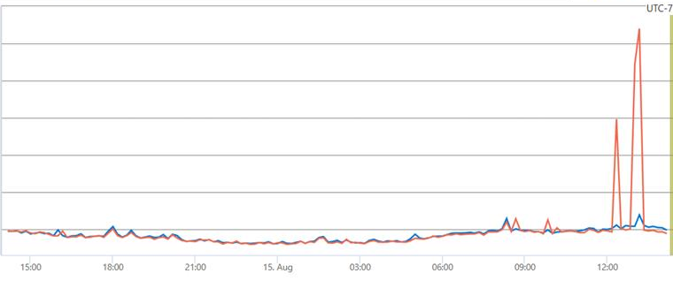
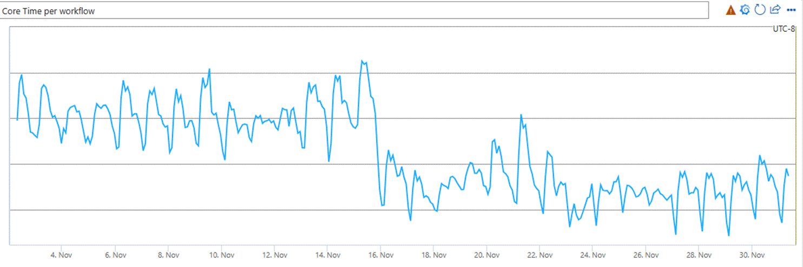
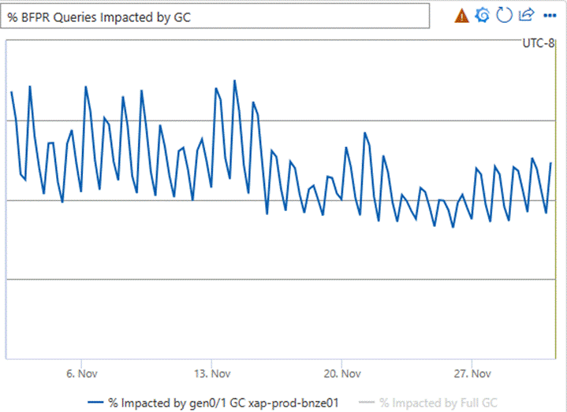

> ## 摘要
>
> Bing 可扩展应用程序平台升级到 .NET 8 以及动态配置文件引导优化如何继续提供性能增益
>
> 原文 [Bing on .NET 8 – The Impact of Dynamic PGO - .NET Blog](https://devblogs.microsoft.com/dotnet/bing-on-dotnet-8-the-impact-of-dynamic-pgo/)

---

2024年3月29日

自从我上次更新大家有关在 Bing 堆栈中 .NET 的状态以来已经过去一年多了，特别是位于一切中心的高性能工作流执行引擎。在这段时间里，这个引擎的范围只有增加，特别是随着 Microsoft Copilot 的发布。虽然我们的工作流引擎起源于 Bing，但公平地说，现在它构成了许多 Microsoft 应用程序中搜索和数据堆栈的一个重要部分。

我们从 .NET 8 的早期预览版本开始测试。尽管在 .NET 8 中 .NET 核心库的性能跨度有明显的增长，但我们升级的最大因素是对动态 PGO 的显著改进。这个特性自从 .NET 6 版本开始就以预览形式存在，[到了 .NET 8，改进足够显著](https://devblogs.microsoft.com/dotnet/performance-improvements-in-net-8/#tiering-and-dynamic-pgo)，以至于它默认情况下就被开启了。

> **以前的帖子**
>
> - [Bing 的工作流引擎迁移到 .NET 5](https://devblogs.microsoft.com/dotnet/migration-of-bings-workflow-engine-to-net-5/)
> - [.NET 性能再次为 Bing 提供支持，从 .NET 5 到 .NET 7](https://devblogs.microsoft.com/dotnet/dotnet-performance-delivers-again-for-bing-from-dotnet-5-to-dotnet-7/)

## 动态 PGO

鉴于我们的规模，有时几乎所有应用程序都能很好地使用某些功能，但我们以额外的考虑来处理它们。

在进程启动时，这个服务器加载数千个合作伙伴程序集，包含组成我们执行的工作流的插件。这大约是 2 GB 的代码，其中很多需要进行 JIT 编译。当第一个用户查询到达机器时，它需要在几百毫秒内能够提供答案，而不会因为 JIT 编译而暂停。

人们自然会想，像 NGEN 和 Ready2Run 这样的技术是否会有所帮助。尝试预编译代码已经尝试过不同程度的成功。最终，让 JIT 去做它的事情，结合在启动时预编译在之前运行中检测到的特别关键的方法列表，达到了性能和启动最小化的最佳平衡。我们在启动时并行进行数据加载，也会在接受真实用户流量之前通过系统处理一些测试查询。

动态 PGO 通过根据需要重新编译某些代码来提高运行时代码的质量。这理论上可以帮助我们的延迟，但我们需要彻底测试它对启动和第一批用户查询的影响。你可以在其他地方[阅读有关动态 PGO 如何工作的内容](https://devblogs.microsoft.com/dotnet/performance-improvements-in-net-8/#tiering-and-dynamic-pgo)，但简要来说：

动态 PGO 用一些轻量级指令对新 JIT 编译的代码进行注释，以记录性能特征并构建一个重新编译候选名单。可能的优化包括：

- 内联
- 方法去虚拟化
- 循环优化
- 尾递归移除
- 内存中的代码布局以优化处理器缓存
- ……以及更多

在测试中，我们看到了两个主要结果：

1. 稳定状态性能显著提升。
2. 我们最大的工作负载在第一批用户查询时有一个小的延迟峰值，表明要么有些方法根本没有被 JIT 编译，要么分析的影响太大。这超过了最高延迟限制。对我们较小的工作负载来说，这不是问题。

以下延迟图表显示与基线相比的大幅峰值：



(请注意，本文档中的图表已删除了具体的内部指标，但形状的变化应该能给你一个相对变化的概念。)

经过一些深入的调查和 .NET 团队的协助，我们发现在我们甚至遇到第一个用户查询之前，重编译队列已经增长到超过 300,000 个方法！就像我说的，我们有很多代码。最终，几个小时后，进程运行时，我们通常会有超过两百万个方法。

作为回应，我们实施了一些小改动：

1. 附加的预热查询，以给更多方法一个 JIT 和重新 JIT 的机会。
2. 在我们接受用户流量之前稍加暂停以允许队列排空（我们最初静态配置它，但有一个[事件](https://learn.microsoft.com/dotnet/fundamentals/diagnostics/runtime-tiered-compilation-events#tieredcompilationbackgroundjitstop-event)可以观察 JIT 队列大小）。
3. 一些特定于我们超大规模场景的自定义 JIT 设置：

```bash
REM 启用 64 位计数器以稍微减少假共享
set DOTNET_JitCollect64BitCounts=1

REM 移除启动分层编译的延迟
REM (目标是减少总体上执行带注释方法的时间)
set DOTNET_TC_CallCountingDelayMs=0
```

通过这些更改，延迟峰值消失了，我们现在可以收获稳定状态性能的改进。

## 性能改进

我们在许多性能特征中看到的改善或许是自从从 .NET Framework 迁移到 .NET 5 以来我们看到的最显著的。

我们执行查询所花费的 CPU 周期数量下降了 13%。换句话说，我们变得更加高效，或者再换一种方式说：这是我们需要购买的比以往少 13% 的机器，以跟上不断增长的需求。以下图表显示了执行工作流程时总 CPU 时间的下降。



受 gen0 或 gen1 垃圾回收影响的查询百分比下降了 20%（我们几乎从不有查询受到 gen2 GC 的影响，因为 A. 我们的内存管理策略避免了这一点，B. 我们采取额外步骤确保在 gen2 GC 即将发生时机器不会服务用户——这是极其罕见的）。

此图表显示垃圾回收对查询影响的相对差异：



许多其他指标表明，各种查询执行阶段的改进大致与上述图表的描述相符。一些内部延迟下降了 25% 以上。查询服务的很大一部分是等待其他后端，所以总体查询服务时间改善得不太戏剧性，大约 8%——仍然非常显著！

## 总结

综上所述，这对我们来说是一个稳固且相对容易的 .NET 发行版。我们实现了延迟的改善，并且在效率方面也有很大的改善，这将在未来几年节省数百万美元。动态 PGO，虽然需要一些技巧来处理我们庞大的代码库和严格的延迟要求，但在运行时性能方面是一个巨大的胜利。

现在我需要去为 .NET 9 做准备……我希望在另一年内能报道那个！
