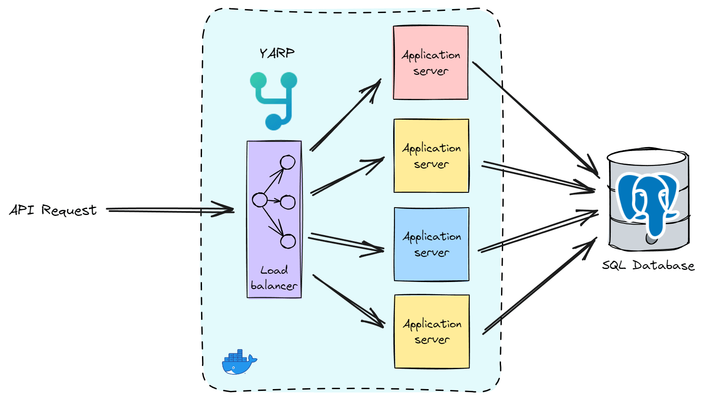

> ## 摘要
>
> 当单个服务器达到其限制时，性能会下降，导致响应时间变慢、错误增加或完全宕机。我们将深入讨论负载均衡的重要性以及YARP如何简化.NET应用程序的这一过程。
>
> 原文 [Horizontally Scaling ASP.NET Core APIs With YARP Load Balancing](https://www.milanjovanovic.tech/blog/horizontally-scaling-aspnetcore-apis-with-yarp-load-balancing) 由 [Milan Jovanović](https://www.milanjovanovic.tech/) 发表。

---

现代网络应用程序需要服务于越来越多的用户并处理流量高峰。当单个服务器达到其限制时，性能会下降，导致响应时间变慢、错误增加或完全宕机。

负载均衡是解决这些挑战并提升应用程序可扩展性的关键技术。

在本文中，我们将探讨：

- 如何使用 [YARP (Yet Another Reverse Proxy)](https://www.milanjovanovic.tech/blog/implementing-an-api-gateway-for-microservices-with-yarp) 实现负载均衡
- 如何利用水平扩展来获得性能提升
- 如何利用K6作为负载测试工具

我们将深入讨论负载均衡，它为什么重要，以及YARP如何为.NET应用程序简化这一过程。

## [软件可扩展性的类型](https://www.milanjovanovic.tech/blog/horizontally-scaling-aspnetcore-apis-with-yarp-load-balancing#types-of-software-scalability)

在深入探讨YARP和负载均衡之前，让我们先了解一下扩展的基础知识。

主要有两种方法：

- **垂直扩展**：通过为单个服务器升级更强大的硬件 - 更多的CPU核心、RAM和更快的存储来实现。然而，这有几个限制：成本迅速增加，并且你仍然会遇到性能上限。
- **水平扩展**：涉及向你的基础架构中添加更多服务器并在它们之间智能分配负载。这种方法提供了更大的可扩展性潜力，因为你可以继续添加服务器以处理更多流量。

在水平扩展方面，负载均衡的角色开始显现，而YARP在这种方法中表现非常出色。

## [添加反向代理](https://www.milanjovanovic.tech/blog/horizontally-scaling-aspnetcore-apis-with-yarp-load-balancing#adding-a-reverse-proxy)

[YARP](https://microsoft.github.io/reverse-proxy/index.html)是微软提供的一个高性能反向代理库。它专为现代微服务架构设计。反向代理位于你的后端服务器前面，充当流量指挥官。

设置YARP相当简单。你需要安装YARP NuGet包，创建基本配置以定义你的后端目的地，然后激活YARP中间件。YARP允许你在请求到达你的后端服务器之前，对进入请求进行路由和转换任务。

首先，让我们安装 `Yarp.ReverseProxy` NuGet包：

```powershell
Install-Package Yarp.ReverseProxy
```

然后，我们将配置所需的应用服务并将YARP中间件引入请求管道：

```csharp
var builder = WebApplication.CreateBuilder(args);

builder.Services.AddReverseProxy()
    .LoadFromConfig(builder.Configuration.GetSection("ReverseProxy"));

var app = builder.Build();

app.MapReverseProxy();

app.Run();
```

剩下的就是将YARP配置添加到我们的 `appsettings.json` 文件中。YARP使用 `Routes` 来代表进入反向代理的请求，并使用 `Clusters` 来定义下游服务。 `{**catch-all}` 模式让我们可以轻松地路由所有进入的请求。

```json
{
  "ReverseProxy": {
    "Routes": {
      "api-route": {
        "ClusterId": "api-cluster",
        "Match": { "Path": "{**catch-all}" },
        "Transforms": [{ "PathPattern": "{**catch-all}" }]
      }
    },
    "Clusters": {
      "api-cluster": {
        "Destinations": { "destination1": { "Address": "http://api:8080" } }
      }
    }
  }
}
```

这配置了YARP作为一个透传代理，但让我们升级它以支持水平扩展。

## [通过YARP负载均衡实现扩容](https://www.milanjovanovic.tech/blog/horizontally-scaling-aspnetcore-apis-with-yarp-load-balancing#scaling-out-with-yarp-load-balancing)

使用YARP进行水平扩展的核心在于其各种[负载均衡策略](https://microsoft.github.io/reverse-proxy/articles/load-balancing.html)：

- `PowerOfTwoChoices`：选择两个随机的目的地并选择分配请求最少的那个。
- `FirstAlphabetical`：选择字母顺序第一个可用的目的地服务器。
- `LeastRequests`：将请求发送到分配请求最少的服务器。
- `RoundRobin`：在后端服务器之间均匀分配请求。
- `Random`：为每个请求随机选择一个后端服务器。

你可以在YARP的配置文件中配置这些策略。负载均衡策略可以使用集群上的 `LoadBalancingPolicy` 属性进行配置。

下面是带有 `RoundRobin` 负载均衡的更新后的YARP配置：

```json
{
  "ReverseProxy": {
    "Routes": {
      "api-route": {
        "ClusterId": "api-cluster",
        "Match": { "Path": "{**catch-all}" },
        "Transforms": [{ "PathPattern": "{**catch-all}" }]
      }
    },
    "Clusters": {
      "api-cluster": {
        "LoadBalancingPolicy": "RoundRobin",
        "Destinations": {
          "destination1": { "Address": "http://api-1:8080" },
          "destination2": { "Address": "http://api-2:8080" },
          "destination3": { "Address": "http://api-3:8080" }
        }
      }
    }
  }
}
```

下面是我们的系统可能的示意图，其中包含YARP负载均衡器和水平扩展的应用服务器。

进入的API请求首先会击中YARP，根据负载均衡策略将流量分配给应用服务器。在这个示例中，有一个数据库为多个应用实例服务。



现在，让我们进行一些性能测试。

## [使用K6进行性能测试](https://www.milanjovanovic.tech/blog/horizontally-scaling-aspnetcore-apis-with-yarp-load-balancing#performance-testing-with-k6)

为了看到我们水平扩展努力的影响，我们需要进行一些负载测试。[K6](https://k6.io/)是一个现代化、对开发者友好的负载测试工具。我们将编写K6脚本来模拟我们应用上的用户流量，并比较诸如平均响应时间和每秒成功请求数量等指标。

我们将要水平扩展的应用有两个API端点。`POST /users`端点创建一个新用户，将用户保存到[PostgreSQL](https://www.postgresql.org/)数据库，并返回用户的标识符。`GET /users/id` 端点返回一个给定标识符的用户（如果存在）。

这里是一个k6性能测试，将会：

- 增加到 **20个虚拟用户**
- 向 `/users` 端点发送 `POST` 请求
- 检查响应是否为 `201 Created`
- 向 `/users/{id}` 端点发送 `GET` 请求
- 检查响应是否为 `200 OK`

注意所有API请求都通过YARP负载均衡器。

```js
import { check } from "k6";
import http from "k6/http";
export const options = {
  stages: [
    { duration: "10s", target: 20 },
    { duration: "1m40s", target: 20 },
    { duration: "10s", target: 0 },
  ],
};
export default function () {
  const proxyUrl = "http://localhost:3000";
  const response = http.post(`${proxyUrl}/users`);
  check(response, { "response code was 201": res => res.status == 201 });
  const userResponse = http.get(`${proxyUrl}/users/${response.body}`);
  check(userResponse, { "response code was 200": res => res.status == 200 });
}
```

为了使性能测试结果更加一致，我们可以限制[Docker](https://www.docker.com/)容器的可用资源为 `1 CPU` 和 `0.5G` 的RAM。

```yml
services: api: image: ${DOCKER_REGISTRY-}loadbalancingapi cpus: 1 mem_limit: '0.5G' ports: - 5000:8080 networks: - proxybackend
```

最终，这是k6性能测试的结果：

| API实例数量          | 请求时长                  |         每秒请求数量 |
| -------------------- | ------------------------- | -------------------: |
| 1                    | 9.68 ms                   |               2260/s |
| -------------------- | ------------------------- | -------------------- |
| 2                    | 6.57 ms                   |               2764/s |
| -------------------- | ------------------------- | -------------------- |
| 3                    | 5.62 ms                   |               3227/s |
| -------------------- | ------------------------- | -------------------- |
| 5                    | 4.65 ms                   |               3881/s |

## [总结](https://www.milanjovanovic.tech/blog/horizontally-scaling-aspnetcore-apis-with-yarp-load-balancing#summary)

水平扩展，结合有效的负载均衡，可以显著提高你的网络应用程序的性能和可扩展性。在高流量场景中，当单个服务器无法再应对需求时，水平扩展的好处尤为明显。

YARP是一个强大且易于使用的.NET应用程序反向代理服务器。然而，高度复杂的大规模分布式系统可能会从专门的、独立的负载均衡解决方案中受益。这些专用解决方案可以提供更细粒度的控制和复杂的功能。

如果你想了解更多，这里是如何[使用YARP构建API网关](https://www.milanjovanovic.tech/blog/implementing-an-api-gateway-for-microservices-with-yarp)。

你可以在GitHub上找到这个示例的[源代码](https://github.com/m-jovanovic/yarp-load-balancing)。

---
