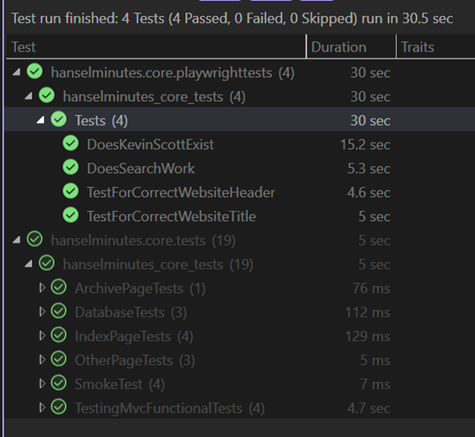

> ## 摘要
>
> 我不仅仅是为我的网站进行单元测试，而是进行全面的集成...
>
> 原文 [Updating to .NET 8, updating to IHostBuilder, and running Playwright Tests within NUnit headless or headed on any OS - Scott Hanselman's Blog](https://www.hanselman.com/blog/) 由 [Scott Hanselman](https://www.hanselman.com/) 发表。

---



我不仅仅为我的网站做单元测试，自2007年以来，我一直在进行全面的集成测试和浏览器自动化测试，最初使用Selenium。然而，最近我一直在使用更快且通常更兼容的 [Playwright](https://playwright.dev/)。它具有一个API，并且可以在Windows、Linux、Mac上本地测试，在容器中（无头）、在我的CI/CD管道上、在Azure DevOps上，或在GitHub Actions中测试。

对我来说，这是确保网站从头到尾完全运行的最后一个真理时刻。

我可以用类似TypeScript的语言编写那些Playwright测试，并且我可以用node启动它们，但我喜欢运行端到端单元测试，并使用那个测试运行器和测试框架作为我.NET应用程序的跳板。我习惯于在Visual Studio或VS Code中右键点击并选择“运行单元测试”，或者更好地，右键点击并选择“调试单元测试”。这让我得到了使用完整单元测试框架的所有断言的好处，以及使用Playwright这类工具自动化我的浏览器的所有好处。

[2018年我开始使用WebApplicationFactory](https://www.hanselman.com/blog/real-browser-integration-testing-with-selenium-standalone-chrome-and-aspnet-core-21)和一些技巧，基本上是在单元测试中启动ASP.NET（当时的）Core 2.1，然后启动Selenium。这有点笨拙，需要手动启动一个单独的进程并管理其生命周期。然而，我持续使用这个技巧好几年，基本上是试图让Kestrel Web服务器在我的单元测试中启动。

最近，我将我的主站点和播客站点升级到了.NET 8。请记住，我一直在将我的网站从早期版本的.NET向最新版本迁移。博客现在很高兴地在Linux的容器中运行在.NET 8上，但它的原始代码始于2002年的.NET 1.1。

现在我升级到.NET 8，当我的单元测试停止工作时，我震惊地发现[世界其它地方五个版本前就从IWebHostBuilder转移到IHostBuilder了](https://learn.microsoft.com/en-us/aspnet/core/migration/22-to-30?view=aspnetcore-3.1&tabs=visual-studio&WT.mc_id=-blog-scottha#hostbuilder-replaces-webhostbuilder)。哎呀。不管你怎么说，向后兼容性令人印象深刻。

因此，我的Program.cs代码从这样：

```csharp
public static void Main(string[] args)
{
    CreateWebHostBuilder(args).Build().Run();
}

public static IWebHostBuilder CreateWebHostBuilder(string[] args) =>
    WebHost.CreateDefaultBuilder(args)
        .UseStartup<Startup>();
```

变成了这样：

```csharp
public static void Main(string[] args)
{
  CreateHostBuilder(args).Build().Run();
}

public static IHostBuilder CreateHostBuilder(string[] args) =>
  Host.CreateDefaultBuilder(args).
      ConfigureWebHostDefaults(WebHostBuilder => WebHostBuilder.UseStartup<Startup>());
```

从外表上看不是一个重大变化，但在内部整理了一下，为我的web应用设置了[一个更灵活的通用主机](https://learn.microsoft.com/en-us/aspnet/core/fundamentals/host/generic-host?view=aspnetcore-3.1&WT.mc_id=-blog-scottha)。

我的单元测试停止工作，因为我的Kestral Web服务器黑客袭击不再启动我的服务器。

下面是一个在.NET NUnit测试中的Playwright角度目标的示例。

```csharp
[Test]
public async Task DoesSearchWork()
{
    await Page.GotoAsync(Url);

    await Page.Locator("#topbar").GetByRole(AriaRole.Link, new() { Name = "episodes" }).ClickAsync();

    await Page.GetByPlaceholder("search and filter").ClickAsync();

    await Page.GetByPlaceholder("search and filter").TypeAsync("wife");

    const string visibleCards = ".showCard:visible";

    var waiting = await Page.WaitForSelectorAsync(visibleCards, new PageWaitForSelectorOptions() { Timeout = 500 });

    await Expect(Page.Locator(visibleCards).First).ToBeVisibleAsync();

    await Expect(Page.Locator(visibleCards)).ToHaveCountAsync(5);
}
```

我喜欢这个。干净利落。当然，在第一行中我们假设有一个URL，将是某个localhost，然后我们假设我们的web应用程序已经自行启动。

下面是启动我的新的“web应用程序测试构建器工厂”的设置代码，是的，这个名字很蠢但它很形象。注意OneTimeSetUp和OneTimeTearDown。这启动了我的web应用程序在我的TestHost的上下文中。注意:0使得应用找到一个端口，然后我不得不挖掘并将其放入私有Url中，供我在我的单元测试中使用。注意<Startup>实际上是我的Startup类，在Startup.cs中，它托管了我的应用程序的管道和Configure和ConfigureServices在这里设置，所以路由都工作了。

```csharp
private string Url;
private WebApplication? _app = null;

[OneTimeSetUp]
public void Setup()
{
    var builder = WebApplicationTestBuilderFactory.CreateBuilder<Startup>();

    var startup = new Startup(builder.Environment);
    builder.WebHost.ConfigureKestrel(o => o.Listen(IPAddress.Loopback, 0));
    startup.ConfigureServices(builder.Services);
    _app = builder.Build();

    // 监听任何本地端口（因此是0）
    startup.Configure(_app, _app.Configuration);
    _app.Start();

    // 你在开玩笑吧
    Url = _app.Services.GetRequiredService<IServer>().Features.GetRequiredFeature<IServerAddressesFeature>().Addresses.Last();
}

[OneTimeTearDown]
public async Task TearDown()
{
    await _app.DisposeAsync();
}
```

那么WebApplicationTestBuilderFactory中隐藏了什么恐怖？第一部分很糟，我们应该在.NET 9中修复它。其余的实际上很好，感谢David Fowler的帮助和指导！这是魔法和不足之处在一个小助手类中。

```csharp
public class WebApplicationTestBuilderFactory
{
    public static WebApplicationBuilder CreateBuilder<T>() where T : class
    {
        // 这段不神圣的代码需要一个对MvcTesting包的未使用的引用，该包通过MSBuild创建
        // 读取这里的清单文件。
        var testLocation = Path.Combine(AppContext.BaseDirectory, "MvcTestingAppManifest.json");
        var json = JsonObject.Parse(File.ReadAllText(testLocation));
        var asmFullName = typeof(T).Assembly.FullName ?? throw new InvalidOperationException("Assembly Full Name is null");
        var contentRootPath = json?[asmFullName]?.GetValue<string>();

        // 在TestHost.exe中启动一个真实的web应用程序
        var builder = WebApplication.CreateBuilder(
            new WebApplicationOptions()
            {
                ContentRootPath = contentRootPath,
                ApplicationName = asmFullName
            });
        return builder;
    }
}
```

前4行很糟糕。因为测试运行在不同目录的上下文中，而我的网站需要在其自己的内容根路径上下文中运行，我必须强制内容根路径正确，而唯一的方法就是从MSBuild生成的文件中获取应用程序的基目录，该文件来自（老化的）MvcTesting包。该包未被使用，但通过引用它，它就进入了构建，并生成了那个文件，然后我使用它来抽取目录。

如果我们能够摆脱那个“黑客”并从其他地方获取目录，那么这个辅助函数变成了一行代码，.NET 9的可测试性将大大提高！

现在我可以跨所有操作系统运行我的单元测试和Playwright浏览器集成测试，无头或有头，在docker中或在金属上。网站已更新到.NET 8，我的代码一切正常。嗯，至少它运行了。;)
