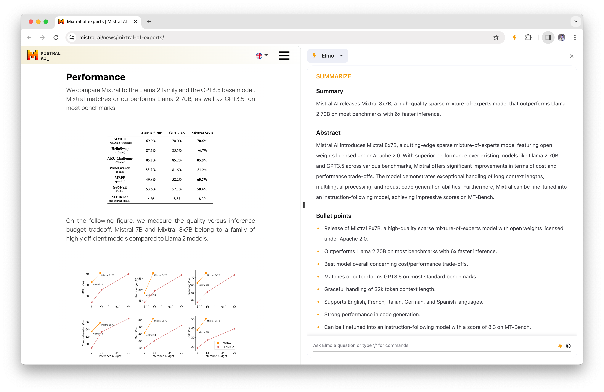
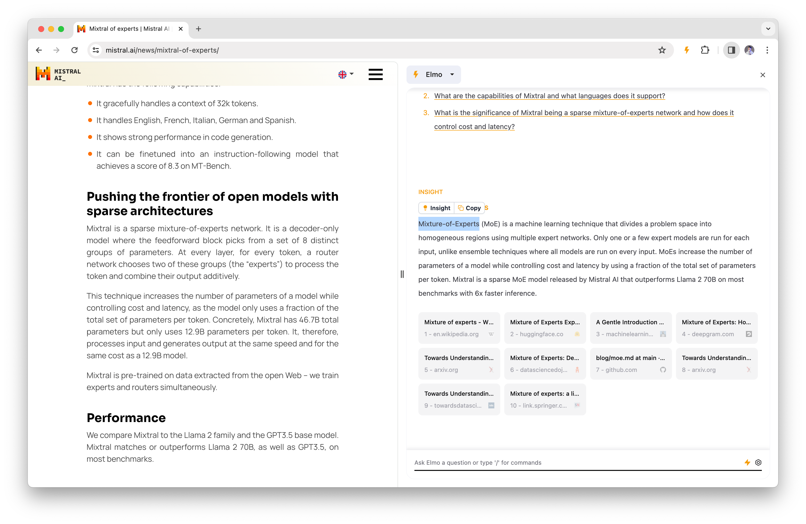
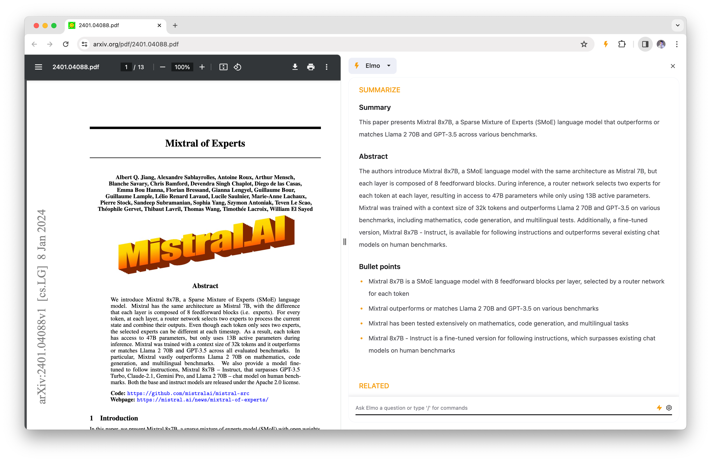
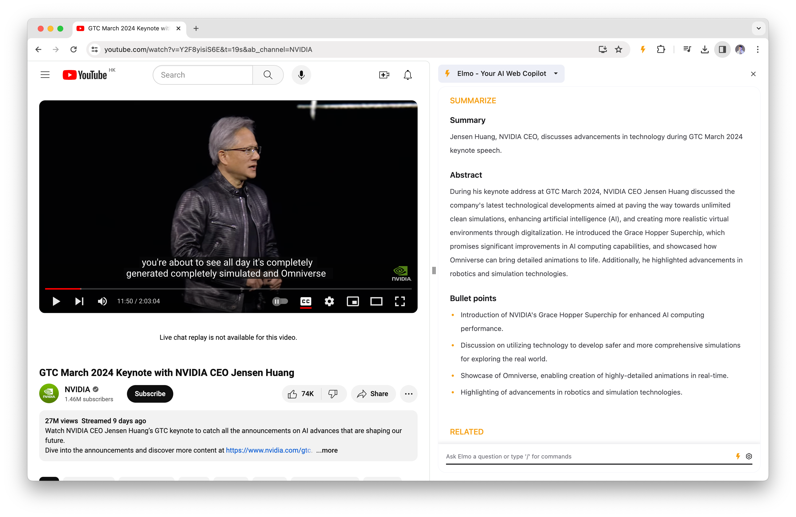

> ## 摘录
>
> Elmo是您的AI网络副驾驶，一个用于创建摘要、洞见和拓展知识的Chrome扩展。
>
> 下载地址：[https://www.elmo.chat/](https://www.elmo.chat/)

---

Elmo是您用于创建摘要、洞见和拓展知识的AI Chrome扩展。

## 摘要和要点

Elmo允许您立即将网站内容压缩成简洁的摘要。此功能适合快速阅读者和那些希望把握主要思想而不深入详细内容的用户。

## 继续提问

您可以提出具体问题并直接从页面接收答案，节省了其他方式搜索材料所需的时间和努力。

## 深入关键词

Elmo可以从网上获取相关信息，无缝整合到您的浏览体验中。对于研究、学习或在不离开当前网页的情况下满足您的好奇心，这一功能非常宝贵。

## 与PDF对话

Elmo的PDF对话功能使得消化大文件、学习教科书或审查报告通过与PDF直接对话变得更容易，提高了您的生产力和理解能力。

## 与Youtube交谈

Elmo允许您与YouTube视频互动，提问并获得洞见，就像您正在与视频本身对话一样。它非常适合学习者、研究人员以及任何希望更深入地与视频材料互动的人。

Elmo由[Lepton AI](https://lepton.ai/)提供的高速LLM API驱动
