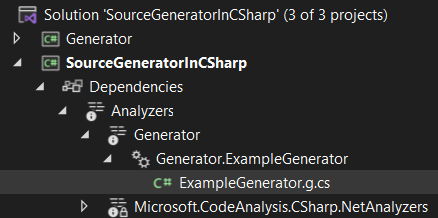

> ## 摘要
>
> 在本文中，我们将讨论 C# 中的 Source Generators。我们将讨论背景以及如何在项目中使用它。
>
> 原文 [C# Source Generators](https://code-maze.com/csharp-source-generators/) 由 [Code Maze](https://code-maze.com/) 发表。

---

传统上，在 C# 中进行代码生成涉及使用外部工具或模板在编译过程之前生成代码，比如 T4 模板。然而，有了源代码生成器，代码生成成为编译本身的一个内在部分。

在本文中，我们将探讨 C# 源代码生成器的基础知识，以及如何使用这个强大的特性，在编译过程中启用动态代码生成，自动化重复任务，并提高开发人员的生产力。

想要下载本文的源代码，您可以访问我们的 [GitHub 仓库](https://github.com/CodeMazeBlog/CodeMazeGuides/tree/main/csharp-advanced-topics/SourceGeneratorInCSharp)。

## 背景

源代码生成器是在 C# 9 中引入的一个特性，它允许在编译过程中动态生成代码。它们直接与 C# 编译器 (`Roslyn`) 集成，并在编译时操作，分析源代码并基于分析结果生成附加代码。

源代码生成器提供了一种流线型的、自动化的代码生成方法，消除了对外部工具或单独预编译步骤的需求。

通过无缝集成到编译过程中，源代码生成器增强了生产力，减少了错误，并允许更高效的开发工作流。

## 如何使用

首先，我们应该创建一个目标是 `netstandard2.0` 的 C# 项目，并添加一些标准包以获得对源代码生成器类型的访问。

我们可以首先创建一个类库。然后，通过 SDK，在当前文件夹中创建一个解决方案和一个项目：

```bash
dotnet new sln -n SourceGeneratorInCSharp
dotnet new classlib --framework "netstandard2.0" -o ./Generator
dotnet sln add ./Generator
```

之后，我们需要替换 `Generator.csproj` 的内容：

```xml
<Project Sdk="Microsoft.NET.Sdk">
    <PropertyGroup>
        <TargetFramework>netstandard2.0</TargetFramework>
        <IncludeBuildOutput>false</IncludeBuildOutput>
        <LangVersion>latest</LangVersion>
    </PropertyGroup>
    <ItemGroup>
        <PackageReference Include="Microsoft.CodeAnalysis.CSharp.Workspaces"
            Version="4.4.0"
            PrivateAssets="all" />
    </ItemGroup>
</Project>
```

正如我们所了解的，源代码生成器像一个分析器一样工作，并提供在开发时生成源代码的选项，即使代码无法被编译。为此，我们需要一个单独的项目来引用我们的生成器。

让我们为此创建一个控制台应用程序：

```bash
dotnet new console --framework "net7.0" -o SourceGeneratorInCSharp
dotnet sln add SourceGeneratorInCSharp
```

在 `SourceGeneratorInCSharp.csproj` 中，我们需要更改内容：

```xml
<Project Sdk="Microsoft.NET.Sdk">
    <PropertyGroup>
        <OutputType>Exe</OutputType>
        <TargetFramework>net7.0</TargetFramework>
        <LangVersion>latest</LangVersion>
        <ImplicitUsings>enable</ImplicitUsings>
        <Nullable>enable</Nullable>
    </PropertyGroup>
    <ItemGroup>
        <ProjectReference Include="..\Generator\Generator.csproj"
            OutputItemType="Analyzer"
            ReferenceOutputAssembly="false"/>
    </ItemGroup>
</Project>
```

到目前为止，我们所做的一切都是标准的事情，现在让我们进入代码部分。

## 实现一个简单的生成器

一个源代码生成器有两个定义特征，实现 `IIncrementalGenerator` 接口并用 `[Generator]` 属性装饰，这使得一个项目将一个类视为源代码生成器：

```csharp
[Generator]
public sealed class ExampleGenerator : IIncrementalGenerator
{
    public void Initialize(IncrementalGeneratorInitializationContext context)
    {
    }
}
```

生成器只需要实现一个方法，`Initialize`。在这个方法中，我们可以注册我们的静态源代码以及创建一个管道来识别感兴趣的语法并将这个语法转换成源代码。

**此外，我们使用 `IIncrementalGenerator` 接口而不是 `ISourceGenerator` 是因为它性能更高，而且 `ISourceGenerator` 接口每次生成都会创建一个新的 `ISyntaxReceiver`，这会产生大量的生成阶段。对于大型项目，这很快会导致性能问题。`IIncrementalGenerator` 旨在为我们的应用程序提供更好的性能。**

现在，让我们实现一个将输出简单源代码的生成器：

```csharp
[Generator]
public sealed class ExampleGenerator : IIncrementalGenerator
{
    public void Initialize(IncrementalGeneratorInitializationContext context)
    {
        context.RegisterPostInitializationOutput(ctx =>
        {
            var sourceText = $$"""
                namespace SourceGeneratorInCSharp
                {
                    public static class HelloWorld
                    {
                        public static void SayHello()
                        {
                            Console.WriteLine("Hello From Generator");
                        }
                    }
                }
                """;
            ctx.AddSource("ExampleGenerator.g", SourceText.From(sourceText, Encoding.UTF8));
        });
    }
}
```

在示例中，我们使用一个字符串字面量来表示我们想要发出的代码。

`RegisterPostInitializationOutput` 只允许我们添加固定的源代码，因为我们在这一点上没有任何访问用户代码的权限。

为了发射文件，我们使用 `AddSource()` 方法，它需要两个参数。第一个参数作为发射源的独特标识符，而第二个参数代表实际的源文本。这个文本来自我们的硬编码字符串并包含相应的编码信息。

构建完毕后，如果一切设置正确，我们可以在 `Console` 项目解决方案资源管理器中的分析器下看到生成的代码文件：

[](https://code-maze.com/wp-content/uploads/2023/07/SourceGeneratorExample.png)

如果我们双击 `ExampleGenerator.g.cs`，我们可以看到输出代码，包括 Visual Studio 的警告，表示该文件不可编辑：

[](https://code-maze.com/wp-content/uploads/2023/07/SourceGeneratorExampleDetail-1.png)

## 实现一个更复杂的生成器

现在我们已经看到了一个简单的生成器如何工作的示例，让我们尝试不同的事情。在我们构建更复杂的生成器之前，让我们考虑一个实践场景。

对于许多企业应用程序，我们有一系列遵循的架构模式，例如实体、仓库、服务和控制器的使用，大多数实现都是相同的。这往往是一个非常手工和耗时的任务。我们需要编写的代码来创建整个结构往往是重复性的，并且容易出错。

使用 C# 源代码生成器来生成这些部分中的一些可以为我们节省大量时间。因此，让我们以实现服务类为例。

### 添加标记属性

我们需要考虑如何选择我们将为哪些模型生成服务类。我们可以为项目中的所有模型执行此操作，但这将导致即使我们不需要的模型也会生成服务。为此，我们可以使用标记属性。标记属性是一个简单的属性，没有功能，只存在于被定位。

我们将创建一个简单的标记属性，但我们不会直接在代码中定义这个属性。相反，我们将创建一个包含 `[GenerateService]` 属性 C# 代码的字符串。我们将让生成器自动将其添加到使用项目的构建中，属性将在运行时可用。需要这样做的原因是当引用我们的 `Generator` 项目时，我们将 `ReferenceOutputAssembly` 设置为 false。

如果将 `ReferenceOutputAssembly` 设置为 false，则引用项目的输出不会作为此项目的 [Reference](https://learn.microsoft.com/en-us/visualstudio/msbuild/common-msbuild-project-items?view=vs-2022#reference) 包含在内，但仍然保证其他项目在此之前构建。

让我们创建这个属性：

```csharp
public class SourceGenerationHelper
{
    public const string Attribute = """
        namespace Generator
        {
            [System.AttributeUsage(System.AttributeTargets.Class)]
            public class GenerateServiceAttribute : System.Attribute
            {
            }
        }
        """;
}
```

### 创建源代码生成器

如前所述，我们的起点是实现 `IIncrementalGenerator` 接口并用 `[Generator]` 属性装饰的类：

```csharp
[Generator]
public sealed class ServiceGenerator : IIncrementalGenerator
{
    public void Initialize(IncrementalGeneratorInitializationContext context)
    {
        context.RegisterPostInitializationOutput(ctx => ctx.AddSource(
            "GenerateServiceAttribute.g.cs",
            SourceText.From(SourceGenerationHelper.Attribute, Encoding.UTF8)));
    }
}
```

在实现中，我们使用了 `RegisterPostInitializationOutput` 方法，它允许我们注册一个仅被调用一次的回调。它对于高效地将“常量”字体添加到构建中很有用，比如我们的标记属性。现在我们的 `SourceGeneratorInCSharp` 项目中有了属性。

### 开发生成器管道

现在我们需要创建一个过滤和转换的管道，该管道在设计上记住了每一层的结果，以避免在没有变化的情况下重新做工作：

```csharp
[Generator]
public sealed class ServiceGenerator : IIncrementalGenerator
{
    public void Initialize(IncrementalGeneratorInitializationContext context)
    {
        context.RegisterPostInitializationOutput(ctx => ctx.AddSource(
            "GenerateServiceAttribute.g.cs",
            SourceText.From(SourceGenerationHelper.Attribute, Encoding.UTF8)));
        IncrementalValuesProvider<ClassDeclarationSyntax> enumDeclarations = context.SyntaxProvider
            .CreateSyntaxProvider(
                predicate: static (s, _) => IsSyntaxTargetForGeneration(s),
                transform: static (ctx, _) => GetTargetForGeneration(ctx));
        IncrementalValueProvider<(Compilation, ImmutableArray<ClassDeclarationSyntax>)> compilationAndEnums
                = context.CompilationProvider.Combine(enumDeclarations.Collect());
        context.RegisterSourceOutput(compilationAndEnums,
            (spc, source) => Execute(source.Item1, source.Item2, spc));
        }
}
```

在管道的第一个阶段，我们使用 `CreateSyntaxProvider` 方法过滤输入列表。`IsSyntaxTargetForGeneration` 谓词提供了第一层的过滤。`GetTargetForGeneration` 转换仅用于转换第一个过滤的结果。

下一个管道阶段简单地将我们在第一阶段发布的 `ClassDeclarationSyntax` 集合与当前的编译结合在一起。

有了这个，我们就可以使用自定义的 `Execute` 方法生成源代码了。

### 实现阶段

`IsSyntaxTargetForGeneration` 谓词是一个将非常频繁调用的方法，用于检查给定的 `SyntaxNode` 是否对我们的生成器来说是相关的。

语法节点是语法树的主要元素之一。这些节点代表声明、语句、子句和表达式。每一类语法节点由 `Microsoft.CodeAnalysis.SyntaxNode` 派生的单独类表示：

```csharp
public static bool IsSyntaxTargetForGeneration(SyntaxNode syntaxNode)
{
    return syntaxNode is ClassDeclarationSyntax classDeclarationSyntax &&
        classDeclarationSyntax.AttributeLists.Count > 0 &&
        classDeclarationSyntax.AttributeLists
            .Any(al => al.Attributes
                .Any(a => a.Name.ToString() == "GenerateService"));
}
```

在我们的实现中，我们检查 `syntaxNode` 对象是否是 `ClassDeclarationSyntax` 类的实例，且它有一个名为 `"GenerateService"` 的属性。

在转换阶段，我们必须从给定上下文中提取并返回类型为 `ClassDeclarationSyntax` 的语法节点：

```csharp
public static ClassDeclarationSyntax GetTargetForGeneration(GeneratorSyntaxContext context)
{
    var classDeclarationSyntax = (ClassDeclarationSyntax)context.Node;
    return classDeclarationSyntax;
}
```

### 使用模板

在开始工作于 `Execute` 方法之前，让我们创建一个用于代码生成的模板。一个简单的字符串构建器就足够了，但是，我们可以使用模板引擎。这时，我们可以使用 [Scriban](https://github.com/scriban/scriban) 模板引擎。

`Scriban` 是一个快速、健壮、安全和轻量级的脚本语言和引擎，专为 .NET 设计。采用这种方法，我们可以将模板存储在单独的文件中，从而保持一个组织良好的解决方案。

要使用这个模板工具，我们需要安装一些包。让我们检查 `Generator.csproj` 文件的内容：

```xml
<Project Sdk="Microsoft.NET.Sdk">
    <ItemGroup>
        <PackageReference Include="Microsoft.CodeAnalysis.CSharp.Workspaces"
            Version="4.6.0"
            PrivateAssets="all" />
        <PackageReference Include="Microsoft.CSharp" Version="4.7.0" />
        <PackageReference Include="Scriban" Version="5.7.0" IncludeAssets="Build"/>
        <PackageReference Include="System.Threading.Tasks.Extensions" Version="4.5.4" />
    </ItemGroup>
</Project>
```

现在，让我们在 `Templates` 文件夹内创建一个名为 `Services.scriban` 的文件，并加入内容：

```csharp
using {{class_namespace}};
namespace {{class_assembly}}.Services
{
    public partial class {{class_name}}Service
    {
        private static readonly List<{{class_name}}> _list = new();
        public virtual List<{{class_name}}> All()
        {
            return _list;
        }
        public virtual void Add({{class_name}} item)
        {
            _list.Add(item);
        }
        public virtual void Update({{class_name}} item)
        {
            var existing = _list.Single(x => x.Id == item.Id);
            _list.Remove(existing);
            _list.Add(item);
        }
        public virtual void Delete(int id)
        {
            var existing = _list.Single(x => x.Id == id);
            _list.Remove(existing);
        }
    }
}
```

现在，我们需要在 `Generator.csproj` 文件中将文件标记为嵌入资源：

```xml
<ItemGroup>
    <None Remove="Templates\**\*.scriban" />
    <EmbeddedResource Include="Templates\**\*.scriban" />
</ItemGroup>
```

### 开发源代码生成器

在完成之后，我们可以回到我们的 `ServiceGenerator` 中的 `Execute` 方法并实现它：

```csharp
public void Execute(Compilation compilation,
    ImmutableArray<ClassDeclarationSyntax> classes,
    SourceProductionContext context)
{
    foreach (var classSyntax in classes)
    {
        // 将类转换为语义模型以访问更有意义的数据。
        var model = compilation.GetSemanticModel(classSyntax.SyntaxTree);
        // 解析为声明的符号，这样您可以单独访问每一部分代码，
        // 例如接口、方法、成员、构造函数参数等。
        var symbol = model.GetDeclaredSymbol(classSyntax);
        var className = symbol.Name;
        if (!className.Contains("Model"))
        {
            var error = Diagnostic.Create(DiagnosticsDescriptors.ClassWithWrongNameMessage,
                classSyntax.Identifier.GetLocation(),
                className);
            context.ReportDiagnostic(error);
            return;
        }
        var classNamespace = symbol.ContainingNamespace?.ToDisplayString();
        var classAssembly = symbol.ContainingAssembly?.Name;
        // 获取模板字符串
        var text = GetEmbededResource("Generator.Templates.Service.scriban");
        var template = Template.Parse(text);
        var sourceCode = template.Render(new {
            ClassName = className,
            ClassNamespace = classNamespace,
            ClassAssembly = classAssembly
        });
        context.AddSource(
            $"{className}{"Service"}.g.cs",
            SourceText.From(sourceCode, Encoding.UTF8)
        );
    }
}
```

在循环内部，我们使用 `Compilation.GetSemanticModel` 方法将类语法节点转换为语义模型。语义模型提供有关代码的更详细信息，允许访问接口、方法、成员和构造函数参数等有意义的数据。

然后我们使用 `model.GetDeclaredSymbol` 方法获取类的符号。一个符号代表一个声明的代码元素，并提供了其属性的信息，包括它的名称、包含的命名空间和包含的程序集。

调用 `GetEmbededResource` 方法检索嵌入资源中的模板字符串。

我们使用 `Template.Parser` 方法准备我们的模板以进行渲染，并通过 `Render` 方法获取我们生成的源代码。

最后，使用 `context.AddSource` 将生成的源代码添加到编译中。该方法采用生成文件的名称（从类名构造）和表示为 `SourceText` 的源代码。

### 调试源代码生成器

在开发源代码生成器时，我们经常需要对生成器本身进行调试。由于这些生成器在构建过程中运行，我们不能像普通的 C# 项目那样调试它们，因此我们必须以其他方式进行调试。如果我们想要将调试器附加到编译器，生成器将运行得如此之快以至于我们没有足够的时间来做这件事。然后我们可以使用另一个技巧，我们可以只等到调试器附加。

在方法的开始添加代码来启动调试器：

```csharp
public void Execute(Compilation compilation,
    ImmutableArray<ClassDeclarationSyntax> classes,
    SourceProductionContext context)
{
    Debugger.Launch();
    ...
}
```

### 发出诊断消息

有时我们可能想向开发者提供一些诊断反馈，以便在事情不按预期进行时让他们知道。在 `Execute` 方法中提供的上下文提供 `context.ReportDiagnostic` 方法，用于记录诊断消息。

诊断实体需要消息、消息类型、标题、诊断代码和帮助链接。位置是可选的，用于识别源代码中问题的确切位置，并且我们可以为描述符传递可选参数。

为了保持清洁，我们可以将诊断描述符存储在单独的静态类中：

```csharp
public static class DiagnosticsDescriptors
{
    public static readonly DiagnosticDescriptor ClassWithWrongNameMessage
        = new("ERR001",                                        // id
            "名称错误",                                        // 标题
            "类 '{0}' 必须包含 'Model' 前缀",                 // 消息
            "Generator",                                       // 类别
            DiagnosticSeverity.Error,
            true);
}
```

要报告诊断消息，我们只需调用 `ReportDiagnostic` 方法：

```csharp
public void Execute(Compilation compilation,
    ImmutableArray<ClassDeclarationSyntax> classes,
    SourceProductionContext context)
{
    ...
    if (!className.Contains("Model"))
    {
        var error = Diagnostic.Create(DiagnosticsDescriptors.ClassWithWrongNameMessage,
            classSyntax.Identifier.GetLocation(),
            className);
        context.ReportDiagnostic(error);
        return;
    }
}
```

### 执行源代码生成器

我们已经完成了 `Generator` 项目，现在让我们让它工作。

在我们的 `Analyzers` 中仍然没有内容，因为我们不使用 `[GenerateService]` 属性，所以我们不能生成任何代码。让我们开始创建一个带有我们属性的新模型，称为 `PersonModel`：

```csharp
[GenerateService]
public class PersonModel
{
    public int Id { get; set; }
    public string? Name { get; set; }
}
```

项目需要被构建，完成后，我们将在解决方案资源管理器分析器中看到生成的代码：

```csharp
using SourceGeneratorInCSharp.Models;
namespace SourceGeneratorInCSharp.Services
{
    public partial class PersonModelService
    {
        private static readonly List<PersonModel> _list = new();
        public virtual List<PersonModel> All()
        {
            return _list;
        }
        public virtual void Add(PersonModel item)
        {
            _list.Add(item);
        }
        public virtual void Update(PersonModel item)
        {
            var existing = _list.Single(x => x.Id == item.Id);
            _list.Remove(existing);
            _list.Add(item);
        }
        public virtual void Delete(int id)
        {
            var existing = _list.Single(x => x.Id == id);
            _list.Remove(existing);
        }
    }
}
```

有了 `PersonModelService` 生成，让我们使用：

```csharp
namespace SourceGeneratorInCSharp
{
    using Services;
    public class Program
    {
        public static void Main(string[] args)
        {
            var personModelService = new PersonModelService();
            personModelService.Add(new() { Id = 1, Name = "Mathew" });
            personModelService.All().ForEach(x => Console.WriteLine(x.Name));
        }
    }
}
```

### 测试源代码生成器

测试是每个开发者过程中非常重要的部分，正如您可能期望的那样，编写代码生成器也不例外。

让我们创建一个 `MsTest` 项目并将其添加到当前解决方案：

```bash
dotnet new mstest -o Tests
dotnet sln add SourceGeneratorInCSharp
```

在创建测试之前，我们需要创建一个帮助方法，该方法使用 `Roslyn` 资源执行代码编译并返回生成的输出：

```csharp
public static class Helper
{
    public static string GetGeneratedOutput(string sourceCode)
    {
        var syntaxTree = CSharpSyntaxTree.ParseText(sourceCode);
        var references = AppDomain.CurrentDomain.GetAssemblies()
            .Where(assembly => !assembly.IsDynamic)
            .Select(assembly => MetadataReference.CreateFromFile(assembly.Location))
            .Cast<MetadataReference>();
        var compilation = CSharpCompilation.Create("SourceGeneratorTests",
            new[] { syntaxTree },
            references,
            new CSharpCompilationOptions(OutputKind.DynamicallyLinkedLibrary));
        // 要测试的源代码生成器
        var generator = new ServiceGenerator();
        CSharpGeneratorDriver.Create(generator)
            .RunGeneratorsAndUpdateCompilation(compilation,
                out var outputCompilation,
                out var diagnostics
            );
        return outputCompilation.SyntaxTrees.Skip(1).LastOrDefault()?.ToString();
    }
}
```

之后，我们可以创建测试：

```csharp
[TestClass]
public class SourceGeneratorsUnitTest
{
    [TestMethod]
    public void WhenGeneratePersonModelService_ThenReturnCorrectOutput()
    {
        var input = """
            using Generator.Attributes;
            namespace SourceGeneratorInCSharp.Models
            {
                [GenerateService]
                public class PersonModel
                {
                    public int Id { get; set; }
                    public string? Name { get; set; }
                }
            }
            """;
        var expectedResult = """
            使用 SourceGeneratorInCSharp.Models;
            namespace SourceGeneratorTests.Services
            {
                public partial class PersonModelService
                {
                    private static readonly List<PersonModel> _list = new();
                    public virtual List<PersonModel> All()
                    {
                        return _list;
                    }
                    public virtual void Add(PersonModel item)
                    {
                        _list.Add(item);
                    }
                    public virtual void Update(PersonModel item)
                    {
                        var existing = _list.Single(x => x.Id == item.Id);
                        _list.Remove(existing);
                        _list.Add(item);
                    }
                    public virtual void Delete(int id)
                    {
                        var existing = _list.Single(x => x.Id == id);
                        _list.Remove(existing);
                    }
                }
            }
            """;
        var output = Helper.GetGeneratedOutput(input);
        Assert.AreEqual(expectedResult, output);
    }
}
```

完成所有这些之后，我们可以继续解释一些补充点。

## 使用 SyntaxFactory 生成

另一种生成源代码的方法是使用 `SyntaxFactory`。它位于 `Microsoft.CodeAnalysis.CSharp` 中，并提供了一套全面的方法来创建语法节点和令牌，从而使开发人员有能力以编程方式生成 C# 代码。

我们可以重写第一个示例：

```csharp
[Generator]
public sealed class ExampleGeneratorSyntaxFactory : IIncrementalGenerator
{
    public void Initialize(IncrementalGeneratorInitializationContext context)
    {
        context.RegisterPostInitializationOutput(ctx =>
        {
            var classBlock = SyntaxFactory.NamespaceDeclaration(SyntaxFactory.ParseName("SourceGeneratorInCSharp"))
                .AddMembers(
                    SyntaxFactory.ClassDeclaration("SyntaxFactoryHelloWorld")
                    .AddModifiers(
                        SyntaxFactory.Token(SyntaxKind.PublicKeyword),
                        SyntaxFactory.Token(SyntaxKind.StaticKeyword)
                    )
                    .AddMembers(
                        SyntaxFactory.MethodDeclaration(
                            SyntaxFactory.ParseTypeName("void"),
                            "SayHello"
                        )
                        .AddModifiers(
                            SyntaxFactory.Token(SyntaxKind.PublicKeyword),
                            SyntaxFactory.Token(SyntaxKind.StaticKeyword)
                        )
                        .AddBodyStatements(
                            SyntaxFactory.ExpressionStatement(
                                SyntaxFactory.InvocationExpression(
                                    SyntaxFactory.MemberAccessExpression(
                                        SyntaxKind.SimpleMemberAccessExpression,
                                        SyntaxFactory.IdentifierName("Console"),
                                        SyntaxFactory.IdentifierName("WriteLine")
                                    ))
                                    .WithArgumentList(
                                        SyntaxFactory.ArgumentList()
                                            .AddArguments(
                                                SyntaxFactory.Argument(
                                                    SyntaxFactory.LiteralExpression(
                                                        SyntaxKind.StringLiteralExpression,
                                                        SyntaxFactory.Literal("从生成器问好")
                                                    )
                                                )
                                            )
                                    )
                            )
                        )
                    )
                ).NormalizeWhitespace();
            ctx.AddSource("ExampleGeneratorSyntaxFactory.g",
                SourceText.From(classBlock.ToFullString(), Encoding.UTF8));
        });
    }
}
```

如我们所见，即使是生成一个简单场景，也需要使用很多方法，而且没有检查生成结果的情况下，我们不能立即看到代码会是什么样子。

## 发出编译器生成的文件

默认情况下，源代码生成器不直接产生工件。相反，在编译过程中，它们生成附加的源代码，该代码与项目的其余源代码一起编译，因此只能通过 IDE 查看。因为这种类型的文件，我们无法进行代码审查。

要启用将源代码生成器文件持久化到文件系统，我们可以在 `Console` 项目文件中设置 `EmitCompilerGeneratedFiles` 属性：

```xml
<PropertyGroup>
    <EmitCompilerGeneratedFiles>true</EmitCompilerGeneratedFiles>
</PropertyGroup>
```

仅设置属性，编译器将把生成的文件保存到磁盘。然后，我们可以看到源代码生成的文件被写入 `obj` 文件夹：

[](https://code-maze.com/wp-content/uploads/2023/07/SourceGeneratorExampleEmit.png)

这可能是一个问题，因为 `bin` 和 `obj` 文件夹通常被排除在源代码控制之外。我们可以指定 `CompilerGeneratedFilesOutputPath` 属性来确定编译器发出的文件的位置。此属性允许我们设置相对于项目根文件夹的自定义路径：

```xml
<PropertyGroup>
    <EmitCompilerGeneratedFiles>true</EmitCompilerGeneratedFiles>
    <CompilerGeneratedFilesOutputPath>Generated</CompilerGeneratedFilesOutputPath>
</PropertyGroup>
```

这将将文件写入项目中的 `Generated` 文件夹：

[](https://code-maze.com/wp-content/uploads/2023/07/SourceGeneratorExampleCustomFolder-1.png)

现在，当我们尝试在文件已写入后第二次构建时，我们会收到一个错误：

```bash
错误 CS0111 类型 'HelloWorld' 已经定义了一个名为 'SayHello' 且具有相同参数类型的成员
```

要解决这个问题，解决方案是使用通配符模式从项目编译中排除那些文件夹中的所有 .cs 文件：

```xml
<ItemGroup>
    <!-- 从编译中排除源代码生成器的输出 -->
    <Compile Remove="$(CompilerGeneratedFilesOutputPath)/**/*.cs" />
</ItemGroup>
```

通过这种修改，源代码生成器的输出现在存储在磁盘上。这确保它可以包含在源代码控制中，以便在拉取请求期间轻松审查。而且，最重要的是，它不再影响编译过程。

## 使用案例

源代码生成器可以用于一些常见的用例，包括：

- 依赖注入：我们可以使用源代码生成器自动为依赖注入容器生成代码，减少设置依赖所需的模板代码。它们还可以抑制 IoC/DI 容器的使用。
- 数据访问层：源代码生成器可以帮助生成数据访问，例如基于模型或数据库模式定义的实体类和仓库。
- 构建模式：源代码生成器可以生成构建器类或流畅接口，允许编写更具可读性和表现力的代码来构建复杂对象。
- 代码分析和验证：源代码生成器可用于在编译期间分析代码并强制编码标准，确保开发人员遵守最佳实践和命名约定。
- 自动测试生成：源代码生成器可以协助自动生成单元测试的测试用例或测试数据。它节省了编写重复测试代码的时间。
- 代码注释和文档：源代码生成器可以创建代码注释和内联文档。这使得开发人员更容易理解和记录各种代码元素的目的和用法。

我们可以在 [csharp-source-generators](https://github.com/amis92/csharp-source-generators) GitHub 仓库中访问实现的源代码生成器列表。

## 结论

在这篇文章中，我们描述了有关代码生成器的基本概念。此外，通过一个简单的例子，我们实现了一个 `IIncrementalGenerator`。

使用一个更复杂的示例，我们可以展示如何通过标记属性过滤对象，同时考虑性能，以确保生成器的消费者不会因 IDE 延迟而受苦。还可以通过诊断消息实现反馈。最后，我们可以看到如何调试和测试生成器。

关于生成工件，我们可以看到有可能在源代码控制中添加我们生成的源代码，从而启用代码审查。

最后，我们描述了源代码生成器的一些用途，并提供了一个可以找到许多源代码生成器的仓库。
