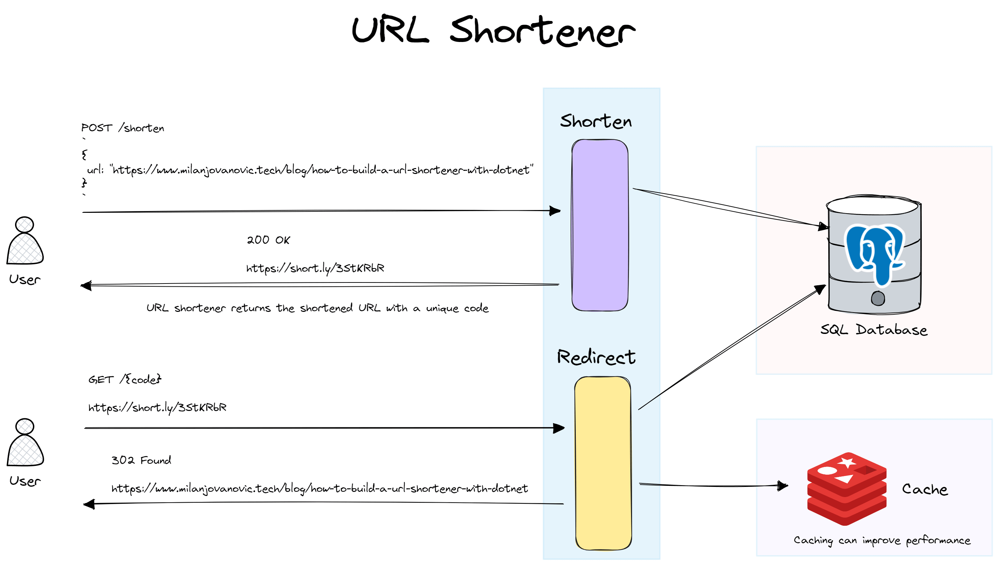

# 如何用 .NET 构建一个 URL 缩短器

> ## 摘要
>
> URL 缩短器是一个简单却强大的工具，它能将长 URL 转化为更易管理的短版本。今天，我将引导你完成在 .NET 中创建你自己的 URL 缩短器的设计、实现和考虑事项。

---

一个 **URL 缩短器** 是一个简单却强大的工具，它能将长 URL 转化为更易管理的短版本。这在需要在字符限制的平台上分享链接或通过减少内容杂乱以改善用户体验方面尤为有用。两个流行的 URL 缩短器是 [Bitly](https://bitly.com/) 和 [TinyURL](https://tinyurl.com/app)。设计一个 URL 缩短器是一个有趣的挑战，有很多有趣的问题需要解决。

但你如何在 .NET 中构建一个 URL 缩短器呢？

URL 缩短器有两个核心功能：

- 为给定的 URL 生成唯一的代码
- 将访问短链接的用户重定向到原始 URL

今天，我将引导你完成创建你自己的 URL 缩短器的设计、实现和考虑事项。

## URL 缩短器系统设计

以下是我们 URL 缩短器的高级系统设计。我们想要暴露两个端点。一个用于缩短长 URL，另一个根据缩短的 URL 重定向用户。在这个示例中，缩短的 URLs 存储在 [PostgreSQL](https://www.postgresql.org/) 数据库中。我们可以向系统中引入像 [Redis](https://redis.io/) 这样的分布式缓存来提高读取性能。



我们首先需要确保有大量的短 URL。我们将为每个长 URL 分配一个唯一代码，并使用它来生成缩短的 URL。唯一代码的长度和字符集决定了系统可以生成多少个短 URL。我们将在实现唯一代码生成时更详细地讨论这一点。

我们将使用随机代码生成策略。它易于实现，并且碰撞率可接受地低。我们做出的权衡是增加了延迟，但我们还会探索其他选项。

## 数据模型

让我们开始考虑我们将在数据库中存储什么。我们的数据模型很简单。我们有一个代表系统中存储的 URL 的 `ShortenedUrl` 类：

```csharp
public class ShortenedUrl
{
    public Guid Id { get; set; }

    public string LongUrl { get; set; } = string.Empty;

    public string ShortUrl { get; set; } = string.Empty;

    public string Code { get; set; } = string.Empty;

    public DateTime CreatedOnUtc { get; set; }
}
```

这个类包括原始 URL（`LongUrl`）、缩短的 URL（`ShortUrl`）和表示缩短的 URL 的唯一代码（`Code`）。`Id` 和 `CreatedOnUtc` 字段用于数据库和跟踪目的。用户将向我们的系统发送唯一的 `Code`，我们的系统将尝试找到匹配的 `LongUrl` 并重定向他们。

此外，我们还将定义一个负责配置我们的实体和设置数据库上下文的 EF `ApplicationDbContext` 类。我在这里做两件事来提高性能：

- 使用 `HasMaxLength` 配置 `Code` 的最大长度
- 在 `Code` 列上定义唯一索引

唯一索引可保护我们免受并发冲突，因此我们将永远不会在数据库中持久化重复的 `Code` 值。为这个列设置最大长度节省了存储空间，并且是在某些数据库中为字符串列编
索引的要求。

请注意，一些数据库以不区分大小写的方式处理字符串。这大大减少了可用的短 URL 数量。你要配置数据库以区分大小写的方式处理唯一代码。

```csharp
public class ApplicationDbContext : DbContext
{
    public ApplicationDbContext(DbContextOptions options)
        : base(options)
    {
    }

    public DbSet<ShortenedUrl> ShortenedUrls { get; set; }

    protected override void OnModelCreating(ModelBuilder modelBuilder)
    {
        modelBuilder.Entity<ShortenedUrl>(builder =>
        {
            builder
                .Property(shortenedUrl => shortenedUrl.Code)
                .HasMaxLength(ShortLinkSettings.Length);

            builder
                .HasIndex(shortenedUrl => shortenedUrl.Code)
                .IsUnique();
        });
    }
}
```

## 唯一代码生成

我们 URL 缩短器最重要的部分是为每个 URL 生成一个唯一代码。有几种不同的算法可以实现这一点。我们希望在所有可能的值中均匀分布唯一代码。这有助于减少潜在的冲突。

我将实现一个具有预定义字母表的随机、唯一代码生成器。实现简单，碰撞机会相对较低。尽管如此，还有比这更高效的解决方案，但我们稍后再讨论。

让我们定义一个 `ShortLinkSettings` 类，其中包含两个常量。一个是用于定义我们将生成的未经验证的代码的长度。另一个常量是我们用来生成随机代码的字母表。

```csharp
public static class ShortLinkSettings
{
    public const int Length = 7;
    public const string Alphabet =
        "ABCDEFGHIJKLMNOPQRSTUVWXYZabcdefghijklmnopqrstuvwxyz0123456789";
}
```

字母表有 `62` 个字符，这为我们提供了 `62^7` 种可能的唯一代码组合。

如果你想知道，这是 `3,521,614,606,208` 种组合。

详细说来是：三万五千二百一十四亿六千一百四十六万零六百零八。

这些是相当多的唯一代码，对我们的 URL 缩短器来说已经足够了。

现在，让我们实现我们的 `UrlShorteningService`，它负责生成唯一代码。此服务生成使用我们预定义的字母表指定长度的随机字符串。它还将校验数据库以确保唯一性。

```csharp
public class UrlShorteningService(ApplicationDbContext dbContext)
{
    private readonly Random _random = new();

    public async Task<string> GenerateUniqueCode()
    {
        var codeChars = new char[ShortLinkSettings.Length];
        const int maxValue = ShortLinkSettings.Alphabet.Length;

        while (true)
        {
            for (var i = 0; i < ShortLinkSettings.Length; i++)
            {
                var randomIndex = _random.Next(maxValue);

                codeChars[i] = ShortLinkSettings.Alphabet[randomIndex];
            }

            var code = new string(codeChars);

            if (!await dbContext.ShortenedUrls.AnyAsync(s => s.Code == code))
            {
                return code;
            }
        }
    }
}
```

**缺点和改进点**

这种实现的缺点是增加了延迟，因为我们正在生成的每个代码都需要与数据库进行检查。一个改进点可以是提前在数据库中生成唯一代码。

另一个改进点可以是使用固定数量的迭代而不是无限循环。在连续多次发生碰撞的情况下，当前实现会继续执行，直到找到一个唯一值。考虑在连续几次碰撞后抛出异常而不是继续执行。

## URL 缩短

现在我们的核心业务逻辑已经准备好，我们可以暴露一个端点来缩短 URL。我们可以使用一个简单的 Minimal API 端点。

这个端点接受一个 URL，验证它，然后使用 `UrlShorteningService` 创建一个缩短的 URL，然后将其保存到数据库中。我们将完整的缩短 URL 返回给客户端。

```csharp
public record ShortenUrlRequest(string Url);

app.MapPost("shorten", async (
    ShortenUrlRequest request,
    UrlShorteningService urlShorteningService,
    ApplicationDbContext dbContext,
    HttpContext httpContext) =>
{
    if (!Uri.TryCreate(request.Url, UriKind.Absolute, out _))
    {
        return Results.BadRequest("The specified URL is invalid.");
    }

    var code = await urlShorteningService.GenerateUniqueCode();

    var request = httpContext.Request;

    var shortenedUrl = new ShortenedUrl
    {
        Id = Guid.NewGuid(),
        LongUrl = request.Url,
        Code = code,
        ShortUrl = $"{request.Scheme}://{request.Host}/{code}",
        CreatedOnUtc = DateTime.UtcNow
    };

    dbContext.ShortenedUrls.Add(shortenedUrl);

    await dbContext.SaveChangesAsync();

    return Results.Ok(shortenedUrl.ShortUrl);
});
```

这里有一个小的[竞态条件](https://www.milanjovanovic.tech/blog/solving-race-conditions-with-ef-core-optimistic-locking)，因为我们首先生成一个唯一代码，然后将其插入数据库。一个并发请求可能会生成同一个唯一代码，并在我们完成交易之前将其插入数据库。然而，发生这种情况的可能性很低，所以我决定不处理这种情况。

记住，数据库中的唯一索引仍然保护我们免受重复值的影响。

## URL 重定向

URL 缩短器的第二个用例是访问缩短的 URL 时进行重定向。

我们将为此功能暴露另一个 Minimal API 端点。该端点将接受一个唯一代码，找到相应的缩短 URL，然后将用户重定向到原始长 URL。在检查数据库中是否有缩短的 URL 之前，你可以为指定的代码实现额外的验证。

```csharp
app.MapGet("{code}", async (string code, ApplicationDbContext dbContext) =>
{
    var shortenedUrl = await dbContext
        .ShortenedUrls
        .SingleOrDefaultAsync(s => s.Code == code);

    if (shortenedUrl is null)
    {
        return Results.NotFound();
    }

    return Results.Redirect(shortenedUrl.LongUrl);
});
```

此端点在数据库中查找代码，如果找到，将用户重定向到原始的长 URL。根据 HTTP 标准，响应将有一个 [302（已找到）状态码](https://datatracker.ietf.org/doc/html/rfc7231#section-6.4.3)。

## URL 缩短器改进点

虽然我们基本的 URL 缩短器是功能性的，但有几个领域可以改进：

- **缓存**：实现缓存以减少频繁访问的 URL 对数据库的负载。
- **水平扩展**：设计系统以水平扩展以处理增加的负载。
- **数据分片**：实现数据分片以将数据分布到多个数据库。
- **分析**：引入分析以跟踪 URL 使用情况并向用户展示报告。
- **用户账号**：允许用户创建账号来管理他们的 URL。

我们已经介绍了使用 .NET 构建 URL 缩短器的关键组件。你可以进一步实现改进点以得到更健壮的解决方案。

如果你想看我从头开始构建它，这里有一个 [YouTube 视频教程。](https://youtu.be/2UoA_PoEvuA)
