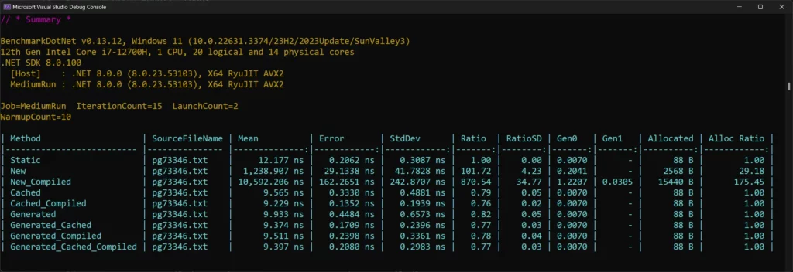

> ## 摘要
>
> 正则表达式在模式匹配中非常强大，但性能如何呢？查看这篇文章，了解C#正则表达式性能的基准测试细节！
>
> 原文 [C# Regex Performance: How To Squeeze Out Performance](https://www.devleader.ca/2024/04/08/csharp-regex-performance-how-to-squeeze-out-performance/)

---

在C#中，当你需要对字符串进行一些复杂的模式匹配时，正则表达式可能是救星。但随着语言的增长和演变，我们继续发现可以在C#中使用正则表达式的新方法。这就是为什么我想花一点时间，通过运行基准测试来考虑C#正则表达式的性能。

当我们有看起来相同的选项时，我喜欢保持好奇心，了解什么是\*实际上\*的不同。这证明是一个有趣的练习，希望你就像我一样，也有所收获！

---

## 什么是正则表达式？

正则表达式，通常被称为regex，是用于文本中模式匹配的强大工具。它们允许你定义一个搜索模式，可用于查找、替换或操作字符串的特定部分。正则表达式提供了一种简洁灵活的方式，来搜索并识别文本数据中的特定模式。

在我的职业生涯中，我使用正则表达式做过很多不同的事情，例如：

- 用户输入的模式匹配
- 从网络爬取数据
- 解析数据源，如日志或其他文件
- 数字取证数据恢复
- … 还有更多用途！

正则表达式可以用于所有类型的高级模式匹配。但如果你想开始使用，你可以查看这些文章：

- [使用C#正则表达式的一些简单示例](https://www.devleader.ca/2024/04/02/regular-expressions-in-csharp-3-examples-you-need-to-know/ "C#中的正则表达式：你需要知道的3个示例")
- [C#的正则表达式选项](https://www.devleader.ca/2024/04/01/regex-options-in-csharp-beginners-guide-to-powerful-pattern-matching/ "C#中的正则表达式选项：初学者强大模式匹配指南")

---

## 为什么要在C#中对正则表达式性能进行基准测试？

除了当我尝试对我的应用程序和服务进行分析和优化时，我喜欢对我好奇的事物进行基准测试。特别是当我发现似乎有多种方法做同一件事时——这让我想知道除了语法和可用性之外的真正区别。最近[对于集合初始化器，我完全被性能差异震惊了](https://www.devleader.ca/2024/03/31/collection-initializer-performance-in-c-double-your-performance-with-what/ "C#中集合初始化器的性能 - 如何获得87%的性能提升！")，所以始终好奇是一个好的提醒。

C#中的正则表达式有几种不同的风格：

- 静态方法调用
- 是否带编译标志
- 源生成器

现在，编译标志应该给我们带来性能提升，但仅仅使用静态方法调用的开销是什么，因为它让代码调用变得非常方便？这些（相对较新的）C#正则表达式的源生成器是什么呢？微软有一些非常棒的[文档关于编译正则表达式和源代码生成](https://learn.microsoft.com/en-us/dotnet/standard/base-types/regular-expression-source-generators "微软学习 - C#正则表达式源代码生成") —— 如果我不是因为好奇来基准测试，我永远也不会偶然发现这个。

虽然我们不会比较所有我们能使用的regex方法，但我确实想看看在获取文本中所有匹配项的性能差异。考虑到上述场景，我好奇哪些会因为它们在表面上看起来大致相同而领先。

---

## 设置C#正则表达式性能基准测试

我知道你迫不及待想直接跳到细节，虽然没什么能阻止你滚动到底部，但我希望你会在这一部分暂停，首先理解基准测试。当我发布基准测试调查时，我的终极目标不是说服你改变编码方式，而是让你对你的编码保持好奇。我认为我们将在这些基准测试中看到一些明显的需要避免的事情 —— 但仍然，好奇是目标。

我将像往常一样使用BenchmarkDotNet来进行这些基准测试。如果你对如何运行自己的基准测试感兴趣，我有很多[BenchmarkDotNet文章可以查看](https://www.devleader.ca/2024/03/05/how-to-use-benchmarkdotnet-simple-performance-boosting-tips-to-get-started/ "如何使用BenchmarkDotNet：6个简单的性能提升技巧以开始")。

### 用于基准测试的测试数据

虽然我们在这里不感兴趣绝对性能 —— 并且你可能会感兴趣，如果你正在对自己的应用程序进行分析和基准测试 —— 我们对于我们各种Regex选项之间的相对性能感兴趣。除了我们必须使用的选项之外，还有其他一些考虑：

- 我们使用的Regex模式可能会影响每种机制的性能表现
- 我们尝试匹配的数据源可能会对结果产生某种影响

我提出这些事情是因为它们对我来说不确定。我觉得数据源不应该是太大的问题 —— 但是可能不同的匹配启发式不允许编译或源生成的正则表达式发挥作用。可能我选择的Regex模式不允许编译或源生成的正则表达式获得优势。或者它确实如此 —— 我应该能够指出来。

我认为为了尽可能地“公平”，我会在真实文本中寻找一些模式：以“ing”或“ed”结尾的单词。为了找到一些真实文本，我使用了[古腾堡计划的数据 —— 特别是这本电子书](https://www.gutenberg.org/ebooks/73346 "古腾堡计划")。它是2200+行的英文文本，因此我们的模式有很多匹配项。

### C#正则表达式基准测试代码

这些基准测试与我通常创建的其他基准测试没有太大区别。然而，我会列出一些值得关注的点，以便你可以在代码中找到它们：

- 我正在使用\[Params\]载入源文件，以防你想在不同的数据集上尝试这些基准测试
- 源数据在全局设置期间读取
- 我需要为一些基准测试缓存一些Regex实例，这在全局设置中完成

你可以在GitHub上[找到基准测试代码](https://github.com/ncosentino/DevLeader/tree/master/WorkingWithRegex/WorkingWithRegex.RegexBenchmarks "C#正则表达式性能基准测试 - GitHub")，以及下面的代码：

```csharp
using BenchmarkDotNet.Attributes;
using BenchmarkDotNet.Running;

using System.Reflection;
using System.Text.RegularExpressions;

BenchmarkRunner.Run(
    Assembly.GetExecutingAssembly(),
    args: args);

[MemoryDiagnoser]
[MediumRunJob]
public partial class RegexBenchmarks
{
    private const string RegexPattern = @"\b\w*(ing|ed)\b";

    private string? _sourceText;
    private Regex? _regex;
    private Regex? _regexCompiled;
    private Regex? _generatedRegex;
    private Regex? _generatedRegexCompiled;

    [GeneratedRegex(RegexPattern, RegexOptions.None, "en-US")]
    private static partial Regex GetGeneratedRegex();

    [GeneratedRegex(RegexPattern, RegexOptions.Compiled, "en-US")]
    private static partial Regex GetGeneratedRegexCompiled();

    [Params("pg73346.txt")]
    public string? SourceFileName { get; set; }

    [GlobalSetup]
    public void Setup()
    {
        _sourceText = File.ReadAllText(SourceFileName!);

        _regex = new(RegexPattern);
        _regexCompiled = new(RegexPattern, RegexOptions.Compiled);
        _generatedRegex = GetGeneratedRegex();
        _generatedRegexCompiled = GetGeneratedRegexCompiled();
    }

    [Benchmark(Baseline = true)]
    public MatchCollection Static()
    {
        return Regex.Matches(_sourceText!, RegexPattern!);
    }

    [Benchmark]
    public MatchCollection New()
    {
        Regex regex = new(RegexPattern!);
        return regex.Matches(_sourceText!);
    }

    [Benchmark]
    public MatchCollection New_Compiled()
    {
        Regex regex = new(RegexPattern!, RegexOptions.Compiled);
        return regex.Matches(_sourceText!);
    }

    [Benchmark]
    public MatchCollection Cached()
    {
        return _regex!.Matches(_sourceText!);
    }

    [Benchmark]
    public MatchCollection Cached_Compiled()
    {
        return _regexCompiled!.Matches(_sourceText!);
    }

    [Benchmark]
    public MatchCollection Generated()
    {
        return GetGeneratedRegex().Matches(_sourceText!);
    }

    [Benchmark]
    public MatchCollection Generated_Cached()
    {
        return _generatedRegex!.Matches(_sourceText!);
    }

    [Benchmark]
    public MatchCollection Generated_Compiled()
    {
        return GetGeneratedRegexCompiled().Matches(_sourceText!);
    }

    [Benchmark]
    public MatchCollection Generated_Cached_Compiled()
    {
        return _generatedRegexCompiled!.Matches(_sourceText!);
    }
}
```

对于我们的基准测试，我们将Regex类上的静态方法作为基准 —— 只是为了在查看性能结果时有一些可以锚定的东西。

---

## C#正则表达式性能结果

让我们来看看结果：



从上面我们可以看到，每次想要执行匹配时都创建一个新的Regex实例，比静态方法慢100倍。这太不可思议了——如果性能对你很重要，你不应该这样做！但情况变得更糟……如果你这样做并提供编译标志，那几乎是1000倍的坏，比每次新建实例慢10倍。这是你应该避免做的两件事。

我们可以看到，随后的缓存变体表明我们可以有效地扭转局面，比静态方法稍快。虽然这些运行时非常快，但在这些情况下看来，它几乎快了30%。但调整你的期望值，因为我不相信这在不同数据集和不同模式下是可扩展的！

源生成的C#正则表达式比静态方法也要快得多——但似乎与之前的两个基准测试大致相当。虽然源生成的正则表达式确实缓存了，并且调用源生成方法不应该有开销，但有两个基准测试变体表明，保持你自己的缓存略微快一点。这些可能仅仅是偶然的结果，考虑到结果如此接近。

---

## 总结C#正则表达式性能

优化C#正则表达式性能的要点：停止在你准备使用它们之前声明C#中的正则表达式！更糟的是，如果你在使用它们之前声明它们，不要使用编译标志！这两件事会破坏你的性能。

否则，似乎横跨各种情况静态方法上的Regex类是相当安全的，但编译和缓存你的regex可以获得最大的好处。根据微软的说法，在许多情况下，C#正则表达式源生成器可以进一步提高性能。

如果你觉得这很有用，并且你正在寻找更多的学习机会，请考虑[订阅我的免费每周软件工程新闻简讯](https://subscribe.devleader.ca/ "订阅DevLeader周刊")，并查看我的[免费YouTube视频](https://www.youtube.com/@devleader?sub_confirmation=1 "Dev Leader - YouTube")！遇见其他志同道合的软件工程师并[加入我的Discord社区](https://www.devleader.ca/discord-community-access/ "Discord社区访问")！

---

## 常见问题：C#中的正则表达式

### 什么是正则表达式？

正则表达式是形成搜索模式的一系列字符。它可以用来基于某些模式来匹配、搜索或操作字符串。

### 在C#编程中，为什么正则表达式很重要？

正则表达式在C#编程中很重要，因为它们允许强大的模式匹配和字符串操作能力。它们可以用于验证输入、提取信息、替换文本等等。

### 在C#中使用正则表达式时有哪些常见选项？

在C#中使用正则表达式时，一些常见的选项包括RegexOptions.Compiled、RegexOptions.IgnoreCase和RegexOptions.Multiline。这些选项允许你优化正则表达式匹配，忽略大小写敏感性，并跨多行进行匹配。
