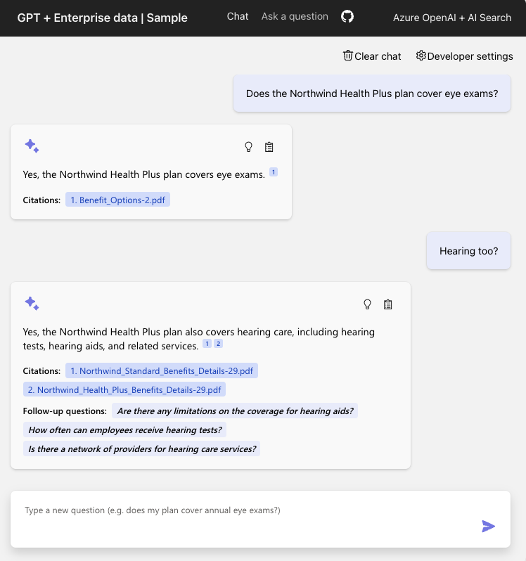

> ## 摘录
>
> 了解您如何快速地构建和测试为满足您的组织特定需求量身定制的自定义copilots。
>
> 原文 [Building custom copilots in Microsoft Teams with Teams App Test Tool and Dev Proxy](https://devblogs.microsoft.com/microsoft365dev/building-custom-copilots-in-microsoft-teams-with-teams-app-test-tool-and-dev-proxy/)

---

2024年4月8日

自定义copilots是为满足组织特定需求量身定制的 AI 助手。Microsoft Teams 是员工每天在组织内进行沟通和协作的地方。许多组织有兴趣为 Microsoft Teams 构建机器人，以整合他们构建的自定义copilots。然而，构建一个自定义copilots并非易事。通过使用 Teams App Test Tool，您将能够更快地构建和测试您的自定义copilots，从而节省时间和金钱。

## 在 Microsoft Cloud 上的自定义copilots

许多组织正在使用检索增强生成（Retrieval Augmented Generation, RAG）模式，基于组织数据构建自定义copilots。组织可以将信息检索与大型语言模型（LLMs）结合起来，使响应更具上下文相关性和用途。

[ChatGPT + 企业数据与 Azure OpenAI 和 AI 搜索](https://github.com/Azure-Samples/azure-search-openai-demo)示例展示了如何在 Microsoft Cloud 上实现 RAG。

_检索增强生成（RAG）架构_

员工使用自然语言提问，并基于虚构公司 Contoso Electronics 的数据接收答案。允许他们询问关于福利、内部政策以及工作描述和角色等问题。

_Web 应用程序中的聊天界面_

员工提交查询时，请求被发送到后端 API。答案以自然语言形式返回，并在响应中显示文档引用和后续问题，这些都在用户界面中显示。

## Microsoft Teams 中的自定义copilots

在许多组织中，日常沟通和协作发生在 Microsoft Teams 中。在 Microsoft Teams 中公开对话 AI 机器人为员工提供了一个熟悉的体验，可以通过 Microsoft Teams 客户端在桌面、平板和移动设备上访问，满足员工的需求，并融入工作流程中。

在[ChatGPT + 企业数据与 Azure OpenAI 和 Microsoft Teams 中的认知搜索](https://adoption.microsoft.com/sample-solution-gallery/sample/pnp-sp-dev-teams-sample-bot-azure-search-openai-ts/)示例中，该示例基于前一个示例构建，员工将问题作为消息发送给 Microsoft Teams 中的机器人，作为使用基于网络的应用程序的替代方案。

机器人将请求发送到相同的后端 API 以返回来自 LLM 的答案。

_Microsoft Teams 机器人中的聊天界面_

答案连同文档引用和操作按钮，以自适应卡片的形式返回。此外，建议的操作中显示了后续问题。

## 移除平台依赖

要运行和开发我们刚刚看到的这两个示例项目，您需要设置和配置几项云服务，并且需要访问 Microsoft 365 租户。

_Microsoft Teams 机器人与 RAG 架构_

在开发期间，这可能既不高效也增加成本。准备所有必需的东西需要时间，而且每次向 LLM 发送请求、以及保持这些服务运行都会产生成本。

在开发过程中，请考虑以下问题：

- 您是否总是需要对每个请求获得来自 LLM 的真实响应？
- 您是否总是需要在 Microsoft Teams 中运行应用程序？
- 您是否总是需要启用云服务？

在许多情况下，答案是“不”。尽管您可以在不使用它们时移除云资源，但每次需要这些资源时都要进行配置也会占用时间，这些时间可以用于更高价值的任务上。

使用 Teams App Test Tool 和 Dev Proxy，您只模拟运行您正在工作的应用程序部分所需的依赖项。

- **Teams App Test Tool（测试工具）**是一款 Microsoft Teams 应用程序模拟器，它通过允许您在无需机器人服务或将应用程序侧加载到真实 Microsoft Teams 环境中的情况下，开发和测试机器人代码来提高开发人员的生产力。
- **Dev Proxy**是一个命令行工具，它通过拦截从您的应用程序发送的网络请求并以模拟的响应或错误响应，注入真实世界 API 行为（如节流或延迟）等，来提高开发者的生产力。

下表展示了运行示例所需的资源，以及使用 Teams App Test Tool 和 Dev Proxy 的组合：

使用 Teams App Test Tool，您可以移除对 Microsoft 365 租户、机器人服务、Microsoft Entra 和 Dev Tunnels 的依赖，同时使用来自 LLM 的真实响应。

_使用 Teams App Test Tool 移除依赖_

通过添加 Dev Proxy，您可以移除对所有云服务和 API 的依赖，同时使用模拟响应来模拟 LLM 响应，而无需更改任何应用程序代码。

_使用 Dev Proxy 移除依赖_

当您准备好对实时 LLM 进行测试时，只需关闭 Dev Proxy 即可。

## 尝试示例项目

使用 Teams App Test Tool 和 Dev Proxy 在本地运行和测试机器人：

1.  [安装并配置](https://learn.microsoft.com/microsoft-cloud/dev/dev-proxy/get-started#install-dev-proxy) Dev Proxy 到您的机器上
2.  [下载](https://adoption.microsoft.com/sample-solution-gallery/sample/pnp-sp-dev-teams-sample-bot-azure-search-openai-ts/)示例并将内容解压到您的机器上的一个文件夹中
3.  在 Visual Studio Code 中打开项目文件夹
4.  在 Visual Studio Code 中，打开一个新的终端窗口
5.  运行 **devproxy –config-file devProxy/use-mocks.json** 启动 Dev Proxy
6.  在 Visual Studio Code 的侧边栏中，选择 **运行和调试** 面板
7.  在调试配置下拉菜单中，选择 **在测试工具中调试**
8.  通过按 **F5** 启动调试会话并启动测试工具

在测试工具中，选择 **“我的 Northwind 包含什么...”** 按钮在机器人聊天中发送消息并向后端 API 发起请求。

_Teams App Test Tool 显示的机器人欢迎消息和答案作为自适应卡片_

在 Dev Proxy 进程输出中，您可以看到对后端 API 的请求被拦截，添加了延迟以模拟真实世界的延迟，并且 API 响应被模拟。

_Visual Studio Code 内终端窗口中运行的 Dev Proxy，显示延迟的模拟后端 API 请求_

## 总结

使用 Teams App Test Tool 和 Dev Proxy，您可以通过移除不需要的依赖项来专注于开发应用逻辑和用户界面。

- 更快的 F5 时间
- 在开发期间降低成本
- 使用确定性响应来开发和测试可重复的场景

尝试示例，并让我们知道您的想法。我们期待听到您的反馈，了解我们如何进行改进。
