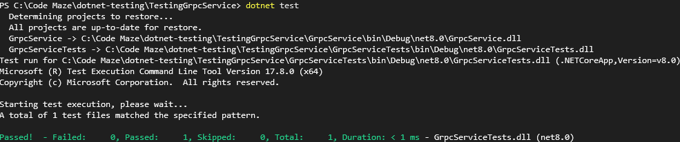
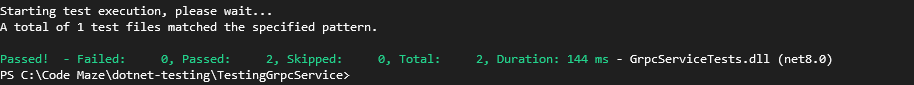

> ## 摘录
>
> 在本文中，我们将学习如何在 .net 应用程序中测试 gRPC 服务。我们专注于单元测试和集成测试。
>
> 原文 [How to Test gRPC Services in ASP.NET Core](https://code-maze.com/aspnetcore-test-grpc-services/)

---

gRPC 是在 .NET 世界中创建快速且可扩展 API 的流行方式。在本文中，我们探索如何在 .NET 应用程序中测试 gRPC 服务，并设置单元测试和集成测试来确保 gRPC 服务的可靠性和性能。

要下载本文的源代码，您可以访问我们的 [GitHub 仓库](https://github.com/CodeMazeBlog/CodeMazeGuides/tree/main/dotnet-testing/TestingGrpcService)。

那么，我们开始吧。

## **什么是 gRPC?**

**通常来说，gRPC 是一种旨在应用程序各部分之间通信的框架，无论它们位于何处或使用何种编程语言。** 底层，它依赖 HTTP/2 进行快速高效的数据传输。它使用 [Protocol Buffer](https://protobuf.dev/) 进行消息序列化。这是一种类似于 XML 或 JSON 的方法，但体积更小，使其更高效。要了解有关 gRPC 的更多信息，特别是关于 ASP.NET Core 实现的信息，请查看我们的 [现有文章](https://code-maze.com/grpc-introduction-aspnetcore/)。

在谈到测试时，我们有各种不同的测试方法服务于不同的目的。例如，我们有性能测试，检查应用程序的整体性能。此外，我们还有检查应用程序逻辑和行为的测试，其中最常见的是单元测试和集成测试。我们使用单元测试来测试应用程序中的一个孤立单元，使用集成测试来测试整个流程。在本文中，我们将专注于这两种类型的测试，单元测试和集成测试，但如果您想了解更多关于测试本身的信息，请参阅 [测试 ASP.NET Core 应用程序](https://code-maze.com/asp-net-core-testing/)。

现在我们对 gRPC 本身有了更多了解，以及为什么我们想测试它，我们准备好设置一个新的 gRPC 项目并看到它的实际操作了！

## 项目设置

首先，我们创建一个新的解决方案，并在其内部使用 .NET CLI 创建一个新的 gRPC 应用程序：

```bash
dotnet new sln -n TestingGrpcService
dotnet new grpc -n GrpcService
dotnet sln TestingGrpcService.sln add GrpcService/GrpcService.csproj
```

在新创建的应用程序中，我们检查 `GreeterService` 类：

```csharp
public class GreeterService : Greeter.GreeterBase
{
    private readonly ILogger<GreeterService> _logger;
    public GreeterService(ILogger<GreeterService> logger)
    {
        _logger = logger;
    }
    public override Task<HelloReply> SayHello(HelloRequest request, ServerCallContext context)
    {
        return Task.FromResult(new HelloReply
        {
            Message = "Hello " + request.Name
        });
    }
}
```

`SayHello()` 方法接受一个 `HelloRequest` 并返回一个 `HelloReply` 对象。它通过问候来自 `HelloRequest` 的名称来构造回复。该方法利用 `Task.FromResult()` 将 `HelloReply` 包装在任务中，使该方法异步，而无需使用任何异步操作。这样做是为了使该方法与 gRPC 方法期望的基于任务的异步模式兼容。

此外，我们看到该方法接受另一个参数，`ServerCallContext` 上下文。当谈到 gRPC 时，**`ServerCallContext` 为我们提供了有关 gRPC 调用的服务器端信息。**它可以包括元数据、截止日期、取消信号和客户端详细信息。此外，使用 `ServerCallContext` 使服务器能够访问和响应每个传入的 gRPC 请求的特定上下文。现在，我们不在方法体中使用这个参数，稍后我们会用到。

gRPC 项目中还生成一个 `greet.proto` 文件的事情也是值得一提的。这个文件定义了 gRPC 服务的结构，它包括服务方法、它们的请求参数和返回类型。在我们的案例中，我们找到了 `SayHello()` 方法的定义。**当谈论测试时，提及这个文件很重要，因为我们使用它来为服务的客户端和服务器端生成代码，但稍后会有更多关于这个的讨论。**

在查看了我们想要测试的服务之后，下一步是在现有解决方案中创建一个新的测试项目：

```bash
dotnet new xunit GrpcServiceTests
dotnet sln TestingGrpcService.sln add GrpcServiceTests/GrpcServiceTests.csproj
```

在测试项目中，我们安装 [NSubstitute](https://code-maze.com/csharp-effective-mocking-with-nsubstitute/)：

```bash
dotnet add package NSubstitute
```

同时，在同一个项目中，我们添加对 `GrpcService` 项目的引用，以便我们可以访问其方法进行测试：

```bash
dotnet add reference GrpcService.csproj
```

现在我们已经简要介绍了 gRPC 结构并设置好了一切，让我们开始编写测试！

## 使用单元测试测试 gRPC 服务

首先，我们打开新创建的测试项目并添加一个新的 `GreeterServiceUnitTests.cs` 类。在其中，我们为 `SayHello()` 方法编写一个测试：

```csharp
private readonly ILogger<GreeterService> _logger;
public GreeterServiceUnitTests()
{
    _logger = Substitute.For<ILogger<GreeterService>>();
}
private GreeterService CreateGreeterService() => new(_logger.Object);
[Fact] public async Task WhenSayHelloAsyncIsCalled_ThenItShouldReturnCorrectName()
{
// Arrange
var service = CreateGreeterService();
var testName = "Test Name";
var expectedOutput = $"Hello {testName}";
var request = new HelloRequest { Name = testName };
// Act
var response = await service.SayHello(request, null);
// Assert
Assert.Equal(expectedOutput, response.Message); }
```

我们定义了一个字段 `ILogger<GreeterService> _logger`，一个我们稍后将用来初始化 `GreeterService` 的日志记录器。通过构造函数中使用 NSubstitute，我们将 `_logger` 初始化为 `ILogger<GreeterService>` 的一个新的模拟实例。这种方式使我们能够在没有任何外部依赖的情况下测试 `GreeterService`。

此外，我们创建了一个小的辅助方法 `CreateGreeterService()`，以便拥有一个集中的地方创建 `GreeterService` 类。

接下来，我们定义 `WhenSayHelloAsyncIsCalled_ThenItShouldReturnCorrectName` 测试，其中我们测试 `SayHello()`  方法。我们准备了一个新的 `HelloRequest`，其 `Name` 属性设置为“Test Name”。为了稍后验证输出，我们还定义了 `expectedOutput` 变量来保存调用方法后的预期响应值。

在测试的 Act 部分，我们使用预定义的请求正文和一个空的 `ServerCallContext` 调用 `SayHello()` 方法。在这种情况下，我们将 `ServerCallContext` 设置为 `null`，因为我们没有使用它。

最后，在 Assert 部分，我们检查方法响应是否等于预期输出。

现在，我们在测试项目中使用 .NET CLI 命令 `dotnet test` 运行测试，并检查一切是否按预期工作：



我们可以看到找到了一个测试，并且它成功运行。

通过这个例子，我们查看了编写单元测试时最简单的情况。接下来，我们将看看如何模拟和使用 `ServerCallContext` 数据。

### 模拟 **ServerCallContext**

首先，我们回到 `GrpcService` 项目。在 `GreeterService` 类中，我们更新 `SayHello()` 方法以使用 `ServerCallContext` 参数：

```csharp
public override Task<HelloReply> SayHello(HelloRequest request, ServerCallContext context)
{
    var peer = context.Peer;
    _logger.LogInformation("Request from: {peer}", peer);
    return Task.FromResult(new HelloReply { Message = "Hello " + request.Name });
}
```

现在，在 `SayHello()` 方法中我们使用 `ServerCallContext` 的 `Peer` 属性来获取发起调用者的地址或其标识符。然后，我们使用这些信息来记录请求来自何处。其余部分的方法行为与之前相同。

**底层来说，ServerCallContext 是一个抽象类。当设置此类的方法和属性时，我们只能设置那些标有抽象或虚拟关键字的方法和属性。** 在我们的案例中，我们想要模拟 `Peer` 属性，这不是抽象或虚拟的。在设置 `ServerCallContext` 的情况下，我们可以使用 [Grpc.Core.Testing](https://www.nuget.org/packages/Grpc.Core.Testing) 库。这个库让我们能够创建一个 `ServerCallContext` 的测试实例。我们回到测试项目，并通过 .NET CLI 安装 `Grpc.Core.Testing`：

```bash
dotnet add package Grpc.Core.Testing
```

然后，我们修改我们现有的测试以包括设置 `ServerCallContext:`

```csharp
[Fact]
public async Task WhenSayHelloAsyncIsCalled_ThenItShouldReturnCorrectName()
{
    // Arrange
    var service = CreateGreeterService();
    var testName = "Test Name";
    var expectedOutput = $"Hello {testName}";
    var request = new HelloRequest { Name = testName };
    var peer = "localhost";
    var mockContext = TestServerCallContext.Create(
        method: "",
        host: "",
        deadline: DateTime.UtcNow.AddMinutes(30),
        requestHeaders: [],
        cancellationToken: CancellationToken.None,
        peer: peer,
        authContext: null,
        contextPropagationToken: null,
        writeHeadersFunc: null,
        writeOptionsGetter: null,
        writeOptionsSetter: null);
    // Act
    var response = await service.SayHello(request, mockContext);
    // Assert
    Assert.Equal(expectedOutput, response.Message);
    _logger.Received(1).Log(
        LogLevel.Information,
        Arg.Any<EventId>(),
        Arg.Is<object>(o => o.ToString()!.Contains("Request from: localhost")),
        null,
        Arg.Any<Func<object, Exception, string>>());
}
```

我们包括来自 `Grpc.Core.Testing` 库的 `TestServerCallContext`，它允许我们创建一个 `ServerCallContext` 的测试实例。我们调用其 `Create()` 方法并定义所有必需的构造函数参数，将 peer 值设置为“localhost”。现在，在断言部分，我们验证我们的日志记录器是否正确记录了期望的消息。

再次，我们运行 `dotnet test` 命令来检查我们的测试是否成功运行。

通过使用 `TestServerCallContext.Create()` 方法，我们可以定义和测试所有 `ServerCallContext` 构造函数参数。除了 `ServerCallContext` 属性外，我们也可能需要使用其扩展方法，因此让我们快速看一下它。

#### 设置 ServerCallContext 扩展方法

在使用 `ServerCallContext` 时，有些情况下我们可能也会使用其扩展方法 `GetHttpContext()`。此扩展方法用于访问 `HttpContext`，这对于检查 HTTP 头、IP 地址或类似信息很有用。如果我们想在测试场景中设置此方法，我们需要做几件事情：

```csharp
var serverCallContextMock = TestServerCallContext.Create();
var httpContext = new DefaultHttpContext();
serverCallContextMock.UserState["__HttpContext"] = httpContext;
```

与之前一样，我们首先使用 `Grpc.Core.Testing` 库创建一个新的 `ServerCallContext` 类。

然后，我们定义 `httpContext` 变量，它代表 `GetHttpContext()` 方法将返回的 `HttpContext` 对象。 接着，我们修改创建的 `ServerCallContext` 对象的 `UserState` 属性。`UserState` 属性定义为 `<key, value>` 对值。

**底层来说，当我们调用 `GetHttpContext()` 时，在 `UserState` 中它寻找键为** `__HttpContext` 的值。为了在设置中一切顺利，用第4行 `serverCallContextMock.UserState["__HttpContext"] = httpContext` 我们将键 `__HttpContext` 的值分配给我们的模拟 `HttpContext`，名为 httpContext。这样，我们就设置好了测试 `GetHttpContext()` 扩展方法，

现在我们已经了解了如何在不同场景中对 gRPC 服务进行单元测试，接下来让我们看看如何设置集成测试的外观。

## 使用集成测试测试 gRPC 服务

首先开始进行 gRPC 服务的集成测试，我们需要检查是否从我们的 `greeter.proto` 文件中创建了客户端和服务器。我们可以检查的一种方法是打开 `GrpcService` 项目的 `.csproj` 文件，其中包含 `greet.proto` 文件：

```xml
<ItemGroup>
  <Protobuf Include="Protos\greet.proto" GrpcServices="Server" />
</ItemGroup>
```

默认情况下，我们看到我们有 `<Protobuf Include="Protos\greet.proto" GrpcServices="Server" />`。这个指令声明从 `greet.proto` 文件生成了 gRPC 服务器代码。对于集成测试，还需要客户端来模拟与服务器的真实客户端交互：

```xml
<ItemGroup>
  <Protobuf Include="Protos\greet.proto" GrpcServices="Both" />
</ItemGroup>
```

**我们将 GrpcServices 设置从“Server”更新为“Both”。这样，我们指示我们的开发环境从我们的 proto 文件生成服务器和客户端存根。**为了应用这些变化并生成客户端和服务器所需的代码，我们需要重建项目。

在设置好这些之后，让我们看看开始测试还需要什么。

### 设置引导代码以测试 gRPC 服务

在为 gRPC 编写集成测试时，我们有很多类似的代码需要编写，就像在 .NET 中测试任何其他客户端一样。在这些情况下，我们通常使用的一种工具是 [WebApplicationFactory<TEntryPoint> 类](https://learn.microsoft.com/en-us/dotnet/api/microsoft.aspnetcore.mvc.testing.webapplicationfactory-1?view=aspnetcore-8.0)。这是一个工具，允许我们编写集成测试，无需真实的 Web 服务器。它使用 `TEntryPoint` 配置和运行应用程序，通常是 “Program” 或 “Startup” 类，在我们的案例中是 `Program.cs` 类。

由于在本文中，我们希望关注测试 gRPC 服务时的特殊情况，我们将快速解释如何设置 `WebApplicationFactory<Program>` 并在我们的集成测试设置中使用它。如果您想更深入地了解，可以查看 [ASP.NET Core 中的集成测试](https://code-maze.com/aspnet-core-integration-testing/)。

第一件事是我们需要转到我们的 GrpcService 项目，并向 `Program.cs` 类添加 public 和 partial 修饰符：

```csharp
public partial class Program { }
```

这使得 Program.cs 在我们的测试项目中可以访问，并且对于进一步扩展是灵活的：

接着，我们回到测试项目并创建一个 `CustomWebApplicationFactory.cs` 类，它继承自 `WebApplicationFactory<Program>`：

```csharp
public class CustomWebApplicationFactory : WebApplicationFactory<Program>
{

}
```

通过这个设置，我们有了一个集中的地方来修改应用程序设置。如果使用内存数据库或想要自定义应用程序的配置方式，这将非常有用。

之后，我们创建一个新的类，命名为`GreeterServiceIntegrationTests.cs`，我们将使用它来编写我们的集成测试。在其中，我们使用xunit的[IClassFixture](https://xunit.net/docs/shared-context)，来添加`CustomWebApplicationFactory`：

```csharp
 public class GreeterServiceIntegrationTests : IClassFixture<CustomWebApplicationFactory>
 {
     private readonly WebApplicationFactory<Program> _factory;
     public GreeterServiceIntegrationTests(CustomWebApplicationFactory factory)
     {
         _factory = factory;
     }
}
```

我们在构造函数中注入CustomWebApplicationFactory并将其赋值给`WebApplicationFactory<Program> _factory`，这样我们稍后就可以使用它了。

有了这一切，我们就可以专注于在集成测试中的gRPC特定内容了。我们需要做的下一件事是创建一个新的gRPC客户端，用于发出请求。

### 设置一个gRPC客户端

保持在我们的测试项目中，我们想要创建一个新的`GreeterClient`类。这个客户端指向了从greet.proto定义中生成的特定客户端存根。

要创建一个客户端，我们首先需要创建一个新的通道。**在gRPC中，通道代表着与一个gRPC服务器的长期连接。客户端使用这个连接来发送请求并从服务器接收响应：**

```csharp
[Fact]
public async Task WhenSayHelloAsyncIsCalled_ThenItShouldReturnCorrectName()
{
    // 安排
    GrpcChannelOptions options = new() { HttpHandler = _factory.Server.CreateHandler() };
    GrpcChannel channel = GrpcChannel.ForAddress(_factory.Server.BaseAddress, options);
    GreeterClient client = new(channel);
    var testName = "Test Name";
    var expectedResponse = $"Hello {testName}";
    var request = new HelloRequest { Name = testName };
    // 行动
    var response = await client.SayHelloAsync(request);
    // 断言
    Assert.Equal(expectedResponse, response.Message);
}
```

要创建一个新的通道，我们需要定义它应该将请求发送到何处，这就是ForAddress()方法、BaseAddress和HttpHandler发挥作用的地方。

我们使用`ForAddress()`方法来创建一个新的通道，它连接到指定地址的gRPC服务。**在我们的例子中，我们想要连接到从我们的`WebApplicationFactory`类创建的测试服务器，因此我们使用`_factory.Server.BaseAddress`属性来获取其基本地址。**

接下来，我们使用GrpcChannelOptions来实例化一个新的`HttpHandler`。一个`HttpHandler`是处理请求的HTTP传输层的组件。通过使用`_factory.Server.CreateHandler()`定义我们的处理器，我们绕过了网络堆栈，直接调用了测试服务器的处理管道。这允许我们的测试中的gRPC客户端与测试服务器进行通信，而无需进行实际的网络调用，这使得测试更快、更可靠，因为它们不受网络问题的影响。

现在我们的通道准备好了，通过使用`new Greeter.GreeterClient(channel)`，我们创建了一个新的`GreeterClient`。有了客户端，我们创建一个新的请求体，准备了一个示例名称和预期输出变量。我们调用SayHelloAsync()方法，请求发出后检查响应是否包含预期的消息。

再一次，我们使用.NET CLI `dotnet test`命令来运行测试：



测试运行后，我们看到我们之前写的单元测试和新添加的集成测试都被找到并按预期工作。

## 结论

在这篇文章中，我们学习了如何在ASP.NET Core应用程序中测试gRPC服务。我们覆盖了单元测试和集成测试，并展示了如何使用Web工厂选项来设置gRPC客户端，然后我们使用它进行了测试。
